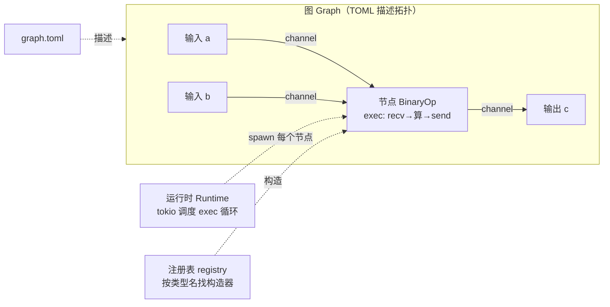

# Ch0.1 什么是 dataflow / actor，MegFlow 全景

一句话：**MegFlow 是一个 actor 模型的 dataflow（数据流）引擎**。

跑在它之上的**算法仓**（业务代码仓）做的事，本质上就是把一条视频分析流水线——「解码帧 → 检测 → 跟踪 → 属性 → 报警」——描述成一张**图**，然后让一帧帧图像数据在这张图里**流动**：每经过一个环节被加工一次，最后从末端流出结果（比如「3 号摄像头有人闯入」这样的报警事件）。

标题里的两个词，先各用一段话讲清楚：

- **dataflow（数据流）**：你不写「主流程从头到尾该怎么跑」的那段大控制代码；你只描述「有哪些加工环节、它们怎么首尾相连」，剩下的交给引擎——**数据到了谁那儿，谁就醒过来干活**。程序的推进不由一条主线驱动，而由**数据的流动**驱动，故名 dataflow。
- **actor（参与者）模型**：图里每个加工环节都是一个独立小单元，叫 actor。每个 actor 有自己的私有状态，彼此**不共享内存**，只靠**收发消息**通信（我算完把结果发给你，你收到再算）。这样天然并发、天然隔离——一个环节慢了或崩了，不会直接踩坏别人的数据。

## 先记住五个词

整本书都围绕下面这五个概念展开。这一节先建立直觉，后面每一个 Part 再把它们一个个亲手实现出来。

### 节点 Node / Actor

一个**拥有状态的处理单元**。你把「做一件事」的逻辑写进它，框架会**反复调用它的 `exec` 方法**——每被调用一次，它就处理一份流经自己的数据。比如一个跟踪节点，`exec` 里读入这一帧的检测框，更新内部维护的轨迹表，再把带轨迹 ID 的结果发出去。

**为什么需要**：把「一件事」封成独立单元，各自守着自己的状态（跟踪器要记住上一帧、计数器要记住累计值），互不干扰；增删或替换某个环节，不影响其它环节。

### 端口 Port

节点对外的**输入/输出接口**，每个端口都有名字。整张图用 `节点名:端口名` 来引用它——比如 `add:a`，指名为 `add` 的节点上那个叫 `a` 的输入端口。

**为什么需要**：节点自己**不关心**数据从哪来、发到哪去，它只认识自己的端口名字。「谁连谁」这件事交给图去描述。于是同一种节点能被复用到不同的图里、接不同的上下游。

### channel（通道）

连接两个端口的**异步队列**：上游节点往里 `send`，下游节点从里 `recv`。它有容量上限 `cap`，也可以被**关闭**。

**为什么需要**：上下游速度往往不一样（解码快、检测慢）。中间垫一条带缓冲的队列，两边就**解耦**了，各跑各的。`cap` 还带来**背压**——队列满了，上游 `send` 会自然地等一等，不至于把内存撑爆；「可关闭」则服务于**优雅停机**：上游关掉 channel，下游 `recv` 会收到「没有更多数据了」的信号，从而干净收尾。

### 图 Graph

整条流水线的**拓扑描述**：有哪些节点、每个节点是什么类型、端口之间怎么连线。在 MegFlow 里，这张图用一份 **TOML 配置**写出来。

**为什么需要**：把「装配线路」从代码里抽出来变成**配置**。改流程（多挂一个报警节点、换一条连线）只需改 TOML，**不用改代码、不用重新编译**。

### 运行时 Runtime

真正让图「跑起来」的调度器。它把图里**每个节点都 spawn 成一个异步任务**，交给 tokio（Rust 的异步运行时）去调度：谁的输入到齐了就唤醒谁执行 `exec`，谁在 `recv().await` 上等数据就先让出 CPU 给别人。

**为什么需要**：一张图可能有成百上千个节点，不可能一个节点独占一个操作系统线程。用**异步任务**在少数线程上做协作式调度，才能让海量节点高效地并发跑起来。

## 一张图看懂整体

把上面五个词拼到一起，就是下面这张全景图。我们用最小的 `BinaryOp`（二元运算）节点举例——它有两个输入端口 `a`、`b` 和一个输出端口 `c`：



对着图读一遍：

- **实线箭头**是 **channel**，标出数据的流向（`a`、`b` 流入节点，结果从 `c` 流出）。
- 中间的方框 `BinaryOp` 是**节点**，它的活儿就是在 `exec` 里「收两个数 → 算 → 发一个数」。
- 外层大框是**图**，它的形状由 `graph.toml` 描述（左边那条虚线）。
- 底下两条虚线是幕后功臣：**运行时**把节点 spawn 成异步任务来跑；**注册表 registry** 则负责按 TOML 里写的类型名 `"BinaryOp"` 找到对应的构造器、把节点实例造出来（这块到 Part 2 会亲手实现，现在知道「有这么个按名字找构造器的东西」就够了）。

## 数据流走一遍：`1 + 2 = 3`

把 `op="+"` 的 `BinaryOp` 跑一遍，看一颗数据怎么穿过整张图：

1. 我们从图的**外面**，往输入端 `a` 送进 `1`、往输入端 `b` 送进 `2`。
2. 这两个数各自沿着一条 channel 排队，停在 `BinaryOp` 的输入端口 `a`、`b` 上等着。
3. 运行时发现 `BinaryOp` 有活可干，调用它的 `exec`。这一趟里：端口 `a` 上 `recv().await` 取出 `1`，端口 `b` 上 `recv().await` 取出 `2`（两个 `recv` 一起等）。
4. 节点把它们相加得到 `3`，通过输出端口 `c` 做 `send(3).await`——`3` 进入 `c` 那条 channel。
5. 我们在图外面对 `c` 做 `recv()`，读到 `3`。
6. `exec` 返回后，框架**再次**调用它，它继续等下一对 `a`、`b`……如此往复。这个「反复调用 `exec`」的过程，就是节点的生命循环。

整张图，就是许许多多这样的 `exec` 循环被运行时同时驱动着：数据从输入端流进，逐个节点加工，最后从输出端流出。

## 剧透：这就是我们要亲手搭出来的

上面的 `1 + 2 = 3`，用真实的 flow-rs API 写出来长这样。**现在看不懂完全没关系**——这正是本书要带你从零实现、并在 **Ch3.4** 亲手跑通的东西。先混个眼熟。

先看节点长什么样（一个有状态的 actor + 一个 `exec`）：

```rust,ignore
use flow_rs::prelude::*;

// 两个输入端口 a、b，一个输出端口 c，元素类型都是 i32
#[inputs(a: i32, b: i32)]
#[outputs(c: i32)]
#[derive(Default, Node)]
struct BinaryOp {
    op: char, // 节点自己的状态：这次要做哪种运算（由 TOML 的 op="+" 传入）
}

#[methods]
impl BinaryOp {
    // 构造器：框架按 TOML 里的 args 造节点，把 op="+" 解析进字段
    fn new(_: String, args: &Args) -> BinaryOp {
        BinaryOp {
            op: args["op"].as_str().unwrap().trim().chars().next().unwrap(),
            ..Default::default()
        }
    }

    // 框架反复调用的 exec：收两个数 → 按 op 运算 → 发一个数
    async fn exec(&mut self) {
        if let (Ok(mut ea), Ok(mut eb)) =
            futures_util::join!(self.a.recv(), self.b.recv())
        {
            let (a, b) = (ea.unpack(), eb.unpack());
            // repack：复用原来的信封，只把里面的值换成结果
            self.c
                .send(ea.repack(match self.op {
                    '+' => a + b,
                    '-' => a - b,
                    '*' => a * b,
                    '/' => a / b,
                    _ => unreachable!(),
                }))
                .await
                .ok();
        }
    }
}

node_register!("BinaryOp", BinaryOp); // 按类型名 "BinaryOp" 注册进注册表
```

再看怎么把它连成一张图、跑起来：

```rust,ignore
use flow_rs::prelude::*;

#[amain]
async fn main() -> flow_rs::error::Result<()> {
    // 1) 用一段 TOML 描述图的拓扑，Builder 据此装配出图
    let mut graph = Builder::default()
        .template(
        r#"
main="example"
[[graphs]]
name="example"
nodes=[
    {name="add", ty="BinaryOp", op="+"},
]
inputs=[
    {name="a",cap=16,ports=["add:a"]},
    {name="b",cap=16,ports=["add:b"]}
]
outputs=[{name="c",cap=16,ports=["add:c"]}]
        "#.to_owned()).build()?;

    // 2) 拿到这张图对外暴露的输入/输出端
    let a = graph.input("a").unwrap();
    let b = graph.input("b").unwrap();
    let c = graph.output("c").unwrap();

    // 3) 启动运行时（每个节点被 spawn 成一个异步任务）
    let handle = graph.start();

    // 4) 送进 1 和 2，读回 3
    a.send(Envelope::new(1i32)).await?;
    b.send(Envelope::new(2i32)).await?;
    assert_eq!(c.recv::<i32>().await.map(|mut x| x.unpack()), Ok(3i32));

    // 5) 优雅停机
    graph.stop();
    handle.await?;
    flow_rs::finalize().await;
    Ok(())
}
```

能把这两段代码从零写出来、还讲得清每一行背后的机制——这就是本书的目标。

## 本书路线图

知道了要造什么，再看这本书会怎么一步步把你带到那里。全书分 **6 个 Part**，顺着引擎真实的依赖关系「从地基往上」建：

- **Part 0 · 全景与环境**（你在这里）：建立心智模型（本章）、搭好开发环境、先把真实 flow-rs 跑通并钉死验收标准。
- **Part 1 · 消息与异步地基**：`Envelope` 消息信封与类型擦除消息层、async/await 入门与 channel 封装。
- **Part 2 · 节点与过程宏**：Node/Actor trait 与 `exec` 循环，以及 `#[inputs]` / `#[outputs]` / `derive(Node)` / `node_register!` 这套过程宏与编译期注册表。
- **Part 3 · 图与运行时**：TOML 配置解析、Graph Builder 装配节点与 channel、tokio 调度与优雅停机。**里程碑 Ch3.4**：端到端跑通上面那段 BinaryOp `1 + 2 == 3`——第一个完整可用的框架。
- **Part 4 · 内置节点与高级特性**：transform / broadcast / merge / demux 等内置节点、共享资源、子图与多图。
- **Part 5 · 兼容 · 优化 · 收尾**：对齐真实 API。**里程碑 Ch5.1**：跑通一个 detector → tracker → alarm 风格的多节点/子图图；再逐条对比原版做优化与收尾。

下一章（Ch0.2）先把开发环境和项目骨架搭起来，让你随时能动手。
