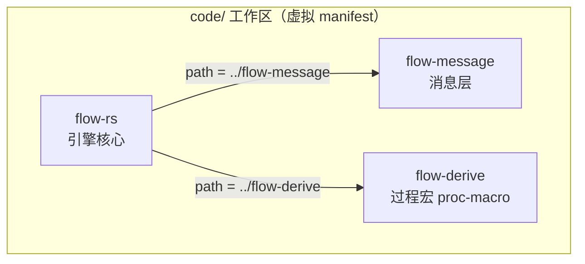

# Ch0.2 开发环境与项目骨架

本章从空目录建立三个空库和一份学习笔记。这里给出的是**本章阶段文件**，不是仓库最终文件。结束时能够构建，但还没有消息、节点或图功能。完整目标还有第四个 crate `flow-plugins`，在服务插件阶段加入。已经完成后续章节的读者不要用空骨架覆盖现有代码。

<!-- toc -->

## 0. 先看全局：我们要建两样东西

整个工程就是**两个平级目录**：

```text
megflow-rebuild/          # 工程根（名字随意）
├── code/                 # 引擎工作区（Rust），本书逐章写的代码都落在这
│   ├── Cargo.toml        # 工作区根：虚拟 manifest
│   ├── flow-message/     # 消息层
│   ├── flow-derive/      # 过程宏
│   └── flow-rs/          # 引擎核心
└── book/                 # 这本教材（mdbook）
    ├── book.toml
    └── src/
```

- **`code/`**：引擎本体，一个 cargo **工作区**，里面并排放三个 crate。
- **`book/`**：教材本身，一个 **mdbook**。

本章 §3 把 `code/` 建出来，§4 把 `book/` 建出来，§5 用两条命令验证。先装工具。

## 1. 装工具链

### 1.1 rustup 与 Rust 1.98

用官方 rustup 一键安装（Linux / macOS）：

```bash
curl --proto '=https' --tlsv1.2 -sSf https://sh.rustup.rs | sh
```

装完让当前 shell 生效（`source "$HOME/.cargo/env"` 或重开终端）。本书**只用 stable 工具链**，不用 nightly、不用任何 `#![feature(...)]`。装好后验证：

```bash
$ rustc --version
rustc 1.98.1 (...)
$ cargo --version
cargo 1.98.1 (...)
```

本仓库验证使用 Rust 1.98.1。这里省略了工具实际输出的构建哈希和日期；1.98 中的 98 是次版本号。Rust 2021 则是语言 edition，不是编译器版本。

### 1.2 mdbook 三件套 + cargo-expand

教材用 mdbook 构建，再加两个预处理器和一个调试工具。都用 `cargo install` 从 crates.io 装，并**钉住本书验证过的版本**：

```bash
cargo install mdbook         --version 0.5.4
cargo install mdbook-toc     --version 0.15.4
cargo install mdbook-mermaid --version 0.17.1
cargo install cargo-expand   --version 1.0.119
```

各是干什么的：

- **mdbook**（0.5.4）：把 `src/` 下的 Markdown 编译成一本可浏览的书。
- **mdbook-toc**（0.15.4）：预处理器，把页面里的 `<!-- toc -->` 标记替换成该页的目录（本章顶部那份目录就是它生成的）。
- **mdbook-mermaid**（0.17.1）：预处理器，把 ` ```mermaid ` 代码块渲染成图（Ch0.1 那张全景图就靠它）。
- **cargo-expand**（1.0.119）：把宏展开成普通 Rust 代码看，Part 2 调过程宏时会天天用；现在一起装上。

> **注意 mdbook 必须是 0.5.x**。0.4.x 与这里的 mdbook-toc / mdbook-mermaid 版本使用的预处理器协议不兼容，会构建失败——本书正是把全局 mdbook 从 0.4.x 升到了 0.5.4 才跑通的。

验证四个都在（版本应与上面一致）：

```bash
$ mdbook --version
mdbook v0.5.4
$ mdbook-toc --version
mdbook-toc 0.15.4
$ mdbook-mermaid --version
mdbook-mermaid 0.17.1
$ cargo expand --version
cargo-expand 1.0.119
```

## 2. 先搞懂 cargo workspace（心智模型）

动手建 `code/` 之前，先把 **workspace（工作区）** 这个概念立起来——它是 §3 那堆文件背后的道理。

一句话：**workspace 把多个 crate 编成一组，让它们共享同一份 `Cargo.lock` 和同一个 `target/` 目录，用一条命令一起构建、测试。**

**为什么需要**：我们的引擎故意拆成三个 crate（消息层、过程宏、核心）。有了工作区，`cargo build --workspace` 一次把三个都编了；它们依赖的第三方库锁在同一份 `Cargo.lock`，版本统一；共享依赖只编一次，不会重复三遍。下面五个词，§3 的真实文件里会逐个见到：

### `[workspace] members`

工作区根 `Cargo.toml` 里的 `members` 列出所有成员 crate 的路径。`cargo` 据此知道「这一组里有哪几个 crate」。

### 虚拟 manifest（virtual manifest）

如果根 `Cargo.toml` 只有 `[workspace]` 而**没有 `[package]`**，那么这个根**自己不是一个 crate**，只负责把成员组织起来。这种根叫「虚拟 manifest」。我们的 `code/Cargo.toml` 正是这样——它不产出任何库或可执行文件。

### `resolver = "2"`

cargo 的**特性解析器（feature resolver）**版本。resolver 2 修正了老解析器的毛病：让开发依赖、构建依赖、平台专属依赖的 feature 不再「泄漏」进正常构建。edition 2021 的**包**会默认用 resolver 2，但**虚拟 manifest 里没有包、没有 edition 可推断**，所以必须在 `[workspace]` 里**显式写** `resolver = "2"`，否则会退回默认的 `"1"`。（原版引擎的根 manifest 就没写 resolver，用的是老的 `"1"`。）

### `workspace.package` 继承

把多个成员**共有的元数据**（版本、edition、许可证、作者……）在根的 `[workspace.package]` 里定义一次，成员再用 `字段.workspace = true` **按需继承**。这样改一处、全体生效，不用在每个 crate 里重复写。记住这是**「工作区级定义 + 按需继承」**的机制：定义在根里不等于成员自动就有，成员要**主动 opt-in** 才继承（§3.1 会看到一个「定义了但成员没继承」的活例子）。

### path 依赖

成员之间互相引用，用**相对路径**写依赖：`flow-message = { path = "../flow-message" }`。这类本地依赖不需要版本号、不需要注册表——cargo 直接按路径找到源码一起编。

## 3. 一步步建引擎骨架（`code/`）

现在把 `code/` 和里面的 7 个文件（4 个 `Cargo.toml` + 3 个 `src/lib.rs`）建出来。下面给出本阶段的完整内容。路径相对新工程根目录，终端则按命令逐步进入子目录。

先建根目录：

```bash
mkdir -p megflow-rebuild/code
cd megflow-rebuild/code
```

### 3.1 工作区根 `code/Cargo.toml`（虚拟 manifest）

<!-- course-file: code/Cargo.toml -->
```toml
[workspace]
resolver = "2"
members = ["flow-message", "flow-derive", "flow-rs"]

[workspace.package]
version = "0.1.0"
edition = "2021"
license = "Apache-2.0"
authors = ["douzhenbo", "Claude"]

# 说明：本 workspace 只用 crates.io 公共 crate；不使用原版的 megvii 私有注册表。
[profile.dev]
incremental = true
```

逐块读：

- `[workspace]`：`members` 列出三个成员；`resolver = "2"` 如 §2 所说，虚拟 manifest 里必须显式写。
- **虚拟 manifest**：整份文件**没有 `[package]`**，所以 `code/` 本身不是 crate，只是三个成员的「组长」。
- `[workspace.package]`：四个共有字段定义在此。三个成员里，`version` / `edition` / `license` 都会用 `.workspace = true` 继承过去（§3.2 起可见）。
- **`authors` 的处理（一个教学点）**：`authors` 也定义在这里了，但三个成员**目前都没有**写 `authors.workspace = true`，所以它们并没有继承作者字段。这不是缺陷，正是 §2 说的「工作区级定义 + 按需继承」：想让某个 crate 带上作者，就在它的 `[package]` 里加一行 `authors.workspace = true` 主动继承；不加就不继承。对比 `edition.workspace = true`——那是「已经 opt-in」的字段。
- 注释点明**只用 crates.io**：我们刻意不碰原版的私有注册表（下面「edition 与注册表」小节展开）。
- `[profile.dev] incremental = true`：开增量编译，改一点重编快一点，适合边学边改的节奏。（原版这里是 `incremental = false`。）

### 3.2 `flow-message`（消息层）

```bash
mkdir -p flow-message/src
```

`code/flow-message/Cargo.toml`：

<!-- course-file: code/flow-message/Cargo.toml -->
```toml
[package]
name = "flow-message"
version.workspace = true
edition.workspace = true
license.workspace = true

[lib]
doctest = false   # 与原版一致：文档示例不作为 doctest 运行
```

`code/flow-message/src/lib.rs`：

<!-- course-file: code/flow-message/src/lib.rs -->
```rust
//! flow-message —— MegFlow 消息层（重写版）。
//!
//! 目前为骨架。消息信封 `Envelope<M>` 与类型擦除将在 Part 1（Ch1.3）实现。
//! flow-message —— message layer of MegFlow (rewrite). Skeleton for now;
//! `Envelope<M>` and type erasure arrive in Part 1 (Ch1.3).
```

读点：

- 三行 `字段.workspace = true` 就是 §2 的**继承**——`version` / `edition` / `license` 都从根的 `[workspace.package]` 拿。（注意没有 `authors.workspace`，对应 §3.1 讲的「没 opt-in 就不继承」。）
- **为什么 `doctest = false`**：`lib.rs` 里的 `//!` / `///` 文档注释写的是给人读的说明和示意，并非要编译运行的用例。默认情况下 `cargo test` 会把文档里的代码块当 **doctest** 编译执行；设 `doctest = false` 就关掉这一行为，省得未来文档里写的宏示意被当成测试跑挂。这与原版设置一致；而且 Part 0 本就**没有任何单元测试**（红-绿 TDD 从 Part 1 才开始）。
- `lib.rs` 现在只有模块级文档，是个空壳——真正的 `Envelope<M>` 到 Ch1.3 才写。

### 3.3 `flow-derive`（过程宏）

```bash
mkdir -p flow-derive/src
```

`code/flow-derive/Cargo.toml`：

<!-- course-file: code/flow-derive/Cargo.toml -->
```toml
[package]
name = "flow-derive"
version.workspace = true
edition.workspace = true
license.workspace = true

[lib]
proc-macro = true   # 过程宏 crate
doctest = false
```

`code/flow-derive/src/lib.rs`：

<!-- course-file: code/flow-derive/src/lib.rs -->
```rust
//! flow-derive —— MegFlow 过程宏（重写版）。
//!
//! 目前为骨架。`#[inputs]`/`#[outputs]`/`#[derive(Node)]`/`#[methods]`/
//! `node_register!` 等宏将在 Part 2 实现。
//! flow-derive —— procedural macros of MegFlow (rewrite). Skeleton for now;
//! node macros arrive in Part 2.
```

读点：

- **为什么 `proc-macro = true`**：这个 crate 装的是**过程宏**。过程宏在**编译期**运行——它被编译成一个「编译器插件」，输入一段 `TokenStream`、输出一段 `TokenStream`。只有把 `[lib]` 标成 `proc-macro = true` 的 crate，才**允许**定义 `#[proc_macro]` / `#[proc_macro_derive]` / `#[proc_macro_attribute]` 这三类宏；也正因为它是编译期插件，它不能像普通库那样导出运行期的函数/类型给别人调用。Part 2 我们要写的 `#[inputs]`、`#[derive(Node)]`、`node_register!` 都是过程宏，所以从骨架起就得立这面「过程宏 crate」的旗子。
- `doctest = false`：同 §3.2。

### 3.4 `flow-rs`（引擎核心）

```bash
mkdir -p flow-rs/src
```

`code/flow-rs/Cargo.toml`：

<!-- course-file: code/flow-rs/Cargo.toml -->
```toml
[package]
name = "flow-rs"
version.workspace = true
edition.workspace = true
license.workspace = true

[dependencies]
flow-message = { path = "../flow-message" }
flow-derive = { path = "../flow-derive" }

[lib]
doctest = false
```

`code/flow-rs/src/lib.rs`：

<!-- course-file: code/flow-rs/src/lib.rs -->
```rust
//! flow-rs —— MegFlow 引擎核心（重写版）。
//!
//! 目前为骨架。channel / node / registry / config / graph / rt 等模块将从
//! Part 1 起逐章加入；`prelude` 门面在 Part 5（Ch5.1）补齐。
//! flow-rs —— MegFlow engine core (rewrite). Skeleton for now; modules are
//! added chapter by chapter starting in Part 1.
```

读点：

- `[dependencies]` 两行就是 §2 的 **path 依赖**：核心 crate 通过相对路径把同工作区的 `flow-message`、`flow-derive` 拉进来，不写版本号、不走注册表。三个 crate 里**只有 `flow-rs` 依赖另外两个**；`flow-message` 与 `flow-derive` 彼此独立。它们的依赖关系是：



### 目录树、edition 2021 与「只用 crates.io」

到这里 `code/` 应该长这样（`Cargo.lock` 会在首次构建时由 cargo 自动生成，不用手写）：

```text
code/
├── Cargo.toml            # 虚拟 manifest
├── flow-message/
│   ├── Cargo.toml
│   └── src/lib.rs
├── flow-derive/
│   ├── Cargo.toml
│   └── src/lib.rs
└── flow-rs/
    ├── Cargo.toml
    └── src/lib.rs
```

两个贯穿全书的选择，在这里交代清楚：

- **edition 2021**：统一本工程的语言规则。原版各 crate 的 edition 应分别读取 manifest，不能说全是 2018。闭包按字段捕获、数组的 IntoIterator 和 prelude 的变化将在使用时解释。
- **依赖来源**：重构使用公开依赖和本地纯 Rust 等价实现。原版 manifest 中的私有注册表声明不证明 crates.io 上不存在同名包，更不证明同名包与私有版本等价；替换必须逐项验证调用点行为。

## 4. 建个人学习笔记（`book/`）

这里建立你自己的最小实验笔记，不复制整本教材。每个导航链接对应一份本章给出的文件，不依赖以后补写的页面。

```bash
cd ..                      # 从 code/ 回到新工程根目录
mkdir -p book/src
cd book
```

### `book/book.toml` 完整内容

<!-- course-file: book/book.toml -->
```toml
[book]
title = "我的 MegFlow 实验笔记"
language = "zh-CN"
src = "src"

[output.html]
default-theme = "light"
```

`src` 相对配置文件所在目录。此处没有预处理器和 JavaScript 资源依赖；教材本身的 Mermaid 图是另一套配置，不影响这份笔记。

### `book/src/SUMMARY.md` 完整内容

<!-- course-file: book/src/SUMMARY.md -->
```markdown
# 目录

- [工作区实验](workspace.md)
```

目录决定页面和顺序，链接相对 `src/` 解析。

### `book/src/workspace.md` 完整内容

<!-- course-file: book/src/workspace.md -->
```markdown
# 工作区实验

我建立了 flow-message、flow-derive、flow-rs 三个空库。

flow-rs 通过本地路径依赖另外两个库。

构建成功只证明骨架正确，还没有实现消息传递。
```

以后每次实验可以新增笔记文件，再向目录添加链接。mdBook 构建验证文档结构，不验证文中描述的框架行为。

## 5. 验证：两条命令跑通全部

### 5.1 引擎构建

```bash
cd ../code            # 回到 code/
cargo build --workspace
```

首次构建预期输出（三个 crate 各编一次）：

```text
   Compiling flow-message v0.1.0 (.../code/flow-message)
   Compiling flow-derive v0.1.0 (.../code/flow-derive)
   Compiling flow-rs v0.1.0 (.../code/flow-rs)
    Finished `dev` profile [unoptimized + debuginfo] target(s) in 0.60s
```

看到 `Finished` 就成了。首次构建还会在 `code/` 下生成 `Cargo.lock`（cargo 自动写，别手改）。Part 0 还没有任何测试，所以现在不用跑 `cargo test`——那是 Part 1 起的事。

### 5.2 教材预览

```bash
cd ../book            # 回到 book/
mdbook serve --open
```

`mdbook serve` 会构建整本书、起一个本地服务（默认 `http://localhost:3000`）、`--open` 顺手用浏览器打开，并**监听文件改动自动热重载**——你边改 Markdown 边刷新就能看到效果。`Ctrl-C` 停服务。若只想生成一份静态站点、不起服务，用：

```bash
mdbook build          # 产物在 book/book/ 下
```

至此，Rust 空骨架与个人学习笔记都应构建通过。它们是本阶段产物，不能与参考仓库的后续实现混为一谈。

## 6. 常见坑

### 6.1 `~/.cargo/config` 与 `config.toml` 并存的 warning

如果你以前建过 `~/.cargo/config`（**无扩展名**的老式配置文件），跑 cargo 时可能看到：

```text
warning: both '/home/you/.cargo/config' and '/home/you/.cargo/config.toml' exist. Using '/home/you/.cargo/config'
```

原因：cargo 的全局配置早年叫 `~/.cargo/config`（无扩展名），新版改用 `~/.cargo/config.toml`。当**两者都在**时，出于向后兼容，cargo 会**用那个老的、无扩展名的 `config`**（如 warning 末尾 `Using .../config` 所示），并把 `config.toml` **忽略掉**。这就是坑：你以为自己在改 `config.toml`，实际全没生效。

先比较并备份两份文件，按照 warning 确认实际使用哪份，再合并需要的设置。不要为本教程直接删除已有的代理、源替换或公司注册表配置。

### 6.2 构建本教材时：mermaid 图不渲染（显示成源码或代码块）

症状：页面里 ` ```mermaid ` 块没变成图，而是显示成一段文字或普通代码块。十有八九是**忘了跑 `mdbook-mermaid install`**——那两个 `.js` 没被注入，浏览器端就没有渲染 mermaid 的脚本。修复：

```bash
cd book
mdbook-mermaid install .     # 补上两个 js 并写进 book.toml
mdbook build
```

再核对两点：`book/` 下确有 `mermaid.min.js` 与 `mermaid-init.js`；`book.toml` 的 `[output.html]` 里 `additional-js` 列着这两个文件，且 `[preprocessor.mermaid]` 那段在（负责把 ` ```mermaid ` 块交给预处理器）。两者齐了，图就出来了。

## 小结

这一章你把工作区概念落实为七个完整文件，并建立了个人学习笔记。构建成功证明文件布局和依赖关系正确，不代表实现了消息处理。

下一章 **Ch0.3** 阅读固定版本的原版源码，建立行为验收标准；该章不会假设原版私有依赖已能在本机构建。

## 独立复现与排错实验

教材仓库根目录运行 `python3 scripts/check_environment_course.py`，会从本章的十个完整文件代码块提取内容到新临时目录，离线构建 Rust 工作区并构建笔记；不会复制后续源码。这条维护命令不要求你在手写工程中安装教材的脚本。

故意把 flow-rs 的消息依赖路径改为 `../missing-message`，构建应在读取依赖 manifest 时失败；恢复后应成功。再把笔记目录链接改为 `missing.md`，检查书构建的诊断并恢复。最后不看答案说明：为什么 path 依赖相对声明它的 manifest，而命令中的路径相对终端当前目录？为什么只有库的工作区不能直接用 cargo run 启动？
