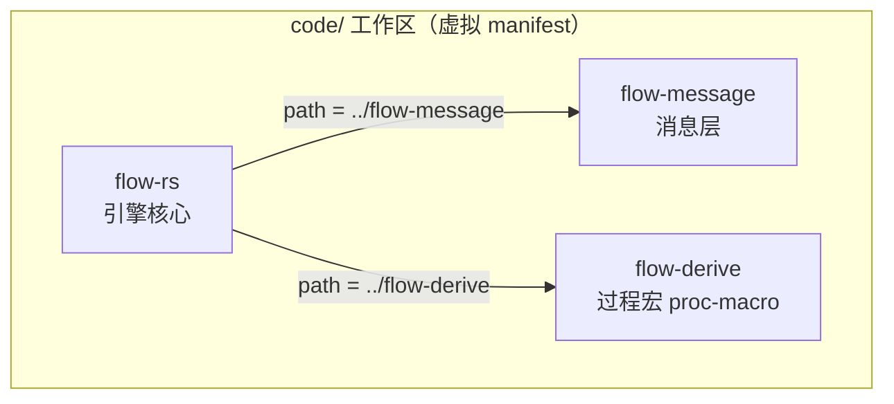

# Ch0.2 开发环境与项目骨架

这一章全程动手。跟着从头到尾走一遍，你的机器上就会长出**和本书 `code/`、`book/` 一模一样的骨架**：一个能 `cargo build` 的三 crate 工作区，加一本能 `mdbook serve` 预览的教材。文中每一条命令、每一份文件，都逐字来自本仓库真实提交的内容——照抄下来，`cargo build --workspace` 与 `mdbook build` 都会通过。

<!-- toc -->

## 0. 先看全局：我们要建两样东西

整个工程就是**两个平级目录**：

```text
megflow-rebuild/          # 工程根（名字随意）
├── code/                 # 引擎工作区（Rust），本书逐章写的代码都落在这
│   ├── Cargo.toml        # 工作区根：虚拟 manifest
│   ├── flow-message/     # 消息层
│   ├── flow-derive/      # 过程宏
│   └── flow-rs/          # 引擎核心
└── book/                 # 这本教材（mdbook）
    ├── book.toml
    └── src/
```

- **`code/`**：引擎本体，一个 cargo **工作区**，里面并排放三个 crate。
- **`book/`**：教材本身，一个 **mdbook**。

本章 §3 把 `code/` 建出来，§4 把 `book/` 建出来，§5 用两条命令验证。先装工具。

## 1. 装工具链

### 1.1 rustup 与 Rust 1.98

用官方 rustup 一键安装（Linux / macOS）：

```bash
curl --proto '=https' --tlsv1.2 -sSf https://sh.rustup.rs | sh
```

装完让当前 shell 生效（`source "$HOME/.cargo/env"` 或重开终端）。本书**只用 stable 工具链**，不用 nightly、不用任何 `#![feature(...)]`。装好后验证：

```bash
$ rustc --version
rustc 1.98.0 (88d9e12ae 2026-08-18)
$ cargo --version
cargo 1.98.0 (797e8a9bc 2026-08-05)
```

只要主版本是 **1.98** 即可；括号里的哈希与日期因构建而异，不必一致。如果你装的是更早的版本，`rustup update stable` 升上来。

### 1.2 mdbook 三件套 + cargo-expand

教材用 mdbook 构建，再加两个预处理器和一个调试工具。都用 `cargo install` 从 crates.io 装，并**钉住本书验证过的版本**：

```bash
cargo install mdbook         --version 0.5.4
cargo install mdbook-toc     --version 0.15.4
cargo install mdbook-mermaid --version 0.17.1
cargo install cargo-expand   --version 1.0.119
```

各是干什么的：

- **mdbook**（0.5.4）：把 `src/` 下的 Markdown 编译成一本可浏览的书。
- **mdbook-toc**（0.15.4）：预处理器，把页面里的 `<!-- toc -->` 标记替换成该页的目录（本章顶部那份目录就是它生成的）。
- **mdbook-mermaid**（0.17.1）：预处理器，把 ` ```mermaid ` 代码块渲染成图（Ch0.1 那张全景图就靠它）。
- **cargo-expand**（1.0.119）：把宏展开成普通 Rust 代码看，Part 2 调过程宏时会天天用；现在一起装上。

> **注意 mdbook 必须是 0.5.x**。0.4.x 与这里的 mdbook-toc / mdbook-mermaid 版本使用的预处理器协议不兼容，会构建失败——本书正是把全局 mdbook 从 0.4.x 升到了 0.5.4 才跑通的。

验证四个都在（版本应与上面一致）：

```bash
$ mdbook --version
mdbook v0.5.4
$ mdbook-toc --version
mdbook-toc 0.15.4
$ mdbook-mermaid --version
mdbook-mermaid 0.17.1
$ cargo expand --version
cargo-expand 1.0.119
```

## 2. 先搞懂 cargo workspace（心智模型）

动手建 `code/` 之前，先把 **workspace（工作区）** 这个概念立起来——它是 §3 那堆文件背后的道理。

一句话：**workspace 把多个 crate 编成一组，让它们共享同一份 `Cargo.lock` 和同一个 `target/` 目录，用一条命令一起构建、测试。**

**为什么需要**：我们的引擎故意拆成三个 crate（消息层、过程宏、核心）。有了工作区，`cargo build --workspace` 一次把三个都编了；它们依赖的第三方库锁在同一份 `Cargo.lock`，版本统一；共享依赖只编一次，不会重复三遍。下面五个词，§3 的真实文件里会逐个见到：

### `[workspace] members`

工作区根 `Cargo.toml` 里的 `members` 列出所有成员 crate 的路径。`cargo` 据此知道「这一组里有哪几个 crate」。

### 虚拟 manifest（virtual manifest）

如果根 `Cargo.toml` 只有 `[workspace]` 而**没有 `[package]`**，那么这个根**自己不是一个 crate**，只负责把成员组织起来。这种根叫「虚拟 manifest」。我们的 `code/Cargo.toml` 正是这样——它不产出任何库或可执行文件。

### `resolver = "2"`

cargo 的**特性解析器（feature resolver）**版本。resolver 2 修正了老解析器的毛病：让开发依赖、构建依赖、平台专属依赖的 feature 不再「泄漏」进正常构建。edition 2021 的**包**会默认用 resolver 2，但**虚拟 manifest 里没有包、没有 edition 可推断**，所以必须在 `[workspace]` 里**显式写** `resolver = "2"`，否则会退回默认的 `"1"`。（原版引擎的根 manifest 就没写 resolver，用的是老的 `"1"`。）

### `workspace.package` 继承

把多个成员**共有的元数据**（版本、edition、许可证、作者……）在根的 `[workspace.package]` 里定义一次，成员再用 `字段.workspace = true` **按需继承**。这样改一处、全体生效，不用在每个 crate 里重复写。记住这是**「工作区级定义 + 按需继承」**的机制：定义在根里不等于成员自动就有，成员要**主动 opt-in** 才继承（§3.1 会看到一个「定义了但成员没继承」的活例子）。

### path 依赖

成员之间互相引用，用**相对路径**写依赖：`flow-message = { path = "../flow-message" }`。这类本地依赖不需要版本号、不需要注册表——cargo 直接按路径找到源码一起编。

## 3. 一步步建引擎骨架（`code/`）

现在把 `code/` 和里面的 7 个文件（4 个 `Cargo.toml` + 3 个 `src/lib.rs`）建出来。**下面每一份都是本仓库真实提交的内容，逐字照抄即可。**

先建根目录：

```bash
mkdir -p megflow-rebuild/code
cd megflow-rebuild/code
```

### 3.1 工作区根 `code/Cargo.toml`（虚拟 manifest）

```toml
[workspace]
resolver = "2"
members = ["flow-message", "flow-derive", "flow-rs"]

[workspace.package]
version = "0.1.0"
edition = "2021"
license = "Apache-2.0"
authors = ["douzhenbo", "Claude"]

# 说明：本 workspace 只用 crates.io 公共 crate；不使用原版的 megvii 私有注册表。
[profile.dev]
incremental = true
```

逐块读：

- `[workspace]`：`members` 列出三个成员；`resolver = "2"` 如 §2 所说，虚拟 manifest 里必须显式写。
- **虚拟 manifest**：整份文件**没有 `[package]`**，所以 `code/` 本身不是 crate，只是三个成员的「组长」。
- `[workspace.package]`：四个共有字段定义在此。三个成员里，`version` / `edition` / `license` 都会用 `.workspace = true` 继承过去（§3.2 起可见）。
- **`authors` 的处理（一个教学点）**：`authors` 也定义在这里了，但三个成员**目前都没有**写 `authors.workspace = true`，所以它们并没有继承作者字段。这不是缺陷，正是 §2 说的「工作区级定义 + 按需继承」：想让某个 crate 带上作者，就在它的 `[package]` 里加一行 `authors.workspace = true` 主动继承；不加就不继承。对比 `edition.workspace = true`——那是「已经 opt-in」的字段。
- 注释点明**只用 crates.io**：我们刻意不碰原版的私有注册表（下面「edition 与注册表」小节展开）。
- `[profile.dev] incremental = true`：开增量编译，改一点重编快一点，适合边学边改的节奏。（原版这里是 `incremental = false`。）

### 3.2 `flow-message`（消息层）

```bash
mkdir -p flow-message/src
```

`code/flow-message/Cargo.toml`：

```toml
[package]
name = "flow-message"
version.workspace = true
edition.workspace = true
license.workspace = true

[lib]
doctest = false   # 与原版一致：文档示例不作为 doctest 运行
```

`code/flow-message/src/lib.rs`：

```rust,ignore
//! flow-message —— MegFlow 消息层（重写版）。
//!
//! 目前为骨架。消息信封 `Envelope<M>` 与类型擦除将在 Part 1（Ch1.3）实现。
//! flow-message —— message layer of MegFlow (rewrite). Skeleton for now;
//! `Envelope<M>` and type erasure arrive in Part 1 (Ch1.3).
```

读点：

- 三行 `字段.workspace = true` 就是 §2 的**继承**——`version` / `edition` / `license` 都从根的 `[workspace.package]` 拿。（注意没有 `authors.workspace`，对应 §3.1 讲的「没 opt-in 就不继承」。）
- **为什么 `doctest = false`**：`lib.rs` 里的 `//!` / `///` 文档注释写的是给人读的说明和示意，并非要编译运行的用例。默认情况下 `cargo test` 会把文档里的代码块当 **doctest** 编译执行；设 `doctest = false` 就关掉这一行为，省得未来文档里写的宏示意被当成测试跑挂。这与原版设置一致；而且 Part 0 本就**没有任何单元测试**（红-绿 TDD 从 Part 1 才开始）。
- `lib.rs` 现在只有模块级文档，是个空壳——真正的 `Envelope<M>` 到 Ch1.3 才写。

### 3.3 `flow-derive`（过程宏）

```bash
mkdir -p flow-derive/src
```

`code/flow-derive/Cargo.toml`：

```toml
[package]
name = "flow-derive"
version.workspace = true
edition.workspace = true
license.workspace = true

[lib]
proc-macro = true   # 过程宏 crate
doctest = false
```

`code/flow-derive/src/lib.rs`：

```rust,ignore
//! flow-derive —— MegFlow 过程宏（重写版）。
//!
//! 目前为骨架。`#[inputs]`/`#[outputs]`/`#[derive(Node)]`/`#[methods]`/
//! `node_register!` 等宏将在 Part 2 实现。
//! flow-derive —— procedural macros of MegFlow (rewrite). Skeleton for now;
//! node macros arrive in Part 2.
```

读点：

- **为什么 `proc-macro = true`**：这个 crate 装的是**过程宏**。过程宏在**编译期**运行——它被编译成一个「编译器插件」，输入一段 `TokenStream`、输出一段 `TokenStream`。只有把 `[lib]` 标成 `proc-macro = true` 的 crate，才**允许**定义 `#[proc_macro]` / `#[proc_macro_derive]` / `#[proc_macro_attribute]` 这三类宏；也正因为它是编译期插件，它不能像普通库那样导出运行期的函数/类型给别人调用。Part 2 我们要写的 `#[inputs]`、`#[derive(Node)]`、`node_register!` 都是过程宏，所以从骨架起就得立这面「过程宏 crate」的旗子。
- `doctest = false`：同 §3.2。

### 3.4 `flow-rs`（引擎核心）

```bash
mkdir -p flow-rs/src
```

`code/flow-rs/Cargo.toml`：

```toml
[package]
name = "flow-rs"
version.workspace = true
edition.workspace = true
license.workspace = true

[dependencies]
flow-message = { path = "../flow-message" }
flow-derive = { path = "../flow-derive" }

[lib]
doctest = false
```

`code/flow-rs/src/lib.rs`：

```rust,ignore
//! flow-rs —— MegFlow 引擎核心（重写版）。
//!
//! 目前为骨架。channel / node / registry / config / graph / rt 等模块将从
//! Part 1 起逐章加入；`prelude` 门面在 Part 5（Ch5.1）补齐。
//! flow-rs —— MegFlow engine core (rewrite). Skeleton for now; modules are
//! added chapter by chapter starting in Part 1.
```

读点：

- `[dependencies]` 两行就是 §2 的 **path 依赖**：核心 crate 通过相对路径把同工作区的 `flow-message`、`flow-derive` 拉进来，不写版本号、不走注册表。三个 crate 里**只有 `flow-rs` 依赖另外两个**；`flow-message` 与 `flow-derive` 彼此独立。它们的依赖关系是：



### 目录树、edition 2021 与「只用 crates.io」

到这里 `code/` 应该长这样（`Cargo.lock` 会在首次构建时由 cargo 自动生成，不用手写）：

```text
code/
├── Cargo.toml            # 虚拟 manifest
├── flow-message/
│   ├── Cargo.toml
│   └── src/lib.rs
├── flow-derive/
│   ├── Cargo.toml
│   └── src/lib.rs
└── flow-rs/
    ├── Cargo.toml
    └── src/lib.rs
```

两个贯穿全书的选择，在这里交代清楚：

- **为什么用 edition 2021（原版是 2018）**：edition 是 Rust 的「语言年份」，决定一批语法与默认行为。**原版引擎三个 crate 都写着 `edition = "2018"`**，而且是在每个 crate 里各写一遍；我们统一用 **2021**，并借 `[workspace.package]` 只写一处。2021 带来的实惠正好都用得上：闭包按字段**分别捕获**（写 async 闭包更省心）、数组直接 `IntoIterator`、prelude 默认引入 `TryFrom`/`TryInto`/`FromIterator`、以及 `resolver = "2"` 成为包的默认。用新 edition 是「实现更简、bug 更少」这个目标的一部分。
- **为什么只用 crates.io（原版用 megvii 私有注册表）**：原版仓库里散布着 **22 处 `registry = "megvii"`** 的私有依赖，还链着闭源的 `pplcore-*` / `mpp` / `blob-proxy` / `pyo3` / `stackful`。这些东西**别人拿不到、也编不了**。本书的重写**明确禁用**私有注册表与闭源依赖，心智模型里只出现 **crates.io 上的公共 crate**——任何人用一套 stock 工具链就能完整复现。§3.1 那行注释说的就是这件事。

## 4. 建 mdbook 教材骨架（`book/`）

回到工程根，把教材目录建出来。可以用 `mdbook init book` 生成初始脚手架，再把它生成的 `book.toml` 和 `src/SUMMARY.md` 换成下面的版本；也可以直接手建。这里给出**最终该长成的样子**（逐字照抄即可复现）：

```bash
cd ..                      # 从 code/ 回到工程根 megflow-rebuild/
mkdir -p book/src/part0
cd book
```

### 4.1 `book/book.toml`

```toml
[book]
title = "从零用 Rust 重写 MegFlow —— 手把手学习型指南"
authors = ["douzhenbo", "Claude"]
language = "zh-CN"
src = "src"

[preprocessor.toc]
command = "mdbook-toc"
renderer = ["html"]

[preprocessor.mermaid]
command = "mdbook-mermaid"

[output.html]
default-theme = "light"
preferred-dark-theme = "navy"
additional-js = ["mermaid.min.js", "mermaid-init.js"]
```

逐块读：

- `[book]`：书名、作者、语言（`zh-CN`）、源码目录（`src`）。
- `[preprocessor.toc]`：启用 mdbook-toc，把页面里的 `<!-- toc -->` 展开成目录；`renderer = ["html"]` 限定它只对 html 输出生效。
- `[preprocessor.mermaid]`：启用 mdbook-mermaid，让 ` ```mermaid ` 代码块变成图。
- `[output.html]`：默认浅色主题、深色主题用 `navy`；`additional-js` 挂两个 js——**这两行不是手填的，是 §4.3 的 `mdbook-mermaid install` 自动加的**。

### 4.2 `book/src/SUMMARY.md`（书的骨架与导航）

`SUMMARY.md` 就是**整本书的结构**：mdbook 读它来决定有哪些页、什么顺序，并据此生成对应的 html。逐字照抄：

```markdown
# 目录

[前言](introduction.md)

# 第 0 部分 · 全景与环境

- [Ch0.1 什么是 dataflow / actor，MegFlow 全景](part0/ch01-panorama.md)
- [Ch0.2 开发环境与项目骨架](part0/ch02-environment.md)
- [Ch0.3 跑通真实 flow-rs，钉死验收标准](part0/ch03-reference.md)

# 第 1 部分 · 消息与异步地基

- [Ch1.1 Rust 复习：并发下的所有权、借用、生命周期 + 错误处理]()
- [Ch1.2 泛型、trait、trait 对象 dyn、Any 与 downcast]()
- [Ch1.3 实现 Envelope 消息信封与类型擦除消息层]()
- [Ch1.4 async/await、Future、tokio 入门 → channel 封装]()

# 第 2 部分 · 节点与过程宏

- [Ch2.1 Node / Actor trait、端口、exec 循环（手写不用宏）]()
- [Ch2.2 过程宏入门：proc-macro2 / syn / quote]()
- [Ch2.3 实现 inputs / outputs / derive(Node) / methods 宏]()
- [Ch2.4 node_register! 与 inventory 编译期注册表]()

# 第 3 部分 · 图与运行时

- [Ch3.1 serde / toml 与图 TOML schema → 配置解析层]()
- [Ch3.2 Graph Builder：装配节点与 channel]()
- [Ch3.3 tokio 调度：spawn actor、start/stop、优雅停机]()
- [Ch3.4 端到端跑通 BinaryOp（大里程碑）+ Sandbox 测试框架]()

# 第 4 部分 · 内置节点与高级特性

- [Ch4.1 transform / noop / bcast 广播 + add_cvt_func]()
- [Ch4.2 merge / demux / reorder（多路复用与重排序）]()
- [Ch4.3 Resource 与 Context：共享模型 / 内存池]()
- [Ch4.4 子图 subgraph、多图 graphs、动态子图]()

# 第 5 部分 · 兼容 · 优化 · 收尾

- [Ch5.1 对齐真实 API，跑真实算法仓风格的图 + pplcore 边界]()
- [Ch5.2 优化与更少 bug：逐条对比原版]()
- [Ch5.3 全景回顾 + 进阶指路]()
```

读点：

- `[前言](introduction.md)` 是**前置章（prefix chapter）**，排在编号章之前。
- `# 第 X 部分 · …` 是**分组标题（part title）**，只分组、不成页。
- `- [标题](路径.md)` 是**编号章节**；mdbook 会为每个有真实路径的条目生成一页。
- **链接为空 `()` 的是「草稿章」**：mdbook 把它渲染成灰色、不可点的占位，`mdbook build` **不会**为它生成文件，因此也不会有死链。整本书的路线图先摆在这，Part 1–5 的正文随写随把 `()` 换成真实路径。
- 我们这一章 `part0/ch02-environment.md` 就是上面一个**已经有真实路径**的条目。

再建另外三个已有真实链接、但内容随后补的页（本章只关心骨架能构建，正文由各自的 Task 写）：`src/introduction.md`、`src/part0/ch01-panorama.md`、`src/part0/ch03-reference.md`——加上你正在读的 `ch02-environment.md`，Part 0 的四个真实页就齐了。

### 4.3 `mdbook-mermaid install`：让 mermaid 能渲染

在 `book/` 目录里跑一次：

```bash
mdbook-mermaid install .
```

它做两件事：

1. 把 `mermaid.min.js` 和 `mermaid-init.js` 两个文件**释放到 `book/` 目录**（与 `book.toml` 同级）；
2. 自动往 `book.toml` 的 `[output.html]` 里**追加** `additional-js = ["mermaid.min.js", "mermaid-init.js"]`。

这正解释了：为什么 §4.1 的 `book.toml` 里已经有那行 `additional-js`，为什么 `book/` 下会躺着那两个 `.js`。**跳过这一步，` ```mermaid ` 块就渲染不出图**（详见 §6.2）。

## 5. 验证：两条命令跑通全部

### 5.1 引擎构建

```bash
cd ../code            # 回到 code/
cargo build --workspace
```

首次构建预期输出（三个 crate 各编一次）：

```text
   Compiling flow-message v0.1.0 (.../code/flow-message)
   Compiling flow-derive v0.1.0 (.../code/flow-derive)
   Compiling flow-rs v0.1.0 (.../code/flow-rs)
    Finished `dev` profile [unoptimized + debuginfo] target(s) in 0.60s
```

看到 `Finished` 就成了。首次构建还会在 `code/` 下生成 `Cargo.lock`（cargo 自动写，别手改）。Part 0 还没有任何测试，所以现在不用跑 `cargo test`——那是 Part 1 起的事。

### 5.2 教材预览

```bash
cd ../book            # 回到 book/
mdbook serve --open
```

`mdbook serve` 会构建整本书、起一个本地服务（默认 `http://localhost:3000`）、`--open` 顺手用浏览器打开，并**监听文件改动自动热重载**——你边改 Markdown 边刷新就能看到效果。`Ctrl-C` 停服务。若只想生成一份静态站点、不起服务，用：

```bash
mdbook build          # 产物在 book/book/ 下
```

至此，`cargo build --workspace` 与 `mdbook build` 都通过——你手上的骨架和本书 `code/`、`book/` 逐字一致了。

## 6. 常见坑

### 6.1 `~/.cargo/config` 与 `config.toml` 并存的 warning

如果你以前建过 `~/.cargo/config`（**无扩展名**的老式配置文件），跑 cargo 时可能看到：

```text
warning: both `/home/you/.cargo/config` and `/home/you/.cargo/config.toml` exist. Using `/home/you/.cargo/config`
```

原因：cargo 的全局配置早年叫 `~/.cargo/config`（无扩展名），新版改用 `~/.cargo/config.toml`。当**两者都在**时，出于向后兼容，cargo 会**用那个老的、无扩展名的 `config`**（如 warning 末尾 `Using .../config` 所示），并把 `config.toml` **忽略掉**。这就是坑：你以为自己在改 `config.toml`，实际全没生效。

修复——只留一个。把无扩展名的那个删掉或改名，让 `config.toml` 生效：

```bash
# 情况 A：还没有 config.toml，直接把老文件改名过去
mv ~/.cargo/config ~/.cargo/config.toml

# 情况 B：两个都有内容，手动把需要的合并进 config.toml 后，删掉老的
rm ~/.cargo/config
```

这只是环境遗留、不影响构建结果，但会误导你，值得清掉。

### 6.2 mermaid 图不渲染（显示成源码或代码块）

症状：页面里 ` ```mermaid ` 块没变成图，而是显示成一段文字或普通代码块。十有八九是**忘了跑 `mdbook-mermaid install`**——那两个 `.js` 没被注入，浏览器端就没有渲染 mermaid 的脚本。修复：

```bash
cd book
mdbook-mermaid install .     # 补上两个 js 并写进 book.toml
mdbook build
```

再核对两点：`book/` 下确有 `mermaid.min.js` 与 `mermaid-init.js`；`book.toml` 的 `[output.html]` 里 `additional-js` 列着这两个文件，且 `[preprocessor.mermaid]` 那段在（负责把 ` ```mermaid ` 块交给预处理器）。两者齐了，图就出来了。

## 小结

这一章你把 §2 的工作区心智模型落成了 §3 的 7 个真实文件，又建起 §4 的 mdbook 骨架，并在 §5 用两条命令验收。现在你有一个**与本书逐字一致、`cargo build --workspace` 与 `mdbook build` 双双通过**的骨架。

下一章 **Ch0.3**：把**真实的** flow-rs 跑起来，用它的行为**钉死本书的验收标准**——之后每一章的「绿」，都对着这根基准线。
