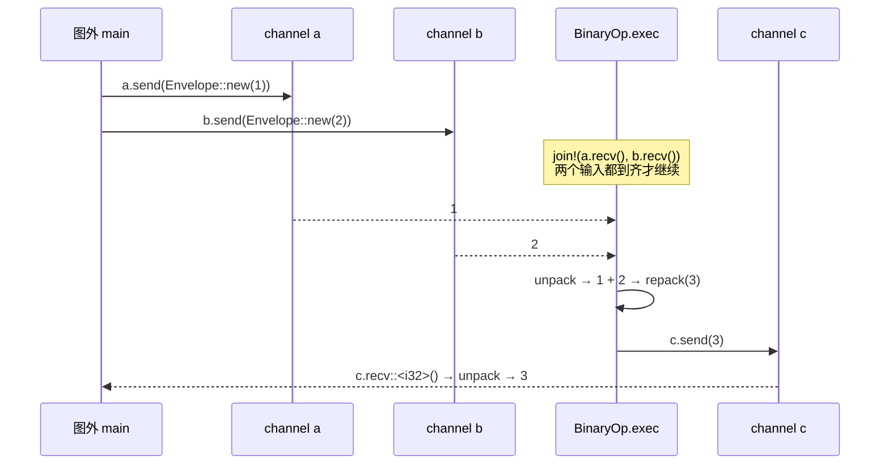

# Ch0.3 跑通真实 flow-rs，钉死验收标准

前两章你建好了心智模型（Ch0.1）与开发骨架（Ch0.2）。这一章要做一件贯穿全书的事：把「我们重写要对齐的**参照系**」固定下来——真实 flow-rs 官方文档里的那个 `BinaryOp`，让 `1 + 2 == 3` 穿过一张图。之后每一章的「绿」，都对着这根基准线量。

> **先说清本章的边界**：本章**只负责钉死它「长什么样」**——把参照系的 API 面、写法、TOML schema 逐段拆开、写成一张契约表；**不负责让它真的跑出 `3`**。真正端到端跑出 `3`，是 **Ch3.4** 的里程碑（那时我们自己的引擎才第一次成型）。所以本章一行 `flow_rs` 代码都不会被编译执行——所有代码块都用 ` ```rust,ignore ` 围栏，只供阅读对照。

<!-- toc -->

## 0. 本章要钉死什么

- **参照系 = 真实 flow-rs 的 BinaryOp `1 + 2 == 3`。** 它来自原版引擎 `flow-rs/src/lib.rs` 顶部那段官方「Getting started」文档——四步上手。这四步就是本书要对齐的目标 API 面。
- Ch0.1 已经**剧透**过其中两块（节点长相 + 建图那段 `main`），让你混了个眼熟。本章比 Ch0.1 **更深**：把四步**逐段拆开**讲清每一行背后的机制，**补上** Ch0.1 没覆盖的 Step 2（Sandbox 单节点测试），最后产出一张**验收契约表**——Ch2.3（节点宏）、Ch3.4（端到端）都回来对照它。
- 顺带把一件容易误解的事讲透：**原版为什么在你的机器上跑不动**，以及这对我们的重写意味着什么依赖边界。

## 1. 参照系从哪来：原版 lib.rs 顶部的「四步上手」

打开原版引擎的 `flow-rs/src/lib.rs`，最顶上是一段模块级文档注释（以 `//!` 开头）。它是官方给新用户的四步上手教程，也正是本书对齐的靶子：

1. **Step 1 定义节点插件**——写一个能干活的小节点（本书对齐目标，Part 2 亲手实现）。
2. **Step 2〔可选〕用 Sandbox 单独测节点**——不建整张图，把单个节点拎出来喂数据、验结果（本书对齐目标，Ch3.4 实现）。
3. **Step 3 描述拓扑、建图跑通**——用 TOML 描述图，`Builder` 装配，送进 `1`、`2`，读回 `3`（本书对齐目标，**Ch3.4 里程碑**）。
4. **Step 4〔可选〕打包成 C/Python 插件**——把插件随框架打包分发。**这是本书的非目标**（见 spec §6），下面提一句其存在、不展开。

前三步是我们要一比一对齐的；第四步是边界之外。下面逐段拆。

## 2. 逐步拆解四步示例

### 2.1 Step 1：定义一个节点插件

这一段 Ch0.1「剧透」里你见过。这里**照着原版源码逐行讲**它每一块干什么（代码与原版逐字对齐，注释保留原版英文并补中文）：

```rust,ignore
use anyhow::Result;
use flow_rs::prelude::*;

// 两个输入端口 a、b，一个输出端口 c，元素类型都是 i32
#[inputs(a: i32, b: i32)]
#[outputs(c: i32)]
#[derive(Default, Node)]
struct BinaryOp {
    op: char,
}

#[methods]
impl BinaryOp {
    // Constructor(name, args)
    // 构造器：第一个参数是节点名（这里用 `_` 忽略），args 是 TOML 传进来的参数表
    fn new(_: String, args: &Args) -> BinaryOp {
        BinaryOp {
            op: args["op"].as_str().unwrap().trim().chars().next().unwrap(),
            ..Default::default()
        }
    }

    // The framework calls `exec` repeatedly
    // 框架反复调用 `exec`：收两个数 → 按 op 运算 → 发一个数
    async fn exec(&mut self) {
        if let (Ok(mut ea), Ok(mut eb)) =
            futures_util::join!(self.a.recv(), self.b.recv())
        {
            let (a, b) = (ea.unpack(), eb.unpack());
            self.c
                .send(ea.repack(match self.op {
                    '+' => a + b,
                    '-' => a - b,
                    '*' => a * b,
                    '/' => a / b,
                    _ => unreachable!(),
                }))
                .await
                .ok();
        }
    }
}

// Register(name, type)
// 按类型名 "BinaryOp" 把这个节点注册进注册表
node_register!("BinaryOp", BinaryOp);
```

逐块读：

- **`#[inputs(a: i32, b: i32)]` / `#[outputs(c: i32)]`**：声明这个节点对外的端口——两个输入 `a`、`b`，一个输出 `c`，元素类型都是 `i32`。这两个属性宏会给结构体**自动生成** `self.a` / `self.b` / `self.c` 这几个端口字段，`exec` 里就能直接用。（怎么生成的？Ch2.3 亲手写这两个宏。）
- **`#[derive(Default, Node)]`**：`Default` 是标准库派生，为的是让 `new` 里能写 `..Default::default()` 一次性把其余字段填默认值；`Node` 是 flow-rs 的**派生宏**，它把这个普通结构体变成一个框架认识的「节点/actor」——生成注册、构造、`exec` 循环所需的样板。（Ch2.3 实现 `derive(Node)`。）
- **`struct BinaryOp { op: char }`**：`op` 是节点**自己的私有状态**——这次要做加/减/乘/除中的哪一种。它由 TOML 里的 `op="+"` 传入（见 Step 3）。actor 各守各的状态、互不共享，这个字段就是活例子。
- **`#[methods] impl BinaryOp { ... }`**：`#[methods]` 标注这个 `impl` 块，让框架识别并接管里面的生命周期方法（`new` / `exec`，以及可选的 `initialize` / `finalize`，见 §4 契约表）。
  - **`fn new(_: String, args: &Args) -> BinaryOp`**：构造器。框架按 TOML 造节点时调用它，传入①节点名（这里用 `_` 忽略）②参数表 `args`（类型 `Args = toml::value::Table`，就是 TOML 里那一行 `op="+"` 解析成的表）。函数体从 `args["op"]` 取出字符串、trim、取首字符，存进 `op` 字段。
  - **`async fn exec(&mut self)`**：节点的心跳。框架会**反复调用**它，每调用一次就处理一份流经自己的数据：
    - `futures_util::join!(self.a.recv(), self.b.recv())`：**同时**在两个输入端口上 `recv().await`，两个都到齐了才往下走（`join!` 是并发等待多个 future 的组合子，Part 1 会讲）。
    - `recv()` 返回的是 `Result`——channel 被上游关闭时会返回 `Err`，所以这里用 `if let (Ok(mut ea), Ok(mut eb)) = ...` 匹配：收齐两个才算；收不齐（比如上游已关）就跳过、`exec` 直接返回。
    - `ea.unpack()` / `eb.unpack()`：把「信封 `Envelope`」拆开，取出里面的 `i32` 值。（`Envelope` 是消息在图里流动时的载体，Ch1.3 实现。）
    - `ea.repack(result)`：**复用**收到的那个信封 `ea`，只把里面的载荷换成运算结果——这样帧序号等元信息能顺着传下去，比新建一个信封更省。换好的信封通过 `self.c.send(...).await` 发到输出端口 `c`。
    - 末尾 `.ok()`：`send` 也可能因下游关闭而失败，这里选择忽略该错误。
  - **`node_register!("BinaryOp", BinaryOp)`**：把「类型名字符串 `"BinaryOp"`」和「Rust 类型 `BinaryOp`」的对应关系登记进**编译期注册表**。之后 TOML 里写 `ty="BinaryOp"`，框架就能靠这张表找到构造器、把节点造出来。（Ch2.4 用 `inventory` 实现这张表。）

> 一句话记住这个节点：**`recv → 算 → send`，装在一个被框架反复调用的 `async fn exec` 里**。这就是整个 dataflow 引擎里「一个环节」的最小形态。

### 2.2 Step 2〔可选〕：用 Sandbox 单独测这个节点

**这一步 Ch0.1 没讲**，是本章补上的。它回答一个很实际的问题：写好一个节点，怎么**不搭整张图**就单独测它对不对？答案是 `Sandbox`——把单个节点拎出来，给它的输入端口灌数据、对它的输出端口验结果：

```rust,ignore
use flow_rs::sandbox::Sandbox;
use flow_rs::prelude::*;

fn into_args(value: toml::value::Value) -> Args {
    match value {
        toml::value::Value::Table(args) => args,
        _ => unreachable!(),
    }
}

#[atest]
async fn test_binary_op() {
    let mut binary_op =
        Sandbox::with_args("BinaryOp", into_args(toml::toml!(op = "+"))).unwrap();
    binary_op.add_data("a", |i| if i == 0 { Some(1i32) } else { None });
    binary_op.add_data("b", |i| if i == 0 { Some(2i32) } else { None });
    binary_op.add_check("c", |i: i32| assert_eq!(i, 3i32));
    binary_op.start().await;
}
```

逐块读：

- **`#[atest]`**：异步版的 `#[test]`——因为节点的 `exec` 是 `async` 的，测试也得在异步运行时里跑。它是 flow-rs 的宏（Ch2.4 实现）。
- **`into_args(toml::toml!(op = "+"))`**：`toml::toml!` 宏把 `op = "+"` 就地写成一个 TOML 值，`into_args` 把它转成节点构造器要的 `Args`（即 `toml::value::Table`）。这一步等价于「TOML 里节点那行的 `op="+"`」。
- **`Sandbox::with_args("BinaryOp", args)`**：按注册名 `"BinaryOp"` 找到构造器、带着 `args` 造出一个**孤立的**节点实例（`.unwrap()` 处理造不出来的情况）。注意它只造这**一个**节点，不建图、不连别的节点。
- **`add_data("a", |i| ...)`**：给输入端口 `a` 挂一个**数据源闭包**。框架按第 `i` 次（从 0 开始）调用它：返回 `Some(v)` 就往端口喂一个 `v`，返回 `None` 表示「没有更多数据了」。这里 `a` 只在第 0 次给 `1`，`b` 只在第 0 次给 `2`，之后都 `None`。
- **`add_check("c", |i: i32| assert_eq!(i, 3))`**：对输出端口 `c` 冒出来的**每个**产物跑一遍这个断言闭包。节点算出 `1 + 2 = 3`，断言通过。
- **`start().await`**：把这套「喂数据 → 跑 exec → 验结果」驱动起来，直到数据源都返回 `None`。

**为什么要有 Sandbox**：它让你能像写普通单元测试一样测单个节点，不必每次都搭一张完整的图。本书 **Ch3.4** 会连 Sandbox 一起实现——那之后你就能给自己写的每个节点配单测了。

### 2.3 Step 3：描述拓扑，建图跑通 `1 + 2 == 3`

这是**核心**的一步，也是 Ch3.4 要端到端跑通的那段。Ch0.1 贴过这段 `main`，这里把每一行拆开讲，并单独把 TOML 拎出来讲清 schema：

```rust,ignore
use flow_rs::prelude::*;

#[amain]
async fn main() -> flow_rs::error::Result<()> {
    // 1) 用一段 TOML 描述图的拓扑，Builder 据此装配出图
    let mut graph = Builder::default()
        .template(
        r#"
main="example"
[[graphs]]
name="example"
nodes=[
    {name="add", ty="BinaryOp", op="+"},
]
inputs=[
    {name="a",cap=16,ports=["add:a"]},
    {name="b",cap=16,ports=["add:b"]}
]
outputs=[{name="c",cap=16,ports=["add:c"]}]
        "#.to_owned()).build()?;

    // 2) 拿到这张图对外暴露的输入/输出端
    let a = graph.input("a").unwrap();
    let b = graph.input("b").unwrap();
    let c = graph.output("c").unwrap();

    // 3) 启动运行时（每个节点被 spawn 成一个异步任务）
    let handle = graph.start();

    // 4) 送进 1 和 2，读回 3
    a.send(Envelope::new(1i32)).await?;
    b.send(Envelope::new(2i32)).await?;
    assert_eq!(c.recv::<i32>().await.map(|mut x| x.unpack()), Ok(3i32));

    // 5) 优雅停机
    graph.stop();
    handle.await?;
    flow_rs::finalize().await;
    Ok(())
}
```

逐块读：

- **`#[amain]`**：异步版的 `main` 宏——它把你的 `async fn main` 包进一个异步运行时里跑起来（Ch2.4 实现）。返回类型 `flow_rs::error::Result<()>`，所以函数体里能用 `?` 传播错误。
- **`Builder::default().template(TOML).build()?`**：建图三连。`Builder::default()` 起一个空构建器，`.template(...)` 喂给它一段 TOML 字符串（这里用 Rust 原始字符串 `r#"..."#` 内嵌），`.build()?` 解析 TOML、按拓扑造节点、连 channel、做构建期校验，产出一张可运行的图 `MainGraph`。
- **`graph.input("a")` / `graph.input("b")` / `graph.output("c")`**：拿到图**对外暴露**的输入端 / 输出端句柄——名字 `"a"`/`"b"`/`"c"` 就是 TOML 的 `inputs`/`outputs` 里定义的那些。这是图与「图外世界」通信的接口。
- **`graph.start()`**：启动运行时。它把图里每个节点都 spawn 成一个 tokio 异步任务，各自跑起 `exec` 循环；返回一个 `handle`，用于之后 `.await` 等图跑完。
- **`a.send(Envelope::new(1i32)).await?`**：从图外把 `1` 包成信封（`Envelope::new`）送进输入端 `a`；同理把 `2` 送进 `b`。这两个数会沿 channel 停到 `BinaryOp` 的输入端口上。
- **`c.recv::<i32>().await.map(|mut x| x.unpack()) == Ok(3i32)`**：从输出端 `c` 收一个信封，`unpack()` 取出里面的 `i32`，断言它等于 `3`。`recv::<i32>()` 的 `::<i32>` 告诉它按 `i32` 来收。
- **`graph.stop(); handle.await?; flow_rs::finalize().await;`**：优雅停机三连。`stop()` 通知图停止，`handle.await?` 等所有节点任务干净退出，`flow_rs::finalize()` 释放全局资源。（注意：这个顶层 `finalize()` 和节点上那个可选的 `async fn finalize(&mut self)` 是**两回事**——前者是全局收尾，后者是单个节点的生命周期钩子。§4 契约表会分开列。）

下面这张时序图，把「送进 `1`、`2` → 节点 `exec` → 读回 `3`」这条路径画出来（这正是 Ch3.4 要让它真的发生的事）：



#### TOML schema：图是怎么写出来的

把上面 `.template(...)` 里那段 TOML 单独拎出来看，它就是「这张图长什么样」的完整描述：

```toml
main="example"
[[graphs]]
name="example"
nodes=[
    {name="add", ty="BinaryOp", op="+"},
]
inputs=[
    {name="a",cap=16,ports=["add:a"]},
    {name="b",cap=16,ports=["add:b"]}
]
outputs=[{name="c",cap=16,ports=["add:c"]}]
```

逐字段读（这套 schema 就是 Ch3.1 要解析的对象）：

- **`main="example"`**：指定入口图的名字。一份配置里可以有多张图（见下 `[[graphs]]`），`main` 说明从哪张开始。
- **`[[graphs]]` + `name="example"`**：定义一张图。`[[graphs]]` 是 TOML 的「数组表」语法——写多个 `[[graphs]]` 段就是多张图（子图/多图，Ch4.4 讲）；这里只有一张，名字 `example`，与 `main` 对上。
- **`nodes=[{name="add", ty="BinaryOp", op="+"}]`**：这张图有哪些节点。每个节点：
  - `name="add"`：节点在**这张图里**的实例名（图内唯一）。
  - `ty="BinaryOp"`：节点的**类型名**——就是 Step 1 里 `node_register!("BinaryOp", ...)` 注册的那个名字，框架靠它找构造器。
  - `op="+"`：**多出来的那个键**。凡是 `name`/`ty` 之外的键，都会被打包成 `args` 传给节点的 `new(_, args)`——这正好接上了 Step 1 里 `args["op"]` 读到的 `"+"`。**这就是「配置驱动」：改运算符只改 TOML，不动代码。**
- **`inputs` / `outputs`**：这张图对外暴露的输入端 / 输出端。每一项：
  - `name="a"`：对外端口名（就是 `graph.input("a")` 里用的名字）。
  - `cap=16`：这条 channel 的**容量**（缓冲多少条消息）。满了上游 `send` 会等一等，这就是**背压**。
  - `ports=["add:a"]`：把这个对外端口接到哪个节点的哪个端口上。**端口引用格式是 `"节点名:端口名"`**——`"add:a"` 就是「名为 `add` 的节点上那个叫 `a` 的端口」。所以外部输入 `a` 连到 `add` 的输入 `a`、外部输入 `b` 连到 `add` 的 `b`、外部输出 `c` 连到 `add` 的输出 `c`。

### 2.4 Step 4〔可选，非目标〕：打包成 C/Python 插件

原版文档的第四步是「把插件随框架打包」，用的是内部工具 megflow-pack，产出可被 C / Python 加载的形式。**这是本书的非目标**（见 spec §6：C FFI 与 Python 加载不在重写范围内），这里提一句它的存在即可，正文不展开。我们的重写心智模型里，节点就是 Rust 代码，跑在 Rust 引擎上。

## 3. 动手：在你的环境验证

按理说，参照系最好能在你机器上真跑起来当「活参照」。但**原版引擎仓在一套 stock（纯 crates.io）工具链上是构建不起来的**——这不是 bug，而是它作为公司内部工程的依赖边界。诚实地把这条边界钉清楚，正是本节的目的。

**怎么证实（不必真去构建）**：直接读原版的 `flow-rs/Cargo.toml`，就能看到私有依赖。关键片段形如：

```toml
[dependencies.minstant]
version = "0.1.7"
features = ["atomic"]
registry = "megvii"          # ← 私有注册表，crates.io 上没有、外部拉不到

[dependencies.petgraph]
version = "0.6.2"
registry = "megvii"

[dependencies.flow-derive]
path = "../flow-derive"
version = "0.8.37"
registry = "megvii"

[build-dependencies]
bindgen = "0.59"             # ← 构建期还要 bindgen 生成 C 绑定
```

事实（已核对原版源码）：

- **原版引擎仓里有 22 处 `registry = "megvii"`** 的私有依赖（散布在 flow-rs / flow-message / flow-derive / flow-plugins / flow-cffi 各 crate 的 `Cargo.toml`）。单看 `flow-rs/Cargo.toml` 就有 6 处：`minstant`、`petgraph`、`templar`、`glider-monitor`、`devtools-exporter`、以及连自家的 `flow-derive` 都走私有注册表。
- 此外还直接依赖 `blob-proxy`（同样在 `registry = "megvii"` 上）、可选的 `pyo3` / `stackful`（Python 绑定 + 有栈协程），以及构建期的 `bindgen`。
- **这些东西 crates.io 上没有、外部机器拉不到**。所以在没有 megvii 内网与注册表凭证的机器上，`cargo build` / `cargo test` 会在**解析/拉取依赖**这一步就失败，形如（示意）：

```text
error: failed to query replaced source registry `megvii`
  (or) error: no matching package named `minstant` found in registry `megvii`
```

> **本书作者没有在原版仓运行 cargo**——原版仓 `/data/algorithm_warehouse/bw100_dev/megflow` 对本书**严格只读**，连它的 `Cargo.lock` 都不去改动。上面的边界是**读 `Cargo.toml` 直接看出来的**，无需真跑构建即可确认。

**这条边界的含义**：

- **原版需内部注册表方能构建；本书以其源码为参照系。** 我们把它的 `lib.rs`、`tests/*` 当作「标准答案」来读、来对齐，而不是把它编译运行当活参照。
- **我们的重写只用 crates.io 公共依赖，从 Ch1.1 起白手起家。** crate 名沿用 `flow-rs` / `flow-message` / `flow-derive`，edition 用 2021，stable 工具链——任何人一套 stock 环境就能完整复现（这与 Ch0.2 §3.4「只用 crates.io、edition 2021」是同一口径）。
- 顺带澄清一个常见误解：闭源的 `pplcore-*` / `mpp` 全家桶**不在引擎仓里**——它们属于引擎**之上**的算法仓 / 视觉硬件层（见 spec §6 与 Ch5.1 的边界讨论）。所以「原版难以构建」的**直接**原因是 **megvii 私有注册表 + `blob-proxy` / `pyo3` / `stackful`**，不要把 `pplcore` / `mpp` 记成引擎仓的直接依赖。

## 4. 验收标准契约表

下面这张表，是**全书的验收目标契约**——把参照系（真实 flow-rs 的 BinaryOp）用到的 API 面一条条列清：**它长什么样、出自哪、本书在哪一章把它实现并验收**。Ch2.3（节点宏）、Ch3.4（端到端）都回来对照这张表判断自己是不是「绿」了。

先把**节点写法的 7 个核心宏**单独列出来（这是 Part 2 的主线产物）：

| # | 核心宏 | 作用 | 实现于 |
|---|---|---|---|
| 1 | `#[inputs(a: i32, b: i32)]` | 声明输入端口 | Ch2.3 |
| 2 | `#[outputs(c: i32)]` | 声明输出端口 | Ch2.3 |
| 3 | `#[derive(Node)]` | 生成节点/actor 骨架（配合 `#[derive(Default)]`） | Ch2.3 |
| 4 | `#[methods]` | 标注 impl 块，让框架接管 `new`/`initialize`/`exec`/`finalize` | Ch2.3 |
| 5 | `node_register!("BinaryOp", BinaryOp)` | 按类型名注册构造器进注册表 | Ch2.4 |
| 6 | `#[amain]` | 异步 `main` 入口宏 | Ch2.4 |
| 7 | `#[atest]` | 异步测试宏（Sandbox 测试用） | Ch2.4 |

> 除这 7 个核心宏外，spec §2.2 还列了 `#[add_cvt_func]`（类型转换函数注册，Part 4/Ch4.1）等；`#[derive(Actor)]` / `#[derive(Parser)]` / `opt_register!` / `resource_register!` 等按需最小实现或末章指路，不在核心主线。

再看**类型 / 建图 / 运行 / 测试 / 配置**这一组契约（`M` 泛指消息类型）：

| 契约项 | 长什么样（写法 / 签名） | 出自 | 实现 / 验收于 |
|---|---|---|---|
| 节点方法集 | `fn new(_: String, args: &Args) -> Self`；`async fn exec(&mut self)`；可选 `async fn initialize(&mut self, _: &Context, _: ResourceCollection)`、`async fn finalize(&mut self)` | lib.rs 示例 + spec §2.2 | Ch2.1 / Ch2.3（`initialize`/资源见 Ch4.3） |
| `Envelope<M>` | `Envelope::new(m)`；`unpack(&mut self) -> M`；`repack<T>(&self, T) -> Envelope<T>`；`repack_inplace(&mut self, M)` | flow-rs `envelope` + spec §2.2 | Ch1.3 |
| 建图 | `Builder::default().template(TOML).build()?` → `MainGraph` | lib.rs 示例 | Ch3.2 / Ch3.4 |
| 图对外端口 | `graph.input(name)` / `graph.output(name)`（另有带类型的 `input::<T>` / `output::<T>`） | lib.rs 示例 + `tests/01-subgraph.rs` | Ch3.4 |
| 启动 / 停机 | `graph.start() -> handle`；`graph.stop()`；`handle.await?` | lib.rs 示例 | Ch3.3 |
| 全局收尾 | `flow_rs::finalize().await`（**≠** 节点的 `finalize` 钩子） | lib.rs 示例 | Ch3.3 / Ch3.4 |
| 图外收发 | `port.send(Envelope::new(v)).await?`；`port.recv::<T>().await`；`port.close()` | lib.rs 示例 + `tests/01-subgraph.rs` | Ch1.4 / Ch3.4 |
| Sandbox（单节点测试） | `Sandbox::with_args("BinaryOp", args)`；`add_data("a", \|i\| Option<T>)`；`add_check("c", \|v: T\| assert...)`；`start().await` | lib.rs 示例 | Ch3.4 |
| TOML schema | `main="..."`；`[[graphs]]` + `name`；`nodes=[{name, ty, ...args}]`；`inputs`/`outputs=[{name, cap, ports}]`；端口引用 `"节点名:端口名"`；`cap`=channel 容量 | lib.rs 示例 + spec §2.2 | Ch3.1 |

**⭐ 一句话钉死本章与 Ch3.4 的分工**：上表里所有 API「长什么样」由**本章（Ch0.3）**钉死；让 `1 + 2 == 3` **真正端到端跑出 `3`** 是 **Ch3.4** 的验收（那是本书第一个「完整框架」里程碑）。本章不负责让它跑，只负责让你——和后续章节——都清楚「要对齐的到底是什么」。

### 旁证：真实集成测试也是这个形状

契约不只写在文档注释里，原版的集成测试 `flow-rs/tests/01-subgraph.rs` 也在**反复使用同一套 API**——这说明它是稳定的真实接口，不是文档里的一次性示意。摘一段（`test_basis`，删繁就简）：

```rust,ignore
let mut graph = Builder::default()
    .template(r#"
main="test"
[[graphs]]
name="sub"
nodes=[{name="b",ty="BinaryOpr"}]
inputs=[
    {name="a",cap=1,ports=["b:a"]},
    {name="b",cap=1,ports=["b:b"]}
]
outputs=[{name="c",cap=1,ports=["b:c"]}]
[[graphs]]
name="test"
# ... 上层图用 connections 把子图 sub 与若干 Transform 连起来
    "#.to_owned())
    .build()?;

let inp = graph.input::<usize>("inp").unwrap();   // 带类型的 input
let out = graph.output::<usize>("out").unwrap();
let handle = graph.start();

inp.send(Envelope::new(1usize)).await.ok();
inp.close();                                       // 关闭输入 → 触发优雅停机
assert!(out.recv().await.is_ok());
assert!(out.recv().await.is_err());                // channel 关闭后 recv 返回 Err
handle.await?;
```

可以看到与四步示例**完全同款**的 `Builder::default().template(...).build()`、`graph.input/output`、`start`、`Envelope::new`、`send`/`recv`、`handle.await`。额外还露出两个后面会讲的点：多个 `[[graphs]]` + `connections` 描述**子图**（Ch4.4）、`recv` 在 channel 关闭后返回 `Err`（通道关闭语义，Ch1.4/Ch3.3）。这些都会进各自章节的验收，本章先记下它们属于同一张契约。

## 小结

这一章我们把**参照系钉死了**：

- 逐段拆解了原版 `lib.rs` 的**四步上手**——定义节点（Step 1）、Sandbox 单节点测试（Step 2，Ch0.1 没讲的一步）、建图跑通 `1 + 2 == 3`（Step 3），以及非目标的打包（Step 4，仅提及）。
- 讲清了**依赖边界**：原版靠 22 处 megvii 私有注册表 + `blob-proxy`/`pyo3`/`stackful`/`bindgen` 才能构建，外部跑不动；我们以它的源码为标准答案，重写只用 crates.io、从 Ch1.1 白手起家。
- 产出了**验收契约表**：7 个核心宏 + `Envelope`/建图/运行/`Sandbox`/TOML schema 的完整 API 面，逐条标注了「本书在哪实现」。并明确：`1 + 2 == 3` 端到端跑出 `3` 是 **Ch3.4** 的验收，本章只钉「长什么样」。

读到这儿，你应该能一口气说清：**「我们最终要让什么代码跑出 `3`」，以及为什么原版跑不动、我们却能从零复现。** 参照系立好了。

**Part 0 到此结束。** 下一章进入 **Part 1（Ch1.1）**：从并发下的所有权/借用/生命周期与错误处理开始，动手写引擎的第一块地基——一路向着上面这张契约表施工。
