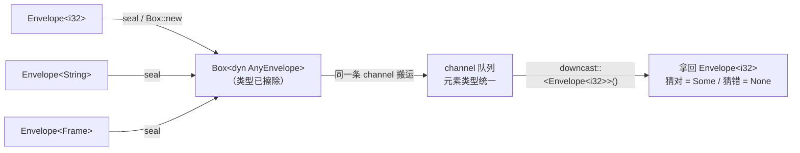

# Ch1.2 泛型、trait、trait 对象 `dyn`、`Any` 与 downcast

上一章讲了「消息如何交接、凭什么跨线程」。这一章解决一个更尖锐的问题——它是整个引擎类型设计的**枢纽**：

> 一条 channel 是**某一个具体类型**的通道。可我们要让**同一套通道与图代码**搬运「装了 `i32` 的信封」「装了 `String` 的信封」「装了一帧图像的信封」——载荷类型 `M` 千变万化。怎么办？

答案分两步，也正是这一章的两半：先用**泛型**让代码对类型「模板化」（编译期多态），再用 **trait 对象 `dyn` + `Any`** 把类型「擦掉」（运行期多态），让通道只认「一个盒子」。**这就是 Ch1.3 `Envelope` 类型擦除的全部原理**——这一章把原理讲透，下一章动手实现。

<!-- toc -->

## 1. 泛型：一份代码，多种类型（静态分发）

**泛型（generics）**让你写一份对类型「留空」的代码，用到时再填具体类型：

```rust,ignore
// 一个函数，对任何「能比较大小」的 T 都成立 / works for any comparable T
fn max<T: PartialOrd>(a: T, b: T) -> T {
    if a > b { a } else { b }
}

// 一个结构体，对任何 T 都能装 / a container generic over T
struct Slot<T> {
    value: T,
}
```

`<T>` 是类型参数，`T: PartialOrd` 是**trait 约束（bound）**——它是入场券：只有实现了 `PartialOrd` 的类型才准填进来，这样函数体里才敢写 `a > b`。

**关键机制：单态化（monomorphization）。** 编译器看到你用 `max(1i32, 2i32)` 和 `max("a", "b")`，会**分别生成两份**具体代码——一份 `i32` 版、一份 `&str` 版，就像你手写了两个函数。所以泛型是**零运行期开销**的（调用时没有查表、没有间接跳转，和手写具体类型一样快），代价是**编译期把类型定死**、生成的代码会膨胀。

这个「类型在编译期定死」正是泛型的**极限**，也是 §3 要突破的地方。

## 2. trait：把「能做什么」抽象出来

**trait** 定义一组行为（方法签名），谁实现了它，谁就「能做这件事」。它是 Rust 抽象的核心：

```rust,ignore
trait Area {
    fn area(&self) -> f64;             // 必须实现的方法 / required method
    fn describe(&self) -> String {     // 默认方法，可不重写 / default method
        format!("area = {}", self.area())
    }
}

struct Circle { r: f64 }
struct Square { side: f64 }

impl Area for Circle {
    fn area(&self) -> f64 { std::f64::consts::PI * self.r * self.r }
}
impl Area for Square {
    fn area(&self) -> f64 { self.side * self.side }
}
```

trait 既能当**约束**用在泛型里（`fn f<T: Area>(x: T)`，静态分发），也能当**类型**用（`dyn Area`，动态分发）——后者就是下面的重点。

## 3. 静态分发 vs 动态分发：泛型的极限

泛型/`impl Trait` 是**静态分发**：类型在编译期定死。这带来一个硬限制——**同一个容器只能装同一种类型**：

```rust,ignore
let v: Vec<Circle> = vec![Circle { r: 1.0 }, Circle { r: 2.0 }];  // ✅ 全是 Circle
// let v = vec![Circle { r: 1.0 }, Square { side: 2.0 }];         // ❌ 类型不一致
```

`Vec<T>` 里的 `T` 是**一个**具体类型。你没法把 `Circle` 和 `Square` 放进同一个 `Vec`——尽管它们都实现了 `Area`。

**这正是引擎撞上的墙**：一条 channel 本质是个队列，队列元素得是**同一个类型**。可我们要让它排队装 `Envelope<i32>`、`Envelope<String>`、`Envelope<Frame>`……这些是**不同的类型**（`Envelope<i32>` 与 `Envelope<String>` 在编译器眼里毫不相干）。泛型做不到——`VecDeque<Envelope<i32>>` 装不下 `Envelope<String>`。

突破口是**动态分发**：放弃「编译期定死类型」，改成「运行期查表决定行为」，从而让不同的具体类型能被当作**同一个** trait 对象来存放和传递。

## 4. trait 对象 `dyn Trait`：擦掉具体类型

把不同类型「统一」起来的工具就是 **trait 对象** `dyn Trait`。它通常以 `Box<dyn Trait>` 的形式出现：

```rust,ignore
// 一个 Vec，装「任何实现了 Area 的东西」——具体是圆是方，已被擦除
let shapes: Vec<Box<dyn Area>> = vec![
    Box::new(Circle { r: 1.0 }),
    Box::new(Square { side: 2.0 }),   // ✅ 现在圆和方能共处一个 Vec 了
];
for s in &shapes {
    println!("{}", s.describe());     // 运行期按各自真实类型查表调用 area()
}
```

`Box<dyn Area>` 是个**胖指针（fat pointer）**——两个机器字宽：一个指向堆上的真实数据，另一个指向该类型的 **vtable**（虚函数表，记着 `area` 等方法的真实地址）。调用 `s.area()` 时，运行期顺着 vtable 找到对应实现跳过去。代价是一次间接跳转（比静态分发略慢、且优化器难内联），换来的是**「异质集合」**能力：不同具体类型，统一成一个 `dyn Trait`。

### 对象安全（object safety）：一条影响深远的约束

不是所有 trait 都能变成 `dyn Trait`。要能建出 vtable，trait 必须**对象安全**，最常撞的两条红线：

- 方法**不能有泛型类型参数**（`fn foo<T>(&self, x: T)`）——vtable 是一张**固定**的表，没法为无穷多个 `T` 都填一格。
- 方法不能按值返回 `Self`（擦除后不知道 `Self` 多大）。

记住这条，因为它**直接决定**了下一章 `AnyEnvelope` 的设计：我们想要的「downcast 成某个具体类型 `T`」天生带泛型参数，**不能**做成 trait 方法（否则整个 trait 就不对象安全、装不进 `Box<dyn ...>` 了）。解法见 §5。

下面这张图就是**类型擦除**的全景——多种 `Envelope<M>` 收束成一个盒子穿过通道，再在下游被「认领」回来：



## 5. `Any` 与 downcast：擦除之后如何「认领」回来

类型擦除是**单向**的「忘掉类型」：一旦变成 `Box<dyn AnyEnvelope>`，编译器就不知道里面原来是 `i32` 还是 `String` 了。下游节点要取出载荷，就得把具体类型「认领」回来。这靠标准库的 **`std::any::Any`**：

- 任何 `'static` 类型都自动实现 `Any`。
- `Any` 背后是 **`TypeId`**——每个类型独一份的运行期指纹。
- `(&dyn Any).downcast_ref::<T>()` 返回 `Option<&T>`：内部**赌**它是 `T`——比对 `TypeId`，**猜对给 `Some`、猜错给 `None`**。这是**安全**的：认错类型不会 UB，只会得到 `None`。

```rust,ignore
use std::any::Any;

let boxed: Box<dyn Any> = Box::new(42i32);   // 擦除成 dyn Any
assert_eq!(boxed.downcast_ref::<i32>(), Some(&42));  // 猜对
assert_eq!(boxed.downcast_ref::<String>(), None);    // 猜错 → None，不崩
```

### 原版怎么做，我们怎么改进（一处「更少 unsafe」）

回看 Ch0.3 读过的原版 `any_envelope.rs`，它的 `AnyEnvelope: Any + DynClone`，然后在 `impl dyn AnyEnvelope` 上**手写** `downcast_ref` / `downcast_mut`——内部先比对 `TypeId`、再用 **`unsafe`** 把裸指针 `transmute` 成 `&T`：

```rust,ignore
// 原版（示意）：手写、带 unsafe 的 downcast
pub fn downcast_ref<T: AnyEnvelope>(&self) -> Option<&T> {
    if self.is::<T>() {
        unsafe { Some(&*(self as *const dyn AnyEnvelope as *const T)) }  // ← unsafe
    } else {
        None
    }
}
```

它把 downcast 写成 `impl dyn AnyEnvelope` 上的**关联函数**（而非 trait 方法），正是为了绕开 §4 的对象安全红线——带泛型参数的方法不能进 vtable。

**我们重写的改进**：不必自己 `transmute`。给 trait 加一个返回 `&dyn Any` 的方法，把「变回具体类型」的活儿**交还给标准库那套久经考验的安全实现**：

```rust,ignore
use std::any::Any;

pub trait AnyEnvelope: Any {
    fn as_any(&self) -> &dyn Any;          // 把自己「降级」成 &dyn Any
    fn as_any_mut(&mut self) -> &mut dyn Any;
    // …… is_some / is_none / info 等（都不带泛型，保持对象安全）
}

// 调用方：走 std 的安全 downcast，全程无 unsafe
fn take_i32(e: &dyn AnyEnvelope) -> Option<&Envelope<i32>> {
    e.as_any().downcast_ref::<Envelope<i32>>()
}
```

`as_any` 本身不带泛型（对象安全无虞），而真正带泛型的 downcast 由 `std` 的 `dyn Any` 提供、**天然安全**。这样我们既保留了原版的类型擦除能力，又抹掉了那段手写 `unsafe`——是「实现更简、更少 bug」这个目标的一个具体落点。（Ch1.3 会把这套真正写进 `code/flow-message` 并用测试钉死。）

## 小结

这一章把引擎类型设计的枢纽讲透了：

- **泛型 = 编译期多态**：单态化为每个具体类型生成一份代码，零运行期开销，但类型编译期定死、异质集合装不进同一个 `Vec`。
- **trait** 抽象「能做什么」，既可当泛型约束（静态分发），也可当类型 `dyn Trait`（动态分发）。
- **`dyn Trait` = 运行期多态**：胖指针（数据指针 + vtable），让不同具体类型统一成一个 trait 对象——这是「一条 channel 搬运不同 `M` 的信封」唯一的出路。
- **对象安全**：带泛型参数的方法不能进 vtable——这条约束逼着 downcast 不能做成 trait 方法。
- **`Any` + downcast**：擦除后靠 `TypeId` 安全「认领」回具体类型（猜错得 `None`，不 UB）；我们用 `as_any() -> &dyn Any` + `std` 的安全 downcast，去掉原版那段手写 `unsafe`。

下一章 **Ch1.3**：把这套原理**落成真实代码**——在 `code/flow-message` 里实现 `Envelope<M>`、`EnvelopeInfo`、类型擦除的 `AnyEnvelope` / `SealedEnvelope`，并从第一个**红-绿测试**开始（Part 1 起对引擎代码严格 TDD）。契约就是 Ch0.3 钉死的那几行：`new` / `unpack` / `repack<T>` / `repack_inplace`。
