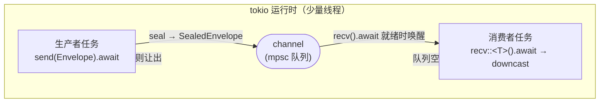

# Ch1.4 async/await、Future、tokio 入门 → channel 封装

上一章我们造好了「消息盒子」`Envelope<M>` 和它的类型擦除。可盒子只是静物——它得**流动**起来：从一个节点异步地发出、被另一个节点异步地收到。这一章给引擎装上**异步的心跳**：先补 `async`/`await`/`Future`/`tokio` 这几样引擎绕不开的异步地基，再把 tokio 的 channel **封装**成引擎自己的收发端，让上一章的 `SealedEnvelope` 真正在任务之间「跑」起来。

本章实现第一版单消费者有界通道。后面的 Ch1.4b～Ch1.4e 继续扩展容量、竞争接收、类型转换和取消协议；完成本章不等于完成原版通道。

<!-- toc -->

## 1. `async` / `await` / `Future`：不阻塞线程的等待

dataflow 引擎里，一个节点大部分时间在**等**——等上游发来消息、等下游腾出空位。如果用「一个节点一个线程 + 阻塞等待」，成百上千个节点就要成百上千个线程，绝大多数时间在睡觉，白白占着栈和调度开销。**异步**就是为解决这个而生：让**少量线程**驱动**大量**「在等待中让出、就绪后继续」的任务。

Rust 的异步三件套：

- **`Future`**：一个「**将来**才会算出值」的惰性状态机。它有个核心方法 `poll`：运行时问它「好了吗？」——要么答 `Ready(值)`，要么答 `Pending(还没，回头再问)`。返回 `Pending` 前，Future 通常需要安排在条件变化时通过 Waker 通知执行器再次 poll。`async fn` 的函数体在被 poll 前不执行；但某些 Future 是已经启动的外部操作的句柄，不能由此推断所有相关工作都尚未开始。
- **`async fn` / `async {}`**：写异步代码的语法糖。`async fn foo() -> T` 实际返回的是一个 `Future<Output = T>`；函数体被编译器**改写成一个状态机**。
- **`.await`**：在一个 `Future` 上「等它出结果」。语义是「**让出**：如果没就绪，就把控制权交还运行时去跑别的任务，等就绪了再从这里继续」——注意是让出**任务**，不是阻塞**线程**。

```rust,ignore
// async fn 返回一个 Future；调用它不会立刻执行，要 .await（或交给运行时）才跑
async fn read_two(rx: &mut Receiver) -> (i32, i32) {
    let a = rx.recv::<i32>().await;   // 没消息就让出，别的任务趁机跑
    let b = rx.recv::<i32>().await;   // 就绪后从这里继续
    (a.unwrap().unpack(), b.unwrap().unpack())
}
```

一句话：**`.await` 是「协作式让出点」**。这正好贴合引擎——节点在 `recv().await` 处等消息时，线程被腾出来跑别的就绪节点，等消息到了再回来。



## 2. 原版同样以 Tokio 为基础

参照版本的 `flow-rs/src/rt/mod.rs` 包含 `pub use tokio::*`，并构造 Tokio 多线程运行时。
`rt/spawn_pinned.rs` 使用 Tokio LocalSet 支持固定在线程上运行的 !Send 任务。
因此不能把原版整个 Rust 运行时描述成“自制有栈协程”，也不能说本书只是把有栈换成无栈
就完成了等价重构。

本书先学习普通 Tokio async 任务，后续仍需迁移原版的线程固定、本地任务池、锁包装、
入口宏和统计等行为。原版存在与同步/外部调用相关的 stackful 路径，不意味着所有节点
都运行在自制的有栈调度器上。判断范围应以具体模块和 feature 为准。

学 Tokio 的理由是理解原版已有的基础并能维护它，而不是凭替换库的名字证明业务等价。

## 3. tokio 入门：运行时、`spawn`、`mpsc`

tokio 是 Rust 事实标准的异步运行时。这一章只用到三样：

- **运行时（runtime）**：`Future` 不会自己跑，得交给运行时来 `poll` 驱动。测试里我们用 `#[tokio::test]` 自动起一个运行时；正式代码里 Ch3.3 会用 `#[tokio::main]` 或手动建 `Runtime`。
- **`tokio::spawn`**：把一个 `Future` 丢给运行时，作为一个**并发任务**跑（Ch3.3 每个节点 spawn 成一个任务）。被 spawn 的 future 必须 `Send + 'static`——正是 Ch1.1 讲的两张通行证。
- **`tokio::sync::mpsc`**：**多生产者、单消费者**的异步有界通道。`send(v).await` 在队列满时让出，`recv().await` 在队列空时让出。这就是我们要封装的底座。

引入依赖（workspace 集中锁版本，全走 crates.io 公共 crate）：

```toml
# code/Cargo.toml
[workspace.dependencies]
tokio = { version = "1", features = ["sync", "rt", "macros"] }
thiserror = "2"
```

`sync` 给我们 `mpsc`，`rt` 支持单线程运行时，`macros` 提供测试与入口属性宏。`#[tokio::test]` 默认使用当前线程；使用 `#[tokio::main]` 时本组 feature 必须显式指定 `flavor = "current_thread"`，默认多线程入口另需 `rt-multi-thread`。**只开用得到的 feature**，不把整个 tokio 拉进来。

先完成 [异步三步实验](ch04a-async-workshop.md)，能解释 Future、背压与关闭，再实现下节的封装。

## 4. 本章工程：先固定能抄写的终点

本章只依赖 Ch1.3 的消息库，不依赖节点、注册表、建图或后续通道实现。先在独立目录验证基础版，再在接下来的通道课中演进它。不要把最终仓库的多消费者测试放进这一版：这里的接收端必须是 `mut`，且不实现 Clone。

目录如下，每个本章新增文件都在下文完整展示：

```text
channel-basic/
├── Cargo.toml
├── src/
│   ├── lib.rs
│   ├── error.rs
│   └── channel.rs
└── message/                 # Ch1.3 已完成的消息库，保持原内容
    ├── Cargo.toml
    └── src/...
```

先保留你在 Ch1.3 完成的消息库。若使用教材提供的消息检查点，从教材仓库根目录执行：

```bash
mkdir -p /tmp/megflow-channel-study/src
python3 scripts/message_checkpoint.py --out /tmp/megflow-channel-study/message
```

这个导出命令要求目标 message 目录不存在，不会覆盖你的工程。它导出当前消息库，包含业务消息扩展；本章代码仅使用 Ch1.3 的 Envelope 和 SealedEnvelope。因而它证明基础通道可独立构建，尚不能替代全书冻结的逐章累计快照验收。手写路线可直接使用你上一章的消息库。

### Cargo.toml 完整内容

```toml
{{#include ../../labs/channel-basic/Cargo.toml}}
```

`[workspace]` 让实验成为独立工作区；`exclude = ["message"]` 允许消息检查点保留自己的工作区根。路径依赖仍然会正常构建它。`version = "1"` 是版本约束，不等于固定某个 Tokio 发布版；实际解析结果保存在 Cargo.lock。自动检查从主工程锁文件选取已验证的依赖版本，离线构建。

本章使用的第三方 crate：

| crate | 用途与关键类型 | feature / 边界 |
|---|---|---|
| Tokio | mpsc::Sender、mpsc::Receiver 和测试运行时 | sync、rt、macros；不用网络或定时器 |
| thiserror | 为 Error 派生 Display 与 std::error::Error | 过程宏生成普通 trait 实现；没有运行时错误收集服务 |

不用 thiserror 也能手写两个 trait；这里减少重复格式化代码。标准库 mpsc 的等待会阻塞线程，不适合作为本章 async 接收的直接替换；Tokio broadcast 则让各订阅者看到消息副本，与这一条竞争队列的契约不同。Tokio 的宏、thiserror 的派生宏还会间接使用 syn、quote、proc-macro2，宏专题会拆解这些编译期依赖。它们不是额外的消息处理任务。

### src/lib.rs 完整内容

```rust
{{#include ../../labs/channel-basic/src/lib.rs}}
```

这两行把两个文件声明为公开模块。只有文件存在而未声明模块，Rust 不会把它自动加入库。

### src/error.rs 完整内容

```rust
{{#include ../../labs/channel-basic/src/error.rs}}
```

`#[derive(Debug, thiserror::Error)]` 生成调试输出和标准错误 trait；每个 `#[error(...)]` 决定 Display 文本。`Result<T>` 是标准 Result 的类型别名，固定错误类型，成功值 T 仍由调用处决定。

这里的 ChannelClosed 表示当前操作无法继续收发，不表示整个图的全部任务都退出；TypeMismatch 表示已经收到一个真实类型不匹配的消息。本阶段把接收的 None 映射到关闭错误，不能据此声称原版 flush、abort、空信号等协议都只有这两类错误。

### src/channel.rs 完整内容（包括五项测试）

```rust
{{#include ../../labs/channel-basic/src/channel.rs}}
```

## 5. 逐段理解所有权与失败路径

### 创建队列

`channel` 同时返回发送端和接收端。两者连接同一条队列，而不是各有一份消息列表。发送端可以 Clone：新增一个生产者句柄，不会复制队列中的消息；接收端独占出队权，所以本阶段使用 `&mut self`。

本阶段明确拒绝容量 0；这是尚未演进的教学实现，**原版容量 0 的契约是无界**，后续 Ch1.4b 必须补齐，不能把这里的 assert 当成最终行为。

### 发送：把值交给队列

`send<T>` 消耗 `Envelope<T>`，调用 seal 转为类型擦除消息，再传给 send_any。这里 T 必须 Clone + Send + 'static：

- Send 允许载荷在任务所在的线程间转移。
- 'static 排除借用即将失效的栈数据，不要求消息一直活到程序结束。
- Clone 是上一章可克隆的类型擦除信封所需约束；本通道不会为了每次 send 主动克隆载荷。

队列满时，send 返回的 Future 等待空位。接收端已被丢弃时，Tokio 返回携带未发送消息的 SendError；本版 map_err 将它转为 ChannelClosed，因此其中的消息也被丢弃，调用者拿不到消息再重试。这是需要明确的 API 选择。

### 接收：先出队，再认领类型

recv_any 用 `Option::ok_or` 把 Some(message) 转成 Ok(message)，把 None 转成 ChannelClosed。所有发送句柄消失后，接收端仍先排空队列，随后才收到 None。

`recv<T>` 在出队后调用 downcast_mut 检查真实类型，得到对内部 `Envelope<T>` 的可变借用，再用 take 把载荷移到一个由调用者拥有的信封。不能直接返回这个借用，因为局部变量 message 会在函数返回时销毁。

如果猜错 T，消息已经出队，本函数返回 TypeMismatch 并销毁它，**不会退回队列**。下一次 recv 读取下一条。测试 wrong_type_consumes_only_that_message 同时断言错误和下一条结果，避免只测“出错了”而漏掉所有权后果。

### await 不保证让出

当队列有空位或有消息时，相应 Future 可以第一次 poll 就 Ready，await 便直接继续。本章的有限测试利用这一点按顺序发送和接收；若先在容量 1 的队列上连续发送两条、再接收，同一个任务就会卡在第二次发送，永远走不到接收。需要并发生产者/消费者的场景见异步三步实验。

## 6. 运行、预期结果和检查边界

把上面的完整文件写进实验目录后运行：

```bash
cargo test --manifest-path /tmp/megflow-channel-study/Cargo.toml --offline
```

若本机还没缓存 Tokio/thiserror，第一次去掉 --offline 下载依赖并生成锁文件，此后保留它复现。五个测试都应通过：

| 测试 | 必须断言的行为 |
|---|---|
| typed_roundtrip_preserves_metadata | 载荷 7，目标地址 Some(42) |
| untyped_roundtrip | 封箱直通后仍可认领为 u32，值为 9 |
| wrong_type_consumes_only_that_message | 第一条类型错误，第二条仍是 i32 的 2 |
| last_sender_drop_drains_before_close | 剩余发送克隆仍可发；最后克隆消失后先取出 3，再报关闭 |
| receiver_drop_rejects_send | 接收端 drop 后发送返回 ChannelClosed |

测试顺序和耗时不固定；验收是 `5 passed; 0 failed` 与退出码 0。测试中的等待都有预先入队消息或已确定的关闭状态，没有用 sleep 猜调度顺序。维护脚本另设进程超时，防止实现退化后无限挂住。

教材仓库根目录运行自动验证：

```bash
python3 scripts/check_basic_channel_course.py
```

脚本复制本章独立文件和消息检查点，在新临时目录离线编译。不会复制 flow-rs 的最终 channel、registry 或图代码。

## 7. 排错实验与独立练习

1. 删除 `send<T>` 的 Clone 约束，运行 cargo check，观察 seal 要求 Clone 的编译诊断。错误来自封箱接口，不来自 Tokio mpsc。恢复约束。
2. 在最后发送端关闭测试中保留 other 不 drop，最后一次 recv 将等待未来消息而非关闭。只运行这一项测试并手动停止，随后恢复代码；不要把这种故意挂起的版本提交到自动测试。
3. 将容量改成 0，观察本阶段明确的 panic；然后阅读 Ch1.4b，说明为什么最终实现必须选择无界队列，不能仅删除 assert 后继续调用 Tokio bounded channel。
4. 不看实现重写 `recv<T>`，解释类型检查、载荷移动、元信息保留分别发生在哪里，并用五个测试验收。

原版对照时，应分别查看固定提交的通道收发实现、关闭处理和类型错误处理。本章五项测试验证的是这个明确缩小的教学阶段，不足以标记原版通道“行为已验证”。完整协议还需要竞争接收、默认端点、转换缓存、批量/限时、关闭与 abort、flush/epoch、空信号和统计。

## 8. 接下来按协议演进

- [Ch1.4b 通道协议](ch04b-channel-protocols.md)：有界/无界、权重批量和竞争接收。
- [Ch1.4c 类型化与默认端点](ch04c-typed-endpoints.md)：SenderT/ReceiverT 与默认端点。
- [Ch1.4d 类型信息与转换表](ch04d-type-conversion.md)：发送侧和接收侧的转换方向。
- [Ch1.4e 取消、超时与任务错误](ch04e-cancellation-errors.md)：根据消息所有权解释取消后果。

完成这些课后再进入节点实现。第一版队列是理解数据如何移动的起点，不能替代后续的原版协议验收。
