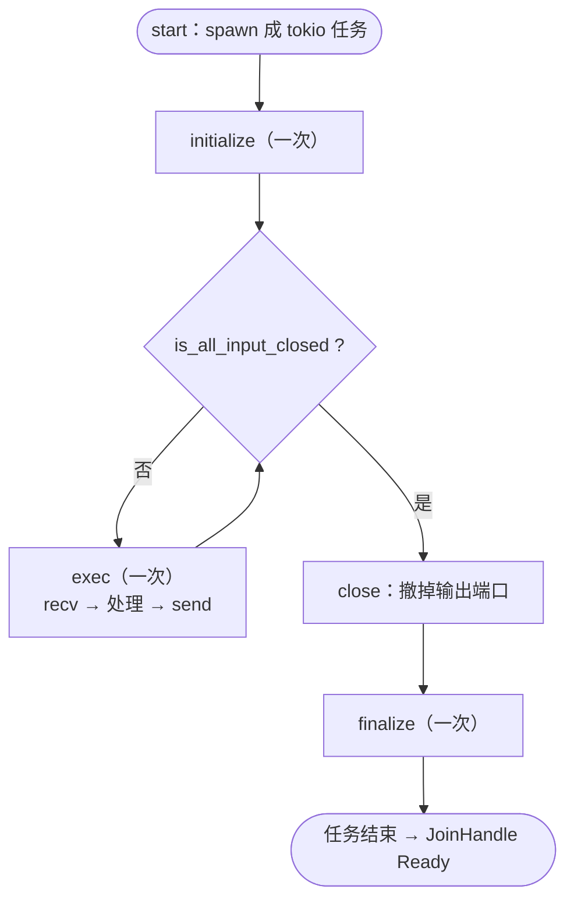

# Ch2.1 Node / Actor trait、端口、exec 循环（手写不用宏）

Part 1 造好了**静态地基**：能装任意载荷的消息 `Envelope<M>`，和能在异步任务间搬运它的通道 `channel`。可消息现在只是「能被搬运」，还没有谁去**处理**它。这一部分登场的主角就是**节点（node）**——dataflow 图里真正干活的单元。

本章我们**全部手写、不碰任何宏**，实现一个最小节点，把它跑起来。目的有两个：**看清节点的本质**（它就是一个反复 `exec` 的异步任务），以及**亲身感受样板之多**——为下一章一头扎进过程宏、把这些样板自动生成，攒够动机。

<!-- toc -->

## 1. 一个节点，就是一个 actor

回忆 Ch0.1 的 actor 模型：每个节点是一个**独立的并发单元**，有自己的输入/输出端口，通过 channel 与别的节点通信，除此之外**不共享状态**。落到实现上，一个节点就是：

> 被 spawn 成**一个 tokio 任务**，在任务里反复地「从输入端口收一条 → 处理 → 往输出端口发」，直到上游全部关闭，然后收尾退出。

我们把这个「一生」定成**三段式生命周期**：



`initialize` 开场做一次（未来用来拿共享资源），`exec` 是**反复调用**的一次处理，`finalize` 收尾做一次。中间那个 `while` 就是**exec 循环**——引擎的心跳。

## 2. 立契约：为什么是两个 trait

原版把节点接口拆成 `Node` 和 `Actor` 两个 trait，我们照搬这个划分，因为它切得很干净——**两个 trait 面向两个不同的「客户」**：

- **`Node`**：面向**图装配**。图在搭建时要把 channel 接到节点的端口上、要判断一个节点的输入是不是都关了、要能主动关掉它的输出。
- **`Actor`**：面向**调度器**。运行时要把节点「点火」跑成一个任务。

```rust,ignore
use crate::error::Result;
use tokio::task::JoinHandle;

/// 面向图装配：判断输入是否关闭、主动关闭输出。
pub trait Node {
    fn close(&mut self);                    // 撤掉所有输出端口 → 下游收到 ChannelClosed
    fn is_all_input_closed(&self) -> bool;  // 所有输入都关了？→ 调度器据此结束 exec 循环
}

/// 面向调度器：被 spawn 成一个 tokio 任务。
pub trait Actor: Node + Send + 'static {
    fn start(self: Box<Self>) -> JoinHandle<Result<()>>;
}
```

这短短几行里藏着**两个关键的 Rust 设计决断**，都值得停下来看清楚。

### 2.1 为什么 `start` 不是 `async fn`？——为了对象安全

图里存的是一堆**类型各异**的节点（`Doubler`、`Merge`、`Bcast`……），必须统一成 `Box<dyn Actor>` 才能装进一个 `Vec`、被调度器一视同仁地点火。这就要求 `Actor` **对象安全**（回忆 Ch1.2：能做成 `dyn` 的 trait）。

而「async fn in trait」直到现在都**不完全对象安全**——一个 `async fn start(&self)` 会让 `dyn Actor` 编译不过。破解办法很直接：**让 `start` 返回一个 `JoinHandle`，而不是自己 `async`**。`start` 只做一件同步的事——把一段 `async` 逻辑 `tokio::spawn` 出去、把句柄交回来。同步方法，对象安全，`Box<dyn Actor>` 稳稳成立。

### 2.2 那需要 `async` 的 `exec` 放哪？——放进固有方法

`exec`/`initialize`/`finalize` 天然是 `async`（要 `.await` 收发消息）。既然不能进 trait，那就**根本不进 trait**——把它们写成节点自己的**固有方法（inherent method）**。`start` 在 `spawn` 的那段 `async` 块里**直接调用**它们即可：

```rust,ignore
fn start(mut self: Box<Self>) -> JoinHandle<Result<()>> {
    tokio::spawn(async move {
        self.initialize().await;                 // ← 调固有方法，非 trait 方法
        while !self.is_all_input_closed() {
            self.exec().await?;                  // ← exec 循环，引擎的心跳
        }
        self.close();
        self.finalize().await;
        Ok(())
    })
}
```

这就是原版那个巧思的全部：**把「需要 async 的部分」关在固有方法里，trait 表面只留一个非 async 的 `start`。** 既拿到了 `async` 的表达力，又保住了 `dyn` 的对象安全。Ch2.3 用 `#[derive(Actor)]` 生成的，正是这段 `start`。

> 题外话：社区有 `async-trait` 宏（把 async trait 方法脱糖成返回 `Box<dyn Future>`）能直接绕过对象安全问题。但那要每次调用都堆一次 `Box` 分配。原版这套「非 async trait + 固有 async 方法」是**零额外分配**的做法，我们沿用。

## 3. 红：先写节点的行为测试

老规矩，先红。我们要一个最小的 worker 节点 `Doubler`：**收一个 `i32`，翻倍，发出去**；上游关闭后自己优雅停机。把它当测试夹具写进 `code/flow-rs/src/node.rs`：

```rust,ignore
#[tokio::test]
async fn doubler_pipes_and_shuts_down() {
    let (in_tx, in_rx) = channel(8);
    let (out_tx, mut out_rx) = channel(8);
    let node = Box::new(Doubler { inp: in_rx, out: Some(out_tx), input_closed: false });
    let handle = node.start();

    // 喂 3 条，随后关闭输入端（drop 掉唯一的 Sender）
    for v in [1i32, 2, 3] { in_tx.send(Envelope::new(v)).await.unwrap(); }
    drop(in_tx);

    // 收集输出：应为翻倍值，且上游停机后本端也随之关闭
    let mut got = Vec::new();
    while let Ok(mut e) = out_rx.recv::<i32>().await { got.push(e.unpack()); }
    assert_eq!(got, vec![2, 4, 6]);

    handle.await.unwrap().unwrap();   // 任务优雅结束、无 panic、无错误
}
```

此刻 `Doubler` 和 `Node`/`Actor` 都还不存在，`cargo test` → **红**：`cannot find type Doubler`、`cannot find trait Node`……契约立住了，去实现。

## 4. 绿（一）：定义两个 trait

先把 §2 的 `Node`/`Actor` 落进 `node.rs`。它们就是上面那两段——不重复贴了。加上 `pub mod node;` 到 `lib.rs`，trait 部分就位。

## 5. 绿（二）：手写 `Doubler` 的**全部**样板

现在把 `Doubler` 从头写全。请**边写边数**：哪些是业务、哪些是样板。

```rust,ignore
struct Doubler {
    inp: Receiver,          // ← 样板：输入端口字段
    out: Option<Sender>,    // ← 样板：输出端口字段（Option 便于 close 时置空）
    input_closed: bool,     // ← 样板：关闭标志
}

impl Doubler {
    async fn initialize(&mut self) {}   // ← 样板：空生命周期钩子
    async fn finalize(&mut self) {}     // ← 样板：空生命周期钩子

    async fn exec(&mut self) -> Result<()> {
        match self.inp.recv::<i32>().await {
            Ok(mut e) => {
                let doubled = e.unpack() * 2;                 // ← 业务：真正的逻辑，就这 1 行
                if let Some(out) = self.out.as_ref() {
                    out.send(Envelope::new(doubled)).await?;  // ← 半业务半样板：发出去
                }
            }
            Err(Error::ChannelClosed) => self.input_closed = true, // ← 样板：收到关闭 → 记标志
            Err(e) => return Err(e),
        }
        Ok(())
    }
}

impl Node for Doubler {                                    // ← 样板：整个 impl
    fn close(&mut self) { self.out = None; }               //    drop Sender → 下游 ChannelClosed
    fn is_all_input_closed(&self) -> bool { self.input_closed }
}

impl Actor for Doubler {                                   // ← 样板：整个 impl（每个节点都一样）
    fn start(mut self: Box<Self>) -> JoinHandle<Result<()>> {
        tokio::spawn(async move {
            self.initialize().await;
            while !self.is_all_input_closed() { self.exec().await?; }
            self.close();
            self.finalize().await;
            Ok(())
        })
    }
}
```

**停机是怎么发生的**，顺着数据流走一遍就清楚了：测试里 `drop(in_tx)` 撤走唯一的上游 → `Doubler` 的 `recv` 返回 `Err(ChannelClosed)` → `exec` 把 `input_closed` 置真 → 下一轮 `while` 判定退出 → `close()` 把 `out` 置 `None`、drop 掉输出 `Sender` → 测试里的 `out_rx.recv` 也随之返回 `Err`、`while let` 收尾 → `handle.await` 拿到任务的 `Ok(())`。**关闭像涟漪一样从上游一路传到下游**，没有一个节点需要「被通知」停机——channel 的关闭语义自己就是信号。这正是 Ch1.4 把 `ChannelClosed` 定为一等错误的回报。

`cargo test -p flow-rs`：

```text
running 7 tests
test channel::tests::... ok        （Ch1.4 的 5 个）
test node::tests::doubler_pipes_and_shuts_down ... ok
test node::tests::runs_behind_boxed_dyn_actor ... ok

test result: ok. 7 passed; 0 failed
```

**绿**。第二个测试 `runs_behind_boxed_dyn_actor` 特意把节点擦除成 `Box<dyn Actor>` 再 `start`——证明 §2.1 的对象安全不是空谈。

## 6. 数一数样板：这就是过程宏的动机

回头看 §5：一个只会把数字**乘二**的节点，业务逻辑实打实就 `e.unpack() * 2` **一行**，其余全是**机械的、每个节点都长一个样**的样板。把它们归归类：

| 样板 | 有多机械 | 将来由谁生成 |
|---|---|---|
| `inp: Receiver` / `out: Option<Sender>` 端口字段 | 完全由「有哪些端口」决定 | `#[inputs(...)]` / `#[outputs(...)]` |
| `input_closed` 标志 + `Err(ChannelClosed) => …` | 每个节点一字不差 | `#[derive(Node)]` |
| `impl Node`（`close` / `is_all_input_closed`） | 每个节点一字不差 | `#[derive(Node)]` |
| `impl Actor`（`start` 里的 spawn + 三段循环） | 每个节点一字不差 | `#[derive(Actor)]` |
| 空的 `initialize` / `finalize` | 常常是空的 | 宏提供默认 |

也就是说，理想中节点开发者**只应该写这些**：

```rust,ignore
#[inputs(inp)]
#[outputs(out)]
#[derive(Node, Actor, Default)]
struct Doubler {}

impl Doubler {
    async fn exec(&mut self, _: &Context) -> Result<()> {
        let v = self.inp.recv::<i32>().await?.unpack();
        self.out.send(Envelope::new(v * 2)).await?;   // 业务，仅此
        Ok(())
    }
}
node_register!("Doubler", Doubler);
```

对比一下——**同一个节点，从三十多行样板塌缩成一行业务 + 几行声明**。这正是原版真实的节点写法（回看 Ch0.3 读到的 `Transform`/`Noop`）。`#[inputs]`/`#[outputs]`/`#[derive(Node, Actor)]`/`node_register!` 这四样，就是 Part 2 剩下三章要**亲手实现**的过程宏。

这也回答了「为什么 MegFlow 要重度用过程宏」：不是炫技，而是**把不可避免、极其重复、又容易写错的并发样板，收敛到编译期一次性正确地生成**——写得更少，也更不容易出 bug。

## 7. 对比原版 · 本章刻意后置的边界

| 维度 | 原版 flow-rs | 本书本章 | 说明 |
|---|---|---|---|
| 双 trait | `Node` + `Actor` | 同 | 划分照搬 |
| `start` 返回 | `rt::task::JoinHandle`（自制 rt） | `tokio::task::JoinHandle` | 换主流运行时 |
| `Node` 方法 | set_port / 动态端口 / stats / anchor / close / is_allinp_closed | 只 `close` / `is_all_input_closed` | 端口动态绑定属图装配（Part 3）、stats/anchor 属 profile（非核心），按需后置 |
| 端口注入 | 由 Graph Builder 经 `set_port` 动态绑定 | 构造时直接注入 | 配置层还没造，Part 3 补 |
| `exec` 参数 | `&Context` | 无参 | `Context`（停机信号等）Part 3 引入 |

还有两处**边界要讲明**，免得误解：

- **源节点（Producer）的循环**：`Doubler` 有输入，靠「输入关闭」退出。但像 `GliderServer` 这种**没有输入**的源节点，`is_all_input_closed` 恒为「空真」，循环语义不一样（它自己决定何时产出、何时停）。这个话题连同 `Context` 一起放到 Part 3/相应章。
- **多输入端口**：`is_all_input_closed` 的「all」在多输入时才有意义（要所有输入都关了才退）。本章单输入，多路输入等 Ch4.2 `merge`。

真实代码见 `code/flow-rs/src/node.rs`（trait + `Doubler` 夹具 + 2 测试）。

## 小结

- **节点 = actor = 一个反复 `exec` 的 tokio 任务**，一生是 `initialize → while !closed { exec } → close → finalize` 三段式。
- **两个 trait 各面向一个客户**：`Node`（图装配）、`Actor`（调度器）。
- **两个 Rust 设计决断**：`start` 非 async → **对象安全** → `Box<dyn Actor>`；`exec`/生命周期是**固有 async 方法**、不进 trait → 绕开 async-fn-in-trait 的对象安全坑，且零额外分配。
- **关闭是涟漪**：channel 的 `ChannelClosed` 从上游一路传到下游，没有节点需要被显式通知停机。
- **手写节点样板极多、业务极少**——这就是 Part 2 后续过程宏的全部动机。

下一章 **Ch2.2 过程宏入门**：进入本书「学 Rust」含金量最高的一段。我们先搞懂过程宏的三件套——`proc-macro2`（在编译期把代码当数据处理的 token 流）、`syn`（把 token 解析成语法树）、`quote`（把语法树再拼回代码）——并亲手写出第一个能跑的派生宏，为 Ch2.3 生成上面那堆 `Node`/`Actor` 样板铺路。
