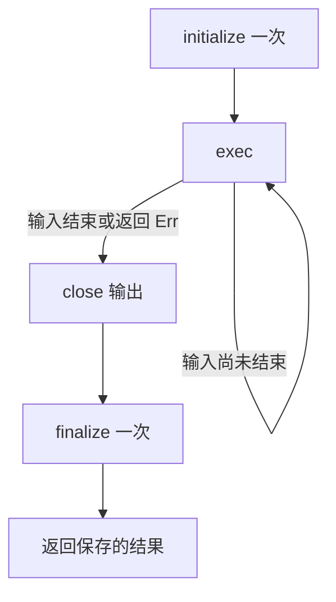

# Ch2.1 第十四、十五步：亲手写出会工作的节点

继续 Part 1 第十三步的 **同一个 flow-rs 工程**。现在你已经有消息、通道、错误类型、类型描述与直接转换。节点就是这些能力的第一个使用者：它收一条输入，处理，再发一条输出。

本章先手写，之后才生成宏。没有 Context、DynPorts、节点注册表，也不从最终仓库复制 node.rs。现阶段只开发单输入的 Doubler，业务是把 i32 乘二并保留元信息；它不是原版全部节点协议已经完成的证明。

<!-- toc -->

## 第十四步：先只处理一条消息

先不启动任务、不写生命周期循环。我们只想证明一个节点能把带序号的 7 变成带同一序号的 14。

**替换 src/lib.rs，新增 src/node.rs**。Cargo.toml、error、channel、config、message 以及已有 tests 全部不变。不增加 crate。

完整 **src/lib.rs**：

```rust
{{#include ../../labs/node-steps/lib.rs}}
```

只新增 `pub mod node;`。它让编译器加载当前目录的 node.rs，其余三个模块都是 Part 1 已写出的。

完整 **src/node.rs**：

```rust
{{#include ../../labs/node-steps/14/node.rs}}
```

按实际写作顺序读：先用两个字段保存输入和输出端点，再写 new 接收它们的所有权；之后写 exec。`&mut self` 让本次处理独占借用节点，避免同一个节点状态被两个调用同时修改。

exec 先调用上一部分实现的 recv，`?` 遇到错误提前返回。成功时 unpack 取出整数，计算后用 repack 创建输出信封，保留序号等信息。最后一行不带分号，把 send 的 Result 作为函数结果返回。

为什么不用 `Envelope::new(doubled)`？因为那会重置元信息。为什么没有 `tokio::spawn`？此时测试直接等待一次 exec，先把业务写对，不同时引入循环与任务所有权。

在当前 flow-rs 目录运行：

```bash
cargo test --offline --lib node::tests
```

预期 `one_call_processes_one_message ... ok`，共 **1 项节点测试**。再运行 `cargo test --offline`，Part 1 的测试也应保留并通过。

排错实验：把 repack 改为 Envelope::new，序号断言应失败。独立练习：在下一次 exec 前再发送一条消息，验证每调用一次只处理一条；不要在容量 1 的队列先连续发送两条，否则测试自己会等待空位。

## 第十五步：让节点自己反复处理并收尾

我们不想让外部为每条消息调用 exec。下一步把节点移动进一个 Tokio 任务，任务自己反复处理，输入结束后关闭输出并 finalize。

**只替换 src/node.rs**。lib.rs 和所有其他文件保持第十四步的内容。完整文件：

```rust
{{#include ../../labs/node-steps/15/node.rs}}
```

先读下面五段，再对照完整文件逐段写。文件保留了第十四步的测试，因此新功能不能破坏已经验证的一次处理。

### 1. Node 和 Actor 分别回答什么

Node 暴露关闭和输入是否结束。Actor 暴露 start，接受 `Box<Self>` 并返回任务句柄。两者都是本章刚定义的 trait，不依赖以后宏生成的代码。

`self: Box<Self>` 表示 start 消耗整个盒子，节点所有权交给任务；调用者不能在启动后继续修改同一节点。`Actor: Node + Send + 'static` 表示实现者还必须实现 Node，并满足 Tokio spawn 的跨线程移动和借用期限要求。

同步 start 调用 tokio::spawn 后立即返回 JoinHandle；真正异步的 initialize、exec、finalize 是 Doubler 的固有方法。这样可以通过 `Box<dyn Actor>` 调用 start。这里选择同步调度入口，不把原生 async trait 方法当作已经能直接动态分发的接口。

### 2. 为什么需要 input_closed

recv 报输入关闭时，exec 把标志设为 true，然后正常返回。下一次循环判断看到 true，便不再调用 exec。

注意关闭错误来自哪里：输入接收关闭表示输入结束；输出发送失败则作为错误向外传播，不应伪装成输入结束。当前单输入节点只需一个 bool，多输入策略要在多端口章节单独设计。

### 3. 为什么把循环放在内层 async

如果直接在最外层写 `self.exec().await?`，业务错误会跳过后面的关闭和 finalize。现在问号只退出内层 async，结果先保存在 result，外层再执行 close、finalize，最后返回 result。



这保证正常返回和普通 Result 错误的收尾，**不保证 panic 或强制取消时仍能异步 finalize**。不要把这段循环理解为所有退出情况都会执行的 finally。

### 4. 怎样观察生命周期，而不猜任务时序

events 只用于教学，记录 initialize、exec、close、finalize。Arc 使测试和节点共享同一列表；标准库 Mutex 保护一次 push。锁只在 record 中短暂持有，既不跨 await，也不执行业务函数。

成功测试使用容量 1 的队列，所以生产方另起任务，与消费方并发推进。生产任务结束时释放 source，节点排空输入后关闭输出，消费方收到关闭退出，最后等待两个任务。两秒 timeout 只负责发现挂起，先后顺序来自收发和任务结束，不来自 sleep。

输入三条为何记录四次 exec？第四次负责读到关闭并更新 input_closed，不产生输出。

### 5. 这里的 close 与上一部分怎样衔接

Doubler 的输出仍是普通 Sender，close 调用 Part 1 第十三步已经实现的显式关闭。即使其他地方还持有输出发送克隆，队列也会拒绝新消息并让接收者排空后结束。它没有偷偷依赖“所有句柄正好都 drop”这个条件。

后面端口宏可能改变字段组织和输出关闭生成方式；到那一章必须明确展示修改，不能把未来的 Option 字段或动态端口接口提前当作当前代码。

## 验收与下一步

运行 `cargo test --offline --lib node::tests`，预期 **3 项测试**通过：

| 测试 | 验证 |
|---|---|
| one_call_processes_one_message | 7 变 14，序号 42 保留 |
| erased_actor_drains_input_and_finalizes | dyn Actor 启动，输出恰好 2、4、6，关闭并 finalize 一次 |
| send_error_still_closes_and_finalizes | 输出提前关闭时返回错误，仍关闭并 finalize 一次 |

运行 `cargo test --offline`，前面所有通道测试仍应通过。维护者运行 `python3 scripts/check_basic_channel_course.py`，现在它会从 Part 1 第一步累计构建到本章第十五步，绝不复制最终节点运行时补齐依赖。

本课没有新增第三方依赖：Tokio 提供任务、测试和计时器；标准库提供 Box、Arc、Mutex；业务错误和消息来自此前手写的两个库。已有 thiserror 仍只生成错误格式化代码，不驱动节点。

下一课 [手写节点排错实作](ch01a-manual-actor-workshop.md) 继续用这份工程理解问号、任务结果和元信息，然后才进入过程宏。
