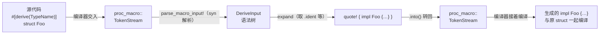

# Ch2.2 过程宏入门：proc-macro2 / syn / quote

上一章我们手写了一个 `Doubler` 节点，数出满屏样板、只有一行业务。要消除那些样板，靠的就是 **过程宏（procedural macro）**——一段在**编译期**运行、**用代码生成代码**的程序。这一章我们把过程宏的机制彻底讲清，并亲手写出第一个能跑的派生宏 `#[derive(TypeName)]`，为 Ch2.3 生成整套 `Node`/`Actor` 样板铺好路。

<!-- toc -->

## 1. 过程宏是什么

先接上 Ch2.0：`macro_rules!`（声明宏）通过匹配语法生成代码。**过程宏**则是**真正的 Rust 程序**：它接收一段代码的 **token 流**作为输入，返回一段 token 流作为输出，中间你可以用任意 Rust 逻辑去分析、变换、生成。它在编译期、在你的代码被真正编译**之前**运行。

过程宏有三种形态：

| 形态 | 长相 | 用途 |
|---|---|---|
| **派生宏** derive | `#[derive(Node)]` | 给一个类型**追加** impl（不改原类型） |
| **属性宏** attribute | `#[inputs(inp)]` / `#[methods]` | **改写**被标注的项（增删字段、包裹方法） |
| **函数式宏** function-like | `node_register!(...)` | 像函数一样调用，展开成任意代码 |

MegFlow 三种都用到了：Ch2.2 先做**派生宏**（最容易入门，只追加不改写），Ch2.3 做**属性宏** `#[inputs]`/`#[outputs]`/`#[methods]`，Ch2.4 做**函数式宏** `node_register!`。

## 2. 三件套：token → 语法树 → token

裸写 token 流会疯掉。生态用三个基础 crate 把它变得可控——这就是几乎每个过程宏都依赖的「三件套」：

- **`proc-macro2`**：token 流的**类型**。编译器自带的 `proc_macro::TokenStream` 有个致命限制——它需要编译器提供的过程宏执行上下文，**不适合在普通程序或单元测试中直接构造**（宏入口调用的普通辅助函数仍可使用它）。`proc-macro2` 是它的可移植镜像（`proc_macro2::TokenStream`），syn 和 quote 都围绕它工作。**这个区别后面测试时是关键。**
- **`syn`**：**解析器**。把 token 流解析成结构化的**语法树**。比如 `syn::DeriveInput` 就是「一个带属性的 struct/enum 定义」的语法树，有 `.ident`（名字）、`.generics`（泛型）、`.data`（字段/变体）等字段。
- **`quote`**：**生成器**。`quote! { ... }` 宏让你像写模板一样写目标代码，用 `#var` 把变量**插值**进去，产出 token 流。

一个派生宏的数据流，从头到尾是这样：



记住这条链：**编译器给你 token → syn 解析成树 → 你的逻辑生成新树 → quote 拼成 token → 交还编译器**。所有过程宏都是这个骨架。

## 3. 一个过程宏 crate 的特殊性

过程宏**必须住在自己的 crate** 里，且 `Cargo.toml` 标 `proc-macro = true`：

```toml
# code/flow-derive/Cargo.toml
[lib]
proc-macro = true
doctest = false

[dependencies]
proc-macro2 = { workspace = true }
quote = { workspace = true }
syn = { workspace = true }   # 本章用默认 features（含解析 DeriveInput）；Ch2.3 升 "full"
```

这种 crate 有两条铁律，都会影响我们的写法：

1. **只能导出宏**。`proc-macro = true` 的 crate **不能**导出普通的函数、类型、trait 给别人 `use`。所以宏**生成的代码**若要引用某个 trait（比如 Ch2.3 里的 `Node`），那个 trait 必须住在**另一个**普通 crate（`flow-rs`）里。本章的 `TypeName` 宏刻意生成**固有方法**、不碰任何 trait，正是为了先避开这个复杂性。
2. **入口函数无法单元测试**。`#[proc_macro_derive]` 入口收发的是 `proc_macro::TokenStream`，它在普通测试里根本构造不出来。破解办法——也是社区标准工程模式——**把逻辑抽成一个用 `proc_macro2::TokenStream` 的普通函数**（我们叫它 `expand_*`），入口只做「边界转换 + 调用它」。于是逻辑函数可以被单元测试直接调用。

## 4. 红：先写下游怎么用

先从**使用者视角**写集成测试，放进 `code/flow-derive/tests/derive_type_name.rs`。我们期望：给任意 struct/enum 标 `#[derive(TypeName)]`，就能调 `T::type_name()` 拿到它的名字字符串。

```rust,ignore
use flow_derive::TypeName;

#[derive(TypeName)]
#[allow(dead_code)]
struct Widget { x: i32 }

#[derive(TypeName)]
#[allow(dead_code)]
enum Color { Red, Green }

#[test]
fn struct_reports_its_name() { assert_eq!(Widget::type_name(), "Widget"); }
#[test]
fn enum_reports_its_name()   { assert_eq!(Color::type_name(), "Color"); }
```

`cargo test -p flow-derive` → **红**：`cannot find derive macro TypeName`。宏还不存在，去实现。

## 5. 绿：实现 `#[derive(TypeName)]`

写进 `code/flow-derive/src/lib.rs`。分成「薄入口」和「可测的逻辑核心」两半。

**薄入口**——只做 §2 那条链的两端（token ↔ 语法树的边界转换），逻辑一律转交：

```rust,ignore
use proc_macro::TokenStream;
use quote::quote;
use syn::{parse_macro_input, DeriveInput};

#[proc_macro_derive(TypeName)]
pub fn derive_type_name(input: TokenStream) -> TokenStream {
    let input = parse_macro_input!(input as DeriveInput); // ① proc_macro → syn 树
    expand_type_name(&input).into()                       // ② 逻辑；③ .into() 转回
}
```

- `#[proc_macro_derive(TypeName)]` 声明「这是名为 `TypeName` 的派生宏」。
- `parse_macro_input!` 把编译器给的 token 解析成 `DeriveInput`；解析失败会自动生成友好的编译错误。
- `.into()` 把逻辑函数产出的 `proc_macro2::TokenStream` 转回编译器要的 `proc_macro::TokenStream`。

**逻辑核心**——接收 `&DeriveInput`，返回 `proc_macro2::TokenStream`，可被单元测试直接调用：

```rust,ignore
{{#include ../../../code/flow-derive/src/lib.rs:type_name_expansion}}
```

`quote!` 是这里的主角。它几乎就是「把你想生成的代码原样写出来」，只有 `#name` / `#name_str` 是插值点：

- `#name` 插入的是 `Ident` → 生成 `impl Foo`（裸标识符）。
- `#name_str` 插入的是 `String` → quote 自动把它变成**字符串字面量** `"Foo"`。

`#name` 和 `#name_str` 的类型不同，插出来的 token 形态就不同——这是 quote 的贴心之处：它按变量的 Rust 类型决定如何 token 化。

加上 `proc-macro2 / quote / syn` 三个 workspace 依赖后，`cargo test -p flow-derive` → **绿**。

## 6. 过程宏怎么测？——两种测试，各补一半

这是本章最该带走的工程经验。上面的 §3 铁律 2 让测试分成互补的两层：

**单元测试**（在 `lib.rs` 里 `#[cfg(test)]`）——测**逻辑函数** `expand_type_name`。因为它接收普通语法树、返回 `proc_macro2::TokenStream`，我们能用 `syn::parse_str` 凭空造一个语法树喂进去，再把输出 token **转成字符串**比对：

```rust,ignore
#[test]
fn expands_to_impl_with_type_name() {
    let input: DeriveInput = syn::parse_str("struct Foo { a: i32 }").unwrap();
    let out = expand_type_name(&input).to_string();
    assert!(out.contains("impl Foo"));
    assert!(out.contains("\"Foo\""));
}
```

它快、精准，能直接盯住「生成的 token 对不对」，但**测不到真实展开后能否编译、运行时行为对不对**。

**集成测试**（`tests/` 目录，就是 §4 那个）——从下游视角真正 `#[derive(TypeName)]` 再 `assert_eq!(Widget::type_name(), "Widget")`。它验证的是**端到端**：宏真的展开了、生成的代码真的编译通过、跑起来结果真的对。代价是它看不见「生成了什么」，只看得见「跑出来对不对」。

> 为什么单元测试测不了入口、集成测试却行？因为集成测试是**独立的编译单元**（相当于一个下游 crate），它像真实用户一样在自己的编译过程里展开宏；而 `lib.rs` 内部的单元测试和宏在同一个 proc-macro crate 里，拿不到 `proc_macro::TokenStream` 这个「只在宏上下文存在」的类型。

这两种是基础，还要加入非法输入的编译诊断测试（见 Ch2.3a）：**单元测试盯生成逻辑，集成测试盯真实行为。** 后面每个宏我们都按这个套路测。

## 7. 对比原版 · 本章后置的边界

- **syn 版本**：原版用 `syn = "1"`，我们用 **`syn = "2"`**（与随书锁文件保持一致，详见 Ch2.2a）——契合「学主流 Rust」。两版语法树结构有差异，重写按 syn 2 来。
- **泛型已纳入当前实现**：`split_for_impl()` 分别提供 impl 参数、类型参数和 where 子句。Ch2.2b 用生命周期、默认类型和 const 泛型解释其区别，主工程集成测试会真实编译这些用法。
- **syn features**：本章解析 `DeriveInput` 用默认 features 就够；Ch2.3 的 `#[methods]` 要解析 `impl` 块里的**方法体**，届时升到 `features = ["full"]`——按需生长，不提前拉全。

真实代码见 `code/flow-derive/src/lib.rs`（入口 + `expand_type_name` + 单元测试）与 `code/flow-derive/tests/derive_type_name.rs`（集成测试）。

## 小结

- **过程宏 = 编译期用代码生成代码**：token 流进、token 流出，中间是任意 Rust 逻辑。三形态：派生 / 属性 / 函数式。
- **三件套**：`proc-macro2`（可测的 token 类型）、`syn`（解析成语法树）、`quote`（`#var` 插值拼回 token）。数据流永远是「token → syn 树 → 生成 → quote → token」。
- **proc-macro crate 两条铁律**：只能导出宏（生成代码引用的 trait 得住在别的 crate）；入口无法单元测试（故把逻辑抽成 `proc_macro2` 的 `expand_*` 函数）。
- **两层测试**：单元测 `expand_*` 的 token 输出，集成测 `tests/` 下游真实展开与运行时行为——缺一不可。

下一章 **Ch2.3**：把三件套用到刀刃上。我们实现 `#[inputs]`/`#[outputs]`（属性宏，往节点结构体注入端口字段）、`#[derive(Node)]`（派生 `close`/`is_all_input_closed`）、`#[derive(Actor)]`（派生那段 exec 循环）和 `#[methods]`，把 Ch2.1 手写的 `Doubler` 样板真正**塌缩成几行声明**。泛型的 `split_for_impl` 也在那里补上。
