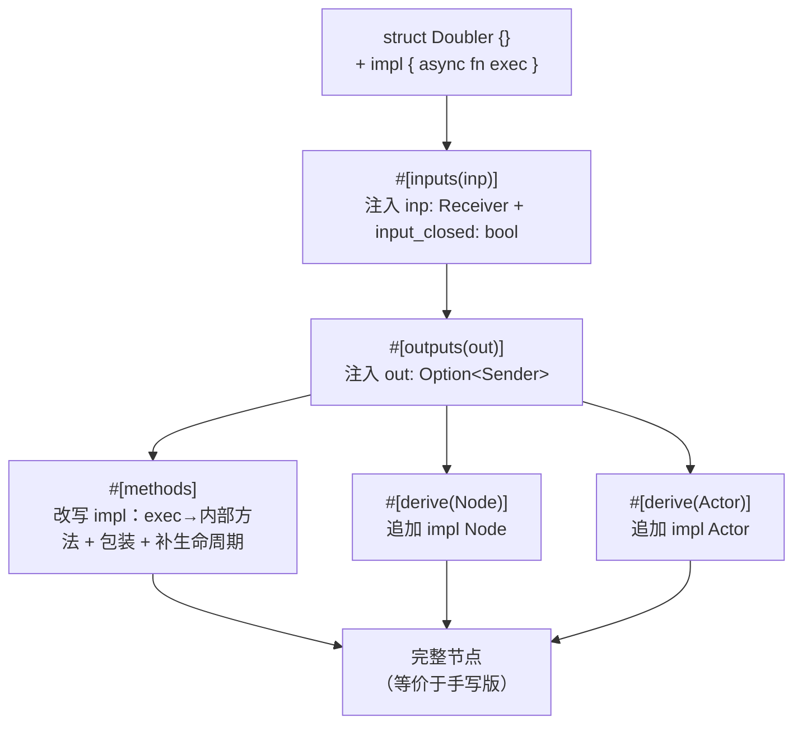

# Ch2.3 实现 inputs / outputs / derive(Node) / methods 宏

Ch2.1 我们手写 `Doubler`、数出满屏样板；Ch2.2 学会了过程宏三件套并写出第一个派生宏。这一章把三件套用到刀刃上——写出 MegFlow 真正的节点宏，把那 ~50 行样板**塌缩成几行声明**。写完这章，Part 2 的核心——节点契约（Ch2.1）与生成节点的宏（Ch2.2/2.3）——就位了；只差 Ch2.4 的编译期注册表来收尾。

<!-- toc -->

## 1. 目标：塌缩前后

先看终点。Ch2.1 手写的 `Doubler`（`flow-rs/src/node.rs`）长这样——业务逻辑只有 `* 2` 一行，其余全是样板：

```rust,ignore
struct Doubler {
    inp: Receiver,
    out: Option<Sender>,
    input_closed: bool,
}
impl Doubler {
    async fn initialize(&mut self) {}
    async fn finalize(&mut self) {}
    async fn exec(&mut self) -> Result<()> {
        match self.inp.recv::<i32>().await {
            Ok(mut e) => {
                let doubled = e.unpack() * 2;
                if let Some(out) = self.out.as_ref() {
                    out.send(Envelope::new(doubled)).await?;
                }
            }
            Err(Error::ChannelClosed) => self.input_closed = true,
            Err(e) => return Err(e),
        }
        Ok(())
    }
}
impl Node for Doubler {
    fn close(&mut self) { self.out = None; }
    fn is_all_input_closed(&self) -> bool { self.input_closed }
}
impl Actor for Doubler {
    fn start(mut self: Box<Self>) -> JoinHandle<Result<()>> {
        tokio::spawn(async move {
            self.initialize().await;
            while !self.is_all_input_closed() { self.exec().await?; }
            self.close();
            self.finalize().await;
            Ok(())
        })
    }
}
```

本章结束时，它塌缩成（真实集成测试见 `flow-rs/tests/derive_node.rs`）：

```rust,ignore
#[inputs(inp)]
#[outputs(out)]
#[derive(Node, Actor)]
struct Doubler {}

#[methods]
impl Doubler {
    async fn exec(&mut self) -> Result<()> {
        let mut e = self.inp.recv::<i32>().await?;   // 直接 ? —— 关闭处理交给宏
        if let Some(out) = self.out.as_ref() {
            out.send(Envelope::new(e.unpack() * 2)).await?;
        }
        Ok(())
    }
}
```

每一行样板由谁消除，一一对应：

| Ch2.1 手写的样板 | 由哪个宏消除 |
|---|---|
| `inp: Receiver` 字段 | `#[inputs(inp)]` |
| `out: Option<Sender>` 字段 | `#[outputs(out)]` |
| `input_closed: bool` 字段 | `#[inputs]`（顺带注入一次） |
| `impl Node`（`close` / `is_all_input_closed`） | `#[derive(Node)]` |
| `impl Actor`（`start` 三段式循环） | `#[derive(Actor)]` |
| `exec` 里的 `match` + `ChannelClosed` 分支 | `#[methods]`（包装 exec） |
| 空的 `initialize` / `finalize` | `#[methods]`（补默认实现） |

五个宏协作，改写管线是这样的（属性宏先跑、派生宏后跑）：



代码分两处：`flow-derive/src/lib.rs` 放**薄入口**（沿用 Ch2.2 的模式），逻辑全在 `flow-derive/src/node.rs`，便于单元测试。解析 `struct`/`impl` 需要 syn 的完整语法，故本章把依赖升到 `syn = { features = ["full"] }`（Ch2.2 预告过的按需生长）。

## 2. `#[inputs]` / `#[outputs]`：属性宏改写结构体

派生宏只能**追加**，属性宏能**改写**被标注的项。端口字段就得靠属性宏注入。属性宏入口收**两个** token 流：

```rust,ignore
#[proc_macro_attribute]
pub fn inputs(args: TokenStream, item: TokenStream) -> TokenStream {
    // args 是括号里的 `inp, foo`；item 是被标注的整个 struct
    let names = parse_macro_input!(args with Punctuated::<Ident, Token![,]>::parse_terminated);
    let item = parse_macro_input!(item as ItemStruct);
    node::expand_inputs(&names.into_iter().collect::<Vec<_>>(), item).into()
}
```

- `args` 是属性括号里的内容 `inp`（或 `inp, foo`）——用 `Punctuated::<Ident, Token![,]>::parse_terminated` 解析成「逗号分隔的标识符列表」。
- `item` 是**整个结构体**（含其下方尚未展开的 `#[outputs]`/`#[derive]` 属性）。

逻辑核心往结构体里塞字段：

```rust,ignore
pub fn expand_inputs(names: &[Ident], mut item: ItemStruct) -> TokenStream2 {
    let ident = item.ident.clone();
    {
        let syn::Fields::Named(named) = &mut item.fields else {
            let msg = "#[inputs] 只能用于具名字段结构体（struct X { .. }）";
            return syn::Error::new_spanned(ident, msg).to_compile_error();
        };
        for n in names {
            named.named.push(named_field(n.clone(), parse_quote!(Receiver)));
        }
        named.named.push(named_field(parse_quote!(input_closed), parse_quote!(bool)));
    }
    quote! { #item }
}
```

三个值得停下的点：

**① `Field` 不实现 `Parse`。** 你可能想 `parse_quote!(inp: Receiver)` 直接造一个字段，但 syn 的 `Field` **没有** `Parse` 实现——因为「一个字段」在语法上有「具名 `a: T`」和「元组 `T`」两种，单看无法区分。所以我们手工构造字段字面量：

```rust,ignore
fn named_field(name: Ident, ty: Type) -> Field {
    Field {
        attrs: vec![],
        vis: Visibility::Inherited,       // 私有：端口是引擎内部状态
        mutability: FieldMutability::None,
        ident: Some(name),
        colon_token: Some(Default::default()),
        ty,                               // 这里的 Type 可以 parse_quote!，因为 Type: Parse
    }
}
```

（`parse_quote!(Receiver)` 能用，是因为 `Type` **实现了** `Parse`；`Field` 不行。这种「整体不可解析、部件可解析」的差异，是 syn 常见的坑。）

**② 关闭标志随输入注入。** `input_closed: bool` 只注入一次，它是 `Node::is_all_input_closed` 的数据来源、由 `#[methods]` 生成的包装 exec 置位——三个宏靠「字段名 `input_closed` 这个约定」协作（都在 flow-derive 里，约定可控）。

**③ 属性宏的展开顺序。** 同一项上的多个属性宏**自上而下**展开：`#[inputs]` 先跑，此刻 `#[outputs]`/`#[derive]` 还挂在结构体上（在 `item.attrs` 里）。我们 `quote! { #item }` 重新输出整个 `ItemStruct` 时，这些属性被**原样保留**，于是轮到 `#[outputs]` 跑、最后派生宏跑。借用检查上有个细节：`named` 是对 `item.fields` 的可变借用，得用一个 `{ }` 块把它限制住，等借用结束后再 `quote! { #item }`（否则可变借用与 quote 里对 `item` 的不可变借用冲突）。

`#[outputs]` 同理，只是注入的是 `out: Option<Sender>`——用 `Option` 是为了让 `close()` 能把它置 `None`、drop 掉 `Sender`、触发下游关闭。

## 3. `#[derive(Node)]`：按字段类型分类端口

派生宏跑时，属性宏已经把字段都注入好了——所以 `#[derive(Node)]` 看到的是**完整字段列表**。它不需要和属性宏共享状态，只要**按字段类型认出端口**：类型 token 里含 `Sender` 的就是输出端口。

```rust,ignore
fn output_field_idents(input: &DeriveInput) -> Vec<Ident> {
    let mut outs = Vec::new();
    if let Data::Struct(data) = &input.data {
        for f in data.fields.iter() {
            if let Some(id) = &f.ident {
                if type_contains(&f.ty, "Sender") { outs.push(id.clone()); }
            }
        }
    }
    outs
}
```

> 这不是我们发明的土办法——**原版 flow-derive 就是这么干的**：它把端口类型名列成常量表（`OUT_T = ["Sender", "SenderT"]`、`IN_T = ["Receiver", "ReceiverT"]`），靠匹配类型名来分类端口。宏在语法层工作，看到的只是 token，「类型名字符串」往往就是最实在的判据。

生成 `impl Node`：

```rust,ignore
pub fn expand_derive_node(input: &DeriveInput) -> TokenStream2 {
    let name = &input.ident;
    let (ig, tg, wc) = input.generics.split_for_impl();     // ← 处理泛型
    let outs = output_field_idents(input);
    quote! {
        impl #ig Node for #name #tg #wc {
            fn close(&mut self) { #( self.#outs = None; )* }   // 撤掉每个输出端口
            fn is_all_input_closed(&self) -> bool { self.input_closed }
        }
    }
}
```

- `close`：`quote` 的重复语法 `#( self.#outs = None; )*` 为每个输出字段生成一行置 `None`。
- `is_all_input_closed`：读 `#[inputs]` 注入的 `self.input_closed` 标志。
- **`split_for_impl()` 处理泛型**——这正是 Ch2.2 里 `TypeName` 刻意后置、承诺本章补上的点。它把泛型拆成三段：`impl_generics`（`<T>`）、`type_generics`（`<T>`）、`where_clause`，拼成正确的 `impl<T> Node for Foo<T> where ..`。我们用一个泛型结构体单元测试证明生成的 `impl<T> Node for G<T>` 良构。

## 4. `#[derive(Actor)]`：近乎常量的模板

`start` 的三段式循环**不依赖任何字段信息**——它只调固有方法 `initialize`/`exec`/`finalize` 和 `Node` 的 `is_all_input_closed`/`close`。所以这个宏几乎是常量模板，只按类型名 + 泛型参数化：

```rust,ignore
pub fn expand_derive_actor(input: &DeriveInput) -> TokenStream2 {
    let name = &input.ident;
    let (ig, tg, wc) = input.generics.split_for_impl();
    quote! {
        impl #ig Actor for #name #tg #wc {
            fn start(mut self: Box<Self>) -> tokio::task::JoinHandle<Result<()>> {
                tokio::spawn(async move {
                    self.initialize().await;
                    while !self.is_all_input_closed() { self.exec().await?; }
                    self.close();
                    self.finalize().await;
                    Ok(())
                })
            }
        }
    }
}
```

与 Ch2.1 手写的 `start` 逐字节一致——只不过现在由宏生成。

## 5. `#[methods]`：改写 impl 块

这是本章最精巧的宏。它要让用户的 `exec` **只写业务逻辑**（`recv().await?` 直接用 `?`），把「收到 `ChannelClosed` 怎么办」的样板藏起来。做三件事：

```rust,ignore
pub fn expand_methods(mut item: ItemImpl) -> TokenStream2 {
    // 先扫一遍：用户是否已定义 initialize / finalize
    let (mut has_init, mut has_final) = (false, false);
    for it in item.items.iter() {
        if let ImplItem::Fn(f) = it {
            match f.sig.ident.to_string().as_str() {
                "initialize" => has_init = true,
                "finalize" => has_final = true,
                _ => {}
            }
        }
    }

    let mut new_items: Vec<ImplItem> = Vec::new();
    for it in item.items.into_iter() {
        match it {
            ImplItem::Fn(f) if f.sig.ident == "exec" => {
                // ① 原 exec 保留签名与函数体，改名为私有内部方法
                let mut inner = f.clone();
                inner.sig.ident = Ident::new("__megflow_exec_inner", f.sig.ident.span());
                // ② 新 exec 包装：调 inner，吞掉 ChannelClosed → 置标志 + 返回 Ok
                let mut wrapper = f;
                wrapper.block = parse_quote!({
                    match self.__megflow_exec_inner().await {
                        Err(Error::ChannelClosed) => { self.input_closed = true; Ok(()) }
                        other => other,
                    }
                });
                new_items.push(ImplItem::Fn(inner));
                new_items.push(ImplItem::Fn(wrapper));
            }
            other => new_items.push(other),
        }
    }
    // ③ 补齐缺失的生命周期默认实现（derive(Actor) 的循环会调它们）
    if !has_init  { new_items.push(parse_quote!( async fn initialize(&mut self) {} )); }
    if !has_final { new_items.push(parse_quote!( async fn finalize(&mut self) {} )); }
    item.items = new_items;
    quote! { #item }
}
```

- **① 重命名**：克隆用户的 `exec`（连同函数体），把 `sig.ident` 改成 `__megflow_exec_inner`。这里靠 syn `full` 才能解析和操作 `ImplItemFn`。
- **② 包装**：新的 `exec` 沿用原签名，函数体换成「调内部方法 + 用 `match` 吞掉 `Err(Error::ChannelClosed)`」。于是关闭发生时，用户 exec 里那个 `?` 抛出的 `ChannelClosed` 被这里接住、转成「置标志 + Ok」，循环下一轮 `is_all_input_closed()` 就会退出——正是 Ch2.1 手写版 `match` 分支干的事，只是移进了宏。
- **③ 补默认**：用户没写 `initialize`/`finalize` 就补上空实现；写了就保留（单元测试专门验证「自定义的 initialize 不被覆盖」）。

这样，`#[methods]` 让用户的 `exec` 干净得只剩业务逻辑，而 `derive(Actor)` 的循环需要的 `initialize`/`exec`/`finalize` 全都齐备。

## 6. 一个巧合：`Node`/`Actor` 既是 trait 又是派生宏

集成测试里同时有：

```rust,ignore
use flow_rs::node::{Actor, Node};        // trait —— 类型命名空间
use flow_derive::{Actor, Node, inputs, outputs, methods};  // 派生宏 —— 宏命名空间
```

两个 `Node` 同名却不冲突，因为 Rust 的 **trait 在类型命名空间、派生宏在宏命名空间**，井水不犯河水。于是 `#[derive(Node)]` 解析到宏、`impl Node for` 解析到 trait。这正是 serde 里 `Serialize` 同时是 trait 和派生宏的套路——现在你知道它为什么能成立了。

## 7. 卫生化（hygiene）与本章边界

宏生成的代码里出现了 `Node`、`Receiver`、`Error::ChannelClosed`、`tokio::task::JoinHandle` 等名字。本章一律用**裸名**，因此**要求使用处 `use` 好这些类型**（集成测试就 `use` 了 `flow_rs::{channel::*, error::*, node::*}`）。

这是一个真实的权衡，得说清楚：

- **裸名 + 要求导入**（本章）：宏代码读起来干净（书里能直接看懂生成了 `impl Node for Doubler`），但依赖使用处的 `use`，不够卫生——用户若没导入、或本地有同名类型，就会出错。
- **绝对路径**（proper fix）：生成 `::flow_rs::node::Node`、`::flow_rs::error::Error` 就与使用处的导入无关了。但难点在于：宏生成的代码既可能被**下游 crate**用（该写 `::flow_rs`），也可能在 **flow-rs 自己**内部用（该写 `crate`）。业界标准解法是 `proc-macro-crate` 这个公共 crate——它在编译期查出「flow-rs 在当前 crate 里叫什么名字」，从而生成正确的路径前缀。

本章的宏使用者全在 `flow-rs/tests/`（下游视角），裸名 + 导入足够跑通，我们就先这样、把 `proc-macro-crate` 卫生化留到真正需要（Part 4 内置节点在 flow-rs 内部用宏时）。**另外两处后置**：

- **`#[derive(Default)]` 与图装配接线**：本章的端口字段在构造时手工填入（集成测试里直接 `Doubler { inp, out: Some(..), input_closed: false }`）。真实场景里端口由 **Graph Builder** 按 TOML 配置自动接线（`set_port`），那需要配置层——留到 **Part 3**。
- **源/汇节点**：本章聚焦 1 输入 1 输出的 worker（与 Ch2.1 一一对应）。没有输入的源节点、没有输出的汇节点，其关闭语义不同，留到 Part 3/4。

## 8. 测试：两层，端到端

延续 Ch2.2 的两层测试法：

- **单元测试**（`node.rs` 内，7 个）：直接调 `expand_*`，把生成的 token 转字符串断言。覆盖每个宏：注入了 `inp: Receiver`/`input_closed: bool`、`out: Option<Sender>`；`derive(Node)` 撤输出且读标志、且**不**误撤输入；`derive(Actor)` 生成三段式循环；泛型走 `split_for_impl`；`methods` 包装 exec、补生命周期、且不覆盖用户自定义的生命周期。
- **集成测试**（`flow-rs/tests/derive_node.rs`，2 个）：用五个宏塌缩出 `Doubler`，真正 spawn、喂 `[1,2,3]`、断言收到 `[2,4,6]`，并验证 `Box<dyn Actor>` 擦除后照样跑（对象安全没丢）。**它逐字节对应 Ch2.1 手写版的两个测试**——证明「宏生成的代码」与「手写的代码」行为完全一致。

## 小结

- **三种宏形态全部到齐**：属性宏 `#[inputs]`/`#[outputs]`/`#[methods]` 改写结构体与 impl，派生宏 `#[derive(Node)]`/`#[derive(Actor)]` 追加 impl。Ch2.1 的 ~50 行样板塌缩成几行声明。
- **宏协作靠约定，不靠共享状态**：属性宏注入字段（含 `input_closed` 标志），派生宏**按字段类型**认端口、按字段名读标志。展开顺序「属性宏自上而下 → 派生宏」是这套协作的前提。
- **syn `full` + `split_for_impl` + `ImplItemFn` 操作**：解析并改写 `struct`/`impl`，正确处理泛型，重命名/包装方法。
- **`Field` 不实现 `Parse`**、**trait 与派生宏同名共存**、**裸名 vs 绝对路径的卫生化权衡**——都是过程宏实战里绕不开的真实细节。

**Part 2 的核心三章至此就位**：我们有了 `Node`/`Actor` 契约（Ch2.1）、过程宏三件套（Ch2.2）、以及一套能把节点样板塌缩掉的宏（Ch2.3）。但还差最后一环——写好的节点怎么被引擎「发现」？下一章 **Ch2.4 `node_register!` 与 inventory 编译期注册表**：用**函数式宏** + `inventory` crate，让节点在编译期自动登记到一张全局表里，Part 3 的 Graph Builder 就能按 TOML 里的类型名把它们造出来。
