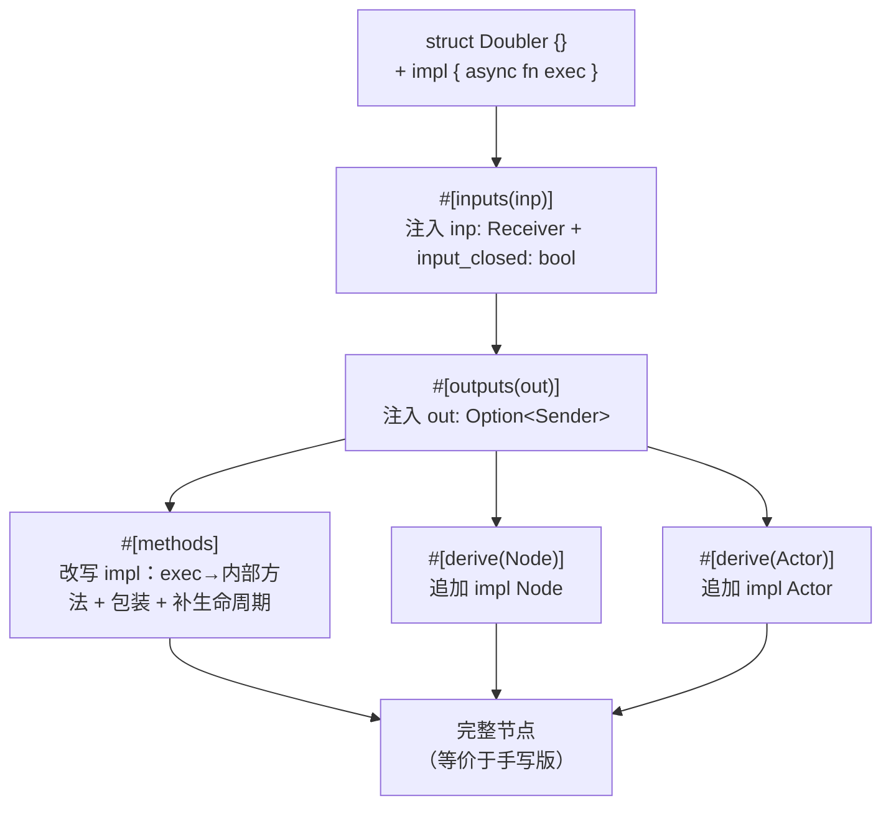

# Ch2.3 实现 inputs / outputs / derive(Node) / methods 宏

Ch2.1 我们手写 `Doubler`、数出满屏样板；Ch2.2 学会了过程宏三件套并写出第一个派生宏。这一章把三件套用到刀刃上——写出 MegFlow 真正的节点宏，把那 ~50 行样板**塌缩成几行声明**。写完这章，Part 2 的核心——节点契约（Ch2.1）与生成节点的宏（Ch2.2/2.3）——就位了；只差 Ch2.4 的编译期注册表来收尾。

本章续着 Ch2.2 的累积工程往下写——起点是第十六步（`derive(Node)` 认死 `output`/`input_closed`
两字段），第十七~二十步一步步把它长成完整的五宏。每步都是一份**可编译、自带测试**的
`derive/src/lib.rs` + `src/node.rs`，抄进工程跑通再走下一步。**教学版全程不带 `Context`**
（`initialize`/`start` 都无 `ctx`）——那是 Ch4.3「资源与上下文」才引入的维度，本章读作
「空上下文占位」即可，不会出现签名混用。想追踪一次真实的宏展开细节，可选读
[从手写实现追踪宏展开](ch03b-expansion-walkthrough.md)。

<!-- toc -->

## 1. 目标：塌缩前后

先看终点。Ch2.1 手写的 `Doubler`（`flow-rs/src/node.rs`）长这样——业务逻辑只有 `* 2` 一行，其余全是样板：

```rust,ignore
struct Doubler {
    inp: Receiver,
    out: Option<Sender>,
    input_closed: bool,
}
impl Doubler {
    async fn initialize(&mut self) {}
    async fn finalize(&mut self) {}
    async fn exec(&mut self) -> Result<()> {
        match self.inp.recv::<i32>().await {
            Ok(mut e) => {
                let doubled = e.unpack() * 2;
                if let Some(out) = self.out.as_ref() {
                    out.send(e.repack(doubled)).await?;
                }
            }
            Err(Error::ChannelClosed) => self.input_closed = true,
            Err(e) => return Err(e),
        }
        Ok(())
    }
}
impl Node for Doubler {
    fn close(&mut self) { self.out = None; }
    fn is_all_input_closed(&self) -> bool { self.input_closed }
}
impl Actor for Doubler {
    fn start(mut self: Box<Self>) -> JoinHandle<Result<()>> {
        tokio::spawn(async move {
            self.initialize().await;
            let result = async {
                while !self.is_all_input_closed() { self.exec().await?; }
                Ok(())
            }.await;
            self.close();
            self.finalize().await;
            result
        })
    }
}
```

本章结束时（第二十步），它塌缩成——业务 `impl` 里只剩 `* 2` 那点纯逻辑，其余全归宏：

```rust
{{#include ../../labs/node-steps/20/node.rs:doubler}}
```

每一行样板由谁消除，一一对应：

| Ch2.1 手写的样板 | 由哪个宏消除 |
|---|---|
| `inp: Receiver` 字段 | `#[inputs(inp)]` |
| `out: Option<Sender>` 字段 | `#[outputs(out)]` |
| `input_closed: bool` 字段 | `#[inputs]`（顺带注入一次） |
| `impl Node`（`close` / `is_all_input_closed`） | `#[derive(Node)]` |
| `impl Actor`（`start` 三段式循环） | `#[derive(Actor)]` |
| `exec` 里的 `match` + `ChannelClosed` 分支 | `#[methods]`（包装 exec） |
| 空的 `initialize` / `finalize` | `#[methods]`（补默认实现） |

五个宏协作，改写管线是这样的（属性宏先跑、派生宏后跑）：



代码都在累积工程的 proc-macro 子 crate `derive/` 里：`derive/src/lib.rs` 上半是**薄入口**（`#[proc_macro_attribute]` / `#[proc_macro_derive]`，沿用 Ch2.2 的模式），下半是可单元测试的 `expand_*` 逻辑。解析 `struct`/`impl` 需要 syn 的完整语法，故 `derive/Cargo.toml` 里 `syn` 早已带 `features = ["full"]`（Ch2.2 建这个子 crate 时就开好了）。（全书终点 `code/flow-derive/` 进一步把逻辑拆到独立的 `src/node.rs` 模块，这里为教学从简，入口与逻辑合在一处。）

## 2. `#[inputs]` / `#[outputs]`：属性宏改写结构体

派生宏只能**追加**，属性宏能**改写**被标注的项。端口字段就得靠属性宏注入。属性宏入口收**两个** token 流：

```rust
{{#include ../../labs/node-steps/17/derive-lib.rs:inputs_entry}}
```

- `args` 是属性括号里的内容 `inp`（或 `inp, foo`）——用 `Punctuated::<Ident, Token![,]>::parse_terminated` 解析成「逗号分隔的标识符列表」。
- `item` 是**整个结构体**（含其下方尚未展开的 `#[outputs]`/`#[derive]` 属性）。

逻辑核心往结构体里塞字段（**单端口教学版**：终点源码里 `PortSpec` 还带数组/字典/类型化维度，见 §9）：

```rust
{{#include ../../labs/node-steps/17/derive-lib.rs:expand_inputs}}
```

三个值得停下的点：

**① `Field` 不实现 `Parse`。** 你可能想 `parse_quote!(inp: Receiver)` 直接造一个字段，但 syn 的 `Field` **没有** `Parse` 实现——因为「一个字段」在语法上有「具名 `a: T`」和「元组 `T`」两种，单看无法区分。所以我们手工构造字段字面量：

```rust
{{#include ../../labs/node-steps/17/derive-lib.rs:named_field}}
```

（`parse_quote!(Receiver)` 能用，是因为 `Type` **实现了** `Parse`；`Field` 不行。这种「整体不可解析、部件可解析」的差异，是 syn 常见的坑。）

**② 关闭标志随输入注入。** `input_closed: bool` 只注入一次，它是 `Node::is_all_input_closed` 的数据来源、由 `#[methods]` 生成的包装 exec 置位——三个宏靠「字段名 `input_closed` 这个约定」协作（都在 flow-derive 里，约定可控）。

**③ 属性宏的展开顺序。** 同一项上的多个属性宏**自上而下**展开：`#[inputs]` 先跑，此刻 `#[outputs]`/`#[derive]` 还挂在结构体上（在 `item.attrs` 里）。我们 `quote! { #item }` 重新输出整个 `ItemStruct` 时，这些属性被**原样保留**，于是轮到 `#[outputs]` 跑、最后派生宏跑。借用检查上有个细节：`named` 是对 `item.fields` 的可变借用，得用一个 `{ }` 块把它限制住，等借用结束后再 `quote! { #item }`（否则可变借用与 quote 里对 `item` 的不可变借用冲突）。

`#[outputs]` 同理，只是注入的是 `out: Option<Sender>`——用 `Option` 是为了让 `close()` 能把它置 `None`、drop 掉 `Sender`、触发下游关闭。

## 3. `#[derive(Node)]`：按字段类型分类端口

派生宏跑时，属性宏已经把字段都注入好了——所以 `#[derive(Node)]` 看到的是**完整字段列表**。它不需要和属性宏共享状态，只要**按字段类型认出端口**。第十七步先用「类型 token 里含 `Sender`」这个粗判据讲清思路（够本步的 Doubler 用），连同生成 `impl Node` 一起：

```rust
{{#include ../../labs/node-steps/17/derive-lib.rs:derive_node_naive}}
```

- `close`：`quote` 的重复语法 `#( self.#outs = None; )*` 为每个输出字段生成一行置 `None`。
- `is_all_input_closed`：读 `#[inputs]` 注入的 `self.input_closed` 标志。
- **`split_for_impl()` 处理泛型**——与 Ch2.2b 的 `TypeName` 同一套路，把泛型拆成 `impl_generics`（`<T>`）/ `type_generics`（`<T>`）/ `where_clause`，拼成正确的 `impl<T> Node for Foo<T> where ..`（Ch2.2 第十六步的单元测试 `preserves_generics_in_generated_impl` 已验证这个机制）。

但这个 `type_contains` 粗判据有个洞：它只看「类型 token 里有没有 `Sender` 这串字符」。业务字段 `Option<HistorySender>`（类型名恰好含 `Sender`）会被误判成输出端口，`close()` 一来就把它撤成 `None`——业务状态凭空丢失。

第十八步把分类从「字符串包含」升级为**按语法树精确匹配**：要求恰好是 `Option<Sender>`（末段是 `Option`、内层恰好是不带泛型实参的 `Sender`），于是 `Option<HistorySender>` 因内层不是 `Sender` 被排除：

```rust
{{#include ../../labs/node-steps/18/derive-lib.rs:classify}}
```

`expand_derive_node` 一字未改（还是上面那个 `#( self.#outs = None; )*`），只是喂给它的 `output_field_idents` 换成了精确版。§8 有一条反面测试钉死这个修复。

## 4. `#[derive(Actor)]`：近乎常量的模板

`start` 的三段式循环**不依赖任何字段信息**——它只调固有方法 `initialize`/`exec`/`finalize` 和 `Node` 的 `is_all_input_closed`/`close`。所以这个宏几乎是常量模板，只按类型名 + 泛型参数化：

```rust
{{#include ../../labs/node-steps/19/derive-lib.rs:expand_derive_actor}}
```

- **循环放在内层 async**：`?` 只提前退出这段内层 future；外层照样往下走 `self.close()` + `self.finalize().await`——即便业务 exec 出错，也保证「撤端口 + 收尾」跑完。这正是不能把 `?` 直接摊在最外层任务体的原因（那样 close/finalize 会被跳过）。
- **教学版不带 `Context`**：`start` 只调固有方法，配套的 `initialize` 也无 `ctx`（与 §5 补的默认一致）。终点在 Ch4.3 才给 `initialize(&ctx)` 加上上下文——那时这个宏也随之穿过 `ctx`，但三段式骨架不变。

第十九步起，Doubler 手写的 `impl Actor` 整块删掉，交给 `#[derive(Actor)]` 生成。

## 5. `#[methods]`：改写 impl 块

这是本章最精巧的宏。它要让用户的 `exec` **只写业务逻辑**（`recv().await?` 直接用 `?`），把「收到 `ChannelClosed` 怎么办」的样板藏起来。先是薄入口——`#[methods]` 括号里没参数，只接被标注的整个 `impl`：

```rust
{{#include ../../labs/node-steps/20/derive-lib.rs:methods_entry}}
```

逻辑做三件事：

```rust
{{#include ../../labs/node-steps/20/derive-lib.rs:expand_methods}}
```

- **① 重命名**：把用户的 `exec`（连同函数体）改名成内部方法 `__megflow_exec_inner`。这里靠 syn `full` 才能解析并操作 `ImplItem::Fn`。
- **② 包装**：新的 `exec` 沿用原签名，函数体换成「调内部方法 + 用 `match` 吞掉 `Err(Error::ChannelClosed)`」。于是关闭发生时，用户 exec 里那个 `?` 抛出的 `ChannelClosed` 被这里接住、转成「置 `input_closed` 标志 + `Ok`」，`derive(Actor)` 的循环下一轮 `is_all_input_closed()` 就退出——正是 Ch2.1 手写版 `match` 分支干的事，只是移进了宏。
- **③ 补默认**：用户没写 `initialize`/`finalize` 就补上空实现；写了就保留（单元测试 `methods_keeps_user_defined_lifecycle` 专门验证「自定义的 initialize 不被覆盖」）。

> **教学版无 `Context`**：这里补的默认 `initialize`/`finalize` 签名是 `async fn initialize(&mut self)`——不带 `ctx`，与 §4 生成的 `start` 一致。全书终点 `code/flow-derive/` 里这个默认签名是 `initialize(&mut self, _ctx: &flow_rs::context::Context)`，那个 `Context` 参数是 Ch4.3「资源与上下文」才引入的；来龙去脉在 Ch4.3 讲透，本章不需要它。

这样，`#[methods]` 让用户的 `exec` 干净得只剩业务逻辑，而 `derive(Actor)` 的循环需要的 `initialize`/`exec`/`finalize` 全都齐备。

## 6. 一个巧合：`Node`/`Actor` 既是 trait 又是派生宏

节点定义处（labs 的 `src/node.rs`）里，`Node` 这个名字出现了两次——一次是本地 trait，一次是派生宏：

```rust,ignore
pub trait Node { .. }                              // trait —— 类型命名空间
pub trait Actor: Node + Send + 'static { .. }      // trait —— 类型命名空间

#[derive(flow_derive::Node, flow_derive::Actor)]   // 派生宏 —— 宏命名空间
pub struct Doubler {}
```

两个 `Node` 同名却不冲突，因为 Rust 的 **trait 在类型命名空间、派生宏在宏命名空间**，井水不犯河水。于是 `#[derive(flow_derive::Node)]` 里的 `Node` 走宏命名空间解析到派生宏，而它生成的 `impl Node for Doubler` 里的 `Node` 走类型命名空间解析到本地 trait。labs 把派生宏写成路径限定的 `flow_derive::Node`，正是想让你一眼看清「这个 `Node` 是宏」；即便改成 `use flow_derive::Node;` 的裸写法也照样成立，靠的就是这条双命名空间规则。这正是 serde 里 `Serialize` 同时是 trait 和派生宏的套路——现在你知道它为什么能成立了。

## 7. 卫生化（hygiene）与本章边界

宏生成的代码里出现了 `Node`、`Actor`、`Result`、`Error::ChannelClosed`、`tokio::task::JoinHandle` 等名字。本章一律用**裸名**，因此**要求使用处 `use` 好这些类型**（labs 的 `src/node.rs` 顶部 `use crate::channel::{Receiver, Sender};`、`use crate::error::{Error, Result};`，并就地定义了 `Node`/`Actor` 两个 trait——宏展开出的裸名才能在这个模块里解析到）。

这是一个真实的权衡，得说清楚：

- **裸名 + 要求导入**（本章）：宏代码读起来干净（书里能直接看懂生成了 `impl Node for Doubler`），但依赖使用处的 `use`，不够卫生——用户若没导入、或本地有同名类型，就会出错。
- **绝对路径**（proper fix）：生成 `::flow_rs::node::Node`、`::flow_rs::error::Error` 就与使用处的导入无关了。但难点在于：宏生成的代码既可能被**下游 crate**用（该写 `::flow_rs`），也可能在 **flow-rs 自己**内部用（该写 `crate`）。业界标准解法是 `proc-macro-crate` 这个公共 crate——它在编译期查出「flow-rs 在当前 crate 里叫什么名字」，从而生成正确的路径前缀。

本章的宏使用者就在累积工程自己的 `src/node.rs` 里（那几个名字都已 `use` 齐或就地定义），裸名 + 导入足够跑通，我们就先这样、把 `proc-macro-crate` 卫生化留到真正需要（Part 4 内置节点在 flow-rs 内部用宏时）。**另外两处后置**：

- **`#[derive(Default)]` 与图装配接线**：本章的端口字段在构造时手工填入（集成测试里直接 `Doubler { inp, out: Some(..), input_closed: false }`）。真实场景里端口由 **Graph Builder** 按 TOML 配置自动接线（`set_port`），那需要配置层——留到 **Part 3**。
- **源/汇节点**：本章聚焦 1 输入 1 输出的 worker（与 Ch2.1 一一对应）。没有输入的源节点、没有输出的汇节点，其关闭语义不同，留到 Part 3/4。

## 8. 测试：两层，端到端

延续 Ch2.2 的两层测试法：

- **单元测试**（labs `derive/src/lib.rs` 的 `mod tests` 内）：直接调 `expand_*`，把生成的 token 转字符串断言。五个宏各有一条：`inputs_injects_receiver_and_flag`（注入了 `inp: Receiver`/`input_closed: bool`）、`classification_uses_structure_not_substrings`（`derive(Node)` 撤输出且**不**误撤内层非 `Sender` 的字段）、`derive_actor_emits_three_phase_loop`（三段式循环）、`methods_wraps_exec_and_fills_lifecycle`（包装 exec + 补生命周期）、`methods_keeps_user_defined_lifecycle`（不覆盖用户自定义的生命周期）。泛型走 `split_for_impl` 的机制由 Ch2.2 第十六步的 `preserves_generics_in_generated_impl` 守着。（全书终点 `code/flow-derive/` 还有数组/字典/模板/`#[state]` 端口的分类测试，Ch2.4/4.2/4.3 陆续补齐。）
- **集成测试**（本章 `src/node.rs` 的 `mod tests` 内）：用五个宏塌缩出 `Doubler`，真正 spawn、喂 `[1,2,3]`、断言收到 `[2,4,6]`，并验证 `Box<dyn Actor>` 擦除后照样跑（对象安全没丢）——与 Ch2.1 手写版的端到端行为一致，证明「宏生成的代码」与「手写的代码」等价：

```rust
{{#include ../../labs/node-steps/20/node.rs:doubler_test}}
```

还有一条**反面**证据 `node_close_does_not_erase_business_type_containing_sender`：`§3` 说过端口识别不能靠「类型名里含 `Sender`」的字符串包含，否则一个业务类型 `Option<HistorySender>` 会被 `close()` 误当输出端口撤掉。这条测试就钉死它——`close()` 后业务字段 `history` 必须还在：

```rust
{{#include ../../labs/node-steps/20/node.rs:keeps_state}}
```

## 9. 本章终点与复现

**起点**：Ch2.2 结束时的累积工程（第十六步——会写第一个派生宏，`derive/Cargo.toml` 里 `syn` 已带 `features = ["full"]`）。

**四步长出五宏**（每步都是一份完整的 `derive/src/lib.rs` + `src/node.rs`，抄进累积工程跑通再走下一步）：

- **第十七步**：加 `#[inputs]`/`#[outputs]` 属性宏注入端口字段；`derive(Node)` 先用「类型 token 含 `Sender`」的粗判据认输出端口。
- **第十八步**：`derive(Node)` 的端口分类升级为按语法树精确匹配（恰好 `Option<Sender>`），反面测试守住业务字段 `Option<HistorySender>` 不被误撤。
- **第十九步**：加 `#[derive(Actor)]`（教学版三段式 `start`，不带 `Context`），手写的 `impl Actor` 整块删掉。
- **第二十步**：加 `#[methods]`（重命名 exec→内部方法 + 包装吞 `ChannelClosed` + 补默认生命周期），exec 只剩业务逻辑，五宏塌缩完成。

**验收命令**（照抄可跑）：

```bash
python3 scripts/check_basic_channel_course.py   # 从空目录累积构建二十步，每步 cargo test
```

**对照成品**（可选）——全书终点的 `flow-derive` 单元测试：

```bash
cargo test -p flow-derive --manifest-path code/Cargo.toml --locked
```

正文 §1~§8 的每个代码块都由 `{{#include}}` 取自 labs 第十七~二十步的可编译文件，抄进去就能跑。教学版是**单端口版**——全书终点 `code/flow-derive/`（1290 行）把端口分类升级成 `port_kind`，长出数组/字典/类型化/模板/`#[state]` 端口（Ch2.4、Ch4.2、Ch4.3 陆续补齐），并给生命周期加上 `Context` 参数（Ch4.3）。想追踪一次真实的宏展开细节，见 [Ch2.3a 从手写实现追踪宏展开](ch03b-expansion-walkthrough.md)。

## 小结

- **三种宏形态全部到齐**：属性宏 `#[inputs]`/`#[outputs]`/`#[methods]` 改写结构体与 impl，派生宏 `#[derive(Node)]`/`#[derive(Actor)]` 追加 impl。Ch2.1 的 ~50 行样板塌缩成几行声明。
- **宏协作靠约定，不靠共享状态**：属性宏注入字段（含 `input_closed` 标志），派生宏**按字段类型**认端口、按字段名读标志。展开顺序「属性宏自上而下 → 派生宏」是这套协作的前提。
- **syn `full` + `split_for_impl` + `ImplItemFn` 操作**：解析并改写 `struct`/`impl`，正确处理泛型，重命名/包装方法。
- **`Field` 不实现 `Parse`**、**trait 与派生宏同名共存**、**裸名 vs 绝对路径的卫生化权衡**——都是过程宏实战里绕不开的真实细节。

**Part 2 的核心三章至此就位**：我们有了 `Node`/`Actor` 契约（Ch2.1）、过程宏三件套（Ch2.2）、以及一套能把节点样板塌缩掉的宏（Ch2.3）。但还差最后一环——写好的节点怎么被引擎「发现」？下一章 **Ch2.4 `node_register!` 与 inventory 编译期注册表**：用**函数式宏** + `inventory` crate，让节点在编译期自动登记到一张全局表里，Part 3 的 Graph Builder 就能按 TOML 里的类型名把它们造出来。
