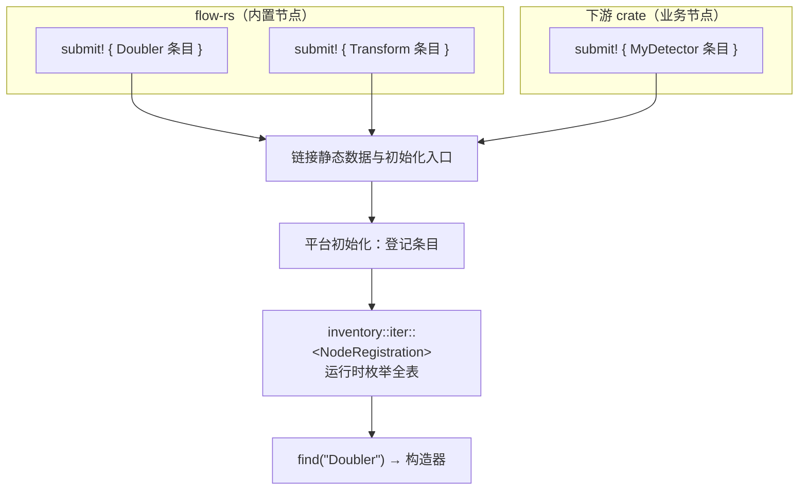

# Ch2.4 node_register! 与 inventory 编译期注册表

Ch2.3 我们把节点样板集中为几行声明。但还差最后一环：写好的节点，引擎怎么**发现**它？图配置里只写类型名字符串 `"Doubler"`，引擎得据此把节点**造出来**。本章用函数式过程宏生成注册条目，再由 inventory 的平台初始化机制登记，运行时按名字查构造器。宏展开、登记和创建业务对象发生在不同阶段。

先完成 [注册表实作](ch04b-registry-workshop.md)，手写名字到构造器的表，再理解 inventory 的分散登记。

<!-- toc -->

## 1. 问题：一张分布式的、编译期就位的表

引擎装配图时，手上只有 TOML 里的一个字符串：

```toml,ignore
[[nodes]]
name = "d"
ty = "Doubler"     # ← 只有这个类型名
```

它要凭 `"Doubler"` 这个名字，造出一个 `Box<dyn Actor>`。所以引擎需要一张表：**类型名 → 构造器**。

难点不在「表」本身，在于表的**来源是分散的**：

- 内置节点（transform/bcast/… Part 4）定义在 **flow-rs** 里；
- 业务节点（真实算法仓里的检测/跟踪/告警节点）定义在**下游 crate** 里。

它们分布在互不相识的 crate 中，却要在**程序跑起来之前**汇成同一张全局表。这就是「**编译期分布式注册**」——每个节点在自己的定义处「报个到」，链接时自动汇总。

原版的 `node_register!` 经 `submit!` 生成 `#[flow_rs::ctor]` 初始化函数，调用运行时注册接口写入 lazy_static 管理的表。原版没有 `#[flow_rs::ln]` 这个入口；源码路径是 `flow-derive/src/node.rs`、`internal.rs` 与 `flow-rs/src/registry.rs`。

我们使用公共 crate `inventory` 管理类型化的分散条目。它生成静态数据和初始化入口，链接进应用后由平台初始化机制登记，运行时枚举。它也有初始化成本，不能未经测量就宣称比原版快；Ch2.4a 用完整实验解释这条路径。

## 2. inventory：三个动作

`inventory` 的心智模型只有三个动作：

- **`inventory::collect!(T)`**：在**定义 `T` 的 crate**里声明「要收集的条目类型是 `T`」。必须与 `T` 同 crate、写在 item 位置（模块级，不在函数体内）。
- **`inventory::submit! { EXPR }`**：在**任意 crate**提交一条 `T` 类型的条目。`EXPR` 必须能在 `static` 上下文里 const 构造。可以有任意多处 `submit!`，分散在任意多个 crate。
- **`inventory::iter::<T>`**：一个实现了 `IntoIterator<Item = &'static T>` 的值，枚举**所有** `submit!` 进来的条目。

关键是分开宏展开、链接和初始化三个阶段。`submit!` 生成静态数据与初始化入口；链接器保留对应项；平台初始化时完成登记；`iter` 在运行时遍历已登记的条目。枚举顺序没有保证：



两者都涉及初始化；本章的直接收益是用公共库承载注册基础设施。节点类型必须进入最终应用的链接结果，登记顺序不能作为业务约定。

## 3. 注册表模块：`registry.rs`

先隔离验证 inventory 本身。创建独立 `inventory-study/` 目录，完整 `Cargo.toml` 如下：

```toml
[package]
name = "inventory-study"
version = "0.1.0"
edition = "2021"

[workspace]

[dependencies]
inventory = "0.3"
```

本实验只需 inventory，无需 feature 开关，不依赖 MegFlow 或 Tokio。下面是完整 `src/main.rs`：

```rust
{{#include ../../../code/flow-rs/examples/registry_basics.rs}}
```

两个模块各提交一条记录，main 枚举后先按名字排序再验证结果，避免把不保证的登记顺序写进业务。这里的 run 是运行函数指针，不是后面 NodeCtor 的构造函数指针；它们共用“静态记录保存函数地址”的原理。

从实验目录运行 `cargo run`，预期输出：

```text
注册与调用通过：[("double", 6), ("increment", 4)]
```

故意删除 increment 的 submit，条目数量断言应失败；恢复后重新通过。独立练习：增加 square 模块，输入 3 应得到 9，同时更新排序后的预期结果。collect 和迭代逻辑不应修改。

教材仓库根目录的 `python3 scripts/check_registry_course.py` 会在新临时目录编译这个独立工程及上一节的标准库实验，验证精确输出；不构建 flow-rs 运行时。

### 从独立登记转到节点构造

先定义「一条注册条目」和这张表。全在新模块 `flow-rs/src/registry.rs`（**本章阶段示意**：终点源码的 `NodeRegistration`/`NodeCtor` 会长出更多字段，见下方落差说明）：

```rust,ignore
use crate::channel::{Receiver, Sender};
use crate::node::Actor;

/// 节点构造器：吃一串输入端口 + 一串输出端口，产出类型擦除的 Box<dyn Actor>。
pub type NodeCtor = fn(Vec<Receiver>, Vec<Sender>) -> Box<dyn Actor>;

/// 注册表里的一条条目：类型名 + 构造器。
pub struct NodeRegistration {
    pub name: &'static str,
    pub ctor: NodeCtor,
}

// 声明「本 crate 收集 NodeRegistration 条目」。必须与被收集类型同 crate、在 item 位置。
inventory::collect!(NodeRegistration);

/// 枚举所有已注册节点。
pub fn registrations() -> impl Iterator<Item = &'static NodeRegistration> {
    inventory::iter::<NodeRegistration>.into_iter()
}

/// 按类型名查一条注册。Part 3 的 Graph Builder 会用它把 TOML 类型名解析成构造器。
pub fn find(name: &str) -> Option<&'static NodeRegistration> {
    registrations().find(|r| r.name == name)
}
```

> **与终点源码的落差**：`inventory::collect!` / `registrations` / `find` 三者到终点**一字未改**，可放心照抄。但 `NodeRegistration` 与 `NodeCtor` 会随后续章节**长出更多字段**——Ch3.2 给 `NodeCtor` 加了 `&Args` 入参并把返回改成 `Result`（配置驱动 + 建图期报错）、给条目加了 `inputs`/`outputs` 端口名表；Ch4.2 又把端口从一维 `Vec` 升成分组 `Vec<Vec<_>>`（数组端口）、加了 `input_array`/`output_array` 标记表；Ch4.3 还并列加了一张**资源**注册表 `ResourceRegistration`。完整终点见 `code/flow-rs/src/registry.rs`。本章先把「名字 → 构造器」这条主干立住，字段的生长留给后面各章按需引入。

两个值得停下的点：

**① `NodeCtor` 为什么是裸函数指针 `fn(..)`，而不是 `Box<dyn Fn(..)>`？** 因为 `NodeRegistration` 要能在 `submit!` 的 **`static` 上下文里 const 构造**。函数指针（指向一个具体的 `build` 函数）是 const 值；`Box<dyn Fn>` 需要堆分配，不是 const。用 `fn` 指针，条目可以静态保存。

**② `collect!` 的位置约束。** 它必须写在**定义 `NodeRegistration` 的 crate**（flow-rs）里、模块级。这是 inventory 的硬性要求——收集点与类型定义绑定。下游 crate 只 `submit!`，不 `collect!`。

## 4. `BuildFromPorts`：位置接线的构造器

`NodeCtor` 的签名是 `fn(Vec<Receiver>, Vec<Sender>) -> Box<dyn Actor>`——给一串端口，造一个节点。但每个节点的字段不同（`Doubler` 是 `inp`/`out`/`input_closed`），谁来把端口**填进**对应字段？这又是一件该由宏生成的样板。我们定义一个 trait，再用派生宏生成它（**本章阶段示意**：终点 `build` 会带 `&Args` 入参、返回 `Result`、端口分组成 `Vec<Vec<_>>`，见 §5 末落差说明与 `code/flow-rs/src/registry.rs`）：

```rust,ignore
pub trait BuildFromPorts {
    fn build(ins: Vec<Receiver>, outs: Vec<Sender>) -> Box<dyn Actor>;
}
```

> **为什么不加 `where Self: Sized`？** 一个没有 `self` 接收者的关联函数，会让 trait 不对象安全（除非加 `Self: Sized`）。但我们从不需要 `dyn BuildFromPorts`——只以 `<Doubler as BuildFromPorts>::build` 对**具体类型**取函数指针。既然不 dyn，就不必加那句仪式。

`#[derive(BuildFromPorts)]` 生成 `build` 的逻辑，和 Ch2.3 的 `#[derive(Node)]` 一样**按字段类型/名字分类**——只是这次是往字段里**填**端口，而非撤（**本章阶段示意**：终点用 `port_kind` 精确分类、并处理数组/字典/类型化/参数字段，见 §5 末落差说明）：

```rust,ignore
pub fn expand_build_from_ports(input: &DeriveInput) -> TokenStream2 {
    let name = &input.ident;
    let (ig, tg, wc) = input.generics.split_for_impl();

    let mut inits = Vec::new();
    if let Data::Struct(data) = &input.data {
        for f in data.fields.iter() {
            let Some(id) = &f.ident else { continue };
            let init = if type_contains(&f.ty, "Sender") {
                quote! { Some(outs.remove(0)) }      // 输出端口：取一个 Sender，包 Some
            } else if type_contains(&f.ty, "Receiver") {
                quote! { ins.remove(0) }             // 输入端口：取一个 Receiver
            } else if *id == "input_closed" {
                quote! { false }                     // 关闭标志：初值 false
            } else {
                quote! { Default::default() }        // 其余字段：默认值
            };
            inits.push(quote! { #id: #init });
        }
    }

    quote! {
        impl #ig BuildFromPorts for #name #tg #wc {
            fn build(mut ins: Vec<Receiver>, mut outs: Vec<Sender>) -> Box<dyn Actor> {
                Box::new(#name { #( #inits ),* })
            }
        }
    }
}
```

对 `Doubler` 它生成：

```rust,ignore
impl BuildFromPorts for Doubler {
    fn build(mut ins: Vec<Receiver>, mut outs: Vec<Sender>) -> Box<dyn Actor> {
        Box::new(Doubler {
            inp: ins.remove(0),
            out: Some(outs.remove(0)),
            input_closed: false,
        })
    }
}
```

两个约定要讲清：

**① 端口按位置对应。** `ins.remove(0)`/`outs.remove(0)` 按**字段声明顺序**依次取——第一个声明的输入端口拿 `ins[0]`，第二个拿（remove 后的）新 `ins[0]`，以此类推。所以「声明顺序 = 传入端口顺序」是本章的约定，够用。真实场景里，端口该按 TOML 里的**名字**（`PortInfo`）接线，而非位置——那需要配置层，留到 **Part 3** 的 Graph Builder。

**② `Box<Doubler>` → `Box<dyn Actor>` 的自动 unsize。** `Box::new(Doubler{..})` 是 `Box<Doubler>`，而 `build` 返回 `Box<dyn Actor>`。在 return 位置 Rust 自动做 unsize coercion——前提是 `Doubler: Actor`，这由同时挂的 `#[derive(Actor)]` 保证。

## 5. `node_register!`：第三种宏形态

Ch2.2/2.3 我们写了派生宏和属性宏。过程宏还有第三种形态——**函数式宏**（function-like macro，形如 `foo!(...)`）。`node_register!("Doubler", Doubler)` 就是它：把一条注册**提交**进表。

函数式宏的入口用 `#[proc_macro]`（不是 `#[proc_macro_derive]`/`#[proc_macro_attribute]`），且它的输入是**任意 token 流**——没有现成的 `DeriveInput`/`ItemStruct` 可解析，得**自己定义语法**。我们要解析的是 `"名字", 类型路径`，于是自定义一个 `Parse`（真实源码取自 `code/flow-derive/src/node.rs`，这一段到终点未改）：

```rust
{{#include ../../../code/flow-derive/src/node.rs:node_register_args}}
```

> 这正是 Ch2.3 里「`Field` 不实现 `Parse`」那条经验的另一面：syn 里 `LitStr`、`Path`、`Token![,]` **都实现了 `Parse`**，可以直接 `input.parse()`。自定义 `Parse` 就是把这些基础件按你的语法拼起来。入口处用 `parse_macro_input!(input as node::NodeRegisterArgs)` 驱动它。

拿到 `name`/`ty` 后，生成一个 `submit!`（**本章阶段示意**：终点的条目还带端口名表 `INPUTS`/`OUTPUTS`、数组标记 `INPUT_ARRAY`/`OUTPUT_ARRAY`、类型表等字段，见下方落差说明）：

```rust,ignore
pub fn expand_node_register(args: &NodeRegisterArgs) -> TokenStream2 {
    let name = &args.name;
    let ty = &args.ty;
    quote! {
        flow_rs::inventory::submit! {
            flow_rs::registry::NodeRegistration {
                name: #name,
                ctor: <#ty as flow_rs::registry::BuildFromPorts>::build,
            }
        }
    }
}
```

`ctor` 那行是点睛：`<Doubler as BuildFromPorts>::build` 是个**函数项**，在 `ctor: NodeCtor`（fn 指针）的位置会自动强制成 fn 指针——于是条目 const 可构造、可作为静态条目。

> **§3~§5 与终点源码的落差小结**：本章为把「编译期分布式注册」这条主干讲清，`NodeCtor` / `NodeRegistration` / `BuildFromPorts::build` / `expand_build_from_ports` / `expand_node_register` 五处都用了**Ch2.4 阶段的单端口简化形态**（端口是一维位置 `Vec`、无参数、`build` 不返回 `Result`）。终点 `code/flow-rs/src/registry.rs` 与 `code/flow-derive/src/node.rs` 里它们已升级为：`build(&Args, Vec<Vec<Receiver>>, Vec<Vec<Sender>>) -> Result<..>`（Ch3.2 配置驱动 + Ch4.2 分组数组端口），条目并列 `INPUTS`/`OUTPUTS`/`INPUT_ARRAY`/`OUTPUT_ARRAY`/类型表，`node_register!` 一并提交这些字段，另有对偶的资源注册表（Ch4.3）。差异按章逐步引入，此处只需理解 inventory 主干；`NodeRegisterArgs` 解析器（上方 include）则到终点未变。

**卫生化：这里用绝对路径 `flow_rs::`，而 Ch2.3 派生宏用裸名。** 为什么不一致？

- Ch2.3 的派生宏生成 `impl Node for Doubler`，`Node` 用**裸名**——因为它出现在能被使用处 `use` 覆盖的位置。
- `node_register!` 生成的是 **item 级的 `static`**（`submit!` 展开成静态变量），不方便要求使用处 `use` 好 `NodeRegistration`/`inventory`。所以这里硬编码**绝对路径** `flow_rs::`（下游视角）。

当前框架在 lib.rs 中写 `extern crate self as flow_rs;`，使内部调用也能解析 `flow_rs::`。这解决了 crate 内自引用，不解决下游在 Cargo.toml 中给依赖改名的情况。后者才需要考虑 `proc-macro-crate` 或显式传入路径；具体方案见宏专题第 7 课。item 位置本身并不禁止 use；选择明确路径是为了减少生成代码对调用处导入的依赖。

为了让 `flow_rs::inventory::submit!` 能被下游定位到，flow-rs 还 `pub use inventory;` 重导出了这个 crate（`lib.rs` 里一行）——这样下游无需自己再依赖 inventory。

## 6. 端到端：注册 → 查找 → 构造 → 运行

集成测试 `flow-rs/tests/register.rs` 把整条链走通。节点定义和 Ch2.3 一模一样，只多挂一个 `#[derive(BuildFromPorts)]` 和一行 `node_register!`（真实源码取自 `code/flow-rs/tests/register.rs`）：

```rust
{{#include ../../../code/flow-rs/tests/register.rs:node_def}}
```

然后**只凭字符串**把它造出来跑（真实源码同上）：

```rust
{{#include ../../../code/flow-rs/tests/register.rs:lookup}}
```

`find("Doubler")` 命中的，正是 `node_register!` 生成并随应用链接、初始化登记的那条。这就是 Part 3 Graph Builder 的底座：**它拿到 TOML 里的类型名，`find` 出构造器，把节点造出来接进图**。

> **一处落差**：include 的真实测试里 `(reg.ctor)(&flow_rs::config::Args::new(), vec![vec![in_rx]], vec![vec![out_tx]])`——构造器多了 `&Args` 入参（Ch3.2）、端口按分组 `vec![vec![..]]` 传（Ch4.2 数组端口），`start(Context::anonymous())` 带了空上下文（Ch4.3）。本章的心智模型里 `ctor` 还是 `(vec![in_rx], vec![out_tx])`、`start()` 无参；这些多出来的参数读作「后续章节引入的占位」即可，主干「名字 → 构造器 → 跑出 `[2,4,6]`」完全一致。

顺带，**同名巧合第三次出现**：`BuildFromPorts` 既是 trait（`flow_rs::registry`，类型命名空间）又是派生宏（`flow_derive`，宏命名空间），和 `Node`/`Actor` 一样共存——测试里两个都 `use` 了，各归其位。

## 7. 测试：两层

- **单元测试**（`flow-derive/src/node.rs` 内）：`build_from_ports_wires_ports` 断言生成的 `build` 里标量端口按位置填、`input_closed: false`、端口名表按序；`node_register_emits_submit` 断言 `node_register!` 生成 `flow_rs::inventory::submit!` + `NodeRegistration` + `<D as ..BuildFromPorts>::build`。（这些断言在终点已随字段生长扩充——如今还核对 `INPUTS`/`OUTPUTS`/`INPUT_ARRAY` 等，跑 `cargo test -p flow-derive` 可见。）
- **集成测试**（`register.rs`，2 个）：`doubler_is_registered` 验证 `find`/`registrations` 能按名字查到、查不到不存在的名字；`build_via_registry_and_run` 走完「名字 → 构造 → 跑出 `[2,4,6]`」。**注册是真的经过了 linker section**——集成测试是独立 crate，它的 `submit!` 与 flow-rs 里的 `collect!` 在链接时汇合，证明跨 crate 收集成立。

## 8. 本章终点与复现

**起点**：Ch2.3 结束时的工程（五个节点宏，能塌缩出 `Doubler`）。

**本章新增/改动的文件**：

- `code/flow-rs/src/registry.rs`——新模块：`NodeRegistration`、`inventory::collect!`、`BuildFromPorts` trait、`registrations`/`find`。
- `code/flow-rs/src/lib.rs`——`pub mod registry;` + `pub use inventory;`（重导出让下游能用 `flow_rs::inventory::submit!`）+ `extern crate self as flow_rs;`（让绝对路径在本 crate 内也解析得通）。
- `code/flow-derive/src/node.rs`——`#[derive(BuildFromPorts)]` 的 `expand_build_from_ports`、函数式宏 `node_register!` 的 `NodeRegisterArgs` + `expand_node_register`。
- `code/flow-derive/src/lib.rs`——`#[proc_macro_derive(BuildFromPorts)]` 与 `#[proc_macro] node_register` 两个入口。
- `code/flow-rs/tests/register.rs`——集成测试：注册 → 查找 → 构造 → 跑出 `[2,4,6]`。

**验收命令**（照抄可跑）：

```bash
cargo test -p flow-derive --manifest-path code/Cargo.toml --locked                     # BuildFromPorts / node_register! 展开单测
cargo test --manifest-path code/Cargo.toml -p flow-rs --test register --locked         # 跨 crate 注册端到端
```

正文里节点定义 + 注册 + 查找运行的集成测试、以及 `NodeRegisterArgs` 解析器均由 `{{#include}}` 直接取自真实文件。§3~§5 的 `NodeCtor`/`NodeRegistration`/`BuildFromPorts`/`expand_*` 代码块仍标注为**示意**——展示 Ch2.4 阶段的单端口简化形态，终点已按 Ch3.2/4.2/4.3 长出参数、`Result`、分组数组端口与资源注册表，差异见各处落差说明与 [注册表实作](ch04b-registry-workshop.md)。

## 小结

- **编译期分布式注册**：节点分散在各 crate，却要在运行前汇成一张全局表。用 inventory 的静态条目与初始化机制承载注册，替换原版自建的 ctor + lazy_static 路径；仍需验证业务语义与成本。
- **三个动作**：`collect!`（定义 crate 声明收集）、`submit!`（任意 crate 提交、须 const 构造）、`iter`（枚举）。`NodeCtor` 用**裸函数指针**正是为了让条目能进 `static` 上下文。
- **`BuildFromPorts` 派生宏**：按字段类型/名字**位置接线**（`ins`/`outs` 按声明顺序 `remove`）。命名接线（TOML `PortInfo`）留到 Part 3。
- **函数式宏 `node_register!`**：过程宏的第三种形态。自定义 Parse 解析 `"名字", 类型`，生成 submit。明确路径减少对调用处 use 的依赖；内部自别名与下游依赖改名是两个不同问题。

**Part 2 至此收官。** 我们有了：`Node`/`Actor` 节点契约（Ch2.1）、过程宏三件套与三种宏形态（Ch2.2/2.3/2.4）、一套把节点样板塌缩掉的宏（Ch2.3）、以及一张编译期就位的节点注册表（Ch2.4）。节点能定义、能塌缩、能被发现——**万事俱备，只差把它们按图接起来跑**。

下一部分 **Part 3 · 图与运行时**才是引擎真正成形的地方：**Ch3.1** 用 serde/toml 定义图的 TOML schema 与配置解析层；**Ch3.2** 写 Graph Builder，按配置从注册表（就是本章这张表！）造出节点、用 channel 接线；**Ch3.3** 用 tokio 调度这些 actor、实现优雅停机；最终 **Ch3.4** 端到端跑通一个 `BinaryOp` 计算图——那是整本书的**大里程碑**：第一个真正能跑的引擎。

[`inventory`]: https://docs.rs/inventory
