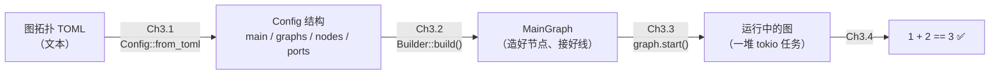

# Ch3.1 serde / toml 与图 TOML schema → 配置解析层

**Part 3 开始了。** 前两部分我们造齐了零件：消息信封（Part 1）、节点与注册表（Part 2）。但它们还是一堆散件——节点能定义、能塌缩、能被名字查到，却还没有人**按一张图纸**把它们接起来跑。Part 3 就是装配线：Ch3.1 读图纸（本章）、Ch3.2 照图纸造节点接线（Builder）、Ch3.3 把节点交给 tokio 跑起来（调度）、Ch3.4 让 `1 + 2 == 3` 端到端穿过整张图——**整本书的大里程碑**。

这一章补上第一步：把 Ch0.3 钉死的那段**图拓扑 TOML**，变成引擎能操作的**类型化结构**。

先完成本章的结构定义，再做 [Ch3.1a 配置分层实验](ch01a-config-workshop.md)：在独立工程中亲自区分解析错误、引用错误与节点参数错误。

<!-- toc -->

## 1. 从一段 TOML 到一组结构

Ch0.3 的契约表里，图是这样写出来的（一字不差）：

```toml
main = "example"
[[graphs]]
name = "example"
nodes = [
    {name="add", ty="BinaryOp", op="+"},
]
inputs = [
    {name="a", cap=16, ports=["add:a"]},
    {name="b", cap=16, ports=["add:b"]}
]
outputs = [{name="c", cap=16, ports=["add:c"]}]
```

引擎不能直接对着一坨文本干活。它需要把这段文本变成**结构**——`main` 是个字符串、`graphs` 是个数组、每个节点有 `name`/`ty` 和一包参数……本章的产物就是这组结构，以及「文本 → 结构」这一步。

这组结构在整条建图链里的位置：



本章只负责最左边那一跳：**文本 → `Config`**。它是纯粹的**解析层**（原版把这一层叫「presentation」）——只管把字段读进结构，**不判断**「`add:a` 里的 `add` 到底存不存在」这类跨引用问题。那类校验集中在 Ch3.2 的 `build()`。原版也有配置翻译、连接检查和类型推断，不能把此处的教学分层说成原版缺少建图校验。

## 2. serde + toml：不自己写 parser

要不要手写一个 TOML 解析器？不要。这正是 Rust 生态最成熟的一块，用两块基石拼起来即可：

- **[`serde`]**：通用**序列化/反序列化框架**。它定义了「一个类型如何与数据格式互转」的抽象；`#[derive(Deserialize)]` 会为你的结构体**自动生成**解析逻辑——你写字段，它写「怎么从数据里把这些字段读出来」。
- **[`toml`]**：TOML 这个具体格式的 serde 实现。`toml::from_str::<Config>(text)` 把文本喂给 serde、按 `Config` 的派生逻辑填出一个 `Config`。

于是「解析」这件事，用户侧就一行：

```rust,ignore
let cfg: Config = toml::from_str(text)?;
```

剩下的全是**声明式**的——你把结构体长相声明清楚（哪些字段、什么类型、缺了给什么默认值），serde 负责兑现。这与 Part 2 的过程宏是同一种味道：**用「生成代码」消灭样板**，只不过这次生成器是 serde 而非我们自己写的宏。

> 这也接上了 Part 1 的依赖边界：serde / toml 都是 crates.io 上的公共 crate，任何人一套 stock 环境就能拉到。我们不碰原版那批 `registry = "megvii"` 私有依赖。

## 3. `config.rs`：四个结构

schema 里有四种东西——整份配置、一张图、一个节点、一个端口——就写四个结构，逐一对应：

```rust,ignore
use serde::Deserialize;

pub type Args = toml::value::Table;      // 节点参数表（= Ch0.3 契约里的 Args）

#[derive(Debug, Clone, Deserialize)]
#[serde(deny_unknown_fields)]
pub struct Config {
    pub main: String,                    // 入口图名
    #[serde(default)]
    pub graphs: Vec<GraphConfig>,        // 所有图
}

#[derive(Debug, Clone, Deserialize)]
#[serde(deny_unknown_fields)]
pub struct GraphConfig {
    pub name: String,
    #[serde(default)] pub nodes: Vec<NodeConfig>,
    #[serde(default)] pub inputs: Vec<PortConfig>,
    #[serde(default)] pub outputs: Vec<PortConfig>,
}

#[derive(Debug, Clone, Deserialize)]
pub struct NodeConfig {
    pub name: String,
    pub ty: String,
    #[serde(default, flatten)]
    pub args: Args,                      // name/ty 之外的键，全兜到这里
}

#[derive(Debug, Clone, Deserialize)]
#[serde(deny_unknown_fields)]
pub struct PortConfig {
    pub name: String,
    pub cap: usize,                      // channel 容量（背压）
    #[serde(default)] pub ports: Vec<String>,   // ["add:a", ..]
}
```

四个结构和 §1 的 TOML 逐行对得上。但有三个 serde 属性值得停下来讲透——它们是这一章真正的「学 Rust / 学生态」的点。

### 3.1 `#[serde(flatten)]`：把多余的键兜进 `args`

看 `NodeConfig`。TOML 里一个节点是 `{name="add", ty="BinaryOp", op="+"}`——`name` 和 `ty` 是**每个**节点都有的固定字段，而 `op="+"` 是 `BinaryOp` **自己**的参数；换个节点可能是 `threshold=0.5` 或者根本没有额外参数。固定字段用具名字段接，**数量不定的自有参数**怎么办？

`#[serde(flatten)]` 就是答案：它让 `args` 这个字段**吸收掉所有没被其它具名字段认领的键**。解析 `{name="add", ty="BinaryOp", op="+"}` 时，`name`/`ty` 先被同名字段吃掉，剩下的 `op="+"` 无处可去——`flatten` 把它收进 `args`（一个 `toml::value::Table`，即 key→value 的表）。于是 Ch0.3 里节点构造器读的那个 `args["op"]`，正是这么来的。

**这就是「配置驱动」的机制底座**：节点的私有参数不必在引擎里写死任何字段，TOML 写什么、`args` 里就有什么，原样交给节点自己解释。

### 3.2 为什么 `NodeConfig` 偏偏不加 `deny_unknown_fields`

你会注意到：`Config`/`GraphConfig`/`PortConfig` 三个都挂了 `#[serde(deny_unknown_fields)]`，唯独 `NodeConfig` 没有。这不是疏漏，是一条 serde 的**硬性限制**：

> `#[serde(flatten)]` 与 `#[serde(deny_unknown_fields)]` **不能共存**。

这是 Serde 官方声明的不支持组合，不应推断成任何组合都会在编译时被拒绝。而 `NodeConfig` 的本意就是**要收**未知键（那正是 `args`），所以它天然不能要 deny。反过来，`PortConfig` 没有兜底字段，未知键一定是笔误，加上 deny 正好挡住。

### 3.3 `deny_unknown_fields` 与 `default`：校验前移的免费第一层

`deny_unknown_fields` 换来一件实在的好处：**把拼写错误的发现时机，从「运行时行为诡异」提前到「解析当场报错」**。比如把 `graphs` 敲成了 `grahps`：

```toml
main = "g"
grahps = []     # ← 拼错了
```

没有 deny 的话，serde 会**默默忽略** `grahps`、把 `graphs` 当成空——你直到运行时发现「图怎么是空的」才反应过来。加了 deny，`toml::from_str` 当场返回 `Err`：`unknown field 'grahps'`。这是「校验前移」最省事的一层——**不用写一行校验代码，serde 免费帮你挡住笔误**。

配套的 `#[serde(default)]` 管另一头：`nodes`/`inputs`/`outputs`/`ports` 都标了 default，所以 TOML 里**省略**它们时，得到的是空 `Vec` 而非解析失败——一张只有输入没有输出的图、一个没有额外参数的节点，都能正常解析。「未知键报错」与「缺省键给默认」这两件事各由一个属性负责，不冲突。

而 `main` 字段**没有** default、也不是 `Option`——它是**必填**的。缺了 `main`，`toml::from_str` 直接报 `missing field 'main'`。这是我们用类型系统表达的一条约束：一份图配置必须指明入口图。

> **教学子集声明**：这四个结构是原版 `config/presentation.rs` 的**精简版**——只覆盖 BinaryOp 里程碑用到的字段。原版还有 `connections`（图内节点互连）、`resources`（共享资源）、子图 `features`、`include`（拆分多文件）等。它们分别留到 Part 4 的相应章节，届时**往这几个结构上加字段**即可（just-in-time：后段要用的 API，靠后段真实需求钉死，不提前臆造）。

## 4. `PortRef`：零拷贝拆 `"node:port"`

端口引用 `"add:a"` 是接线的最小单位——它得拆成「哪个节点」+「哪个端口」，Ch3.2 的 Builder 才知道把 channel 接到哪。我们给它一个专门的类型：

```rust,ignore
#[derive(Debug, Clone, Copy, PartialEq, Eq)]
pub struct PortRef<'a> {
    pub node: &'a str,   // ':' 左侧
    pub port: &'a str,   // ':' 右侧
}

impl<'a> PortRef<'a> {
    pub fn parse(s: &'a str) -> Result<Self> {
        match s.split_once(':') {
            Some((node, port)) if !node.is_empty() && !port.is_empty() => {
                Ok(PortRef { node, port })
            }
            _ => Err(Error::BadPortRef(s.to_owned())),
        }
    }
}
```

这里有个顺带的 Rust 练习点：**`PortRef` 借用 `&str`，而非持有 `String`**。注意那个生命周期参数 `<'a>`——它声明 `node`/`port` 这两个引用**借自**传进来的 `s`，活得不能比 `s` 久。为什么不干脆存两个 `String`？因为解析结果只在「接线那一刻」用一下，没必要为此各堆分配一份拷贝——`split_once` 返回的本就是原串的两个切片，直接借过来即可。这是 Rust 里「零拷贝解析」的典型手法：**用生命周期把「借来的」这件事写进类型**，编译器替你保证不会悬垂。

`split_once(':')` 干净利落：有冒号就切成两半，没有就返回 `None`。加上「两侧都不能空」的守卫（挡掉 `"add:"`、`":a"`），其余情况一律 `Err(Error::BadPortRef)`——这是本章给 `Error` 枚举**按需**添的新变体。

顺带，配置解析失败也进了 `Error`：

```rust,ignore
#[error("config parse error: {0}")]
Toml(#[from] toml::de::Error),      // #[from]：toml::from_str 的错误能被 `?` 直接抬升
#[error("bad port reference {0:?}, expected \"node:port\"")]
BadPortRef(String),
```

那个 `#[from]` 是 Ch1.1 就用过的 thiserror 便利——它自动生成 `From<toml::de::Error>`，于是 `Config::from_toml` 里一个 `?` 就能把底层解析错误抬成引擎自己的 `Error`。错误枚举**按需生长**：这一章真正构造了这两个变体，才把它们加进去。

## 5. 解析错误与跨引用错误分层处理

最后一个分工要讲明白。`Config` 上有个便利方法：

```rust,ignore
impl Config {
    pub fn main_graph(&self) -> Option<&GraphConfig> {
        self.graphs.iter().find(|g| g.name == self.main)
    }
}
```

注意它返回 `Option`——`main` 指向一张不存在的图时，它返回 `None`，**而不是** `Err`。这是刻意的：**本层只负责「解析成结构」和「按结构查找」，不负责裁定「这份配置合不合法」**。「main 指向的图不存在」「端口引用指向的节点不存在」「输入类型对不上」——这些**跨引用**的校验，全部集中到 Ch3.2 的 `build()` 去做。

为什么这么切？因为跨引用校验需要**全局视野**（要同时看到所有节点、所有端口才能判断一个引用对不对），而它天然属于「装配」这道工序。把它放在 `build()` 里，我们就有了一个**单一的、集中的校验点**。当前实现通过 `?` 返回遇到的错误，并不一次收集所有错误；原版也在配置处理阶段校验连接与推断类型。本章的解析层只做它该做的：把文本变成结构，把结构里能免费查的（拼写、必填、格式）用 serde 属性查掉。

## 6. 测试：钉死 schema 与端口拆分

`config.rs` 里的单元测试分两组：

- **schema 解析**：`parses_binary_op_graph` 拿 Ch0.3 那段一字不差的 BinaryOp TOML，逐字段断言解析结果（`main=="example"`、节点 `name/ty`、`args["op"]=="+"`、端口 `cap/ports`）；`node_args_capture_extra_keys_but_not_name_ty` 塞进 `alpha=1, beta="two", flag=true` 三种类型的多余键，验证它们全落进 `args`、而 `name`/`ty` **不**混进去；`unknown_top_level_field_is_rejected` 用拼错的 `grahps` 验证 deny 挡住笔误；`missing_main_is_error` 验证必填字段缺失即报错。
- **端口引用**：`port_ref_splits_node_and_port` 验证 `"add:a"` → `node="add"`/`port="a"`；`port_ref_rejects_malformed` 遍历 `["adda", "add:", ":a", ""]`，验证都被拒成 `BadPortRef`。

这些测试就是**契约的可执行版本**——schema 一旦被改动而偏离 Ch0.3，测试立刻变红。

## 小结

- **Part 3 开工**：从散件到装配线。本章补上第一跳——**图拓扑 TOML → 类型化 `Config` 结构**。
- **serde + toml**：不自己写 parser。`#[derive(Deserialize)]` 声明式生成解析逻辑，`toml::from_str` 一行到位——和过程宏同源的「用生成代码消灭样板」。
- **三个 serde 属性**：`flatten` 把节点的自有参数兜进 `args`（配置驱动的底座）；`flatten` 与 `deny_unknown_fields` **不能共存**（一收一拒）；`deny_unknown_fields` + `default` 是「校验前移」的免费第一层（笔误当场报错、缺省键给默认、必填缺失即失败）。
- **`PortRef` 零拷贝**：用生命周期 `<'a>` 把「借用原串」写进类型，`split_once` 拆 `"node:port"`。
- **分工**：解析层只「发现」（`main_graph` 返回 `Option`），跨引用校验集中到 Ch3.2 的 `build()`；这说明本书当前的分工，不代表已覆盖原版的全部校验。

下一章 **Ch3.2 · Graph Builder**：拿着这份 `Config`，从 Ch2.4 的注册表 `find` 出每个节点的构造器、按 `PortRef` 把 channel 接到节点的端口上、装出一张 `MainGraph`——**注册表与配置层在这里合流**。跨引用校验也在这一章落地：节点不存在、端口接不上，`build()` 当场报错。

[`serde`]: https://docs.rs/serde
[`toml`]: https://docs.rs/toml
