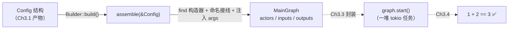
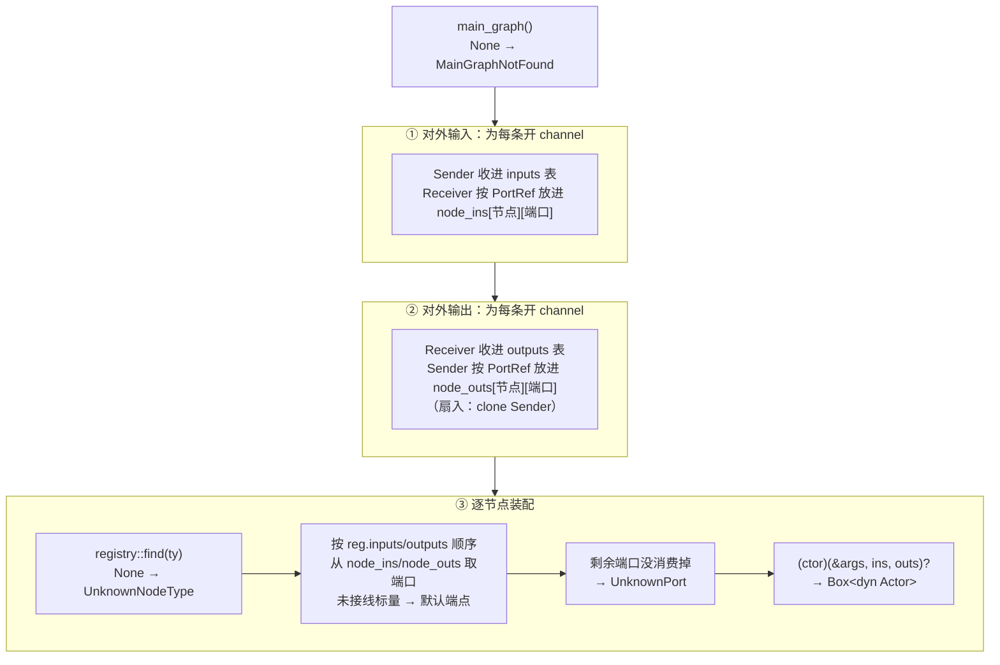

# Ch3.2 Graph Builder：装配节点与 channel

上一章把图纸（TOML）读成了**类型化的 `Config`**。但 `Config` 还只是「文本的结构化副本」——里面没有一个真正的节点、没有一条真正的 channel。本章是装配线的第二道工序：**拿着 `Config`，把节点造出来、把 channel 接上去、装成一张可运行的 `MainGraph`**。

这一章是**注册表（Part 2）与配置层（Ch3.1）的合流点**，也是本书迄今最「较真」的一章——因为两条线在这里**对不齐**，得先把错位讲清楚，再看怎么架桥。

本章接线算法的逐步练习与运行验证见 [Ch3.2a 接线实作](ch02a-wiring-workshop.md)。

> 本章早期单端口示意使用 `Vec<Receiver>`；当前构造器使用 `Vec<Vec<Receiver>>`，外层按端口声明顺序，内层表示该端口连接的端点组。写当前工程时以实作章和源码为准。

<!-- toc -->

## 1. 本章在装配链里的位置



`Builder::build()` 内部只两步：先调 Ch3.1 的 `Config::from_toml` 把文本解析成结构，再把结构交给本章的核心函数 `assemble`。`assemble` 产出的 `MainGraph` 手里攥着三样东西：**造好接好线的节点**、**对外输入句柄**、**对外输出句柄**。本章把节点「装到位、能被 `start()`」为止；真正 spawn 起来跑，是 Ch3.3 的事。

## 2. 中心难题：两套接线语义对不齐

先把两条线各自的「接线方式」摆出来，错位一眼就看得见。

**注册表那条线（Part 2）按「位置」接线。** Ch2.4 的构造器签名是「吃一串输入端口、一串输出端口」——它们是 `Vec`，**靠下标对号入座**：

```rust,ignore
// Ch2.4 的构造器：ins[0] 填第一个 Receiver 字段，outs[0] 填第一个 Sender 字段……
fn build(ins: Vec<Receiver>, outs: Vec<Sender>) -> Box<dyn Actor>;
```

**配置那条线（Ch3.1）按「名字」接线。** TOML 里写的是 `"add:a"`、`"add:b"`——**端口有名字**，`a` 是 `a`、`b` 是 `b`，顺序无所谓：

```toml
inputs = [
    {name="a", cap=8, ports=["add:a"]},   # 接到 add 的名为 a 的端口
    {name="b", cap=8, ports=["add:b"]}    # 接到 add 的名为 b 的端口
]
```

**错位就在这**：配置说「把这条 channel 接到 `add` 的 `a` 端口」，可构造器只认「第 0 个 `Receiver`、第 1 个 `Receiver`」——它根本不知道哪个下标才是 `a`。要是闭着眼按 TOML 里的书写顺序塞进 `Vec`，一旦谁把 `inputs` 数组的两行调个个儿、或者 `#[inputs(a, b)]` 里字段顺序和 TOML 不一致，`a`、`b` 就**悄悄接反了**——编译不报错、运行不报错，只有结果算错。这种 bug 最咬人。

还有第二件事：**节点的自有参数从哪来**。`TestBinaryOp` 有个 `op: String` 字段，值是 TOML 里的 `op="+"`——Ch3.1 已经把它 `flatten` 进了 `NodeConfig.args`。但 Ch2.4 的构造器**只接端口、不接参数**，它对 `op` 一无所知，只能给 `op` 填个 `Default`（空串），运行时必然算错。

所以本章要架的桥有两跨：

1. **名字 → 位置**：让「TOML 里按名接的 channel」能准确排成「构造器要的按位置 `Vec`」。
2. **参数注入**：让构造器能从 `args` 里把 `op` 这类自有参数**按字段名**取出来、填进字段。

## 3. 第一跨：让注册表记住端口名

名字要能对到位置，前提是**有人知道「第 0 个 `Receiver` 字段叫什么名」**。谁知道？`#[derive(BuildFromPorts)]` 这个宏——它就长在结构体上，遍历字段时能看到 `a`、`b`、`c` 这些**字段名**，而字段的**声明顺序**恰恰就是构造器填 `Vec` 的顺序。把这份「顺序 → 名字」的对应记下来，桥的桥墩就有了。

于是给注册条目加两张**端口名表**，和构造器一起注册进表：

```rust,ignore
pub struct NodeRegistration {
    pub name: &'static str,              // 类型名（TOML 里按它引用）
    pub inputs: &'static [&'static str], // 输入端口名，按构造器填充顺序
    pub outputs: &'static [&'static str],// 输出端口名，同上
    pub ctor: NodeCtor,
}
```

`inputs`/`outputs` 由 `#[derive(BuildFromPorts)]` 在**同一次字段遍历**里顺手收集——遍历到 `Receiver` 字段就把名字追加进 `INPUTS`、`Sender` 字段追加进 `OUTPUTS`，与它生成的 `build` 消费 `ins`/`outs` 的顺序**严格同序**。这是关键：名表的第 `i` 项，就是构造器填的第 `i` 个端口。

宏生成的东西长这样（`TestBinaryOp` 有 `a`/`b` 两输入、`c` 一输出）：

```rust,ignore
impl BuildFromPorts for TestBinaryOp {
    const INPUTS:  &'static [&'static str] = &["a", "b"];
    const OUTPUTS: &'static [&'static str] = &["c"];
    fn build(args: &Args, mut ins: Vec<Receiver>, mut outs: Vec<Sender>)
        -> Result<Box<dyn Actor>> { /* ... */ }
}
```

`node_register!` 注册时，就把这两张常量表一并填进条目：

```rust,ignore
flow_rs::registry::NodeRegistration {
    name: "TestBinaryOp",
    inputs:  <TestBinaryOp as BuildFromPorts>::INPUTS,   // &["a","b"]
    outputs: <TestBinaryOp as BuildFromPorts>::OUTPUTS,  // &["c"]
    ctor:    <TestBinaryOp as BuildFromPorts>::build,
}
```

现在 Builder 手里有了对照表：想接 `"add:a"`，查 `INPUTS` 发现 `a` 在第 0 位，就把这条 channel 的 `Receiver` 放进 `ins[0]`。**名字对到了位置，接反的可能性被消灭。**

## 4. 第二跨：构造器吃 `&Args`、返回 `Result`

参数注入这一跨，改的是**构造器的签名本身**。相比 Ch2.4，`build` 多了个 `&Args` 入参、并把返回类型从 `Box<dyn Actor>` 换成 `Result<Box<dyn Actor>>`：

```rust,ignore
//                    ↓ 新增：节点参数表          ↓ 新增：可能失败
fn build(args: &Args, ins: Vec<Receiver>, outs: Vec<Sender>) -> Result<Box<dyn Actor>>;
```

为什么要返回 `Result`？因为「从 `args` 取参数」**可能失败**——参数缺了（TOML 没写 `op`）、或者类型对不上（`op` 写成了数字）。这些错必须能报出来，而不是 panic 或静默填默认值。

宏怎么生成「取参数」这一步？还是那次字段遍历，多加一个分支：字段既不是 `Receiver`、也不是 `Sender`、也不是 `input_closed` 标志，那它就是**节点自有参数**，改用一个小助手 `config::arg` 按字段名从 `args` 反序列化：

```rust,ignore
// #[derive(BuildFromPorts)] 为 op 字段生成的初始化：
op: flow_rs::config::arg(args, "op")?,
```

`config::arg` 就是 Ch3.1 那层的收尾——`flatten` 把节点私有键兜进了 `args`（一个 `key → toml::Value` 的表），这里再按目标字段的类型把某个键取回来：

```rust,ignore
pub fn arg<T: DeserializeOwned>(args: &Args, key: &str) -> Result<T> {
    let value = args.get(key).ok_or_else(|| Error::Arg {
        key: key.to_owned(), msg: "missing".to_owned(),   // 缺键
    })?;
    value.clone().try_into().map_err(|e: toml::de::Error| Error::Arg {
        key: key.to_owned(), msg: e.to_string(),           // 类型对不上
    })
}
```

`T: DeserializeOwned` 是泛型约束：`arg` 能把 `op` 取成 `String`、也能把别的键取成 `f64`/`bool`/自定义结构——**目标字段是什么类型，就往什么类型反序列化**。这正是「配置驱动」在构造侧的落点：TOML 写什么、字段就填什么，全程没在引擎里写死任何一个具体参数名。

> **一次遍历，三件事**。回头看 `#[derive(BuildFromPorts)]` 的字段循环，它一趟同时干了：① 按类型把字段分类成「输入端口 / 输出端口 / 关闭标志 / 自有参数」并生成对应的初始化；② 把端口名收进 `INPUTS`/`OUTPUTS`；③ 给自有参数生成 `arg(args, "字段名")?`。三件事共享同一个遍历顺序，这份「同序」正是名字↔位置桥成立的根基。

## 5. `assemble`：把桥走一遍

桥墩备齐，来看 Builder 怎么走过这座桥。`assemble(&Config)` 的算法分三段：



**① 先为每条对外输入开一条 channel。** 一条 channel 有一个 `Sender`、一个 `Receiver`：`Sender` 交给用户（收进 `inputs` 表，`g.input("a")` 拿的就是它），`Receiver` 顺着 `"add:a"` 这个 `PortRef` 放进「按名收集」的中间表 `node_ins["add"]["a"]`。

**② 再为每条对外输出开一条 channel。** 方向反过来：`Receiver` 交给用户（收进 `outputs` 表），`Sender` 放进 `node_outs`。输出这边支持**扇入**——多个源端口汇到同一个对外输出，是 mpsc 天生的能力，`clone` 一份 `Sender` 即可。

到这里，所有 channel 都开好了，端口按**名字**收在了 `node_ins`/`node_outs` 两张中间表里。第三段就是过桥：

**③ 逐节点，把「按名收集」翻译成「按位置排列」。** 对每个节点：`find` 出注册条目 → 拿它的 `reg.inputs` 名表，**按名表顺序**从 `node_ins[本节点]` 里逐个取端口塞进 `Vec` → 输出同理 → 最后 `(ctor)(&args, ins, outs)?` 造出节点。核心那几行：

```rust,ignore
for &port in reg.inputs {               // 按注册表声明的端口顺序
    let rx = ins_map.remove(port)       // 此处为单端口阶段示意
        .unwrap_or_default();           // 未接线保留默认端点
    ins.push(rx);                        // 排进「按位置」的 Vec
}
// ……outs 同理……
actors.push((reg.ctor)(&nd.args, ins, outs)?);
```

`remove` 而非 `get`，是刻意的：**取一个、少一个**。等注册表声明的端口全取完，`ins_map` 里若还剩东西，说明 TOML 接了一个节点类型上**根本不存在**的端口——正好用来报 `UnknownPort`。

## 6. 跨引用校验与未接线端点

跨引用检查需要同时查看节点和端口声明。`assemble` 遇到错误立即返回；未接线端口按原版保留默认值。

| 错误 | 触发点 | 变体 |
|---|---|---|
| `main` 指向的图不存在 | 开头 `main_graph()` 返回 `None` | `MainGraphNotFound` |
| 节点类型名注册表里没有 | `registry::find(ty)` 返回 `None` | `UnknownNodeType` |
| 端口引用指向不存在的节点 | `node_exists("ghost")` 为假 | `UnknownNode` |
| 接了节点没有的端口 | 名表消费完，中间表还剩键 | `UnknownPort` |
| 节点声明的端口没接线 | 补默认端点，允许建图 | 无错误；接收端关闭，发送端丢弃消息 |
| 声明的图边界 `ports=[]` | 没有目标或来源 | `BadConnection` |
| 参数缺失 / 类型不对 | `config::arg` 取不到或转不动 | `Arg` |

原版 `config/mod.rs::translate_conn` 已检查空连接与引用，`postprocess/conn_check.rs` 对未接线端口只警告。因此，拒绝所有未接线端口并不是兼容性优化。当前默认端点保持原版的收发行为；日志警告尚未复刻。

> **一个设计选择：`assemble` 遇错即返回**（第一个错误就 `?` 抛出），而非收集全部错误再一起报。教学子集里这样最简单直接；「一次报全所有配置错」是可做的增强，但要引入错误累加器，留作练习。

## 7. `MainGraph` 的 API 面

装配的产物 `MainGraph`，本章只给它**最小够用**的接口——刚好让集成测试能手动把图跑起来、端到端验证接线：

```rust,ignore
impl MainGraph {
    pub fn input(&self, name: &str) -> Option<Sender>;        // 拿对外输入的发送端（clone）
    pub fn take_output(&mut self, name: &str) -> Option<Receiver>; // 取走对外输出的接收端
    pub fn input_names(&self) -> Vec<&str>;                   // 所有对外输入名
    pub fn output_names(&self) -> Vec<&str>;                  // 所有对外输出名
    pub fn take_actors(&mut self) -> Vec<Box<dyn Actor>>;     // 取走装好的节点去 spawn
}
```

注意两个方法名里的动词差异，它们直接映射 Part 1 定下的 channel 语义：

- `input` 返回**克隆**的 `Sender`——`Sender` 可 `Clone`（多生产者），复制一份给用户、图里自己也留着一份不碍事。
- `take_output` 用 `&mut self` 把 `Receiver`**取走**（move）——这是 API 选择移除图持有的接收端；当前 `Receiver` 可以克隆，克隆之间竞争同一队列的消息。名字里的 `take` 就是这个提示。

`take_actors` 同样是「取走」：用 `std::mem::take` 把 `actors` 搬空、交给调用方去 `start()`。Ch3.3 会在这个接缝之上封装出 `graph.start()`——本章先把接缝露出来，好让测试**手动**把每个 actor `start()` 起来，先把「接线对不对」这件最要紧的事验证掉，调度的封装往后放。

> 顺带一个 Rust 细节：`MainGraph` 手写了 `Debug` 而没 `#[derive]`。因为它含 `Vec<Box<dyn Actor>>`，而 `Box<dyn Actor>` 不实现 `Debug`，派生会失败。手写版只打印「节点数量 + 端口名」这种摘要——够 `build().unwrap_err()` 在测试里用（`unwrap_err` 要求 `Ok` 侧类型实现 `Debug`），也比逐个打印节点内部有意义。

## 8. 测试：一条 E2E 主线 + 六条错误支线

这一章的测试在 `tests/graph_builder.rs`，是一个**外部 crate**视角的集成测试——因为 `node_register!` 走的是「下游 crate 用 `flow_rs::` 绝对路径注册」的路子，必须在 flow-rs 之外才能真实演练（这点 Ch2.4 已经踩通）。

测试先定义一个 `TestBinaryOp` 节点：`#[inputs(a, b)]` 两输入、`#[outputs(c)]` 一输出、一个 `op: String` 参数——相对 Ch2.4 的 `Doubler`（1 入 1 出、无参），它把本章三件新事一次性覆盖：**多输入端口**（命名接线必须对号入座）、**输出端口**、**从 `args` 取参数**。

**主线 `builds_and_runs_binary_op`**（端到端）：

```rust,ignore
let mut g = Builder::default().template(ADD_GRAPH).build().unwrap();

let mut ins = g.input_names(); ins.sort();
assert_eq!(ins, vec!["a", "b"]);          // 对外端口就是 TOML 里的 a/b/c
assert_eq!(g.output_names(), vec!["c"]);

let actors = g.take_actors();
assert_eq!(actors.len(), 1);
let handles: Vec<_> = actors.into_iter().map(|a| a.start()).collect();

let a_in = g.input("a").unwrap();
let b_in = g.input("b").unwrap();
let mut c_out = g.take_output("c").unwrap();
a_in.send(Envelope::new(1i32)).await.unwrap();
b_in.send(Envelope::new(2i32)).await.unwrap();
let mut e = c_out.recv::<i32>().await.unwrap();
assert_eq!(e.unpack(), 3);                // 1 + 2 == 3 —— 桥若接反，这里立刻变红

drop(a_in); drop(b_in); drop(g);          // 优雅停机：drop 掉所有输入 Sender
for h in handles { h.await.unwrap().unwrap(); }
```

`1 + 2 == 3` 是**桥的验收**：喂给对外输入 `a` 的 `1` 必须准确落到节点的 `a` 端口、`b` 的 `2` 落到 `b` 端口，`op="+"` 必须真的被注入成了 `"+"`。三者任一接错，结果就不是 `3`。停机那几行也复用了 Part 1 的关闭语义：`drop` 掉手上两个 `Sender` 外加 `drop(g)`（连图内 `inputs` 表里那两份 `Sender` 一起丢），节点 `recv` 到 `ChannelClosed` 后由 `#[methods]` 的包装吞成「置标志 + 退出」，任务干净返回 `Ok`。

**错误与兼容性支线**检查入口、类型、端口引用、参数与空边界；未接线标量端口应建图成功。另用倒序输入与减法验证按名接线，用左信封的 `partial_id` 验证元信息来自正确输入。加法即使接反也得到相同结果，不能单独证明位置映射正确。

至此 flow-rs 全套 **46 项测试**（含 flow-derive 的宏单测）全绿，clippy `-D warnings` 干净。

## 小结

- **两套接线语义对不齐**是本章的中心难题：注册表按**位置**接线（`Vec` 下标），配置按**名字**接线（`"add:a"`）；外加节点自有参数（`op`）得从 `args` 注入。
- **第一跨（名字→位置）**：注册条目带上 `INPUTS`/`OUTPUTS` 端口名表，由 `#[derive(BuildFromPorts)]` 在字段遍历里**与填充顺序同序**地收集。Builder 按名表把「按名收集的 channel」排成「按位置的 `Vec`」，接反被消灭。
- **第二跨（参数注入）**：构造器签名升级为 `build(&Args, ins, outs) -> Result`；宏为自有参数字段生成 `config::arg(args, "字段名")?`，按目标类型反序列化——「配置驱动」在构造侧落地。
- **`assemble` 三段**：开 channel 收对外句柄 + 按 `PortRef` 把端口按名收进中间表 → 逐节点按注册表名表把中间表翻译成位置 `Vec` → `(ctor)` 造节点。`remove` 取一个少一个，剩余即非法端口。
- **分清非法引用与未接线**：前者报错，后者保留默认端点。原版已有建图校验，完整类型推断等协议仍需继续补齐。
- **`MainGraph` 最小 API**：`input`（clone Sender）/ `take_output`（move Receiver）/ `take_actors`，动词映射 channel 的多生产者-单消费者语义；调度封装留到 Ch3.3。

下一章 **Ch3.3 · tokio 调度**：本章把节点装到了「能被 `start()`」的地步，但还得由调用方手动一个个 `start`、手动收 `JoinHandle`。Ch3.3 把这套封进 `graph.start()` / 优雅停机 / `handle.await`，让「装好的图」变成「跑起来、又能干净停下的图」——`MainGraph` 从一张静态蓝图，正式变成一台运转的机器。
