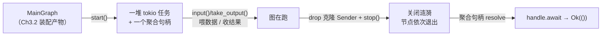

# Ch3.3 tokio 调度：spawn actor、start/stop、优雅停机

上一章把图**装到位**了：节点造好、channel 接好，`MainGraph` 攥着一组 `Box<dyn Actor>` 和对外句柄。但它还是一张**静态蓝图**——要让它跑起来，Ch3.2 的测试得亲手 `take_actors()`、再一个个 `actor.start()`、最后一个个收 `JoinHandle`。本章把这套手工活封进 `MainGraph`：一次 `start()` 启动全图、一个聚合句柄盯着全图收尾，一个 `stop()` 触发优雅停机。**蓝图从此变成一台能跑、又能干净停下的机器。**

<!-- toc -->

## 1. 本章在装配链里的位置



Ch3.2 到 Ch3.3 的跨度，正是「装好」到「跑起来又停得下」这一步。本章只给 `MainGraph` 添两个方法——`start` 和 `stop`——外加一个错误变体。代码量很小，但它把 Part 1（channel 关闭语义）、Part 2（`Actor::start` 非 async、对象安全）在这里收口成一套**生命周期**。

## 2. Ch3.2 留下的手工活

先看上一章的测试是怎么把图跑起来的——这段就是本章要消灭的样板：

```rust,ignore
let actors = g.take_actors();                 // ① 把节点搬出来
let handles: Vec<_> = actors                   // ② 一个个 start，攒一堆句柄
    .into_iter()
    .map(|a| a.start())
    .collect();
// …… 喂数据、收结果 ……
drop(a_in); drop(b_in); drop(g);               // ③ 手动 drop 掉所有输入触发停机
for h in handles { h.await.unwrap().unwrap(); }// ④ 一个个收句柄
```

四步里，①②④都是**纯机械**的：搬节点、逐个 spawn、逐个 join。调用方真正关心的只有「启动」和「等它跑完」两件事，却被迫盯着一个 `Vec<JoinHandle>`。本章把 ①②合成 `start()`、把④收敛成**一个**句柄的 `await`、把③的一部分收进 `stop()`。

> 为什么 Ch3.2 要先把这套摊开手写？因为那一章的主题是**接线对不对**——先用最少的机制把图跑起来、验证 `1+2==3`，调度封装是另一件事，留到本章单独讲。这也是全书的节奏：一次只引入一个新概念。

## 3. 一个设计选择：非 async 的 `start` + 聚合句柄

回忆 Ch2.1 定下的关键决策：`Actor::start` **不是** `async fn`，它同步地返回一个 `JoinHandle`——正因为非 async，它才**对象安全**，才能装进 `Box<dyn Actor>`。这个决策在本章兑现了红利：图里存的是 `Vec<Box<dyn Actor>>`，我们能直接对每个 `Box<dyn Actor>` 调 `start()` 拿句柄，无需任何 async-trait 的额外机制。

那 `MainGraph::start` 该返回什么？有两个选择：

- 返回 `Vec<JoinHandle>`——把 Ch3.2 的④原样丢回给调用方，等于没封装。
- 返回**一个聚合句柄** `JoinHandle<Result<()>>`——它内部替调用方 join 掉所有节点，对外只暴露「整张图跑完了吗、成功吗」这一个问题。

我们选后者，也和原版 MegFlow 的 `start(&mut self) -> JoinHandle<Result<()>>` 对齐。调用方从此只需 `graph.start().await`，不必知道图里有几个节点。

**这个聚合句柄的类型值得盯一眼。** `handle.await` 的结果是 `Result<Result<()>, JoinError>`——**两层**：

```rust,ignore
let handle = g.start();          // JoinHandle<Result<()>>
let outcome = handle.await;      // Result< Result<()>, JoinError >
//                                        └ 内层：图逻辑成没成  └ 外层：任务本身崩没崩
```

- **外层** `Result<_, JoinError>`：这个聚合任务**本身**跑完了、还是 panic/被取消了？出问题给 `JoinError`。
- **内层** `Result<()>`（我们的 `Result`）：图跑完了，但**逻辑**成功吗？某个节点返回了 `Err` 就落这里。

测试里那句 `handle.await.unwrap().unwrap()` 就是把两层依次拆开：第一个 `unwrap` 断言「任务没崩」，第二个断言「逻辑没错」。

## 4. `start`：spawn 全部 + join 全部

先看本章要写进 `MainGraph` 的**最小版**（下面这段是**简化示意**，聚焦「spawn 全部 + join 全部」这一个主题；`actor.start()` 到 Ch4.3 才会多收一个 `Context` 参数，届时这里会顺势长出一行，终点完整代码见本章 §8）：

```rust,ignore
pub fn start(&mut self) -> JoinHandle<Result<()>> {
    let handles: Vec<_> = self
        .take_actors()                 // 复用 Ch3.2 的接缝：把节点搬出来
        .into_iter()
        .map(|actor| actor.start())    // 每个 spawn 成一个 tokio 任务
        .collect();
    tokio::spawn(async move {          // 再 spawn 一个「聚合任务」去 join 它们
        for handle in handles {
            handle.await.map_err(|e| Error::TaskJoin(e.to_string()))??;
        }
        Ok(())
    })
}
```

`start` 自己**不是** async——它同步地 spawn 完就返回句柄，这样调用方能先拿到句柄、再从容地喂数据。真正的等待发生在那个 `tokio::spawn` 出来的**聚合任务**里：它 `move` 走全部节点句柄，逐个 `await`。

那行 `??` 是本章的 Rust 眼——**两个问号，对应上一节的两层 `Result`**：

```rust,ignore
handle.await                                    // Result<Result<()>, JoinError>
    .map_err(|e| Error::TaskJoin(e.to_string()))// 把 JoinError 翻译成我们的 Error
    ?                                            // 外层 ?：任务崩了 → 抬出 TaskJoin
    ?;                                           // 内层 ?：节点返回 Err → 原样抬出
```

第一个 `?` 作用在「外层」——`map_err` 已把 `JoinError` 换成 `Error::TaskJoin`，于是任务若 panic/被取消，这里直接抬出 `TaskJoin`；若任务正常收尾，`?` 剥掉外层 `Ok`，留下内层的 `Result<()>`。第二个 `?` 作用在「内层」——节点 `exec` 若返回过 `Err`，任务就是带着这个 `Err` 收尾的，这里把它**原样**抬出。任一节点出任一种问题，聚合句柄都替调用方抓到。

**为什么逐个顺序 `await` 不会卡住？** 直觉上「先 await 节点 A，可结果先跑完的是 B」似乎会浪费——但停机是一场**关闭涟漪**（Part 1 的 channel 语义）：任一上游任务一收尾，就会 drop 掉它到下游的 `Sender`，下游随即 `recv` 到 `ChannelClosed` 而退出。所以所有该结束的节点**都会**结束，先 `await` 谁只影响「谁先被收」，不影响「是否都被收」。顺序 join 因此既正确又够简单，无需 `join_all` 之类的并发原语。

## 5. `stop`：撤掉所有输入，让涟漪跑起来

节点靠「输入 channel 关闭」来知道该收工，而一条 channel 只有在**所有** `Sender` 都 drop 后才关闭。对外输入的 `Sender` 有两份持有者：

1. 调用方手里那份——`g.input("a")` 返回的**克隆**；
2. 图自己留的那份——躺在 `MainGraph.inputs` 表里。

两份都得没了，channel 才关。`stop` 负责的就是第 2 份：

```rust,ignore
pub fn stop(self) {
    // self 在此 drop：inputs 里的 Sender、outputs 里未取走的 Receiver 一并释放。
}
```

它**消费 `self`**（`self` 而非 `&mut self`）——整张图连同 `inputs` 表一起 drop，图自留的那份 `Sender` 随之消失。配合调用方 drop 掉自己的克隆，发送端彻底清零，关闭涟漪从对外输入灌入，顺着图一路传导到底，最终 §4 的聚合句柄 resolve。

论效果，`stop()` 完全等价于直接 `drop(graph)`。那为什么还要给它起个名字？为了把**意图**讲明白：「停机 = 撤掉图的所有对外输入」。一个空函数体承载的是语义，不是逻辑——这也对齐原版 `stop(self)` 的做法。

> **一个诚实的小台阶**：调用方仍得**自己**记得 drop 掉从 `input()` 拿到的克隆句柄，`stop()` 管不着它们。这是「`Sender` 可克隆 = 多生产者」这一便利的代价——channel 不知道哪份克隆才算「最后一份」，只能等它们全没。教学子集里把这点如实暴露；真要更省心，可以让 `MainGraph` 交出一个「一次性输入」的封装类型，drop 它就自动收口——留作练习。

## 6. `Error::TaskJoin`：按需生长的第 N 个变体

聚合任务 `await` 子任务时，`JoinError` 是 tokio 的类型，不能直接混进我们的 `Result`。延续全书「错误枚举**按需生长**」的做法，本章添第一个、也是唯一一个新变体：

```rust,ignore
/// 节点任务异常收尾——panic 或被取消，即 tokio `JoinError` 的抬升（Ch3.3 调度）。
#[error("node task join error: {0}")]
TaskJoin(String),
```

存 `String` 而非 `JoinError` 本身，是刻意的：`JoinError` 携带 tokio 的运行时细节，我们的错误类型不该把它渗进公开 API；`to_string()` 抽出人话即可。

**要分清它和「节点返回 `Err`」的界线**：节点 `exec` 正常 `return Err(...)`，走的是 §4 那个**内层** `?`，抬出的是节点**自己的**错误（比如 `Error::Arg`）；只有任务**本身**崩了——代码 panic、或任务被取消——才轮到 `TaskJoin`。前者是「逻辑判定失败」，后者是「任务没能正常收尾」，两码事，各有各的落点。

## 7. 测试：两个独立节点 + 一条错误支线

测试在 `tests/scheduler.rs`。当前拓扑还不支持**节点间内连**（`connections` 留到 Part 4），所以没法搭一条 A→B 的链。但要演练「聚合句柄跨**多个**任务 join」，放**两个互相独立**的单节点就够了——`add`（求和）和 `mul`（求积），各从对外输入取数、往对外输出吐结果，彼此不接线：

```toml
nodes = [
    {name="add", ty="TestBinaryOp", op="+"},
    {name="mul", ty="TestBinaryOp", op="*"},
]
inputs = [
    {name="a", cap=8, ports=["add:a"]}, {name="b", cap=8, ports=["add:b"]},
    {name="x", cap=8, ports=["mul:a"]}, {name="y", cap=8, ports=["mul:b"]},
]
outputs = [
    {name="sum",  cap=8, ports=["add:c"]},
    {name="prod", cap=8, ports=["mul:c"]},
]
```

**主线 `start_runs_all_nodes_then_stop_shuts_down`**——一次 `start()` 跑起两个节点，喂数、收数、优雅停机。下面是 `tests/scheduler.rs` 里**逐字照抄可跑**的这一段（本书用 `{{#include}}` 直接嵌入真实测试文件，不是重新誊写的片段）：

```rust
{{#include ../../../code/flow-rs/tests/scheduler.rs:main_test}}
```

`handle.await.unwrap().unwrap()` 能顺利返回，恰恰证明了聚合句柄**等齐了两个**任务：只要有一个没停，这句就悬着。

**错误支线 `node_error_propagates_through_aggregate_handle`**——给 `op="%"`（未知运算符），节点收到数据后 `exec` 返回 `Err(Arg)`：

```rust
{{#include ../../../code/flow-rs/tests/scheduler.rs:error_test}}
```

这条支线钉死的正是 §4 的**内层 `?`**：节点的业务错误（`Arg`，不是 `TaskJoin`）经聚合句柄一路抬到 `handle.await`，`unwrap()` 拆掉外层的「没崩」，剩下的正是节点返回的那个 `Err(Arg)`。

至此 flow-rs 全套 **48 项测试**（较上一章 +2）全绿，clippy `-D warnings` 干净。

## 8. 本章终点与复现

**起点**：Ch3.2 结束时的工程——`MainGraph` 已能 `build()`、`take_actors()`，测试还在手动逐个 `start`。

**本章改动**：给 `code/flow-rs/src/graph.rs` 的 `MainGraph` 加 `start` / `stop` 两个方法、给 `code/flow-rs/src/error.rs` 加 `TaskJoin` 变体，新增 `code/flow-rs/tests/scheduler.rs`。§4 的 `start` 是聚焦本章主题的简化示意；真实文件里 `start` 已按 Ch4.3 收一个 `Context`（`initialize` 时按名借资源），逻辑骨架与本章完全一致。

**验收命令**（照抄可跑，两项测试全绿即达标）：

```bash
cargo test --manifest-path code/Cargo.toml -p flow-rs --test scheduler --locked
```

预期输出包含：

```text
running 2 tests
test start_runs_all_nodes_then_stop_shuts_down ... ok
test node_error_propagates_through_aggregate_handle ... ok
```

本章正文里两段测试代码由 `{{#include}}` 直接取自该文件，读者照抄或直接运行都是同一份真实代码。

## 小结

- **Ch3.2 留下的手工活**——`take_actors()` + 逐个 `start()` + 逐个收 `JoinHandle`——本章封成 `start()` / `stop()` 两个方法，`MainGraph` 从静态蓝图变成能跑能停的机器。
- **`start` 返回一个聚合句柄** `JoinHandle<Result<()>>`：内部 spawn 全部节点、再 spawn 一个聚合任务逐个 join，对外只暴露「整张图跑完没、成没成」。`handle.await` 是**两层 `Result`**（外层任务崩没崩、内层逻辑成没成），`??` 依次剥开。
- **顺序 `await` 是安全的**：停机是关闭涟漪，该结束的节点都会结束，先收谁只影响顺序、不影响完整性——无需并发 join 原语。
- **`stop(self)` 消费整张图**，drop 掉图自留的对外输入 `Sender`；配合调用方 drop 自己的克隆，channel 关闭、涟漪灌入。等价于 `drop(graph)`，但把「停机 = 撤掉所有输入」的意图讲明白。
- **`Error::TaskJoin` 按需新增**，专收 `JoinError`（任务 panic/取消）；与「节点自己返回 `Err`」严格区分——后者原样抬出，不套 `TaskJoin`。

下一章 **Ch3.4 · 大里程碑**：把散落在测试里的 `TestBinaryOp` 提炼成一个真正的 `BinaryOp` 内置节点，配上一个 `Sandbox` 测试框架（一句话建图、喂数、收数、停机），端到端跑通 `1 + 2 == 3`——**这是全书第一个「真能跑」的引擎**，也是我们从 Part 0 一路钉下的验收契约兑现的时刻。
