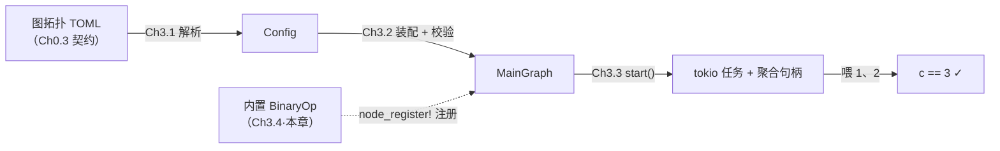

# Ch3.4 端到端跑通 BinaryOp（大里程碑）+ Sandbox 测试框架

从 Part 0 钉下验收契约算起，我们造了消息层、节点 trait、三种过程宏、编译期注册表、配置解析、图装配、tokio 调度——七章的零件，只为这一刻能拼成一台**真能跑的引擎**。本章不引入大的新机制，而是**合流**：把散落在测试里的 `TestBinaryOp` 提炼成一个随 crate 发货的内置节点 `BinaryOp`，配上一个 `Sandbox` 单节点测试框架，然后让 Ch0.3 契约里那段一字不差的 TOML 真正跑出 `1 + 2 == 3`。**这是全书第一个「真能跑」的引擎。**

<!-- toc -->

## 1. 本章在全书的位置：契约兑现



前七章每一章都往这条链上补一段；到本章，链的两端终于接上——**输入端**是 Part 0 钉死的那段 TOML，**输出端**是 `c` 端口吐出的 `3`。中间的解析、装配、调度全是现成的，本章只需补上链条里唯一还缺的一环：一个真正**注册进引擎**的 `BinaryOp` 节点。再顺手造一个 `Sandbox`，让「测一个节点」不必每次都铺一张图。

## 2. 从 `TestBinaryOp` 到内置 `BinaryOp`

Ch3.2、Ch3.3 的测试里都躺着一个 `TestBinaryOp`——两输入 `a`/`b`、一输出 `c`、一个 `op` 参数，`exec` 里各收一个操作数、按 `op` 运算、发往 `c`。它一直**定义在测试文件里**，只有那个测试二进制看得见。本章把它原样搬进 `flow-rs/src/builtin.rs`，改名 `BinaryOp`，成为**随 crate 发货**的内置节点：

```rust,ignore
#[inputs(a, b)]
#[outputs(c)]
#[derive(Node, Actor, BuildFromPorts)]
pub struct BinaryOp {
    op: String,
}

#[methods]
impl BinaryOp {
    async fn exec(&mut self) -> Result<()> {
        let mut ea = self.a.recv::<i32>().await?;
        let mut eb = self.b.recv::<i32>().await?;
        let (x, y) = (ea.unpack(), eb.unpack());
        let r = match self.op.as_str() {
            "+" => x + y,
            "-" => x - y,
            "*" => x * y,
            "/" => x / y,
            other => return Err(Error::Arg { key: "op".into(), msg: format!("未知运算符 {other:?}") }),
        };
        if let Some(out) = self.c.as_ref() {
            out.send(ea.repack(r)).await?;
        }
        Ok(())
    }
}

node_register!("BinaryOp", BinaryOp);
```

写法和下游用户会写的节点**没有任何区别**——同一套 `#[inputs]`/`#[methods]`/`#[derive]`/`node_register!`。区别只在**它住在哪**：内置节点住在引擎 crate 里。而「住在 crate 内部」恰好触到一个前几章一直绕开的坎。

## 3. `extern crate self as flow_rs;`：crate 内自注册的钥匙

翻回 flow-derive 里 `node_register!` 生成的代码（Ch2.4）——它全用**绝对路径** `flow_rs::`：

```rust,ignore
flow_rs::inventory::submit! {
    flow_rs::registry::NodeRegistration {
        name: "BinaryOp",
        inputs:  <BinaryOp as flow_rs::registry::BuildFromPorts>::INPUTS,
        outputs: <BinaryOp as flow_rs::registry::BuildFromPorts>::OUTPUTS,
        ctor:    <BinaryOp as flow_rs::registry::BuildFromPorts>::build,
    }
}
```

为什么 `node_register!` 不像 `#[inputs]` 那样用裸名 `Receiver`、让使用处 `use`？生成器使用明确路径以减少对调用处导入的依赖。inventory 的条目经平台初始化登记，运行时枚举；不是只靠链接器收集后直接迭代。当前 flow_rs 路径要求下游未将依赖改名；改名问题见宏教程第 7 课。

可 `BinaryOp` 现在住在 **flow-rs 自己**里。一个 crate 默认并不用自己的名字指代自己——它的自指名是 `crate`，而不是 `flow_rs`。于是 `flow_rs::inventory` 在 crate 内部**无从解析**。flow-derive 的注释当初甚至为此留了句猜测：「本 crate 内部用宏时才需要 `proc-macro-crate`——那时 `flow_rs::` 前缀失效、得换成 `crate::`」。

实际有个**更简单**的解，一行就够，写在 `lib.rs`：

```rust,ignore
extern crate self as flow_rs;
```

它给**当前 crate 自己**起个别名 `flow_rs`。加上这行，`flow_rs::inventory`、`flow_rs::registry` 在 crate 内部就与下游完全一样地解析——`node_register!` 的绝对路径原样成立，不必动宏、更不必引入 `proc-macro-crate`。连带的好处：`builtin.rs` 里那些 `use flow_rs::channel::{Receiver, Sender};` 也能照抄下游用户的写法，内置节点与业务节点由此**长得一模一样**。

> **一段 Rust 小史**：`extern crate` 是 Rust 2015 的老语法——那时每个依赖都要 `extern crate foo;` 手动引入。2018 edition 起依赖自动进入路径根，`extern crate` 几乎绝迹，唯独 `extern crate self as NAME;` 作为「给自己起别名」的惯用法留存至今。原版 MegFlow 的 `lib.rs` 用的正是这一手。加它**不影响**已有的 `crate::` 路径——只是额外把 `flow_rs` 也认作 crate 根的别名。

## 4. `Sandbox`：一句话测一个节点

有了内置节点，怎么测它？走完整 `Builder` 得写一整段 TOML——`main`、`graphs`、`inputs`、`outputs`、每条端口引用。为**单独**验一个节点铺一张图，太重。`Sandbox` 把这件事收敛成三步：**按类型名建节点 → 给输入喂数 → 在输出收数**。

它是原版 `flow-rs/src/sandbox.rs` 的**教学子集**（原版还带 Broker、`ChannelStorage`、动态端口、资源注入），这里只留最小内核，直接站在 Ch2.4 注册表 + Ch1.4 channel + Ch2.1 `Actor::start` 之上，**不经过图装配**：

```rust,ignore
pub fn with_args(ty: &str, args: Args) -> Result<Self> {
    let reg = registry::find(ty).ok_or_else(|| Error::UnknownNodeType(ty.to_owned()))?;
    // 为节点声明的每个输入/输出端口各开一条 channel：
    //   输入 → Receiver 给节点、Sender 留给沙箱（供 add_data）；
    //   输出 → Sender 给节点、Receiver 留给沙箱（供 add_check）。
    // 端口按注册表名表顺序排成位置 Vec，交给同一套 ctor——与 Graph Builder 一致。
    let actor = (reg.ctor)(&args, ins, outs)?;
    Ok(Sandbox { actor: Some(actor), inputs, outputs, subs: HashMap::new() })
}
```

### 4.1 按原版接口登记数据源

`add_data("a", |i| if i == 0 { Some(1i32) } else { None })` 接受闭包。
索引从 0 开始，每次返回 Some 发送一条，None 结束；闭包在 start 时执行，
登记时不执行。已有 Vec 可以使用本书额外提供的 add_items，内部转成同一种闭包。

要保留元信息，使用 add_envelope 返回完整信封。以下是实际源码中的三个入口：

```rust,ignore
{{#include ../../../code/flow-rs/src/sandbox.rs:sandbox_sources}}
```

add_data 只负责把载荷包装成 Envelope::new，发送与循环统一交给 add_envelope。
它先登记任务工厂，在 start 时 remove 输入 Sender，把唯一发送端移进任务，避免沙箱残留 Sender 导致
数据源结束后输入仍不关闭。与原版一致，发送失败后仍调用有限数据源直到 None；
所以数据源中的副作用次数不会因节点提前关闭而改变。无限数据源必须自己提供结束条件。

重复登记同一个名字时，原版 HashMap::insert 会丢弃旧回调，只执行最后登记的回调。
当前实现也按端口名保存“任务工厂”：它是一个 FnOnce 闭包，接收端口表，返回一个
尚未执行的 Future。只有 start 才让工厂取走端口，因而覆盖登记时不必回收已经被移动的
Receiver。这里多一层闭包是为了解决所有权与覆盖语义，不是额外启动一层线程。

输入和输出沿用原版同一名字空间；若两方向同名，后一次登记同样覆盖前一次。
这不是两个独立列表。普通节点应明确区分输入输出名字。

### 4.2 正常关闭与检查错误要区分

```rust,ignore
{{#include ../../../code/flow-rs/src/sandbox.rs:sandbox_checks}}
```

add_check 只关心载荷，add_envelope_check 可检查元信息和空载荷。
只有 ChannelClosed 表示正常收尾；TypeMismatch 必须返回错误，否则一个类型写错、
从未执行过断言的测试也可能显示通过。空载荷需要使用完整信封检查器，不能直接 unpack。

### 4.3 启动和收尾

start 清理未使用的端口，启动节点与所有源/检查任务，先收集子任务结果，再等待节点。
即使检查器失败，也不能立即返回、丢下尚未完成的节点；当前实现保留第一个检查错误，
待节点完成后再返回。节点本身仍有任务层与业务层两层 Result。

这个流程不是完整任务监督器：若节点无法自行退出，仍可能等待；panic 或强制取消也
不能保证异步 finalize。教学测试使用超时，并分别验证正常关闭、业务错误和检查器失败。

```bash
cargo test --manifest-path code/Cargo.toml -p flow-rs --test sandbox_envelopes --locked
```

六个用例检查完整信封源、错误检查类型、检查器 panic 后等待收尾、原版数据闭包的
调用序号与输出数量、节点提前关闭后继续遍历源，以及同名登记覆盖旧回调。资源注入和动态端口
仍有差距，不能把这几个入口对齐当成完整 Sandbox 已兼容。

## 5. 端到端：两条路径都跑出 `1 + 2 == 3`

测试在 `tests/binary_op_e2e.rs`。它**不再自己定义节点**——`BinaryOp` 已在引擎里注册，测试只按名字 `"BinaryOp"` 引用它。这本身就证明「节点真的进了引擎」。

**路径一 · 完整图**：喂给 `Builder` 的，正是 Ch0.3 契约里那段一字不差的 TOML。

```rust,ignore
const BINARY_OP_GRAPH: &str = r#"
main = "example"
[[graphs]]
name = "example"
nodes = [ {name="add", ty="BinaryOp", op="+"} ]
inputs = [
    {name="a", cap=16, ports=["add:a"]},
    {name="b", cap=16, ports=["add:b"]}
]
outputs = [{name="c", cap=16, ports=["add:c"]}]
"#;

let mut g = Builder::default().template(BINARY_OP_GRAPH).build().unwrap();
let handle = g.start();                          // Ch3.3 调度
let a = g.input("a").unwrap();
let b = g.input("b").unwrap();
let mut c = g.take_output("c").unwrap();
a.send(Envelope::new(1i32)).await.unwrap();
b.send(Envelope::new(2i32)).await.unwrap();
assert_eq!(c.recv::<i32>().await.unwrap().unpack(), 3);   // ← 里程碑
drop(a); drop(b); g.stop();
handle.await.unwrap().unwrap();
```

这一条断言 `== 3` 把**七章的链**一次跑通：TOML 经 Ch3.1 解析、Ch3.2 装配校验、Ch3.3 调度，喂进 Ch3.4 的内置 `BinaryOp`，算出 `3` 从 `c` 吐出。**Part 0 钉下的验收契约，在这一行兑现。**

**路径二 · Sandbox**：同样的 `1 + 2 == 3`，但不写一行 TOML。

```rust,ignore
let args: Args = toml::from_str(r#"op = "+""#).unwrap();
let collected = Arc::new(Mutex::new(Vec::new()));
let sink = collected.clone();

let mut sb = Sandbox::with_args("BinaryOp", args).unwrap();
sb.add_data("a", |i| if i == 0 { Some(1i32) } else { None })
  .add_data("b", |i| if i == 0 { Some(2i32) } else { None })
  .add_check("c", move |v: i32| sink.lock().unwrap().push(v));
sb.start().await.unwrap();

assert_eq!(*collected.lock().unwrap(), vec![3]);
```

两条路径从**两个入口**逼近同一个结果：一条走完整配置驱动的全链，一条走极简的单节点直连。前者证明**引擎**通了，后者给出**测节点**的顺手工具。

## 6. 错误也走得通

顺带验一条错误支线——`op="%"` 是未知运算符，`exec` 收到数据后返回 `Err(Arg)`，这个错误应当**抬到** `Sandbox::start` 的返回值，而非被静默吞掉：

```rust,ignore
let args: Args = toml::from_str(r#"op = "%""#).unwrap();
let mut sb = Sandbox::with_args("BinaryOp", args).unwrap();
sb.add_items("a", vec![1i32]).add_items("b", vec![2i32]);
let result: Result<()> = sb.start().await;
assert!(matches!(result, Err(Error::Arg { .. })));
```

它钉死的和 Ch3.3 错误支线同源：节点的**业务错误**经任务收尾、经那句 `node.await...?` 的**内层**原样抬出——`Arg`，不是 `TaskJoin`。实际通过数量以当前测试输出为准；增加测试后不沿用旧章节的历史数字。

## 小结

- **合流之章**：不引入大机制，把前七章的零件拼成第一台真能跑的引擎——Ch0.3 的 TOML 端到端跑出 `1 + 2 == 3`。
- **`BinaryOp` 成为内置节点**：与下游业务节点用**完全相同**的宏写法，区别只在「住在引擎 crate 里」。
- **`extern crate self as flow_rs;`** 是 crate 内自注册的钥匙：`node_register!` 生成的绝对路径 `flow_rs::` 在 crate 内部本不解析，一行自别名让内外统一——比早期猜测的 `proc-macro-crate` 简单得多。
- **`Sandbox`** 把「测一个节点」收敛成建节点 / 喂数 / 收数三步；`add_data` **搬走**发送端（而非克隆）从内部化解了 Ch3.3 的「drop 两份 Sender」台阶；`start` 复用 Ch3.3 的两层 `Result` 把节点错误如实抬出。
- **两条路径**（完整图 + Sandbox）从两个入口验同一个 `1 + 2 == 3`：一条证引擎、一条给工具。

**Part 3 到此完结**——引擎从「一段 TOML」到「跑出结果」的主干全部打通。下一部 **Part 4** 转向**内置节点与高级特性**：先补上节点间的**内连** `connections`（`a→b` 成链，不再只靠对外端口），再造 `bcast` 广播 / `merge` / `demux` / `reorder`、`Resource` 与 `Context` 共享、子图 `subgraph`——把这台最小引擎，长成能承载真实算法流水线的样子。


## 补充验收：算对数值还不够

原版 `flow-rs/src/lib.rs` 的 BinaryOp 支持四则运算，并用左输入的
`ea.repack(result)` 保留元信息。这里不能用 `Envelope::new(r)`：它会把
`partial_id` 和 `extra_data` 重置，后续按帧关联结果就会失败。

1. 在 `code/flow-rs/tests/binary_op_e2e.rs` 添加四种运算的图测试，输入为 7 和 2，预期依次为 9、5、14、3。
2. 给左输入的 `partial_id` 写入 42，右输入写入 99；输出必须保留 42。
3. 给左输入附上一个 `Arc<String>`，检查输出仍指向同一份附带数据。
4. 用五秒超时包住测试，防止接收或停机死锁让测试无限等待。
5. 在 `code/` 执行 `cargo test -p flow-rs --test binary_op_e2e`。

参考实现中的 `all_operations_preserve_left_envelope_metadata` 是完整测试。
整数除法截断小数；本节点与原版示例一样使用 Rust 的整数运算，除零及
`i32::MIN / -1` 会 panic。生产业务若要改为结构化错误，应明确记录为行为变更，
不能把它当作已经证明与原版一致。
