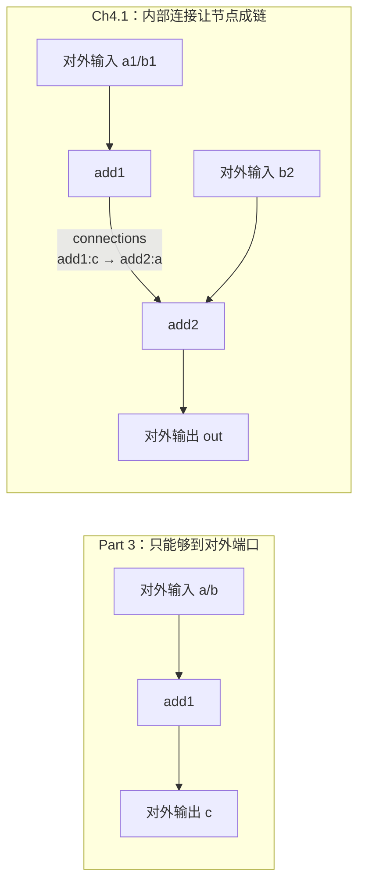

# Ch4.1 节点成链：内部连接 connections + 类型无关直通节点 Transform / Noop

Part 3 收官时我们有了**第一台真能跑的引擎**——TOML 进、`1 + 2 == 3` 出。但那台引擎有个静默的天花板：节点只能接到图的**对外**输入/输出端口。想把 `add1` 的输出喂给 `add2` 的输入，得先绕到某个对外输出、再从某个对外输入接回来——图里根本没有「节点直接连节点」这回事。真实算法仓的流水线（解码 → 检测 → 跟踪 → 告警）恰恰是一长串节点首尾相连，没有内部连接就无从谈起。

本章补上这一环，并顺带交付两个**类型无关**的内置节点：

1. **内部连接 `connections`**——匿名的节点间边，让 `add1:c` 直接接上 `add2:a`，图从「一排各自为政的节点」变成「能成链的网络」。
2. **`Transform` / `NoopConsumer`**——走未类型化的 `recv_any`/`send_any`，搬运封箱消息而不拆封。它们与钉死了 `i32` 的 `BinaryOp` 形成对照，讲清「类型无关的数据流」这一招。

<!-- toc -->

## 1. 本章在全书的位置：从「够到边界」到「节点成链」



Part 3 的 Builder 已经会为每条**对外**端口开 channel、按 `PortRef`（`"节点:端口"`）把两端分派到位。本章要做的，是在同一套装配逻辑里加一类新的边：既不连用户、也不连图边界，而是**图内部两个节点之间**的边。地基全在，缺的只是「解析这类边」+「按端口角色把它接上」。

## 2. 内部连接长什么样：匿名的边

回看 Ch0.3 契约里的 TOML schema，图除了 `inputs`/`outputs`，还有一个 `connections` 数组。它与对外端口的关键区别是**没有名字**：

```toml
[[graphs]]
name = "chain"
nodes = [
    {name="add1", ty="BinaryOp", op="+"},
    {name="add2", ty="BinaryOp", op="+"},
]
inputs = [
    {name="a1", cap=16, ports=["add1:a"]},
    {name="b1", cap=16, ports=["add1:b"]},
    {name="b2", cap=16, ports=["add2:b"]},
]
outputs = [{name="out", cap=16, ports=["add2:c"]}]
connections = [
    {cap=16, ports=["add1:c", "add2:a"]},   # ← 匿名内部边：add1 的输出直连 add2 的输入
]
```

对外端口要名字，是因为**用户**要用那个名字往图里发/收（`graph.input("a1")`）。内部连接不对外暴露，没人从外面引用它，自然不需要名字——它只是「把这几个节点端口挂到同一条 channel 上」。于是配置层加一个**不带 `name`** 的 `ConnConfig`：

```rust,ignore
/// 一条**内部连接**：channel 容量 `cap` + 挂在这条 channel 上的一组「节点:端口」。
/// 与 PortConfig 的关键区别是没有名字——内部连接是匿名的。
#[derive(Debug, Clone, Deserialize)]
#[serde(deny_unknown_fields)]
pub struct ConnConfig {
    pub cap: usize,
    #[serde(default)]
    pub ports: Vec<String>,
}
```

再给 `GraphConfig` 添一个 `#[serde(default)] pub connections: Vec<ConnConfig>` 字段即可。`default` 让老配置（没有 `connections`）照样解析——Part 3 的所有测试一字不改地继续绿。

## 3. 方向从哪来：按端口角色推断

对外端口的方向是**写死**的：`inputs` 里的必是输入、`outputs` 里的必是输出。但内部连接是匿名的一串端口引用，`["add1:c", "add2:a"]` 里谁发谁收？配置没说。

答案是**推断**：每个端口引用指向某个节点的某个端口，而那个端口在**注册表**里早已登记了角色——`add1:c` 的 `c` 在 `BinaryOp` 的 `outputs` 名表里，是输出端口 → 它是**发送端**；`add2:a` 的 `a` 在 `inputs` 名表里 → 它是**接收端**。Ch3.2 的注册条目正好带着 `inputs`/`outputs` 两张端口名表，拿来做判据现成：

```rust,ignore
for conn in &g.connections {
    let mut senders: Vec<PortRef> = Vec::new();
    let mut receivers: Vec<PortRef> = Vec::new();
    for pref_str in &conn.ports {
        let pref = PortRef::parse(pref_str)?;
        let nd = g.nodes.iter().find(|n| n.name == pref.node)
            .ok_or_else(|| Error::UnknownNode(pref.node.to_owned()))?;
        let reg = registry::find(&nd.ty)
            .ok_or_else(|| Error::UnknownNodeType(nd.ty.clone()))?;
        // 端口名表是 &'static [&'static str]，直接用 contains 比对端口名。
        if reg.outputs.contains(&pref.port) {
            senders.push(pref);          // 输出端口 → 发送端
        } else if reg.inputs.contains(&pref.port) {
            receivers.push(pref);        // 输入端口 → 接收端
        } else {
            return Err(Error::UnknownPort { node: pref.node.to_owned(), port: pref.port.to_owned() });
        }
    }
    // ……见下：形态校验 + 建 channel + 接线
}
```

> **一个被经验推翻的直觉**：端口名表类型是 `&'static [&'static str]`，而 `pref.port` 是借自配置、**寿命更短**的 `&str`。凭直觉会担心 `reg.outputs.contains(&pref.port)` 因「`&&'static str` 与 `&&'a str` 不同型」编译不过，退而写 `iter().any(|&p| p == pref.port)`。实测：`contains` **能编译**——`&'static str` 对生命周期**协变**，编译器把整个切片的 `'static` 压短到 `'a` 去匹配即可。clippy 还会主动建议把 `any` 换成更省的 `contains`。教训：生命周期能不能过，编译器说了算，纸上推理容易想当然。

**形态校验**才是这段的重点。我们的 channel 是 `mpsc`——**多生产者、单消费者**。一条内部连接对应一条 channel，因此：

- **恰好 1 个接收端**：一条 channel 只有一个 `Receiver`，多个消费者是不允许的（真要一份数据喂多路，那是**扇出/广播**，得靠专门的 bcast 节点，见下一章）；
- **≥1 个发送端**：`Sender` 可 `Clone`，多个上游发往同一下游是 mpsc 天生支持的**扇入**。

```rust,ignore
    if receivers.len() != 1 || senders.is_empty() {
        return Err(Error::BadConnection(format!(
            "connection {:?} has {} receiver(s) and {} sender(s); \
             need exactly 1 receiver (input port) and ≥1 sender (output port)",
            conn.ports, receivers.len(), senders.len()
        )));
    }
    let (tx, rx) = channel(conn.cap);
    // 接收端：rx 挂到该输入端口；端口已被接过 → PortAlreadyConnected。
    let rcv = receivers[0];
    let in_slot = node_ins.entry(rcv.node.to_owned()).or_default();
    if in_slot.contains_key(rcv.port) {
        return Err(Error::PortAlreadyConnected { node: rcv.node.to_owned(), port: rcv.port.to_owned() });
    }
    in_slot.insert(rcv.port.to_owned(), rx);
    // 发送端：每个输出端口挂一份 tx.clone()（多个即扇入）；同样查重。
    for snd in &senders {
        let out_slot = node_outs.entry(snd.node.to_owned()).or_default();
        if out_slot.contains_key(snd.port) {
            return Err(Error::PortAlreadyConnected { node: snd.node.to_owned(), port: snd.port.to_owned() });
        }
        out_slot.insert(snd.port.to_owned(), tx.clone());
    }
```

这段插在「对外输入/输出」与「逐节点构造」之间：等它跑完，`node_ins`/`node_outs` 里既有对外端口带来的 channel 端、也有内部连接带来的，后面**同一套**「按注册表端口名表排成位置 Vec → 造节点」的逻辑照单全收，一行不用改。

新增的两个错误变体 `BadConnection` / `PortAlreadyConnected` 都在 `build()` 当场抛出——延续 Part 3 的「**校验前移到 build()**」：接线错误在建图那一刻暴露，而非等节点跑起来才诡异地收不到数据。三条构建期测试钉死它们：

```rust,ignore
// 两个输入端口挂一条连接 → 2 接收端 0 发送端 → BadConnection
connections = [{cap=16, ports=["add1:a", "add2:a"]}]
// 全是输出端口 → 0 接收端 → BadConnection
connections = [{cap=16, ports=["add1:c", "add2:c"]}]
// add2:a 既被对外输入 x 接了、又被内部连接接 → PortAlreadyConnected
inputs = [{name="x", cap=16, ports=["add2:a"]}]
connections = [{cap=16, ports=["add1:c", "add2:a"]}]
```

## 4. 端到端：两个 BinaryOp 串成 `(1 + 2) + 10 == 13`

不引入任何新节点，纯用已发货的 `BinaryOp` 串链，专验「内部连接」这一件事成立。`add1` 算 `a1 + b1`，结果经内部连接喂给 `add2` 的 `a`，`add2` 再加上外部 `b2`：

```rust,ignore
#[tokio::test]
async fn internal_connection_chains_two_nodes() {
    let mut g = Builder::default().template(CHAIN_GRAPH).build().unwrap();
    let handle = g.start();

    let a1 = g.input("a1").unwrap();
    let b1 = g.input("b1").unwrap();
    let b2 = g.input("b2").unwrap();
    let mut out = g.take_output("out").unwrap();

    a1.send(Envelope::new(1i32)).await.unwrap();
    b1.send(Envelope::new(2i32)).await.unwrap();   // add1: 1 + 2 = 3
    b2.send(Envelope::new(10i32)).await.unwrap();  // add2: 3 + 10 = 13

    assert_eq!(out.recv::<i32>().await.unwrap().unpack(), 13);

    drop(a1); drop(b1); drop(b2);
    g.stop();
    handle.await.unwrap().unwrap();
}
```

`3` 从没经过任何对外端口——它在图**内部**从 `add1` 流到了 `add2`。这正是流水线的最小雏形。

## 5. 类型无关的节点：`Transform` 与 `NoopConsumer`

`BinaryOp` 里 `self.a.recv::<i32>()` 把消息类型**钉死在节点里**——它只会处理 `i32`。但有一类节点根本不关心载荷是什么，只管**搬运**：原样透传、或收下即弃。它们该走 Ch1.4 那对**未类型化**的 API——`recv_any`/`send_any`，进出的是**已封箱**的 `SealedEnvelope`，全程不拆封。

**`Transform`**：1 入 1 出，把收到的封箱消息原样转发。

```rust,ignore
#[inputs(inp)]
#[outputs(out)]
#[derive(Node, Actor, BuildFromPorts)]
pub struct Transform {}

#[methods]
impl Transform {
    async fn exec(&mut self) -> Result<()> {
        let msg = self.inp.recv_any().await?;      // 收一条封箱消息，不拆封
        if let Some(out) = self.out.as_ref() {
            out.send_any(msg).await?;              // 原样转发
        }
        Ok(())
    }
}
node_register!("Transform", Transform);
```

因为它不 `downcast`，同一个 `Transform` 搬 `i32` 和搬 `String` 一样自然——两个测试分别喂整数流和字符串流，都原样吐出：

```rust,ignore
// 搬 i32
sb.add_items("inp", vec![1i32, 2, 3]).add_check("out", move |v: i32| sink.push(v));
// 换成同一个 Transform，搬 String——照转不误
sb.add_items("inp", vec!["a".to_string(), "bc".to_string()]).add_check("out", move |v: String| sink.push(v));
```

`Transform` 是流水线里最朴素的一块积木：占位、解耦、当调试探针，都用得上。它兑现了 Ch1.3「封箱 + 类型擦除」那层设计——正因为消息能被封进不透明的信封，才可能有「不看类型也能搬」的节点。

**`NoopConsumer`**：只有输入、没有输出的**汇（sink）**，把消息吸收丢弃：

```rust,ignore
#[inputs(inp)]
#[outputs]
#[derive(Node, Actor, BuildFromPorts)]
pub struct NoopConsumer {}

#[methods]
impl NoopConsumer {
    async fn exec(&mut self) -> Result<()> {
        self.inp.recv_any().await?;   // 收下即弃
        Ok(())
    }
}
node_register!("NoopConsumer", NoopConsumer);
```

它用来**终止**一条数据流分支：下游不再需要结果，但仍得有人把消息取走，好让上游的关闭涟漪正常传导（没人收，channel 满了就卡住）。注意它合法地**没有** `#[outputs]`——零输出节点，`close()` 无端口可撤，`recv_any` 一旦 `ChannelClosed` 即收工。

## 6. 诚实的边界：这一章**没做**什么

按「够干净才并入本章」的原则，两样东西被**推迟**：

- **`NoopProducer`（0 输入的源节点）**：我们的 Actor 循环是 `while !is_all_input_closed()`，而关闭标志靠输入端口 `recv` 到 `ChannelClosed` 才置位。一个**零输入**节点永远等不到这个信号，会**忙循环空转**。「源节点如何自终止」是独立话题（要么外部驱动、要么靠计数/信号），留到真正的 source 节点一起讲。
- **`bcast` 广播**：它要把一份输入**扇出**给多个下游，靠的是**数组输出端口** `#[outputs(out:[T0])]`——一个端口名对应 `Vec<Sender>`。这需要给过程宏、注册表端口模型、图接线都加一套「变长端口」机制，是一块独立的地基。它和 `merge`（数组输入扇入）同属「变长端口」族，放一起讲更顺——见 Ch4.2。

也正因为如此，Ch3.2 里「对外输入扇出到多个端口 → `Unsupported`」那条限制**本章仍在**——解除它同样要等数组端口落地。把「暂时做不到什么、为什么」写清楚，比假装引擎已经全能要诚实得多。

## 小结

- **内部连接 `connections`** 是匿名的节点间边；方向不写在配置里，而是**按端口在注册表里的角色推断**（输出端口→发送端、输入端口→接收端）。
- mpsc 单消费者定死了连接形态：**恰 1 接收端 + ≥1 发送端（扇入）**；违反 → `BadConnection`，端口重复接线 → `PortAlreadyConnected`，全在 `build()` 当场报错。
- 接线复用 Part 3 的 `node_ins`/`node_outs` 汇聚 + 位置化逻辑——内部连接只是往这两张表里多塞几条 channel 端，**后续装配一行不改**。
- **`Transform`/`NoopConsumer`** 走 `recv_any`/`send_any`，搬运封箱消息而不拆封，是「类型无关数据流」的样板，也是 Ch1.3 类型擦除设计的兑现。
- 诚实记账：`NoopProducer`（零输入自终止）与 `bcast`（数组端口扇出）被有意推迟，各有其独立的地基要先造。

下一章 Ch4.2 造那块地基——**数组端口**，然后 `Bcast` 扇出、`Merge` 扇入就水到渠成。
