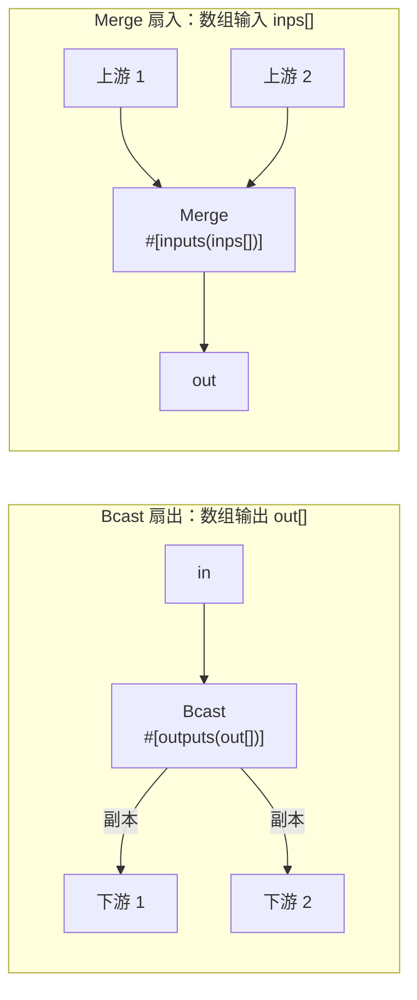

# Ch4.2 数组端口与广播/汇聚：Bcast / Merge（扇出与扇入）

Ch4.1 收尾时留了两笔明账：`bcast`（把一份输入扇出给多个下游）没做，Ch3.2 那条「对外输入扇出到多个端口 → `Unsupported`」的限制也还在。两者卡在同一块缺失的地基上——**数组端口**：一个端口名对应**一组** channel 端，而非一条。本章就造这块地基，然后 `Bcast` 扇出、`Merge` 扇入水到渠成。

到目前为止，所有端口都是**标量**的：`BinaryOp:c`、`Transform:out` 一个名字只能接一条边。真实流水线里，一个检测结果常要**同时**喂给跟踪、告警、编码三条支路（扇出）；反过来，多路解码流也常要**汇成一路**统一处理（扇入）。标量端口表达不了「一名多端」，本章补上：

1. **数组端口语法** `#[outputs(out[])]` / `#[inputs(inps[])]`——名字后跟 `[]`，字段类型从 `Option<Sender>`/`Receiver` 变成 `Vec<Sender>`/`Vec<Receiver>`。
2. **分组构造器**——构造器收的端口从「按位置的一维 Vec」升级成「按端口分组的二维 `Vec<Vec<_>>`」，标量端口退化成「恰 1 个的组」。
3. **`Bcast` / `Merge`**——扇出靠数组输出 `split_last` 复制，扇入靠数组输入 `select_ok` 轮询。

<!-- toc -->

## 1. 本章在全书的位置：一名多端



关键的非对称在 Ch4.1 已埋下伏笔：**扇入本可以不要节点**——mpsc 天生多生产者，多个上游 clone 同一个 `Sender` 发往一条 channel 即可（Ch4.1 内部连接的 `≥1 发送端`就是这么扇入的）。但**扇出必须由节点显式做**——一条 channel 只有一个 `Receiver`（单消费者），拆不出多份；要一份数据变多份，只能有个节点**主动复制**再分发。这正是 Ch1.4「广播是节点的职责、不塞进 channel 层」那个决策的落点：原版把广播糅进 channel 抽象，我们把它留给 `Bcast` 节点，channel 层保持极简的单生产者-单/多…—单消费者语义。

那既然扇入不需要节点，为什么还要 `Merge`？因为「多路独立 channel」和「一条共享 channel 的多个 Sender」是两回事：前者每路有独立的关闭时机、独立的背压，`Merge` 能在语义上表达「轮询 N 条独立流直到全关」。这也顺带把数组**输入**端口这条地基一起验穿。

## 2. 数组端口的语法与字段注入

标量端口声明是裸名 `#[inputs(inp)]`；数组端口在名字后加**空方括号** `#[inputs(inps[])]`。解析器 `PortSpec` 只认「名字后有没有 `[]`」这一个 bit：

```rust,ignore
/// 一个端口声明：端口名 + 是否为数组端口（名字后跟 `[]`）。
pub struct PortSpec {
    pub name: Ident,
    pub array: bool,
}

impl Parse for PortSpec {
    fn parse(input: ParseStream) -> syn::Result<Self> {
        let name: Ident = input.parse()?;
        // 名字后可选 `[...]` → 标记为数组端口；括号内内容一律忽略（消费掉即可）。
        let array = input.peek(syn::token::Bracket);
        if array {
            let _bracket_content;
            syn::bracketed!(_bracket_content in input);
        }
        Ok(PortSpec { name, array })
    }
}
```

> **一个刻意从简的取舍**：原版数组端口写作 `name:[T0]`——方括号里带一个**每端口的类型变量**。我们的写法是**裸的空方括号** `name[]`，括号里就算写了东西也一律忽略。差别的根源在 Ch1.3/Ch1.4：重写版的 channel 在**字段层是未类型化**的（`Sender`/`Receiver` 都搬 `SealedEnvelope`，类型信息在 `recv::<T>()` 那一刻才 `downcast` 回来）。既然字段不带类型参数，那套 `[T0]` 类型变量机制就无处安放、也无必要——省掉它，语法更干净，解析器少一半分支。

属性宏据此注入字段：数组端口给 `Vec<_>`，标量端口维持 Ch2.3 的老样子。

```rust,ignore
// #[inputs] —— 数组端口 → Vec<Receiver>（一名多端，扇入）；标量端口 → 单个 Receiver。
let ty: Type = if spec.array { parse_quote!(Vec<Receiver>) } else { parse_quote!(Receiver) };

// #[outputs] —— 数组端口 → Vec<Sender>（扇出/广播）；标量端口 → Option<Sender>。
let ty: Type = if spec.array { parse_quote!(Vec<Sender>) } else { parse_quote!(Option<Sender>) };
```

标量输出为什么是 `Option<Sender>` 而数组是裸 `Vec<Sender>`？因为 `close()` 要「撤掉输出端口」触发关闭涟漪：标量靠**置 `None`** drop 掉那个 `Sender`，数组靠 **`.clear()`** drop 掉一 Vec 的 `Sender`。`#[derive(Node)]` 的 `close` 按字段类型里有没有 `Vec` 二选一：

```rust,ignore
// output_fields 返回 (字段名, 是否数组)；close 据此选置 None 还是清空 Vec。
if is_array {
    quote! { self.#id.clear(); }   // 数组输出：清空 Vec → drop 掉每个 Sender
} else {
    quote! { self.#id = None; }    // 标量输出：置 None → drop 掉 Sender
}
```

端口是不是数组，判据全靠**类型 token 里含不含 `Vec`**——`type_contains(&f.ty, "Sender")` 认出它是输出端口，再 `type_contains(&f.ty, "Vec")` 认出它是数组。这沿用了 Ch2.3「按类型名字符串分类字段」的土办法，够用且零依赖。

## 3. 分组构造器：从一维 Vec 到二维 `Vec<Vec<_>>`

Ch3.2 的构造器按**位置**收端口：`fn(&Args, Vec<Receiver>, Vec<Sender>)`——第 0 个 `Receiver` 对应 `INPUTS[0]`，第 1 个对应 `INPUTS[1]`……一个端口一个位置。但数组端口打破了这个一一对应：`inps[]` 一个端口名要对应**N 个** `Receiver`，一维 Vec 表达不了「这 3 个属于同一个端口、那 1 个属于另一个端口」。

解法是**升一维**——构造器改收**分组**的端口，每个内层 Vec 是**一个端口名**下的那一组 channel 端：

```rust,ignore
pub type NodeCtor =
    fn(&crate::config::Args, Vec<Vec<Receiver>>, Vec<Vec<Sender>>) -> Result<Box<dyn Actor>>;
```

于是「标量 vs 数组」变成「取组里唯一那个 vs 整组搬走」。`#[derive(BuildFromPorts)]` 生成的字段初始化按类型四选一：

```rust,ignore
// 输出端口：
if is_array { quote! { outs.remove(0) } }                    // 数组：整组 Vec<Sender> 搬走
else        { quote! { Some(outs.remove(0).remove(0)) } }    // 标量：取组里唯一的 Sender

// 输入端口：
if is_array { quote! { ins.remove(0) } }                     // 数组：整组 Vec<Receiver> 搬走
else        { quote! { ins.remove(0).remove(0) } }           // 标量：取组里唯一的 Receiver
```

`remove(0)` 取走「下一个端口的组」，标量再 `.remove(0)` 从组里取出唯一那一个。顺序严格对齐 `INPUTS`/`OUTPUTS` 名表（同一次字段遍历生成，天然同序），所以「按名接好的 channel 组」和「构造器按位置填的字段」始终对得上。

**光有类型还不够，运行期也要知道每个端口的 arity**——装配器判断「这个端口能接几条边」时手上只有注册条目、没有字段类型。所以再生成一对**并行的布尔表** `INPUT_ARRAY`/`OUTPUT_ARRAY`，和名表同序：

```rust,ignore
const INPUTS:       &'static [&'static str] = &[ /* 端口名，声明序 */ ];
const INPUT_ARRAY:  &'static [bool]         = &[ /* 对应端口是否数组 */ ];
// OUTPUTS / OUTPUT_ARRAY 同理
```

注册表上配一对辅助方法把「名字 → 是否数组」查出来：

```rust,ignore
// 查名表定位下标，再取并行的 input_array；查无此端口 → false。
pub fn input_is_array(&self, port: &str) -> bool { /* position + index */ }
pub fn output_is_array(&self, port: &str) -> bool { /* 同理 */ }
```

> **这次改动是全工程的**：`NodeCtor` 签名一变，`graph.rs` 装配、`sandbox.rs` 单节点沙箱、乃至 Ch2.4 的 `register.rs` 集成测试全得跟着从「一维」改成「分组」。好在**标量端口的分组就是「恰 1 个的组」**，行为与旧的一维版**逐字节等价**——所以改完之后 Part 1–3 攒下的 64 个测试**一个不改**继续绿。这正是「升维而非另起炉灶」的好处：数组端口是标量端口的超集，标量是 N=1 的退化。

## 4. 装配期：数组端口能接多条边

有了 `input_is_array`/`output_is_array`，装配器的接线规则就能按 arity 分岔。Ch4.1 里「一个端口只能接一条边、重复接报 `PortAlreadyConnected`」的铁律，对**数组端口**要放开：

```rust,ignore
fn attach_receiver(node_ins, reg, node, port, rx) -> Result<()> {
    let slot = node_ins.entry(node).or_default().entry(port).or_default(); // 该端口的组
    // 标量端口只能接 1 条边，已有边再接 → PortAlreadyConnected；
    // 数组端口（Vec<Receiver>）可接多条（扇入 Merge），往组里继续 push。
    if !reg.input_is_array(port) && !slot.is_empty() {
        return Err(Error::PortAlreadyConnected { node, port });
    }
    slot.push(rx);
    Ok(())
}
```

`attach_sender` 对称——标量输出重复接报错，数组输出（Bcast 扇出）可接多条。于是 `MERGE_GRAPH` 里两条对外输入都写 `ports=["mg:inps"]`、`BCAST_GRAPH` 里两条内部连接都从 `bc:out` 出发，装配器各自往 `inps`/`out` 的组里攒 channel 端，不再当成重复接线报错。

逐节点构造时，「空组」的处置也随 arity 分岔：**标量端口空组 = 没接线 = `PortNotConnected`；数组端口空组 = 接了 0 条 = 合法**（一个 `Bcast` 允许暂时不接任何下游）：

```rust,ignore
for &port in reg.inputs {
    let group = ins_map.remove(port).unwrap_or_default();
    if group.is_empty() && !reg.input_is_array(port) {
        return Err(Error::PortNotConnected { node: nd.name.clone(), port: port.to_owned() });
    }
    ins.push(group); // 数组端口的空组原样入列——合法的「接了 0 条」
}
```

## 5. `Bcast`：数组输出扇出

`Bcast` 收一条消息、往**每个**下游发一份副本。数组输出 `out: Vec<Sender>`，发送策略用 `split_last`——对「除最后一个之外」的下游发 `msg.clone()`，最后一个直接**搬走原件**省掉一次克隆：

```rust,ignore
#[inputs(inp)]
#[outputs(out[])]
#[derive(Node, Actor, BuildFromPorts)]
pub struct Bcast {}

#[methods]
impl Bcast {
    async fn exec(&mut self) -> Result<()> {
        // 收一条封箱消息。输入关闭 → recv_any 返回 ChannelClosed，`?` 交给 #[methods] 包装收工。
        let msg = self.inp.recv_any().await?;
        // 数组输出 out: Vec<Sender>。split_last：前 n-1 个发克隆、最后一个搬原件。
        if let Some((last, rest)) = self.out.split_last() {
            for out in rest {
                out.send_any(msg.clone()).await.ok();
            }
            last.send_any(msg).await.ok();
        }
        Ok(())
    }
}
node_register!("Bcast", Bcast);
```

两个细节：

- **`msg.clone()` 何以可能**——`SealedEnvelope` 在 Ch1.3 就做了「类型擦除的克隆」（`clone_box`）。正因为封箱消息可克隆，广播才成立；这也回收了 `channel::send<T>` 要求 `T: Clone` 那条约束的价值。
- **`.ok()` 吞掉发送错误**——某个下游已经关闭时 `send_any` 返回 `Err`，但广播不该因为「一路下游没了」就整体崩掉，其余路照发。`.ok()` 把 `Result` 丢弃、继续循环。

## 6. `Merge`：数组输入扇入

`Merge` 反过来——数组输入 `inps: Vec<Receiver>`，轮询 N 路、汇成一路。核心是 `futures_util::future::select_ok`：并发 race 一组 future，返回**第一个成功**的：

```rust,ignore
#[inputs(inps[])]
#[outputs(out)]
#[derive(Node, Actor, BuildFromPorts)]
pub struct Merge {}

#[methods]
impl Merge {
    async fn exec(&mut self) -> Result<()> {
        // 没有任何上游 → 直接 ChannelClosed，交给 #[methods] 包装置关闭标志、优雅收工。
        if self.inps.is_empty() {
            return Err(Error::ChannelClosed);
        }
        // 为每路发起一个 recv_any future，pin 后交给 select_ok 并发 race。
        let futs: Vec<_> = self
            .inps
            .iter_mut()
            .map(|r| Box::pin(r.recv_any()))
            .collect();
        // 谁先拿到消息用谁；先 Err（某路关闭）的被跳过；全 Err → 整体 Err(ChannelClosed)。
        // `_` 立即丢弃其余未完成的 future（recv 可取消，不丢消息）。
        let (msg, _) = futures_util::future::select_ok(futs).await?;
        if let Some(out) = self.out.as_ref() {
            out.send_any(msg).await?;
        }
        Ok(())
    }
}
node_register!("Merge", Merge);
```

三个要害，逐个说清：

- **为什么是 `select_ok` 而不是 `select_all`**——`select_all` 只按「谁先 ready」返回，**不区分 Ok/Err**。可这里 `recv_any` 返回 `Err` 意味着「某一路关闭了」，不是「有消息来了」。若用 `select_all`，一路先关闭会立刻被当成结果返回，把「关闭」误当「有消息」。`select_ok` 恰好相反：它**跳过先来的 Err**，等到某个 Ok，或者**全部 Err** 时才返回 `Err`——语义正好是「还有活着的上游就继续收，全关了才收工」。
- **取消安全（cancel-safety）**——`select_ok` 拿到第一个 Ok 后返回 `(msg, 其余未完成的 future)`，我们 `let (msg, _) = ..` 把其余 future **立即丢弃**。这安全，是因为 tokio mpsc 的 `recv` 是**可取消**的：一个还没 ready 的 `recv` future 被 drop，不会「偷走」并丢失一条消息——下一轮 `exec` 重新发起 `recv` 照样收得到。否则每轮丢弃 N-1 个 future 就会漏消息。
- **空守卫 `if self.inps.is_empty()`**——`select_ok` 对空迭代器会 panic。一个没接任何上游的 `Merge` 是合法的（数组端口允许接 0 条，见 §4），此时直接返回 `ChannelClosed`，靠 `#[methods]` 的收尾语义优雅停机，而非 panic。

这里也顺带印证了 `#[methods]` 包装的价值（Ch2.3）：包装拦截 `exec` 的**返回值**，`Err(ChannelClosed)` → 置 `input_closed = true` 并返回 `Ok`。所以 `Merge` 可以大大方方 `return Err(Error::ChannelClosed)` 表达「我该停了」，收尾细节交给宏。

## 7. 端到端：真正的 N 路

`Bcast`：一条输入经 `bc` 复制给 `t1`/`t2` 两个 `Transform`，两条对外输出各收到全部三条消息的副本。`bc:out` 这个数组输出端口出现在**两条**内部连接上，装配期攒成 2 个 `Sender` 的组：

```rust,ignore
connections = [
    {cap=16, ports=["bc:out", "t1:inp"]},   // bc:out 数组端口，第 1 个 Sender
    {cap=16, ports=["bc:out", "t2:inp"]},   // 同一个数组端口，第 2 个 Sender
]
```

`Merge`：两条对外输入 `in1`/`in2` 都接到 `mg:inps`（数组输入端口，两条**独立** channel），`mg` 轮询汇成一路，输出端收齐两路共 6 条。

> **一条真踩到的坑：不能 drain-到-close。** 最初这两个图测试用 `while let Ok(mut e) = o1.recv::<i32>().await { .. }` 想「收到 channel 关闭为止」，结果**死锁超时**。根因藏在 `MainGraph` 的停机语义里：`g.input(name)` 返回的是对外输入 `Sender` 的**克隆**，图**自己保留着原件**，直到 `g.stop()`（消费 `self`）或 `drop(g)` 才释放。于是调用方 `drop(tx)` 只丢了自己那份克隆，节点的输入端口**并未关闭**——关闭涟漪传不到 `o1`/`o2`，`while let Ok` 永远等不到关闭。而 `g.stop()` 又排在 drain 循环**之后**：drain 等 stop、stop 等 drain 结束，死锁。
>
> 修复对齐 Ch3.3/Ch4.1 已被验证的模式：**定量 `recv`**（`Bcast` 每路收恰好 3 条、`Merge` 收恰好 6 条排序比对）→ `drop` 克隆 → `g.stop()` → `handle.await`。教训：优雅停机的关闭涟漪，要么定量收、要么先 `stop` 再收，别指望在 `stop` 之前把对外输出「读到关闭」。

四个测试（两图 + 两沙箱 group-of-1 退化例）全绿，连同全工程 **68 个测试** 一起通过。

## 8. 诚实的边界：这一章**没做**什么

- **数组端口没有「按下标寻址」**——`Vec<Sender>` 的顺序是「连接在 TOML 里出现的顺序」，节点只能「全发」（Bcast）或「全收」（Merge），不能说「只发给第 2 个下游」。真要选择性路由，那是 `demux`/条件分发节点的活，是另一块地基。
- **`select_ok` 的公平性没有保证**——它按 future 在 Vec 里的顺序 poll，若第 0 路一直有数据，可能**饿死**后面几路（本章测试因数据有限没暴露，但长流下要留意）。本地原版 `flow-rs/src/node/merge.rs` 同样使用 `select_ok`，没有轮转策略；不能把未经源码支持的公平性改进归给原版。
- **`NoopProducer`（零输入源节点）仍然没做**——Ch4.1 推迟的这一项，本章也没碰。数组端口解决的是「一名多端」，与「源节点如何自终止」正交，仍留给真正的 source 节点。

对外输入现在允许多个目标端口，它们竞争同一队列，每条消息只交给其中一个目标。
如果业务要求所有目标都看到同一条消息，仍应输入 Bcast，由它克隆并逐路发送。
能否接多个端口与是否复制消息是两个问题，不能混为一谈。

## 小结

- **数组端口** `name[]` 是标量端口的超集：字段从 `Option<Sender>`/`Receiver` 升成 `Vec<Sender>`/`Vec<Receiver>`，`close` 从「置 `None`」升成「`.clear()`」。语法从简用裸空方括号（channel 字段未类型化，不需要原版的 `[T0]` 类型变量）。
- **构造器升一维**：`Vec<Vec<_>>`，每个内层 Vec 是一个端口名的「组」。标量端口 = 恰 1 个的组（`remove(0).remove(0)`），数组端口 = 整组搬走（`remove(0)`）。并行的 `INPUT_ARRAY`/`OUTPUT_ARRAY` 让装配器在运行期也知道端口 arity。
- **升维而非另起炉灶**：标量是 N=1 的退化，行为逐字节等价，故 64 个旧测试一字不改继续绿。
- **扇出必须由节点做，扇入本可不要节点**：`Bcast` 用 `split_last` 克隆-分发（兑现 Ch1.4「广播是节点职责」）；`Merge` 用 `select_ok` 轮询独立多路，靠「跳过 Err、全 Err 才停」正确区分「消息」与「关闭」，靠 recv 的取消安全放心丢弃落选 future。
- **一条硬教训**：`MainGraph` 保留对外输入 `Sender` 直到 `stop()`，所以停机前**不能** drain-到-close，只能定量收或先 stop——否则死锁。

下一章 Ch4.3 造**资源与上下文**：让多个节点共享一份模型/内存池，而不是各造一份——这是把玩具引擎推向真实算法仓的关键一步。
