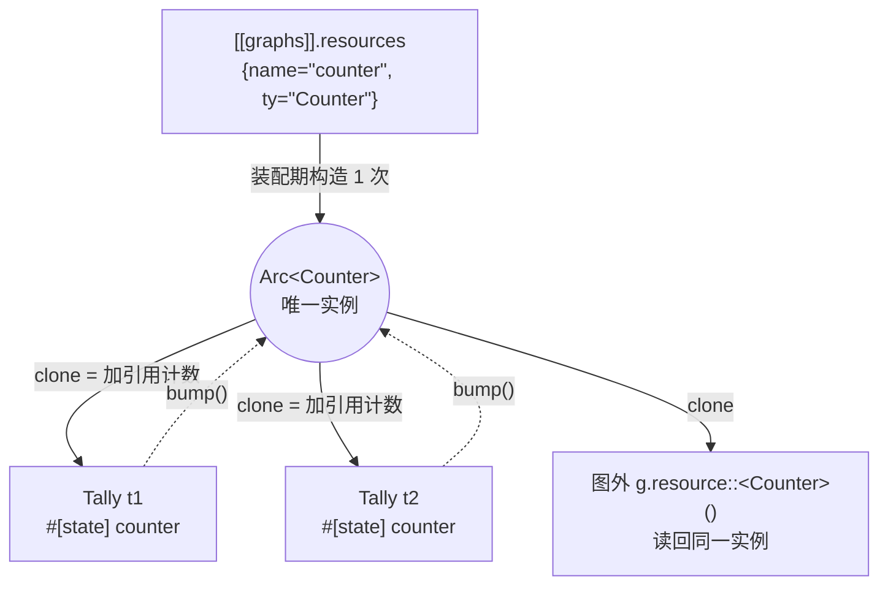

# Ch4.3 Resource 与 Context：共享模型 / 内存池

到 Ch4.2 为止，我们的节点个个**自给自足**：自己的端口、自己从 TOML 参数填出来的字段。可真实算法仓里有一类东西，多个节点**必须共用同一份**——一个几百 MB 的检测模型被检测/跟踪/告警三条支路同时用，一块预分配的内存池被多个节点轮流借。给每条流各造一份，显存三倍、加载时间三倍。本章补上引擎的这块地基：**资源（Resource）——构造一次、被多个节点共享的重对象**，以及把它交到节点手里的运行时载体 **Context（上下文）**。

我们用一个最小、可断言的替身 `Counter`（原子计数器）来演示整套机制：把它换成「模型」或「内存池」，代码骨架一字不变。本章要打通四件事：

1. **类型擦除，这次用 std 的 `Any` 就够了**——一张表里放不同类型的资源，靠 `Arc<dyn Any>`；与 Ch1.3 那个自定义 `AnyEnvelope` 形成一课刻意的对照。
2. **资源注册表**——与 `node_register!` 对偶的 `resource_register!`，编译期把资源类型登记进表。
3. **配置层加 `resources` 声明**——顺带撞上一条 serde 铁律。
4. **节点怎么拿到资源**——`Context` 只穿过 `initialize`、不动 `exec`，节点用 `#[state]` 字段长期持有句柄。

<!-- toc -->

## 1. 本章在全书的位置：从「各造各的」到「构造一次、共享一份」



关键词是 **`Arc`**（原子引用计数）。资源在装配期只 `new` 一次，之后每个要用它的节点、以及图自己，各持有一个 `Arc`——`clone` 只让计数 +1，**底层对象始终只有一份**。N 个 `Tally` 往「同一个」计数器上 `bump()`，图跑完后从图外读回的总数，就是它们共享的铁证：若各造各的，图外那份永远是 0。

这也回收了一条早在 Part 1 埋下的伏笔。Ch1.4 把 channel 钉成 mpsc、Ch4.2 让 `Bcast` 复制消息——那是**数据流**的共享（一份数据变多份、各自消费）。资源是另一回事：**同一个对象被多处只读地共用**，不复制、不分发。两种「共享」用两套机制，别混。

## 2. 类型擦除，这次用 std 的 `Any` 就够了

图里可能同时有 `Counter`、`Model`、`MemPool`，类型各异，却要塞进同一张 `name → 资源` 表。这正是 Ch1.2/1.3 反复练过的**类型擦除**问题。但这次的结论和 Ch1.3 **相反**，对照本身就是一课：

- **Ch1.3 的消息**需要一个 `std::any::Any` **给不了**的行为——类型擦除之后**还能克隆**（`Bcast` 要复制封箱消息）。`Any` 的 vtable 里没有 `clone`，所以我们**自定义**了 `AnyEnvelope` trait，手写一个 `clone_box` 塞进 vtable。
- **本章的资源**没有任何这类需求。节点只想「把它按原类型借出来用」——不需要跨类型的统一操作，不需要 clone 一份资源。**需求决定抽象**：既然不要自定义行为，就别造自定义 trait，直接用标准库的 `Any`。

于是资源句柄就是一行类型别名：

```rust,ignore
/// 类型擦除的共享资源句柄。
/// - `Arc`——多个节点共享同一份（clone 加计数，不拷贝底层）；
/// - `dyn Any`——抹掉具体类型，好让不同类型的资源塞进同一张表；
/// - `Send + Sync`——能安全地在（跑在不同 tokio 任务里的）节点间共享。
pub type AnyResource = Arc<dyn Any + Send + Sync>;
```

还原时的关键动作是 **`Arc::downcast`**（标准库自 1.29 起为 `Arc<dyn Any + Send + Sync>` 提供）：

```rust,ignore
/// 把类型擦除的资源还原成具体的 `Arc<T>`；类型不符则 `None`。
pub fn downcast_arc<T: Any + Send + Sync>(r: AnyResource) -> Option<Arc<T>> {
    r.downcast::<T>().ok()
}
```

> **与 Ch1.3 `downcast_ref` 的又一处对照**：Ch1.3 拆封消息用 `downcast_ref::<T>()`，只借出一个 `&T`——消息拆完即用、不长期持有。资源相反，要**塞进节点字段长期保存**，所以还原出的必须是**带所有权、带共享计数**的 `Arc<T>`，而非借用。`Arc::downcast` 恰好把**整个 `Arc`**（连计数）还原过去：成功得 `Ok(Arc<T>)`，失败把原 `Arc` 原样还回 `Err`；`.ok()` 把我们不关心的「失败分支」丢掉，只留 `Option`。

「怎么造」资源用一个对偶于 `BuildFromPorts` 的 trait 表达，但简单得多——资源没有端口、没有接线，只从配置参数 `args` 造出自己：

```rust,ignore
/// 「可被引擎构造的资源」——由 resource_register! 注册的类型实现它。
pub trait BuildResource: Any + Send + Sync {
    fn build(args: &Args) -> Result<Self>
    where
        Self: Sized; // build 按值返回 Self；我们只取 build 的函数指针，从不需要 dyn BuildResource
}
```

最后把 `T::build` 包成一个**类型擦除**的构造器——这里藏着一个 Rust 新手常踩的**类型推断坑**，值得单独点出：

```rust,ignore
pub fn build_arc<T: BuildResource>(args: &Args) -> Result<AnyResource> {
    let r: Arc<T> = Arc::new(T::build(args)?);
    let any: AnyResource = r; // ← 显式强转点：Arc<T> → Arc<dyn Any + Send + Sync>
    Ok(any)
}
```

> **为什么不能一行写成 `Ok(Arc::new(T::build(args)?))`？** 因为「`Arc<T>` → `Arc<dyn Any>`」是一次 **unsize 强转**，编译器只在**有明确目标类型的赋值点**才做它。埋在 `Ok(..)` 里，编译器会先把 `Arc::new(..)` 的类型推成 `Arc<T>`、再期望它「恰好等于」`AnyResource`——而它俩不是同一个类型，强转不会自动发生，报错。解法就是先 `let any: AnyResource = r;` 给一个明确的目标类型，让强转在这一行落地。这类「强转只在标注点发生」的坑，`Box<dyn Trait>` / `Arc<dyn Trait>` 到处都是，记住「给它一个带类型标注的落脚点」即可。

`ResourceCollection` 则是随 `Context` 发给每个节点的那张只读表：

```rust,ignore
#[derive(Clone, Default)]
pub struct ResourceCollection {
    inner: Arc<HashMap<String, AnyResource>>, // 整张表也 Arc 共享：分发给 N 个节点只 clone 外层 Arc
}
impl ResourceCollection {
    pub fn from_map(m: HashMap<String, AnyResource>) -> Self { Self { inner: Arc::new(m) } }
    pub fn get<T: Any + Send + Sync>(&self, name: &str) -> Option<Arc<T>> {
        downcast_arc::<T>(self.inner.get(name)?.clone()) // 按名取 → clone 那个 Arc → 还原成 Arc<T>
    }
}
```

注意**两层 `Arc`**各司其职：外层 `Arc<HashMap>` 让「整张表」被 N 个 `Context` 廉价共享（clone 只加计数）；表里每个 value 是 `AnyResource`（又一个 `Arc`），让「每份资源」被 N 个节点共享。表在装配期一次建好后**只读**，没有写竞争，故用朴素 `HashMap` 而非并发容器——读多个 `Arc` 无需加锁。

## 3. 资源注册表：与 `node_register!` 对偶

Ch2.4 用 `inventory` 造了编译期节点注册表，`node_register!` 把 `NodeRegistration` 条目在 link 期汇成一张全局表。资源如法炮制，多一张对偶的表：

```rust,ignore
pub type ResCtor = fn(&crate::config::Args) -> Result<AnyResource>;
pub struct ResourceRegistration {
    pub ty: &'static str, // 注册名（TOML 里 ty="Counter" 按它查）
    pub ctor: ResCtor,    // 指向 resource::build_arc::<T>
}
inventory::collect!(ResourceRegistration);
pub fn find_resource(ty: &str) -> Option<&'static ResourceRegistration> {
    resource_registrations().find(|r| r.ty == ty)
}
```

`resource_register!("Counter", Counter)` 这个函数式宏的展开，与 `node_register!` 几乎一模一样，区别只在：资源没有端口，故没有端口名表 / 数组标记；`ctor` 指向 `build_arc::<Type>`：

```rust,ignore
pub fn expand_resource_register(args: &NodeRegisterArgs) -> TokenStream2 {
    let (name, ty) = (&args.name, &args.ty);
    quote! {
        flow_rs::inventory::submit! {
            flow_rs::registry::ResourceRegistration {
                ty: #name,
                ctor: flow_rs::resource::build_arc::<#ty>,
            }
        }
    }
}
```

同样全用**绝对路径** `flow_rs::`（Ch3.4 那条老规矩：`submit!` 生成 item 级 `static`，不便要求使用处 `use`；靠 lib.rs 里 `extern crate self as flow_rs;` 让绝对路径在本 crate 内部也解析得通）。于是内置的 `Counter` 登记就一行：

```rust,ignore
resource_register!("Counter", Counter);
```

## 4. 配置层加 `resources` 声明，撞上一条 serde 铁律

图 TOML 要能声明资源，`GraphConfig` 得多一个字段：

```rust,ignore
pub struct GraphConfig {
    pub name: String,
    // ... nodes / inputs / outputs / connections ...
    #[serde(default)]
    pub resources: Vec<ResourceConfig>, // 缺省空 Vec——旧图不写 resources 照样解析
}

pub struct ResourceConfig {
    pub name: String, // 资源实例名（TOML 里 t1 用 res="counter" 引用它）
    pub ty: String,   // 注册的资源类型名（find_resource 按它查）
    #[serde(default, flatten)]
    pub args: Args,   // name/ty 之外的键 flatten 进来，原样交给 BuildResource::build
}
```

这里撞上一条 Ch3.1 就立过的 serde 铁律：**`#[serde(flatten)]` 与 `#[serde(deny_unknown_fields)]` 不能共存**。因为 `flatten` 的语义就是「把其余未知键兜住」，而 `deny_unknown_fields` 的语义是「见到未知键就报错」——直接打架。`ResourceConfig`（像 `NodeConfig` 一样）要用 flatten 兜住 `capacity` 这类资源私有参数，所以它**没有** `deny_unknown_fields`。

> **一个不这么写就会静默出错的坑**：`GraphConfig` 自己是**有** `deny_unknown_fields` 的（图的顶层键必须拼写正确，写错 `nodesss` 要当场报错）。正因如此，给 `GraphConfig` **补上 `resources` 字段这一步是强制的**——否则一张写了 `resources = [...]` 的合法图，会因为「顶层出现未知键 `resources`」被 `deny_unknown_fields` 拒掉。加字段不是「顺手扩展」，是「不加就报错」。

## 5. 节点怎么拿到资源：`Context` 只穿过 `initialize`，不动 `exec`

现在到了全章设计上最要害的一步：**怎么把资源交到节点手里，又不惊动已经发布的 `exec` 签名。**

Ch3.4 定死的节点生命周期是 `initialize → while !closed { exec } → close → finalize`。资源是**构造期就定好、之后只读持有**的东西——没有理由每轮 `exec` 都重新查表。所以设计是**一次性拿、长期持有**：

- 引擎在**启动**节点时交给它一份 `Context`（节点名 + 资源集合）；
- 节点在 `initialize(&mut self, ctx)` 里**按名把资源借出来**，存进自己的一个字段；
- `exec` 直接读那个字段。**`Context` 只作为 `Actor::start` 和 `initialize` 的参数，绝不塞进 `exec`**——Ch3.4 那条 `exec(&mut self)` 签名一个字不改，几十个节点的 `exec` 无感。

`Context` 本身朴素得很：

```rust,ignore
pub struct Context {
    pub name: String,                  // 节点实例名（日志/诊断）
    pub resources: ResourceCollection, // 本图共享资源（Arc 共享，clone 廉价）
}
impl Context {
    pub fn resource<T: Any + Send + Sync>(&self, name: &str) -> Option<Arc<T>> {
        self.resources.get(name) // 按名+类型借出；查无此名或类型不符 → None
    }
    pub fn anonymous() -> Self { /* 空名、空资源——给不经 Builder 的直接 start（测试/沙箱）兜底 */ }
}
```

> **`Context` 为什么必须是 `Send`？** 它要作为参数被 move 进 `tokio::spawn` 的 future（见 `Actor::start`）。`String` 是 `Send`，`ResourceCollection`（内部 `Arc<HashMap<String, Arc<dyn Any + Send + Sync>>>`）是 `Send + Sync`——于是 `Context` 自动 `Send`，spawn 出的节点 future 保持 `Send`。这条要求，正是 §2 里 `AnyResource` 那个 `+ Send + Sync` 边界的用处所在：不是随手加的，是这里必须要。

`Actor::start` 的签名相应地多了一个 `ctx` 参数。注意它**仍是非 async 方法**（返回 `JoinHandle`），所以 trait 依旧**对象安全**、`Box<dyn Actor>` 照旧成立——加一个 `Sized` 类型的参数不破坏对象安全：

```rust,ignore
fn start(self: Box<Self>, ctx: Context) -> JoinHandle<Result<()>>;
```

节点侧，用一个 `Tally`（计数转发）示范「拿资源」的全套只有三个动作：

```rust,ignore
#[inputs(inp)]
#[outputs(out)]
#[derive(Node, Actor, BuildFromPorts)]
pub struct Tally {
    res: String,                    // ① 自有参数：要借用的资源名（TOML 里 res="counter"）
    #[state]                        // ② #[state]：不从 args 反序列化，Default(None) 初始化，留给运行期填
    counter: Option<Arc<Counter>>,
}
#[methods]
impl Tally {
    async fn initialize(&mut self, ctx: &Context) {
        self.counter = ctx.resource::<Counter>(&self.res); // ③ 按名借出，存进字段
    }
    async fn exec(&mut self) -> Result<()> {
        let msg = self.inp.recv_any().await?;
        if let Some(c) = self.counter.as_ref() { c.bump(); } // 有资源才 bump；没有则降级为纯转发
        if let Some(out) = self.out.as_ref() { out.send_any(msg).await?; }
        Ok(())
    }
}
```

这里的新语法是 **`#[state]`**。它标记「这是个**运行期状态**字段，不是配置参数」。`#[derive(BuildFromPorts)]` 生成构造器 `build` 时，对字段的处理是一串 if-else：是 `Sender`/`Receiver` → 从端口接线来，名叫 `input_closed` → 填 `false`，**否则**当自有参数、去 `args` 里反序列化。`#[state]` 字段插在这串判断的**最前面**：

```rust,ignore
let is_state = f.attrs.iter().any(|a| a.path().is_ident("state"));
let init = if is_state {
    quote! { Default::default() } // #[state] → Default（Option 即 None），留给 initialize 填
} else if type_contains(&f.ty, "Sender") {
    // ... 端口接线 ...
} else {
    quote! { flow_rs::config::arg(args, #key)? } // 自有参数：去 args 反序列化
};
```

> **为什么 `#[state]` 分支必须排在最前？** 若不排在「自有参数 else 分支」之前，`counter: Option<Arc<Counter>>` 会掉进 else，构造器会去 `args` 里找一个叫 `counter` 的键来反序列化——TOML 里根本没有，运行必失败。**分支顺序即语义**。
>
> 还有一层「宏管道」的细节值得记：`#[state]` 是 `#[derive(BuildFromPorts)]` 声明的**惰性辅助属性**（`attributes(state)`），它本身不生成任何代码，只是个「让编译器别报『未知属性』」的标记，由 derive 宏自己读取。而 `#[inputs]`/`#[outputs]` 这两个**属性宏**先于 derive 展开、把结构体原样重新 `quote` 出来（只往里塞端口字段），**保留了原有字段上的 `#[state]`**——所以等 derive 宏跑到时，`#[state]` 还在。这与「serde 字段属性 + 多个 derive 共存」是同一套机制。

## 6. 装配与分发：一次构造、多处共享

两头都备齐了，Graph Builder 把它们接起来。装配期（`assemble`），**「构造一次」**的那「一次」就落在这里：

```rust,ignore
// 按 ty 查资源注册表、(ctor)(args) 造一份类型擦除的 Arc，按 name 收进一张表。
let mut res_map: HashMap<String, AnyResource> = HashMap::new();
for rc in &g.resources {
    let reg = registry::find_resource(&rc.ty)
        .ok_or_else(|| Error::UnknownResourceType(rc.ty.clone()))?; // 查不到 → 装配期报错
    res_map.insert(rc.name.clone(), (reg.ctor)(&rc.args)?);
}
let resources = ResourceCollection::from_map(res_map);
```

`UnknownResourceType` 与节点的 `UnknownNodeType` 对偶——**校验前移到 build()**（Ch3.1 立的规矩）：资源类型名拼错、或忘了 `resource_register!`，在装配期当场 `Err`，而非等运行时 panic。

**「多处共享」**的分发落在 `start()`：

```rust,ignore
pub fn start(&mut self) -> JoinHandle<Result<()>> {
    let resources = self.resources.clone(); // clone 外层 Arc（加计数），底层表不动
    let names = std::mem::take(&mut self.node_names);
    let handles: Vec<_> = self.take_actors().into_iter().zip(names)
        .map(|(actor, name)| actor.start(Context::new(name, resources.clone()))) // 每个节点一个 Context，共享同一张表
        .collect();
    // ... spawn 聚合句柄 ...
}
```

注意 `start()` 是 `clone` 了 `self.resources`、**没有搬走**——所以图跑完后 `self` 仍持有那张表，能读回：

```rust,ignore
pub fn resource<T: Any + Send + Sync>(&self, name: &str) -> Option<Arc<T>> {
    self.resources.get(name) // 与节点在 Context 里拿到的是同一个 Arc<T>
}
```

这让测试能在**图外**读回资源的运行时状态，验证「多个节点确实共用了同一份实例」。

## 7. 端到端：两个 `Tally` 共享一个 `Counter`

红→绿的收口测试（`tests/resource_e2e.rs`），接线是 `in → Bcast → {t1, t2}`，两个 `Tally` 都声明 `res="counter"`，图里只放**一个** `Counter`：

```toml
[[graphs]]
name = "g"
resources = [{name="counter", ty="Counter"}]      # ← 只此一份
nodes = [
    {name="bc", ty="Bcast"},
    {name="t1", ty="Tally", res="counter"},        # ← 两个 Tally 都借 "counter"
    {name="t2", ty="Tally", res="counter"},
]
inputs  = [{name="in", cap=16, ports=["bc:inp"]}]
outputs = [{name="o1", cap=16, ports=["t1:out"]}, {name="o2", cap=16, ports=["t2:out"]}]
connections = [
    {cap=16, ports=["bc:out", "t1:inp"]},          # bc:out 数组端口的第 1、2 个 Sender（Ch4.2）
    {cap=16, ports=["bc:out", "t2:inp"]},
]
```

喂 3 条 → `Bcast` 各复制给两路 → 两个 `Tally` 各转发 3 条、各在**同一个**计数器上 `bump()` 3 次。断言的核心是最后一行——图外读回计数器 == **6**：

```rust,ignore
for _ in 0..3 { got1.push(o1.recv::<i32>().await.unwrap().unpack()); } // 定量收 3
for _ in 0..3 { got2.push(o2.recv::<i32>().await.unwrap().unpack()); }
assert_eq!(got1, vec![1, 2, 3]);
assert_eq!(got2, vec![1, 2, 3]);
let counter = g.resource::<Counter>("counter").unwrap();
assert_eq!(counter.get(), 6, "两个节点共享同一个 Counter → 合计 bump 6 次");
```

**6 是确定性的，不是碰运气**：`Tally` 的 `exec` 是「**先 bump 再转发**」，所以当我们从 `o1`/`o2` 各收满 3 条时，对应的 6 次 bump 必已全部先于各自的 `send` 完成。若两个节点各造各的 `Counter`，图外这份就从没被 bump 过，读到的会是 0——`6` vs `0`，就是「共享」与「不共享」的判决线。

停机仍守 Ch4.2 那条硬教训：**不能 drain-到-close**（`MainGraph` 保留对外输入 `Sender` 直到 `stop()`，drain 会死锁）。所以定量收满后 `drop(tx); g.stop(); handle.await`。

另两个测试守住边界：**沙箱降级**——`Sandbox` 不注入任何资源，`Tally` 拿到 `Context::anonymous()`、`res` 借不到 → `counter` 保持 `None` → 优雅降级为纯转发（`if let Some(c) = ..` 正是为此）；**未知类型**——`resources` 里写个没注册的 `ty` → 装配期 `UnknownResourceType`。

三个新测试连同全工程 **82 个测试**（较 Ch4.2 的 68 增 14：resource 5 + context 2 + config 2 + flow-derive 2 + e2e 3）一起通过，clippy / fmt / mdbook 全绿。

## 8. 诚实的边界：这一章**没做**什么

- **资源生命周期只有「装配期造、图存续期活」**——没有惰性初始化、没有热重载、没有引用计数归零前的显式释放钩子。真实模型仓可能要「首次用到才加载」或「换模型不重启」，那是另一层机制。
- **`BuildResource::build` 是同步的**——真实模型加载往往是重 IO / 要 await 的异步操作。本章的 `build(&Args) -> Result<Self>` 同步签名够教学，但接真实异步加载时要改成 async 构造（留待 Part 5 对接真实 API 时谈）。
- **资源是只读共享的**——`Counter` 靠 `AtomicU64` 的内部可变性绕开了「`Arc` 给不出 `&mut`」，但那是原子类型的特例。要共享**可变**资源（如一个需要加锁写入的缓存），得自己在资源类型里包 `Mutex`/`RwLock`——引擎不替你管这层同步。
- **没有跨图共享**——资源属于**单张图**（`GraphConfig.resources`）。多图 / 子图之间怎么共享同一份模型，正是下一章要碰的话题。

## 小结

- **资源 = 构造一次、被多个节点 `Arc` 共享的重对象**（模型 / 内存池）。与「数据流的复制分发」（Bcast）是两套正交的「共享」。
- **类型擦除这次用 std 的 `Any` 就够了**：资源不需要 Ch1.3 那种自定义 vtable 行为（clone_box），`Arc<dyn Any + Send + Sync>` + `Arc::downcast::<T>()` 即可。**需求决定抽象**——这份与 Ch1.3 的正反对照本身就是一课。
- **`Arc::downcast` 还原出带所有权的 `Arc<T>`**（对照 Ch1.3 `downcast_ref` 只借 `&T`）：资源要长期持有，故要所有权+计数，不是借用。
- **`Context` 只穿过 `Actor::start`/`initialize`，绝不动 `exec`**：已发布的 `exec(&mut self)` 签名零改动；节点用 `#[state]` 字段「一次性拿、长期持有」。`Context` 是 `Send`，spawn 的 future 保持 `Send`。
- **`#[state]` 是惰性辅助属性**：分支排在「自有参数」之前（顺序即语义），初始化为 `Default`，留给 `initialize` 填；`#[inputs]`/`#[outputs]` 重新 `quote` 结构体时保留了它。
- **一次构造在 `assemble`、多处分发在 `start`**：`find_resource` 查不到 → `UnknownResourceType`（校验前移）；`start` 只 clone 资源集合不搬走，故图外能 `g.resource()` 读回同一实例——e2e 靠它断言「读回 6」证明共享。
- **serde 铁律复现**：`flatten` ⊥ `deny_unknown_fields`；正因 `GraphConfig` 有 `deny_unknown_fields`，补 `resources` 字段是强制的。

下一章 Ch4.4 造**子图 / 多图 / 动态子图**：把一张图当一个「可复用的部件」嵌进另一张图，让「一个模型喂 N 条同构支路」这种真实拓扑用一份声明表达——顺带回答本章末尾留的那个问题：资源怎么跨图共享。
