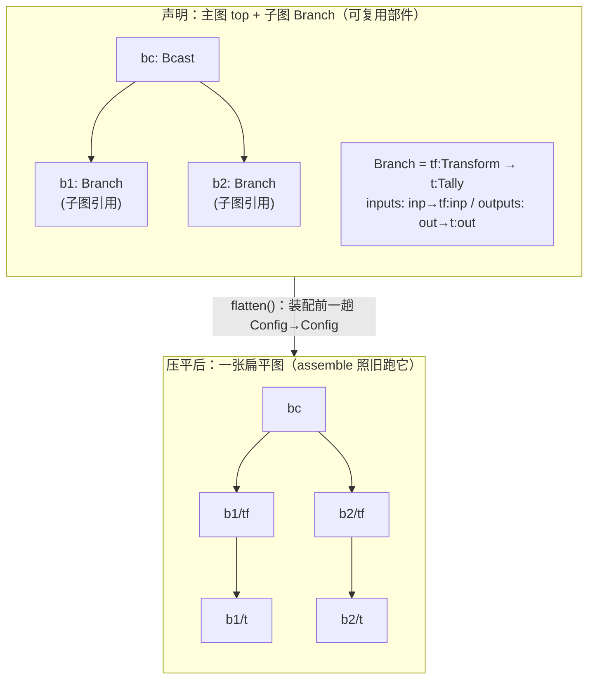

# Ch4.4 子图 subgraph、多图 graphs、动态子图

到 Ch4.3 为止，一张图里的节点能共享资源了，但**图本身**还是铁板一块：想要「一个检测模型喂 N 条结构相同的下游支路」（检测 → 跟踪 → 属性 → 告警，重复 N 份），你只能把那 N 份支路的节点**一个个抄进同一张图**——抄五遍，改一处得改五处。真实算法仓里这种同构重复到处都是。本章让**一张图能当「可复用的部件」嵌进另一张图**：把那条支路写成**一张子图**，在主图里像放一个节点那样实例化 N 份。

本章还要顺带还上 Ch4.3 末尾留的那张欠条——**资源怎么跨图共享**。答案会来得比想象中干脆。

本章打通三件事：

1. **子图引用无需新语法**——一个节点的 `ty` 恰好等于某张图的名字，它就是一次子图引用。
2. **一次「架构决定设计」的抉择**——原版用「嵌套运行时」，我们这版重写却选了**内联展开（flattening）**，而且这个相反的选择恰恰是被两版**底层接线架构的不同**逼出来的。
3. **压平算法**——前缀命名、边界端口下钻、环检测；以及它对无子图的旧配置为什么是**恒等变换**，从而前几章测试一字不改地继续绿。

> **完整性状态**：本章的静态压平是中间实现，不是原版子图运行时的完整替代。
> 当前 `flatten` 只保留主图资源，并穿透子图边界引用；子图资源、边界容量、实例参数、
> 独立生命周期与动态实例仍需逐项实现和验证。这些内容属于本书必做范围。

先做 [递归展开实作](ch04a-subgraph-workshop.md)，手算实例名字、边界替换和祖先栈，再对照本章算法。

<!-- toc -->

## 1. 本章在全书的位置：把一张图折叠进另一张图



关键动作是一趟**装配前的预处理**：`flatten(&Config) -> Config`。它把「主图 + 被它引用的子图」**内联展开**成**一张**扁平图——子图 `Branch` 的两次实例 `b1`/`b2` 被摊开成带前缀的叶子节点 `b1/tf`、`b1/t`、`b2/tf`、`b2/t`。之后 Ch3.2 的 `assemble` **一行不改**地跑在这张扁平图上。

接线只在 `Builder::build` 里多插一句：

```rust,ignore
let config = Config::from_toml(&text)?;
let flat = crate::subgraph::flatten(&config)?; // ← Ch4.4 新插的一趟
MainGraph::assemble(&flat)                      //   assemble 拿到的永远是「一张图」
```

`Config` 早在 Ch3.1 就是 `{ main: String, graphs: Vec<GraphConfig> }`——**多图容器一直都在**，只是此前只有 `main` 那张被装配。本章让其余的图作为「可复用部件」被主图引用、并在装配前折叠进来。

## 2. 子图引用：无需新语法

怎么在配置里表达「这里嵌一张子图」？答案是**不加任何新语法**——沿用原版的约定：

> **一个节点的 `ty` 恰好等于某张图的 `name`，它就是一次子图引用。**

```toml
main = "top"

# 可复用子图：Branch = Transform（原样透传）→ Tally（先 bump 再转发）
[[graphs]]
name = "Branch"
nodes = [
    {name="tf", ty="Transform"},
    {name="t",  ty="Tally", res="counter"},
]
inputs  = [{name="inp", cap=16, ports=["tf:inp"]}]   # 子图的边界输入端口
outputs = [{name="out", cap=16, ports=["t:out"]}]    # 子图的边界输出端口
connections = [{cap=16, ports=["tf:out", "t:inp"]}]

# 主图：一个 Bcast 扇出给两份 Branch 子图实例
[[graphs]]
name = "top"
resources = [{name="counter", ty="Counter"}]
nodes = [
    {name="bc", ty="Bcast"},
    {name="b1", ty="Branch"},   # ← ty="Branch" 是图名 ⇒ 子图引用
    {name="b2", ty="Branch"},   # ← 再来一份，独立实例
]
inputs  = [{name="in", cap=16, ports=["bc:inp"]}]
outputs = [
    {name="o1", cap=16, ports=["b1:out"]},   # 引用子图实例 b1 的边界输出端口 out
    {name="o2", cap=16, ports=["b2:out"]},
]
connections = [
    {cap=16, ports=["bc:out", "b1:inp"]},    # bc 的输出接到子图实例 b1 的边界输入端口 inp
    {cap=16, ports=["bc:out", "b2:inp"]},
]
```

两个要点：

- **子图的「对外端口」用它自己的 `inputs`/`outputs` 声明**。`Branch` 的 `inputs=[{name="inp", ports=["tf:inp"]}]` 意思是「我这张图对外暴露一个叫 `inp` 的输入端口，它接到内部 `tf` 节点的 `inp` 端口」。主图于是能用 `b1:inp` 引用「子图实例 `b1` 的边界端口 `inp`」。
- **同一张子图可实例化多份**（`b1`/`b2`），互不干扰——它们前缀不同，是两份独立的节点集合。

这套自动识别与原版的 `graph_names.contains(&node.ty)` 一模一样。它之所以不需要新语法，靠的是 Ch3.1 的一个设计细节：`NodeConfig` 用 `#[serde(flatten)]` 兜住自有参数、**没有** `deny_unknown_fields`，所以 `{name="b1", ty="Branch"}` 这种「只有 name/ty、没有额外参数」的节点声明照样合法解析——是不是子图引用，交给装配前的 `flatten` 用「ty 在不在图名表里」来判定。

## 3. 架构决定设计：为什么是「内联展开」而非原版的「嵌套运行时」

这是本章最值得停下来看的一处。原版和我们这版**对同一个需求给出了相反的解法**，而相反不是品味问题，是被各自的底层架构逼出来的。

**原版：子图是「嵌套运行时」。** 原版把 `Graph` 也实现成一个 `Node`——一张子图就是一个能被父调度器当普通节点调度的单元，内部自己递归地跑一套运行时。父子图的边界端口靠**构造后注入通道**（`set_port`）对接：父图创建 channel，把同一个 channel 的两端分别「塞」进父节点和子图内部节点。这在原版里最省事，因为原版的**端口信息本就是运行期算出来的、通道本就是构造后注入的**——多套一层「图也是节点」正好顺水推舟。

**我们这版：装配模型根本不同。** 回顾前几章钉下的东西：

- 节点在**构造时**就把 channel 作为构造器参数拿走（Ch3.2/4.2 的 `NodeCtor = fn(&Args, Vec<Vec<Receiver>>, Vec<Vec<Sender>>) -> Result<Box<dyn Actor>>`）——**没有**「构造后 `set_port` 再注入通道」这一步。
- 端口名表是**编译期**的 `&'static [&'static str]`（Ch3.2 的注册表）。
- `MainGraph` **不是** `Node`/`Actor`（Ch3.3），它是装配产物，不参与调度。

在这套架构里照搬「图也是节点」的嵌套运行时，要凭空补回一套「运行期端口信息 + 构造后通道注入」，跟我们「编译期端口表 + 构造期接线」的地基处处顶牛——是伤筋动骨的大改。

反过来看**内联展开**：既然 `assemble` 只认「一张扁平图」，那就在它之前把多图**压平成一张**。于是：

- `assemble`、`NodeCtor`、注册表、调度——**一个字都不用改**；
- 新增的全部代码集中在一个新模块 `subgraph.rs` + `Builder::build` 里的一行 + 一个错误变体。

> **这正是与 Ch4.3「需求决定抽象」呼应的一课：「架构决定设计」。** 同一个问题（子图边界怎么对接），原版因其「运行期端口 + set_port 注入」的架构，选嵌套运行时最省事；我们因其「编译期端口 + 构造期接线」的架构，选内联展开最省事。**没有绝对更优的设计，只有与你既有架构最契合的设计。** 照抄原版结构反而会把简单问题做复杂——这也是「重写一遍」相比「读一遍源码」能真正学到的东西。

（代价不是没有：内联展开做不了**动态子图**——运行期按流的条数生成 N 份实例。那确实需要嵌套运行时 + 逐消息寻址，见 §7「诚实的边界」。本章教学子集只做**静态**子图，这已经覆盖了「一个模型喂 N 条同构支路」这个最常见的真实场景。）

## 4. 压平算法：前缀命名、边界下钻、环检测

`flatten` 把 `Config{ main, graphs }` 变成 `Config{ main, graphs: vec![一张扁平图] }`。核心是一个递归的 `expand`，带三件要点。

### 4.1 前缀命名，分隔符为什么必须是 `/`

子图实例 `b1` 内部的节点 `tf`，摊平后叫什么？加实例名前缀：`b1/tf`。嵌套更深就层层叠加：`outer` 里的 `m` 引用子图、`m` 里又有 `leaf` → `m/leaf`。

分隔符选 `/` 而**不是** `:`，这是个不选对就会静默出错的细节：

> Ch3.1 的 `PortRef::parse` 是用 **`split_once(':')`** 把 `"节点:端口"` 拆成两半的。如果前缀分隔符也用 `:`，那么摊平出来的节点名 `b1:tf` 再接上端口就成了 `b1:tf:inp`——`split_once(':')` 会从**第一个** `:` 切开，得到节点名 `b1`、端口名 `tf:inp`，全乱。选 `/` 就没这问题：`"b1/tf:inp".split_once(':')` 干净地给出节点 `b1/tf`、端口 `inp`。**节点名里不能出现 `:`，因为 `:` 是端口引用的保留分隔符。**

```rust,ignore
// expand 里，对每个节点：ty 是图名 → 递归展开（前缀追加 `名字/`）；否则是叶子，带前缀收下。
for nd in &g.nodes {
    if let Some(sub) = graphs.get(nd.ty.as_str()) {
        let child_prefix = format!("{}{}/", prefix, nd.name); // "b1" → "b1/"
        expand(sub, &child_prefix, /* ... */)?;
    } else {
        flat_nodes.push(NodeConfig {
            name: format!("{}{}", prefix, nd.name),           // "tf" → "b1/tf"
            ty: nd.ty.clone(),
            args: nd.args.clone(),                            // 自有参数随实例保留（两份 Tally 都带 res）
        });
    }
}
```

### 4.2 边界端口「下钻」到叶子

主图连接里写的是 `bc:out → b1:inp`，可 `b1` 摊平后已经不存在了——只剩 `b1/tf`、`b1/t`。所以每个端口引用都要**解析到真实叶子**：`b1:inp` 里 `b1` 是子图、`inp` 是它的边界输入端口 → 查 `Branch.inputs` 找到 `inp` 映射的内部端口 `tf:inp` → 带上前缀下钻，得 `b1/tf:inp`。主图对外的 `o1` 引用 `b1:out` 同理下钻到 `b1/t:out`。

```rust,ignore
// resolve_ref：把一个端口引用解析成若干叶子引用
match graphs.get(nd.ty.as_str()) {
    Some(sub) => {  // 是子图引用：把边界端口映射到内部端口，逐个下钻
        let decl = sub.inputs.iter().chain(sub.outputs.iter())
            .find(|p| p.name == pref.port)
            .ok_or_else(|| Error::UnknownPort { node: .., port: .. })?; // 没这个边界端口 → 报错
        let child_prefix = format!("{}{}/", prefix, pref.node);
        for inner in &decl.ports {
            resolve_ref(sub, &child_prefix, graphs, inner, out)?;        // 递归下钻
        }
    }
    None => out.push(format!("{}{}:{}", prefix, pref.node, pref.port)),  // 叶子：产出带前缀的引用
}
```

> **一处刻意的分工**：`flatten` 只校验**引用指向的节点存不存在**（`UnknownNode`）、**子图边界端口对不对**（`UnknownPort`）。至于叶子节点上「这个端口名在节点类型上到底有没有」，`flatten` **不查**——留给 `assemble`（它才握有编译期端口名表）。这样一来，无子图时 `flatten` 对连接是纯透传，`assemble` 原有的端口校验行为一字不变。

### 4.3 环检测：兄弟复用不是环

如果图 `a` 引用 `b`、`b` 又引用 `a`，内联展开会无限递归。用一条**祖先链**拦下：`expand` 维护一个「当前正在展开的图名栈」，进入一张图前先看它在不在栈上。

```rust,ignore
if ancestors.iter().any(|name| name == &g.name) {
    return Err(Error::SubgraphCycle(g.name.clone())); // 沿引用链兜回自己 → 报错，而非爆栈
}
ancestors.push(g.name.clone());
// ... 展开这张图的节点与连接 ...
ancestors.pop();  // 展开完弹出
```

> **为什么 `b1`/`b2` 都引用 `Branch` 不算环？** 因为 `b1` 展开**完**会把 `Branch` 弹出栈，轮到 `b2` 时栈上并无 `Branch`。环的定义是「**引用路径上**重复出现同一张图」，不是「同一张图被用了多次」。兄弟复用正是我们要的功能（一个部件实例化多份），它和环的区别就在这一进一出的栈上。

### 4.4 对无子图配置是恒等变换

这是「前几章测试一字不改继续绿」的保证：一份没有任何子图引用的单图配置，走一遍 `flatten` 会怎样？前缀始终是空串，每个节点都是叶子（名字不变），每个引用都是叶子引用（原样透传），资源取主图的（就是它自己）。**产出的扁平图与原主图逐字段等价**——`flatten` 在这条路径上是恒等函数。所以把它插进 `Builder::build`，Part 3 到 Ch4.3 的所有单图 e2e 全都行为不变。

## 5. 还欠条：资源怎么跨图共享

Ch4.3 末尾留的问题——「多图 / 子图之间怎么共享同一份模型」——在内联展开下答案干脆得几乎不像个答案：

> **压平之后就是一张图，主图的资源自然被所有节点共享。**

`flatten` 产出的扁平图，`resources` 取的是**主图**的资源表。摊平进来的、原本分属不同子图实例的节点（`b1/t`、`b2/t`），现在全都住在这张扁平图里，跟着 Ch4.3 那套「装配期构造一次、`start` 时随 `Context` 分发」的机制，自然共享主图声明的那**同一个** `Counter`。

```rust,ignore
// flatten 收尾：扁平图的资源 = 主图的资源
let flat = GraphConfig {
    name: main.name.clone(),
    nodes: flat_nodes,       // bc, b1/tf, b1/t, b2/tf, b2/t
    // ...
    resources: main.resources.clone(),  // ← counter，被上面所有节点共享
};
```

于是「一个模型喂 N 条同构支路」这个开篇场景真正闭环了：模型作为**主图**的一份资源声明一次，N 条支路（各是一份子图实例）里的节点全都借同一份——**显存一份，加载一次**。Ch4.3 埋的「数据流的复制分发（Bcast）」与「资源的只读共享（Arc）」两条正交的线，在这里合流成一张真实拓扑。

（子图**自己**也能写 `resources` 吗？本教学子集里 `flatten` 只采主图的资源表——子图作为「纯拓扑部件」，资源统一由宿主主图提供。这对「共享一份模型」的目标已经够用，也最不容易让人对「到底谁拥有这份资源」产生歧义。）

## 6. 端到端：可复用子图共享顶层资源

红→绿的收口测试（`tests/subgraph_e2e.rs`）用的正是 §2 那份配置：`Branch = Transform → Tally` 被实例化两份 `b1`/`b2`，主图一个 `Bcast` 扇出给两份，全图只声明**一个** `Counter`。

```rust,ignore
let mut g = Builder::default().template(SUBGRAPH_SHARED).build().unwrap();
let handle = g.start();
let tx = g.input("in").unwrap();
let mut o1 = g.take_output("o1").unwrap();
let mut o2 = g.take_output("o2").unwrap();

for v in [1i32, 2, 3] { tx.send(Envelope::new(v)).await.unwrap(); }

// 定量收每路 3 条（守 Ch4.2 硬教训：图保留对外输入 Sender 直到 stop，不能 drain-到-close）
let mut got1 = Vec::new();
for _ in 0..3 { got1.push(o1.recv::<i32>().await.unwrap().unpack()); }
let mut got2 = Vec::new();
for _ in 0..3 { got2.push(o2.recv::<i32>().await.unwrap().unpack()); }
assert_eq!(got1, vec![1, 2, 3]);
assert_eq!(got2, vec![1, 2, 3]);

// 关键：两份**不同子图实例**里的 Tally 借的是主图**同一个** Counter，各 bump 3 次 = 6
let counter = g.resource::<Counter>("counter").unwrap();
assert_eq!(counter.get(), 6, "两份子图实例共享主图同一个 Counter");

drop(tx); g.stop(); handle.await.unwrap().unwrap();
```

`6` 依旧是**确定性**的（`Tally` 先 bump 再转发，故收满 6 条输出时 6 次 bump 必已完成）；若子图实例各造各的计数器，图外这份就是 `0`——`6` vs `0` 就是「跨图（实为压平后同图）共享」成立与否的判决线。这个断言同时证明了两件事：**子图被正确展开、接线**（否则收不到 `[1,2,3]`），以及**资源确实跨实例共享**（否则读不到 6）。

另一个测试守住环：两张图互相引用（`a` 里有个 `ty="b"` 的节点、`b` 里有个 `ty="a"` 的节点）→ `build()` 报 `SubgraphCycle("a")`，在装配前当场拦下，而非爆栈。

`subgraph.rs` 里还有一组单元测试直接钉住压平本身：无子图时恒等、节点带前缀展开、内部边与边界端口重写正确、多层嵌套前缀叠加、环检测、未知边界端口报 `UnknownPort`。连同全工程 **91 个测试**（较 Ch4.3 的 82 增 9：subgraph 单元 7 + e2e 2）一起通过，clippy / fmt / mdbook 全绿。

## 7. 诚实的边界：这一章**没做**什么

- **动态子图（dynamic subgraph）没做**——运行期按输入流的条数**动态生成** N 份子图实例（原版用于「每来一路视频流就起一套处理管线」）。这真的需要原版那套嵌套运行时 + 逐消息寻址：实例个数在**运行期**才知道，没法在装配前的静态 `flatten` 里摊开。本章只做**静态**子图（配置里写死几份就是几份）。这是当前中间实现的缺口，不能当作最终交付范围。
- **子图不能声明自己的资源**——本教学子集里资源统一由宿主主图提供（§5）。子图作纯拓扑部件。
- **没有可见性 / 命名空间隔离**——摊平后全是 `b1/tf` 这样的扁平名，靠前缀避免碰撞，但没有真正的「子图内部私有」概念。够用，但不是完整的模块系统。
- **子图边界端口是「一对一/一对多映射到内部端口」的纯转发**——没有在边界上做类型转换、缓冲策略调整之类的事。边界只是「改个名字、下钻到叶子」。

## 小结

- **子图 = 把一张图当可复用部件嵌进另一张图**。引用无需新语法：**节点的 `ty` 等于某张图的 `name`**，就是一次子图引用（沿用原版 `graph_names.contains`）。子图用自己的 `inputs`/`outputs` 声明边界端口。
- **架构决定设计**：原版选「嵌套运行时」（因其运行期端口 + `set_port` 注入的架构），我们选「**内联展开**」（因其编译期端口 + 构造期接线的架构）。相反的选择都是被各自地基逼出的最省事解——没有绝对更优的设计，只有最契合既有架构的设计。这与 Ch4.3「需求决定抽象」是同一课的两面。
- **内联展开 = 装配前一趟 `flatten(&Config) -> Config`**，把「主图 + 被引用子图」压平成一张扁平图，`assemble` / `NodeCtor` / 注册表 / 调度**一律不改**。新增代码集中在 `subgraph.rs` + `Builder::build` 一行 + 一个错误变体。
- **三个算法要点**：前缀命名（分隔符必须用 `/`，因 `:` 是 `PortRef` 保留分隔符）；边界端口**下钻**到真实叶子（`flatten` 只校验节点/边界端口存在，叶子端口校验留给 `assemble`）；**环检测**用祖先链（兄弟复用一进一出栈，不算环）。
- **对无子图配置是恒等变换**——这是前几章单图测试一字不改继续绿的保证。
- **资源跨图共享的答案**：压平后就是一张图，扁平图的资源取主图的，摊进来的所有节点自然共享——「一个模型喂 N 条同构支路」由此闭环（模型声明一次、显存一份）。
- **诚实的边界**：动态子图（运行期按流数量生成实例）需要另一套架构，仍须在后续实现与讲解中补齐。

**Part 4 到此收尾**：从内部连接、数组端口与广播汇聚（Ch4.1/4.2），到资源与上下文（Ch4.3），再到子图复用（Ch4.4），引擎已经具备了真实算法仓拓扑的全部骨架。下一部分 **Part 5 · 兼容 · 优化 · 收尾**：Ch5.1 把我们的 API 对齐真实 MegFlow、划清 pplcore/mpp 这些闭源边界；Ch5.2 逐条对比原版，盘点这一版**为什么 bug 更少、哪些地方更优**；Ch5.3 全景回顾整本书，并为想继续深入（图优化器、debugger、C/Python FFI）的读者指路。
