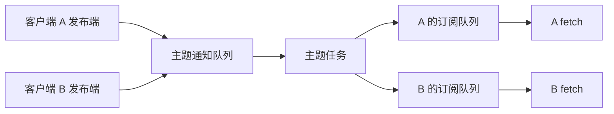

# Ch4.8 Broker：给动态子图广播通知

动态子图创建后，多个动态端口需要得知实例以及它的输入输出端点。普通共享队列把一条
消息交给一个消费者，无法满足这个需求。Broker 为同一主题的每个订阅者保存独立队列，
再把通知克隆到每条队列。本节先完成通知机制；它本身还不会创建子图。

前置知识是信封、Arc、Mutex、async、Future 和 Tokio 任务。工程继承 Ch4.7c 的
flow-rs、flow-message、flow-derive，不新增第三方依赖。新增 broker.rs 和测试文件，
并在 lib.rs 模块声明中加入 `pub mod broker;`。

### 先建立本章可以独立编译的工程

先在仓库根目录创建 `broker-study/src`、`broker-study/tests` 和
`broker-study/examples`。这个目录是自己的练习工程，不是最终框架的替代品。
消息层沿用 Ch1.3 已完成的实现，其他图、节点、配置、宏模块都不参与本章独立验证。

文件树如下；broker.rs 和测试的全文在后面的第 5、7 节给出。

```text
broker-study/
  Cargo.toml
  message/              # Ch1.3 的完整消息层工程
  src/lib.rs
  src/error.rs
  src/broker.rs
  tests/broker.rs
  examples/notify.rs
```

从仓库根目录执行一次：

```sh
mkdir -p broker-study/src broker-study/tests broker-study/examples
python3 scripts/message_checkpoint.py --out broker-study/message
```

导出命令仅复制已经完成的消息层，并拒绝覆盖已有目录。消息源码仍应在 Ch1.3 学习；
它没有复制最终引擎来代替你实现 Broker。

`broker-study/Cargo.toml` 全文：

```toml
{{#include ../../labs/broker/Cargo.toml}}
```

package 名字是 flow-rs，因此 Rust 测试代码用 flow_rs 引用它。edition=2021 控制语言
版本。空的 workspace 声明让这个工程不继承外部工作区；exclude 排除自己已经声明
独立 workspace 的 message，否则 Cargo 会报告“multiple workspace roots”。

path 依赖从当前 Cargo.toml 所在目录寻找消息库。Tokio 的 rt 用于单线程运行时和 spawn，
sync 提供 Notify，macros 提供 main/test/pin，time 用于超时。futures-util 仅用于测试
中的 poll!，所以放在 dev-dependencies。没有使用它创建第二个运行时。

`broker-study/src/lib.rs` 全文：

```rust
{{#include ../../labs/broker/src/lib.rs}}
```

pub mod 声明需要对应源文件。envelope 内的 pub use 只是重导出消息类型，让与主工程
相同的 Broker 源码仍可使用 crate::envelope；没有重写或复制另一种信封行为。

`broker-study/src/error.rs` 全文：

```rust
{{#include ../../labs/broker/src/error.rs}}
```

独立编译入口只保留 Broker 实际使用的 ChannelClosed。Display 负责错误文本，
std::error::Error 表明它是标准错误，Result 是类型别名。这个文件用于隔离依赖；
接回主工程时仍使用主工程完整错误枚举。初写这两个文件而还没有 broker.rs 时，
编译器报告“file not found for module broker”是预期的中间状态。

## 1. 从原版确定契约

对照父目录 `flow-rs/src/broker.rs`，先写出这些可观察规则：

| 操作 | 必须得到的行为 |
| --- | --- |
| subscribe(topic) | 返回一个能发布也能接收的客户端；每次订阅都有独立接收队列 |
| publish(value) | 同主题所有订阅者收到克隆，包括发布者自己；其他主题不收到 |
| run() | 取走当前全部订阅形成运行快照，之后新订阅属于下一批 |
| fetch() | 异步等待一条通知，类型不匹配时 panic |
| try_fetch() | 立即返回一条已有通知或 None，不等待 |
| close() | 关闭共享主题发布通道和自己的订阅队列；其他客户端观察到发布通道关闭 |
| 最后一个发布端释放 | 已排队通知处理完后主题任务结束 |

关闭与丢弃客户端不同：drop 一个客户端只减少发布端计数并关闭它自己的接收队列；
显式 close 会让同主题的其他发布者也不能再发送。关闭后，已进入订阅队列的消息仍可
读完。publish 忽略关闭后的发送失败，与原版无返回值的接口保持一致。

## 2. 先画清楚所有权



一条主题通知队列用于汇集发布，每个订阅队列用于保存一份副本。两个客户端订阅同一
主题时共享发布队列，但不共享接收队列。一个客户端自身的两个并发 fetch 则竞争它的
同一订阅队列；这时两次 fetch 各取一条，并不会让一条通知返回两次。

HashMap 按主题字符串查找状态；Vec 保留该主题所有订阅发送端；VecDeque 保存单条
队列的消息。Arc 让不同端点共享 Mailbox 的所有权。Mutex 保护短暂的入队、出队和
关闭状态修改，锁内不执行 await。

## 3. 为什么需要一个私有 Mailbox

原版使用 async-channel 的无界队列。当前基于已有 Tokio 依赖实现 Broker 私有的
Mailbox，保留广播所需的共享关闭与排空语义。它不是完整 MegFlow ChannelStorage，
不承载 flush/epoch、统计和图内背压协议。

State 保存 items、closed 和 senders。Tx::clone 增加发布端计数；Tx::drop 减少计数，
最后一个发送端消失时关闭。Rx::drop 关闭所属队列。关闭只禁止新入队，不提前清空
缓存。send 在发现关闭后释放传入消息；recv 先查缓存，再检查关闭。

不要用 Arc::strong_count 代替 senders：Arc 还被接收端持有，强引用数不是发送端数。
也不要只给每个 Tx 保存一个独立 bool，否则关闭不会传播给其他克隆。

## 4. 等待消息时怎样避免丢失唤醒

Tokio 的 Notify 负责唤醒，不负责存储消息。队列状态才是是否有数据的依据。recv 每轮：

1. 创建 Notified future，用 pin! 固定位置，再 enable 注册等待。
2. 在 Mutex 下检查消息和关闭状态；有消息就返回，已关闭且无消息就报错。
3. 释放锁后 await 通知，被唤醒后重新检查状态。

需要分清 Notify 的通知方式：notify_one 在没有等待者时可以保存一个许可，因此
单个接收者不必然因为“通知发生在 await 前”就漏掉通知。但它不会累计任意多个许可；
两个接收者尚未注册时连续入队两条消息，两次 notify_one 可能只留下一个许可，
其中一个接收者可能没有被唤醒。先 enable 再检查队列，让各等待者先进入通知队列。
close 使用 notify_waiters，它不会为未来等待者保存许可；先注册再检查 closed 也
防止在检查关闭状态与实际等待之间错过关闭通知。醒来仍须循环检查真实队列状态。

pin! 把局部 future 固定在当前位置，允许 enable 通过 `Pin<&mut Notified>` 注册它。
这不是把消息固定在内存中；固定的是等待状态。代码中的花括号作用域保证 MutexGuard
在 ready.await 前析构。把锁带过 await 会让其他发送者拿不到锁，也可能使 future
不满足 tokio::spawn 要求的 Send。

取消 fetch 会丢弃其 Notified future，消息尚未出队就仍留在队列。接收函数取得消息
后没有新的 await，再进行信封解包，因此不会在“已经出队但尚未交给解包代码”之间
主动挂起。测试通过手动 poll 到 Pending 再取消来检查这条边界。

## 5. 完整实现文件

新建 `code/flow-rs/src/broker.rs`。建议先写 State/Mailbox，再写 Tx/Rx，随后写 Broker
订阅与 run，最后写客户端 API。完整文件如下，可直接对照逐段输入：

```rust
{{#include ../../../code/flow-rs/src/broker.rs}}
```

std::mem::take 用空 HashMap 替换 self.subs，把旧表的所有权交给异步任务。因此 run
不需要永久借用 `&mut Broker`；同一个 Broker 还可以为下一次 run 收集新订阅。

对 subscribe 的三步再单独读一遍：entry(topic.clone()) 查找共享主题；or_insert_with
只在主题不存在时创建通知队列；随后无条件调用 queue 创建这个客户端自己的订阅队列。
前一条队列每主题一份，后一条每客户端一份，位置写错就会改变广播语义。

run 中先 drop(publisher)，释放 Broker 自己持有的那一份发布端。如果保留到接收循环
结束，最后一个客户端已经释放时 senders 仍不为 0，接收循环就等不到自然关闭。
每个主题任务同时启动后再依次 await，所以先等待某个主题不会阻止另一个主题处理消息。

主题任务持有订阅发送端。每次收到通知，为每个订阅者 clone 一份信封。载荷的 Clone
决定实际复制深度；如果载荷包含 Arc，复制的是共享句柄，不是它背后的全部图数据。
最后等待所有主题任务。任务 panic 会使聚合任务失败；当前行为不保证 panic 后其他
主题都已收尾，不能把普通关闭测试写成完整异常收尾证明。

fetch 的泛型 T 只在取值时指定，并不把主题绑定为某种类型。错误类型会在 downcast
处 panic。这说明协议两端仍必须约定通知类型；编译器不能从 topic 字符串推导出 T。

本章用到的依赖：Tokio 的 rt 创建任务，sync 提供 Notify，macros 提供测试与 pin!；
测试另用 time 设置超时，用 futures-util::poll! 将 future 确定地推进到 Pending。
Envelope/SealedEnvelope 来自已完成的本地消息层，不需要新的序列化 crate。

## 6. 写一个看得见结果的通知程序，再接回主工程

`broker-study/examples/notify.rs` 全文如下：

```rust
{{#include ../../labs/broker/examples/notify.rs}}
```

Created 表示“实例 7 已经创建”的教学通知，不是真正创建子图。derive(Clone) 让
Broker 能复制通知；u64 被复制，`Arc<String>` 复制共享句柄。两个订阅者得到不同通知
值，但 ptr_eq 为真说明 resource 指向同一个对象。这个实验让你区分“复制通知”和
“复制资源”，不应仅用字符串相等来证明资源共享。

main 的 current_thread 明确使用单线程运行时。publish 在 run 前执行，验证通知先
进入队列；run 后各 fetch 取到自己的副本。最后显式 close，await 聚合任务，程序才
完成收尾。没有 close 或 drop 所有客户端就等待 task，主题仍有发布者，会一直等待。

先运行：

```sh
cargo run --manifest-path broker-study/Cargo.toml --example notify
```

预期输出：`两个订阅者收到实例 7；资源共享；主题已关闭。`
首次运行会生成 Cargo.lock，后续保留它并使用 --locked 固定解析版本。仓库验证脚本
使用现有锁文件版本并在离线环境解析独立工程；未预先下载依赖时先在联网环境正常构建。

验证完独立工程后，接回主工程。

修改 `code/flow-rs/src/lib.rs` 后完整内容如下。其他模块继承前一阶段，新增的 broker
公开模块使调用者可以通过 flow_rs::broker 使用 Broker。

```rust
{{#include ../../../code/flow-rs/src/lib.rs}}
```

## 7. 完整测试文件与命令

新建 `code/flow-rs/tests/broker.rs`：

```rust
{{#include ../../../code/flow-rs/tests/broker.rs}}
```

运行 `cargo test --manifest-path code/Cargo.toml -p flow-rs --test broker --locked`。
四项测试覆盖发布前排队、主题隔离、广播副本、共享关闭、快照分离、最后客户端释放、
取消等待、多个等待者唤醒和缓存排空。预期所有测试通过，不需要外部服务。

测试没有用固定 sleep 猜测任务是否已等待。poll! 返回 Pending 证明对应接收确实
进入等待；外层 timeout 防止错误实现让测试永久挂起。收到值还要断言数量，避免
“什么也没收到”却因为回调没执行而误判通过。

## 8. 排错与独立练习

先预测再修改：去掉广播循环，改为只发给第一个订阅者，哪个断言会失败？把 run 中
mem::take 改成仍使用旧订阅表，会破坏哪个快照测试？取消一个 fetch 后再发布两条，
两次新 fetch 应各得到多少条？完成后恢复实现并运行验证。

独立作品：定义包含实例编号和 Arc 资源句柄的通知，订阅两个客户端，验证二者都
得到通知且 Arc::ptr_eq 为真；随后关闭一个客户端，验证同主题发布端观察到关闭。
这个实验连接到下一步 DynPorts 所需的“共享端点句柄通知”。

独立练习工程的测试命令为：

```sh
cargo test --manifest-path broker-study/Cargo.toml --locked
```

维护本书时执行 `python3 scripts/check_broker_course.py`。脚本在新临时目录仅复制
上文实验入口、前置消息层、本章 Broker 原文和测试原文，离线编译并运行通知示例；
没有复制节点、配置和图模块。验证已接入 CI，检查的是独立模块实验，尚不是从 Ch0
一路累积到本章的完整工程快照。其余章节的逐步链路仍须逐章建立，不能据此宣布整本
书已经完成教学验收。
