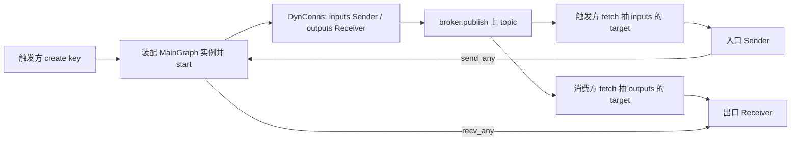

# Ch4.9 DynPorts：运行期动态子图实例（机制层）

[Ch4.4](ch04-subgraph.md) 的静态压平把「配置里写死几份子图」摊平成一张扁平图，但留了一张明确的欠条：**动态子图**——运行期按输入流的条数**现装** N 份同构管线（原版用于「每来一路视频流就起一套检测→跟踪→告警」），实例个数装配前不知道，没法在静态 `flatten` 里摊开。[Ch4.8](ch08-broker.md) 章末又埋了一个钩子：broker 能把「共享端点句柄通知」广播给同主题的每个订阅者。本章把这两件事接上：**用 broker 广播运行期新建实例的边界端点**，完成原版那条 **create → publish → fetch → route** 环路。

原版没有「动态子图节点类型」这么个东西，它是一条运行期协议（`node/port.rs` + `node/demux.rs` + `broker.rs`）：子图作为**惰性构造器**注册；触发节点在运行期按某个 key `create` 一份实例、为它开好 channel、`start` 跑起来，再把实例的边界端点经 broker **广播**；订阅方 `fetch` 取回端点、完成接线。核心业务逻辑就是这条环路，本章原样重建它。

**架构映射的一句话**（也是本章能站住的地基）：

> **一个动态子图实例 = 用注入的 `ResourceCollection` 把某个具名 `GraphConfig` 装配成的一张 `MainGraph`**；它的边界 `inputs`(Sender) / `outputs`(Receiver) 就是广播的 `DynConns` 载荷，`MainGraph::start()` 把它跑起来。

原版的 `Graph` 自身 impl `Node`、靠 `set_port` + `start(Some(resource))` 当运行期子图实例；我们这版只有 `MainGraph` 一个运行期图，于是用**「现装一张 `MainGraph` + 注入资源」**顶替——完全复用 [Ch4.4](ch04-subgraph.md) 已有的装配机制，不需要嵌套运行时。

**本章只造机制**，照抄 broker / subgraph / demux 章的既定风格：先显式构造、真实测试，把 TOML / 派生宏 / config 自动接线的糖标注「后续补齐」，留到 §7 指向的 4.9a/b/c 三节。工程继承 Ch4.8 的 flow-rs，新增 `dyn_ports.rs` + 测试 + example，并在 `graph.rs` 做一次**恒等重构**提取可复用的装配入口。

<!-- toc -->

## 1. 从原版确定契约

对照父目录 `flow-rs/src/node/port.rs` 与 `broker.rs`，先写出这条环路必须满足的可观察规则：

| 操作 | 必须得到的行为 |
| --- | --- |
| `create(key, resources)` | 用**注入的** `resources` 把目标子图装成一张 `MainGraph`、`start()` 跑起来，把边界端点（`DynConns`）`publish` 上 broker；**只返回 `JoinHandle`** |
| 触发方 `fetch(key)` | 从 broker 取回**自己 publish 的**那份 `DynConns`、抽出入口 `Sender`（证「自发自收」，端点不抄近路直接返回） |
| 消费方 `fetch(key)` | 从 broker 取回**独立的一份** `DynConns`、抽出出口 `Receiver` |
| `fetch` 的 **R3** 契约 | 只抽出 `target` 那**一个**端点、`DynConns` 其余当场 **drop**——否则残留端点会把实例钉住、拆除时永久挂起 |
| `is_cached(key)` 把门 | 同一 key 只 `create` **一次**（每 key 一个实例） |
| `evict(key)` + drop 本地端点 | 撤掉实例**唯一**的外部 `Sender` → 实例收到 `ChannelClosed` 优雅停机、`create` 拿到的 `JoinHandle` 解析 |
| `to_addr=Some(k)` 的**空**信封 | 生命周期**拆除**信号（`is_none()` 为真）；驱动见状拆掉 key `k` 的实例 |

两条纪律要先记住。其一，**端点一律经 broker `fetch` 取回，`create` 不抄近路直接返回本地 `Sender`**——否则 Broker 章白讲，也证不出「创建者能 `fetch` 回自己 `publish` 的那份 `DynConns`」。其二，**所有订阅者（触发方 client + 消费方 client）必须在 `broker.run()` 之前 subscribe**；`create`/`publish` 发生在其后（驱动期），靠 broker `run()` 用 `mem::take` 快照订阅、每 topic fan-out 到**所有订阅者含发布者自己**这条已验收的语义（Ch4.8）。

## 2. 架构映射：端点的一生

一次 `create` 到拆除，端点的流转如下：



`create` 采集实例边界端点时，入口 `Sender` 是**克隆**一份、出口 `Receiver` 是**移出**一份，塞进 `DynConns`；`start()` 之后本地那张 `MainGraph` 变量随即 drop 也**安全**——`start()` 已把 actors 取走跑成独立任务，边界通道靠 `DynConns` 里的端点续命。broker 给**每个**订阅者 fan-out 一份**独立克隆**，于是触发方与消费方各 `fetch` 各自那一份、各抽各要的那一端。

**R3 就是这张图能收尾的关键**：消费方 `fetch` 出口时，必须把同一份 `DynConns` 里多余的**入口 `Sender` 克隆**当场 drop；否则那个残留的 `Sender` 会一直是实例的一个外部发送端，拆除时 `evict` 撤掉缓存那份也不够、`JoinHandle` 永远等不到 `ChannelClosed`。测试 4（§6）专门把这条钉死。

> **单消费者纪律**：`Receiver` 的多个 clone 共享同一 `Arc<Mutex<..>>`、彼此**竞争**消息（[Ch1.4](../part1/ch04-async-channel.md) 的忠实语义，非 bug）。故每个 key 的出口只应有一个持有者在收。broker 已保证「每订阅者一份独立 `DynConns`」，§6 的 `two_readers_...` 测试则诚实演示「同一份出口的两个 clone 会分食消息」。

## 3. 重构接缝：把 `assemble` 拆出可复用的装配入口

要让运行期能「现装一张 `MainGraph`」，先把 [Ch4.4](ch04-subgraph.md) 的 `MainGraph::assemble` 做一次**恒等重构**：把「按 `main` 取子图 → 造资源 → 三趟接线」中**后两步**拆成两个可复用的关联函数。`assemble` 收敛成三步委派：

```rust,ignore
{{#include ../../../code/flow-rs/src/graph.rs:assemble}}
```

其中造资源那步单独成 `build_resources`——主图路径按 `g.resources` 现造，动态实例路径**跳过**它、改用运行期注入的集合：

```rust,ignore
{{#include ../../../code/flow-rs/src/graph.rs:build_resources}}
```

真正的接线核心 `assemble_graph(g: &GraphConfig, resources: ResourceCollection) -> Result<MainGraph>` 吃**单个** `GraphConfig` + 一份**注入的** `ResourceCollection`。它的三趟接线主体（对外输入 / 对外输出 / 图内连接 + 造节点）就是 Ch3.3、Ch4.1–4.3 已逐行讲过的装配逻辑**原样搬进一个 `pub(crate)` 入口、未改行为**，全文在 `code/flow-rs/src/graph.rs`（这里不重复贴）。它的两个调用点你在本章都看得到：主图路径在上面的 `assemble` 里、动态实例路径在下面 `dyn_ports.rs` 的 `create` 里。

**签名取 `ResourceCollection` 而非 `Option<ResourceCollection>`**：分支无教学收益；两条路径同构——主图传 `build_resources(g)` 的结果、实例传注入集合。`Builder::build` 与 `MainGraph` 公开 API 一个字不动，既有单图 / 子图 / demux / 资源测试是这次重构的护栏，全部一字不改继续绿（§6 末给出全量回归数）。关键前提：`type_infer::infer(g)` 作用于**单个** `GraphConfig`，故子图能独立推断边界与内部连接的类型——这正是它能被拿来现装成实例的地基。

## 4. 完整实现：`DynConns` / `DynPortsConfig` / `DynPorts`

新建 `code/flow-rs/src/dyn_ports.rs`。三个类型分别是：广播载荷 `DynConns`（边界端点句柄）、惰性构造器 + 广播信道配置 `DynPortsConfig`（教学子集直接持目标 `GraphConfig` 当构造器），以及句柄 + 实例缓存 `DynPorts<V>`。`create` 在 `impl<V>` 上（与 `V` 无关），`fetch` 系列按端点归属分入口/出口——本章路由只用无类型的 `impl DynPorts<Sender>`（抽入口）/ `impl DynPorts<Receiver>`（抽出口）。四个特化（含类型化两支）方法体相同，已用一个本地 `dyn_fetch_methods!` 宏统一生成（对标原版 `port_impl!`）；宏机制与类型化特化的讲解见 [Ch4.9a](ch09a-derive-dyn-ports.md)。完整文件如下，可直接对照逐段输入：

```rust,ignore
{{#include ../../../code/flow-rs/src/dyn_ports.rs}}
```

`create` 里 `MainGraph::assemble_graph(&cfg.graph_config, resources)?` 就是 §3 那个复用入口。采集端点时先 `*_names()` 拿到的 `&str` 名 `.map(str::to_owned)` own 下来断开对实例的借用，再遍历 `input()`（克隆 `Sender`）/ `take_output()`（移出 `Receiver`）——这几个边界访问器 [Ch3.3](../part3/ch02-graph-builder.md) 已是 `MainGraph` 的公开 API，无需新增。`publish` 广播的 `DynConns` 里，入口是克隆、出口是移出的那一份，故 `instance` 变量在函数尾 drop 安全。

`fetch_with_cache` 是多 key 的主力：命中缓存直接返回克隆；否则把陆续 `fetch` 到的每份 `DynConns` 都抽出其 `target` 端点存进 `cache[name]`（**顺带缓冲乱序到达的别的 key**），直到目标 key 就位。**每份 `DynConns` 只留 `target` 那一个端点、其余（`outputs`、别的 `inputs`）在块尾 drop——这就是 R3 的落地。** 注意那个把 `self.cfg` 借用限制在小块里、`fetch` 完即释放的写法，是为了随后能和 `&mut self.cache` 分裂借用。

把模块接进 `code/flow-rs/src/lib.rs`（`pub mod dyn_ports;` 放在 `pub mod context;` 之后，按字母序）。完整内容如下：

```rust,ignore
{{#include ../../../code/flow-rs/src/lib.rs}}
```

## 5. 用 example 显式跑通环路

镜像 `examples/demux_steps.rs` 的「先写一个裸 `route` 驱动」写法：这里的 `route` 扮演后续 4.9c 里注册版 `DynDemux` 节点在 `exec` 要做的事——空信封即拆除、有载荷即（按需 `create` 一次 → `fetch` 入口 → `send_any` 送进实例）。全程只用无类型 `send_any` / `recv_any`。

新建 `code/flow-rs/examples/dynports_steps.rs`：

```rust,ignore
{{#include ../../../code/flow-rs/examples/dynports_steps.rs}}
```

在仓库根目录运行：

```sh
cargo run --manifest-path code/Cargo.toml -p flow-rs --example dynports_steps --locked
```

预期输出（key 7 复用同一实例收两帧、key 42 是另一张独立图、两个 key 各自拆除）：

```text
· 新建 key 7 的实例，边界端点已广播上 broker
key 7 收到：frame-1
key 7 收到：frame-2
· 新建 key 42 的实例，边界端点已广播上 broker
key 42 收到：frame-42
· 拆除 key 7：撤入口端点，实例停机
· 拆除 key 42：撤入口端点，实例停机
create→publish→fetch→route→teardown 环路跑通。
```

`main` 用 `current_thread` 单线程运行时即可：`publish` 是同步入队、`fetch().await` 让出，fan-out 任务被唤醒后投递，单线程下 await 点也能正确交接（Ch4.8 已验）。结束时 `close()` 两个 client → topic 任务结束 → `run()` 句柄可解析。

## 6. 完整测试与命令

新建 `code/flow-rs/tests/dyn_ports.rs`。五个测试都用 `tokio::time::timeout` 包裹——**teardown 一旦挂起（例如 R3 没落实、残端钉住实例），超时即失败而非卡死 CI**，仿 `tests/broker.rs` / `tests/demux_e2e.rs`：

```rust,ignore
{{#include ../../../code/flow-rs/tests/dyn_ports.rs}}
```

运行 `cargo test --manifest-path code/Cargo.toml -p flow-rs --test dyn_ports --locked`。五个测试各钉一条契约：

1. `create_publishes_and_endpoint_round_trips_through_broker`——单 key 端到端：证 build + start + publish + fetch + route，且**创建者 fetch 到自己 publish 的 `DynConns`**。
2. `routes_by_to_addr_and_each_key_is_its_own_instance`——key 7 与 42 各驱动一次，各载荷只从各自实例冒出，**无串台**（每 key 是独立的一张图）。
3. `instance_created_once_per_key`——注入共享计数器、子图节点 `initialize` 时 bump 一次；对同一 key 连发 3 条、以 `!is_cached` 把门；断言计数**恰为 1**（create-once 守卫）。
4. `empty_payload_tears_down_and_recreate_is_fresh`——路由到 key 后发 `to_addr=Some(k)` 的空信封（`is_none()`），撤端点 + await 任务（**证 R3：无残留端点钉住**），随后 `create(k)` 建全新实例、计数 +1。
5. `two_readers_of_one_output_receiver_compete`——诚实演示单消费者纪律：一份出口 `Receiver` 的两个 clone **分食**同一队列（合计恰好收全、无重复，不是各得一份）。

其中测试 3、4 需要一个 `initialize` 时 bump 注入计数器的 `InitBump` 节点，就地用 `node_register!` 定义（内置 `Tally` 是**每消息** bump，证不了 create-once，故另造一个每实例只 bump 一次的）。守住重构注入接缝的单元测试 `assemble_graph_injects_resources` 放在 `graph.rs` 里（`pub(crate)` 入口在外部 test crate 够不着），随 `cargo test -p flow-rs --lib graph::tests` 跑。

跑一遍全量回归确认 `assemble` 的恒等重构没破坏既有测试：

```sh
cargo test --manifest-path code/Cargo.toml -p flow-rs --locked
```

本章把 flow-rs 测试总数从 139 抬到 **145**（新增 5 个 `dyn_ports` 集成测试 + 1 个 `graph.rs` 注入单元测试），无 warning、无 failure。

## 7. 落差与后续：这一章**没做**什么

本章刻意只造机制。以下都是诚实的落差，各有明确的后续着落点：

- **本章路由只用无类型 `DynPorts<Sender>` / `DynPorts<Receiver>`**——`send_any` / `recv_any` 搬无类型 `SealedEnvelope`，本就只需无类型端口。类型化的 4 个特化（`DynPorts<SenderT<T>>` 等）、把它们与无类型两支收进一个 `dyn_fetch_methods!` 宏的去重、以及派生宏 `dyn` 端口关键字 + `Node::set_port_dynamic` 节点侧注入 + 生成派发，已在 [Ch4.9a](ch09a-derive-dyn-ports.md) 补齐。
- **资源只注入、不链接**——原版 `ext_resource.chain(in_resource)` 把「外层注入资源」和「子图自带资源」链起来，还按 instance-id 分尺度资源；本章动态子图暂不声明自带 `resources`、多个实例共享同一注入集合。这是 `assemble_graph` 取 `ResourceCollection` 而非 `Option` 的直接后果，够用但非最终形态。
- **本章实例路径没有调用 `set_port_dynamic`**——运行期实例靠**装配期接线 + 端点保留在 `MainGraph.inputs/outputs`** 就位，根本不经过「构造后再 set_port」。`set_port_dynamic` 只有派生 / config 路径（节点字段持 `DynPortsConfig`）才需要——**不是漏了，是本章这条路径用不到**。它已在 [Ch4.9a](ch09a-derive-dyn-ports.md) 由派生宏生成（`Node` trait 默认 no-op + 含 dyn 字段的节点覆盖），真正的建图期调用点已在 [Ch4.9b](ch09b-config-auto-wiring.md) 落地。
- **`DynPortsConfig` 丢了原版的 `local_key` / `typeinfo` / `args`**——`typeinfo` 不需要（`assemble_graph` 内 `infer` 自行推断边界类型）；`args` 合并（`merge_table` 覆盖实例参数）本章 `create` 接受 `cap` 字段但**忽略**，整条 DynPorts 弧继续 defer（见 [Ch4.9a](ch09a-derive-dyn-ports.md) 章末落差）。
- **config 层还不认识 `dyn` 连接**——建图期自动发 `DynPortsConfig`、`translate_conn` 检测 `is_dyn`、`flatten` 跳过 dyn 子图，这套自动接线已在 [Ch4.9b](ch09b-config-auto-wiring.md) 实现（对齐原版 `graph/mod.rs`）。
- **`DynDemux` 还不是注册 builtin**——本章用测试夹具 / example 的裸 `route` 驱动环路（对标 `demux_steps.rs`）。把它做成能由真实 TOML 端到端驱动的注册节点 + Sandbox 动态端口支持（broker + 临时图），已在 [Ch4.9c](ch09c-dyn-demux-in-graph.md) 实现——也正是 [Ch4.7c](ch07c-demux-node.md) §5 明确 defer 的那块。

## 小结

- **动态子图 = 一条运行期环路，不是一种节点类型**。原版 `create → publish → fetch → route`：触发节点按 key 现装实例、`start`、把边界端点经 broker 广播；订阅方 `fetch` 取回端点接线。本章原样重建这条环路。
- **架构映射**：一个动态子图实例 = 用注入的 `ResourceCollection` 把某个具名 `GraphConfig` 装配成的一张 `MainGraph`；边界 `inputs`/`outputs` 就是 `DynConns` 载荷。这复用 [Ch4.4](ch04-subgraph.md) 的静态装配，不需要原版的嵌套运行时——又一次「架构决定设计」。
- **恒等重构**：把 `assemble` 拆出 `pub(crate) assemble_graph(g, resources)` + `build_resources(g)`，主图路径与动态实例路径**同构复用**同一套接线；既有 139 测试一字不改继续绿。
- **两条硬纪律**：端点一律经 broker `fetch` 取回（不抄近路，才证得出自发自收）；订阅必须在 `run()` 之前。
- **R3 是收尾的关键**：`fetch` 只留 `target` 一个端点、其余当场 drop，否则残端钉住实例、拆除挂起——测试 4 用超时把它钉死。
- **落差诚实标注**：`set_port_dynamic` 生成、config 自动接线、注册版 `DynDemux` 已分别在 [Ch4.9a](ch09a-derive-dyn-ports.md) / [Ch4.9b](ch09b-config-auto-wiring.md) / [Ch4.9c](ch09c-dyn-demux-in-graph.md) 实现；无类型-only、资源只注入不链接、`args` 忽略是整条弧的既定 defer。
