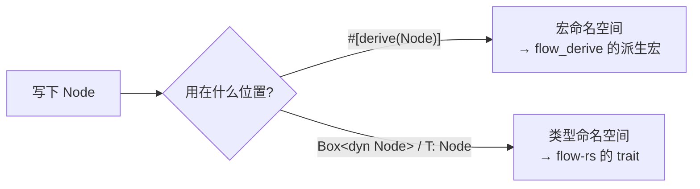
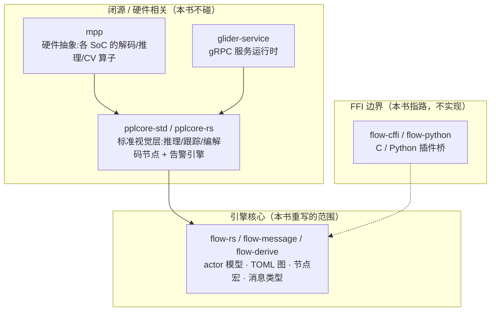

# Ch5.1 对齐真实 API：`prelude` 门面与 pplcore 闭源边界

前四个部分，我们把引擎从「一条 TOML」一路推到「跑出结果」，又补齐了连接、数组端口、广播汇聚、资源上下文、子图复用——真实算法仓拓扑的全部骨架都在了。这一部分收尾：**Ch5.1 把我们的 API 对齐真实 MegFlow，并划清那条「到此为止」的闭源边界**；Ch5.2 逐条对比原版、盘点这一版为什么 bug 更少；Ch5.3 全景回顾并为想继续深入的读者指路。

先从一个每天都硌手、却一直被我们拖着的小问题开始:写一个节点，要铺一屏 `use`。

## 1. 痛点：一屏 `use` 才能写一个节点

回看 Ch4.3 里那个 `Tally` 节点，它文件顶上的导入长这样（把 Part 1~4 散落各处的名字凑齐）:

```rust,ignore
use flow_rs::channel::{Receiver, Sender};       // 端口类型
use flow_rs::context::Context;                   // initialize 的入参
use flow_rs::error::Result;                       // exec 的返回
use flow_rs::node::{Actor, Node};                 // trait 约束
use flow_rs::registry::BuildFromPorts;            // 派生要用
use flow_rs::resource::BuildResource;             // 写资源要用
use flow_message::Envelope;                       // 收发的信封
use flow_derive::{inputs, outputs, methods, node_register, Node, Actor, BuildFromPorts};
```

八九行，且**每个节点文件都要重抄一遍**。真实算法仓（`megflow-alarm-std` 这类）里，`src/filters/`、`src/nodes/`、`src/models/` 下几十个文件，每个开头都是这坨。加一个名字（比如 Ch4.3 新增的 `#[state]` 要配 `Context`），就得挨个文件补 `use`。这不是 Rust 的错，是我们**没给下游一个统一入口**。

标准答案是 **prelude 门面**:把高频名字收拢到一个模块，下游一行导入。

```rust,ignore
use flow_rs::prelude::*;
```

`std::prelude`、`tokio::prelude`（旧版）、`rayon::prelude` 都是这个套路——「把这个库最常用的名字一次性带进作用域」。**原版 MegFlow 也有一个 `flow_rs::prelude`**，下游一律 `use flow_rs::prelude::*;` 起手（见 §4）。我们这一章把它补上，顺便对齐原版的入口习惯。

## 2. 我们的 `prelude`

`flow-rs/src/prelude.rs` 全文就是一组 `pub use`——门面模块**不定义任何东西**，只是把别处的名字重新导出到一处:

```rust,ignore
//! flow-rs · prelude —— 一行导入常用名字的门面。

// ── 消息 ──
pub use flow_message::Envelope;

// ── 过程宏（flow-derive）──
pub use flow_derive::{
    inputs, methods, node_register, outputs, resource_register, Actor, BuildFromPorts, Node,
    TypeName,
};

// ── 引擎类型与函数 ──
pub use crate::channel::{channel, Receiver, Sender};
pub use crate::config::Args;          // 资源作者写 `BuildResource::build(args: &Args)` 要命名它
pub use crate::context::Context;
pub use crate::error::{Error, Result};
pub use crate::graph::{Builder, MainGraph};
pub use crate::node::{Actor, Node};        // trait 形态
pub use crate::registry::BuildFromPorts;   // trait 形态
pub use crate::resource::BuildResource;
pub use crate::sandbox::Sandbox;
```

分三组，每组对应一类作者的需求:

| 组 | 名字 | 谁需要 |
|---|---|---|
| 消息 | `Envelope` | 每个节点收发都要 |
| 过程宏 | `inputs`/`outputs`/`methods` + `Node`/`Actor`/`BuildFromPorts`/`TypeName` + `node_register!`/`resource_register!` | 写节点、写资源要用的**全部**宏 |
| 引擎类型 | `channel`/`Sender`/`Receiver`、`Context`、`Error`/`Result`、`Builder`/`MainGraph`、`Args`、`BuildResource`、`Sandbox` + `Node`/`Actor`/`BuildFromPorts`（trait 形态） | 节点、资源、app、测试作者按需 |

有了它，§1 那八九行 `use` 塌缩成一行。真实下游每个节点文件省下的就是这坨样板。

这里有两个值得停下来讲清楚的点:**同名的 trait 与派生宏为什么能并存**（§3），以及**我们的 `Result` 为什么不用像原版那样再配一句 `use anyhow::Result;`**（§4 里对比）。

## 3. 同名的「trait + 派生宏」为什么能并存——serde 套路

注意 `Node` / `Actor` / `BuildFromPorts` 在门面里各被导出了**两次**:

```rust,ignore
pub use flow_derive::{ /* ... */ Actor, BuildFromPorts, Node, /* ... */ };  // 派生宏
// ...
pub use crate::node::{Actor, Node};        // trait
pub use crate::registry::BuildFromPorts;   // trait
```

同一个名字 `Node`，既是 `flow_derive` 里的**派生宏**，又是 `flow-rs` 里的**trait**。`use flow_rs::prelude::*;` 把它们俩**同时**带进作用域——不冲突吗?

不冲突。**Rust 的名字分属几个互不干扰的命名空间**，其中「宏」和「类型」是两个不同的命名空间。编译器按**用法**去对应的命名空间里查:



- `#[derive(Node)]` 里的 `Node` 出现在 derive 位置 → 查**宏**命名空间 → 命中派生宏；
- `Box<dyn Node>`、`fn f<T: Node>()`、`impl Node for X` 里的 `Node` 出现在类型位置 → 查**类型**命名空间 → 命中 trait。

各取所需，天然错开。这正是 `serde` 让 `Serialize` **既是**派生宏（`#[derive(Serialize)]`）**又是** trait（`T: Serialize`）的同款套路——我们在 Ch2.3、Ch2.4 里已经反复用到，这里只是把它明确写进 prelude 的设计说明。`TypeName` 是个例外:它的派生宏生成的是**固有方法**（`impl Foo { fn type_name() }`，见 Ch2.2），不依赖任何 trait，所以门面里只有它的**宏**形态、没有对应 trait。

## 4. 对齐原版:原版 prelude 更大，而「大出来的部分」正是闭源边界

原版 `flow_rs::prelude`（内联在其 `lib.rs` 里）长这样:

```rust,ignore
// 原版 flow-rs/src/lib.rs —— 只读参考，勿改
pub mod prelude {
    #[doc(hidden)]
    pub use super::broker::*;      // ← 动态子图运行时（Broker）
    pub use super::channel::*;
    pub use super::envelope::*;
    pub use super::graph::*;
    pub use super::node::*;
    pub use super::registry::*;
    pub use super::resource::*;
    pub use super::rt;             // ← 运行时模块：spawn_pinned / 自定义 RwLock / !Send 支持
    pub use super::Builder;
    pub type Args = toml::value::Table;
    pub type Arg = toml::value::Value;
    pub use super::config::interlayer::{MsgType, MsgTypeId, PortInfo, PortType}; // ← 运行期端口类型
    pub use super::config::optimizer;   // ← 图优化器
    pub use flow_derive::*;             // ← 全部 14 个宏 glob 导出
}
```

把它和我们的逐行对照，能看清**两件事**。

**第一，共同的骨架完全对得上。** channel / envelope / graph / node / registry / resource / Builder / flow_derive 的宏——这些我们都有，名字和角色一一对应。`Args` 连定义都一样（`toml::value::Table`，我们在 Ch3.1 就注明了「原版也用它」）。这说明我们纵切下来的这条主干，和原版是同一套心智模型:**下游作者从原版切到我们这版，`use flow_rs::prelude::*;` 起手这件事一模一样。**

**第二，原版「多出来的那几行」，恰好是我们从第一天就划出去的非目标。** 逐个看:

| 原版 prelude 多出的项 | 它是什么 | 我们为什么没有 |
|---|---|---|
| `broker::*` | **动态子图**运行时——运行期按流条数生成 N 套管线 | Ch4.4 划出:我们只做静态 `flatten`，动态子图需要嵌套运行时 |
| `rt` | 包在 tokio 外的运行时层:`spawn_pinned`（把 `!Send` 任务钉到本地线程）、带超时重试的自定义 `RwLock`、死锁计数 | 这些能力是为 **FFI / Python / C 插件**里的 `!Send` 与阻塞调用服务的（Ch5.2 细讲）——我们没这些需求，直接用 tokio |
| `config::optimizer` | **图优化器**:自动插 buffer / mem_pool / skip 节点等 pass | 非目标，Ch5.3 指路 |
| `config::interlayer::{MsgType, MsgTypeId, PortInfo, PortType}` | **运行期**算出来的端口类型信息 | 我们的端口名表是**编译期** `&'static`（Ch3.2），不需要运行期端口类型层 |

换句话说，**原版 prelude 的「大」，量出的正是那条闭源/高级特性边界**。我们的 prelude 小一圈，不是偷懒，是它忠实地反映了「这本书的引擎 = 核心子集」这个从 Ch0.2 就定下的范围。门面的大小，就是范围的尺子。

还有两处**有意的小差异**:

- **`Result` 从我们门面里直接出。** 注意原版 `lib.rs` 开头的下游示例是 `use anyhow::Result;` **配上** `use flow_rs::prelude::*;`——原版的错误类型借道 `anyhow`，prelude 不提供 `Result`，下游得自己补一句。而我们**自己拥有**错误类型（Ch1.4 的 `thiserror` 枚举 `Error`，及其 `Result<T> = Result<T, Error>`），所以 `Error`/`Result` 直接进门面——下游**少一个外部依赖、少一行 `use`**。这是「拥有自己的错误类型」在人机工程上的一个具体红利，Ch5.2 会把它和「为什么 bug 更少」串起来。
- **宏我们逐个点名，原版 `flow_derive::*` 一把 glob。** 效果一样（都带进那些宏），但逐个点名让「门面到底暴露了哪些宏」在源码里一目了然，也不会把 flow-derive 里的内部辅助项顺带 glob 进来。纯风格选择，无功能差异。

## 5. 划清闭源边界:pplcore / mpp / FFI 到此为止

借这一章把「到此为止」这条线一次性画清楚——这也是 Ch0.2「诚实边界」的收束。真实算法仓（跑在原版 MegFlow 上的业务仓）的依赖栈是这样的:



我们重写的是**最底下那层引擎核心**。往上，`pplcore-*` 把「一帧图怎么过检测/跟踪/告警」标准化，`mpp` 把「这些算子在 t4 / atlas / bm1684 各跑一套」抽象掉——这两层**闭源、且强绑定硬件与私有模型格式**，是这本书从 Ch0.2 起就明确不碰的。旁边，`flow-cffi` / `flow-python` 把 C / Python 写的节点桥接进引擎——这是原版 `rt` 里那套 `spawn_pinned` + 自定义 `RwLock` 真正的用武之地（把同步的、`!Send` 的插件调用塞进 async 世界），我们在 Ch5.3 给出指路，但不实现。

**一句话记住这条边界**:我们的 prelude 能让你写出**结构上**和真实算法仓节点一模一样的 Rust（同样的 `#[inputs]`/`#[methods]`/`node_register!`），但真正的推理、跟踪、告警节点住在 `pplcore` 里、跑在 `mpp` 上——那是另一座山。本书教你造的是**承载它们的引擎**，不是那些节点本身。

## 6. 用一个「只靠 prelude」的测试钉死完备性

门面好不好，标准只有一个:**下游是不是真的只需这一行就够了**。我们写一个集成测试 `tests/prelude.rs`，通篇**只有** `use flow_rs::prelude::*;`（外加标准库的 `Arc`，它不属于本引擎），却要完成①定义并注册一个**资源**、②定义并注册一个**节点**、③用 `Builder` 搭图、跑图、图外读回资源——真实下游三类作者（资源/节点/app）的活儿全覆盖:

```rust,ignore
use flow_rs::prelude::*;
use std::sync::Arc;   // 唯一的额外导入:节点持有 Arc<资源> 句柄，Arc 属标准库、非本引擎

// —— 只靠 prelude 定义一份资源 ——
#[derive(Default)]
struct Bag { seen: std::sync::atomic::AtomicU64 }
impl Bag {
    fn bump(&self) { self.seen.fetch_add(1, std::sync::atomic::Ordering::Relaxed); }
    fn get(&self) -> u64 { self.seen.load(std::sync::atomic::Ordering::Relaxed) }
}
impl BuildResource for Bag {                    // ← trait 来自 prelude
    fn build(_args: &Args) -> Result<Self> { Ok(Bag::default()) }   // ← Args / Result 来自 prelude
}
resource_register!("PreludeBag", Bag);          // ← 宏来自 prelude

// —— 只靠 prelude 定义一个节点 ——
#[inputs(inp)]                                   // ← 属性宏来自 prelude
#[outputs(out)]
#[derive(Node, Actor, BuildFromPorts)]           // ← 派生宏来自 prelude
struct PreludeTally {
    res: String,
    #[state] bag: Option<Arc<Bag>>,
}
#[methods]
impl PreludeTally {
    async fn initialize(&mut self, ctx: &Context) {   // ← Context 来自 prelude
        self.bag = ctx.resource::<Bag>(&self.res);
    }
    async fn exec(&mut self) -> Result<()> {
        let mut env = self.inp.recv::<i32>().await?;
        let v = env.unpack();
        if let Some(b) = self.bag.as_ref() { b.bump(); }
        if let Some(out) = self.out.as_ref() {
            out.send(Envelope::new(v + 1)).await?;    // ← Envelope 来自 prelude
        }
        Ok(())
    }
}
node_register!("PreludeTally", PreludeTally);
```

测试主体喂 `[10, 20, 30]`、定量收 3 条、断言得到 `[11, 21, 31]`（节点端到端 +1）、再从图外读回 `bag.get() == 3`（资源被门面定义的节点正常共享），最后 `drop(tx); g.stop(); handle.await`——守的还是 Ch4.2 那条硬教训:**定量收 → drop 克隆 → stop → await**，绝不 drain-到-close。

除了这个能跑的用例，文件末尾还有一组**编译期完备性检查**——一批永不被调用、但只要**能编译**就证明对应名字在作用域里的 item:

```rust,ignore
#[derive(TypeName)]                              // 证明 TypeName 派生宏在作用域
struct _PreludeName {}

#[allow(dead_code)]                              // 证明四个 trait 都在作用域
fn _traits_in_scope<N: Node, A: Actor, B: BuildFromPorts, R: BuildResource>() {}

#[allow(dead_code)]                              // 证明四个类型名都在作用域
fn _types_in_scope(_a: Error, _b: Sandbox, _c: MainGraph, _d: Context) {}

#[allow(dead_code)]                              // 证明 channel 函数 + Sender/Receiver 在作用域
fn _channel_in_scope() -> (Sender, Receiver) { channel(1) }
```

这招值得记:**「一个名字在不在作用域」本身就是可测的**——写一个引用了它的函数签名，让编译器替你断言。它不占运行期一分一毫，却把「prelude 是否完备」这个否则只能靠肉眼数的问题，变成了 `cargo test` 能红能绿的硬约束。加进这个测试后，全工程 **92 个测试**通过（Ch4.4 的 91 + 本章这 1 个集成测试），clippy `-D warnings`、`cargo fmt --all --check`、`mdbook build` 全绿。

## 7. 诚实的边界:这一章**没做**什么

- **没有把 `rt` / `broker` / `optimizer` 补进门面**——因为我们压根没实现它们（分别对应 FFI 运行时、动态子图、图优化器，见 §4/§5）。门面只暴露真实存在的东西。
- **没有做 `pub use` 之外的任何再封装**——prelude 是纯粹的名字聚合，不引入新类型、不加抽象层。它薄到「删掉它，下游把 `use` 铺回去就行」，这正是它该有的样子。
- **没有为「兼容原版下游代码」做逐字节的 API 镜像**——我们对齐的是**入口习惯与心智模型**（`use flow_rs::prelude::*;` 起手、同样的宏写法），不是让原版算法仓的 `.rs` 文件原封不动编译过（那需要把 pplcore/mpp 整座山搬过来）。

## 小结

- **prelude 门面 = 把高频名字收拢到一处，下游一行 `use flow_rs::prelude::*;` 起手**，替掉每个节点文件顶上一屏的 `use`。门面模块**不定义东西**，纯 `pub use` 聚合。
- **同名 trait + 派生宏能并存**，因为宏和类型分属两个命名空间，编译器按用法各查各的——`#[derive(Node)]` 查宏、`dyn Node` 查 trait。这是 serde 的同款套路。
- **对齐原版**:骨架逐行对得上（channel/graph/node/registry/resource/Builder/宏、连 `Args` 定义都一样），下游起手式一致。
- **原版 prelude「大出来的部分」正是闭源边界**:`broker`（动态子图）、`rt`（FFI 运行时）、`optimizer`（图优化器）、`interlayer`（运行期端口类型）——全是我们从 Ch0.2 就划出去的非目标。门面的大小就是范围的尺子。
- **我们的 `Result` 直接进门面**（thiserror 自有错误类型），下游比原版少一句 `use anyhow::Result;`——「拥有自己的错误类型」的人机工程红利。
- **闭源边界**:我们造的是**承载**推理/跟踪/告警节点的引擎；那些节点住在 `pplcore` 里、跑在 `mpp` 上，是另一座山。
- **完备性可测**:`tests/prelude.rs` 通篇只一行 `use`，却跑通「定义资源 + 定义节点 + 搭图跑图」；再加一组「能编译即在作用域」的编译期检查，把「门面是否完备」变成 `cargo test` 的硬约束。

下一章 **Ch5.2**，我们把这一版和原版**逐条摆开对比**:`anyhow` → `thiserror`、`ctor` + `lazy_static` 运行时注册表 → `inventory` 编译期收集、校验前移到 `build()`、`unsafe` 从原版的几十处降到近乎零、内联展开替嵌套运行时……盘点这一版**为什么 bug 更少、哪些地方更优**，也诚实标出哪些「优」是因为我们**不必**承担原版那些 FFI / 动态 / 硬件的负担。

## 端口描述与带标签引用：接口存在不代表接线完成

原版 `flow-rs/src/lib.rs::prelude` 导出 MsgType、MsgTypeId、PortInfo、PortType，以及
单个 TOML 值的别名 Arg。当前重构已补这些导出；Args 是参数表，Arg 是表中的一个值，
不要将两者混为一谈。

PortType 的四个分支 Unit、List、Dict、Dyn 描述端口形态。MsgType 描述载荷类型。
例如一个 Dict 端口可以存 u32 载荷，“字典”不意味着每条载荷必须是 HashMap。
后续需要建立的是地址到端点的映射，而不是改变消息载荷的 Rust 类型。

在 `config/interlayer.rs` 中，PortInfo 保存端口名、形态和消息类型；Port 再保存节点类型名、
节点实例名、PortInfo 和可选地址标签。这个分层让两个同类型节点可以有不同实例名、
相同端口名，并通过标签连接不同目标。

### 从字符串到标签

原版 `Port::parse` 使用 `splitn(3, ':')`，最多切成三段：

| 输入 | 节点/端口 | 标签 |
| --- | --- | --- |
| `router:out` | router / out | None |
| `router:out:42` | router / out | Some(42) |
| `router:out:camera:1` | router / out | 对完整 camera:1 哈希 |
| `router:out:` | router / out | 对空字符串哈希，不是 None |

标签先尝试解析 u64，失败则对原字符串哈希，与消息地址 str2addr 的规则一致。
不裁剪空白，剩余冒号属于标签。None 表示没有第三段，空第三段仍表示提供了标签，
这是 Option 与空字符串在业务中的实际区别。

解析返回的节点与端口名是借用切片，来自输入字符串；标签则是新计算的 u64。
不需要复制名字再切分，也不能让返回切片比输入字符串活得更久。

原版这个解析器允许 `":"` 得到两个空名字，后续配置查找再决定是否合法。
当前重构的旧 `config::PortRef` 是更严格的二段式教学解析器，两者不能当成同一个 API。
Builder 尚未全面切换到带标签的 Port 描述，所以补齐解析器**不表示** Demux、字典端口
或动态实例已经可以使用。它们仍需要宏、注册、接线和运行时的完整配合。

运行 `cargo test --manifest-path code/Cargo.toml -p flow-rs --test port_description --locked`，
验证标签边界和端口形态。然后独立比较 `r:p`、`r:p:`、`r:p:0` 的返回结果：
你应能解释为什么这三种写法不能随意合并。
