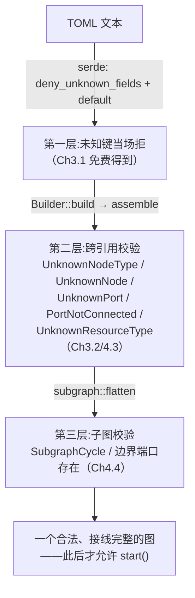
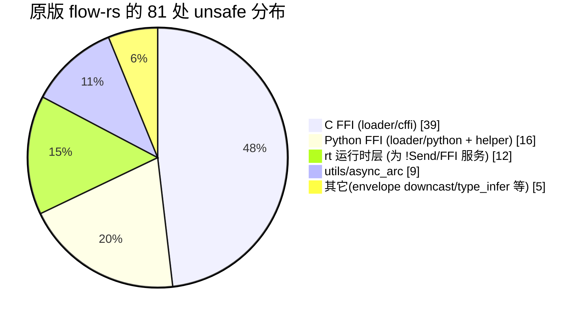
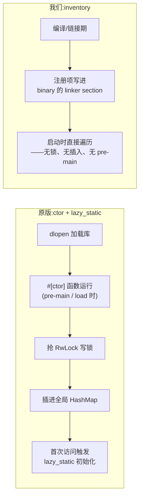

# Ch5.2 优化与更少 bug：逐条对比原版

引擎造完了。这一章不写新代码，而是把这一版和原版 MegFlow **并排摆开**，逐条盘点:哪些地方我们**真的**更稳、bug 更少，哪些「优」其实只是**范围不同**（我们没扛原版那些 FFI / 动态 / 硬件的负担），以及——同样重要——**原版哪些地方其实比我们强**。

诚实是这一章的底线。一个学习项目最容易犯的错，是把「我重写的东西更干净」当成「我比原作者高明」。绝大多数时候不是。原版扛着真实生产环境里 C/Python 插件、多路视频流、十几种加速卡的重量；我们在一张干净的桌子上纵切它的核心。**看清楚哪些是真优化、哪些是范围红利，本身就是这本书想教的判断力。**

## 1. 一张总对照表

| 维度 | 原版 MegFlow | 这一版 | 这是「真优化」还是「范围不同」? |
|---|---|---|---|
| 错误类型 | `anyhow`（动态、字符串化） | `thiserror` 枚举（类型化、可穷尽） | **真优化**（对我们的用法而言） |
| 配置/接线校验 | 部分留到**运行期**发现 | 全部前移到 **`build()`** | **真优化**（最大的一条） |
| `unsafe` 数量 | flow-rs 81 处 + flow-message 4 处 | 三个 crate **0 处** | **一半范围**（FFI）+**一半真优化**（核心机制去 transmute） |
| 节点注册 | `ctor` + `lazy_static` 运行期插入 | `inventory` 编译期收集 | **真优化**（但原版那套支持运行期 dlopen 插件，我们不需要） |
| 子图 | `Graph` impl `Node` = 嵌套运行时 | 装配前**内联展开** flatten | **范围不同**（原版支持动态子图，我们只做静态） |
| 运行时 | tokio + `rt` 包装层（`spawn_pinned`/自定义 `RwLock`） | 直接用 tokio | **范围不同**（`rt` 是为 FFI/!Send 服务，我们没这需求） |

下面逐条展开。

## 2. 错误类型：`anyhow` → `thiserror`

**原版**:错误借道 `anyhow::Result`——一个动态的、把任何 `Error` 装箱、主要靠字符串描述的错误类型。下游一律 `use anyhow::Result;`（Ch5.1 §4 见过）。

**我们**（Ch1.4）:一个 `thiserror` 派生的枚举，按需一个变体一个变体地长出来:

```rust,ignore
#[derive(Debug, Error)]
pub enum Error {
    #[error("channel closed")]
    ChannelClosed,
    #[error("type mismatch: expected {expected}, got {actual}")]
    TypeMismatch { expected: &'static str, actual: &'static str },
    #[error("unknown node type: {0}")]
    UnknownNodeType(String),
    #[error("port not connected: {0}")]
    PortNotConnected(String),
    // …… Part 3/4 里按需长到十几个变体
}
```

**为什么这对我们是真优化——三个具体好处**:

1. **调用方能区分失败种类。** `anyhow` 的错误基本只能打印；我们的能 `match`:
   ```rust,ignore
   match graph_build_result {
       Err(Error::UnknownNodeType(ty)) => // 提示用户拼错了节点名
       Err(Error::PortNotConnected(p))  => // 提示某端口漏接
       Err(e) => // 其它
   }
   ```
   「区分失败」是写出好错误提示、做重试/降级决策的前提。字符串化的错误做不到（你不能 `match` 一句人话）。
2. **加变体时，编译器逼你处理。** 给枚举加一个变体，所有非穷尽的 `match` 会当场编译报错——「你新增了一种失败，但这里没处理」。这把「我是不是漏了一种错误情况」从**运行期才暴露的 bug**变成了**编译期就挡住的问题**。这是 Rust 类型系统最直接的「少 bug」红利。
3. **下游少一个依赖、少一行 `use`**（Ch5.1 §4）:我们自己拥有 `Result`，它从 prelude 直接出，下游不必 `use anyhow::Result;`。

**诚实标注**:`anyhow` 不是坏选择。对一个「错误绝大多数直接冒泡到顶层统一处理、且插件生态庞杂」的系统，`anyhow` 的省事是有道理的。我们的类型化路线之所以更划算，是因为它和下一条「校验前移」是一对——我们**想让**调用方在 `build()` 当场区分并处理每一种配置错误。用法不同，最优解就不同。

## 3. 校验前移：运行期报错 → `build()` 期报错

这是**最大的一条**，也是「生产环境里 bug 更少」最实打实的杠杆。

**原版**:一部分配置与接线问题（节点类型不存在、端口没接上、跨引用错位）要等到图**跑起来、数据流到那个节点**时才暴露。想象一条视频流管线，某个节点名在 TOML 里拼错了——如果这个错误要到运行期才报，它可能在服务跑了三个小时、处理到某一帧时才崩。

**我们**（Ch3.1 起层层加码）:**整张拓扑在 `build()` 时一次性校验完**，一帧数据都还没流动，非法的图就已经被拒绝。分三层:



- **第一层**在解析期:`deny_unknown_fields` + `default`（Ch3.1）让 TOML 里一个拼错的键当场被拒，而不是被默默忽略。
- **第二层**在装配期:Ch3.2 一口气给了 6 个错误变体，全部在 `build()` 里落地——节点类型未注册、引用了不存在的节点、端口没接上、端口重复接、参数缺失……Ch4.3 又补了资源类型未注册。
- **第三层**在展开期:Ch4.4 的 `flatten` 在装配**前**查子图引用与边界端口、检测环。

**结果**:一整类「配置错误在生产环境运行期才崩」的 bug 被消灭了。图要么在 `build()` 就以一个**具体、类型化**（见 §2）的错误失败，要么它此后跑起来就是接线完整的。**fail fast, fail at the boundary**——在边界上快速失败，是稳态系统的基本功。

## 4. `unsafe`：81 处 → 0 处

先摆实测数字（直接 grep 只读原版与本仓，非估算）:

| | 原版 | 这一版 |
|---|---|---|
| flow-rs/src | **81** 处 `unsafe` | **0** |
| flow-message/src | 4 处 + 大量裸指针（C/Python 互操作） | **0** |
| flow-derive 生成码 | `transmute_unchecked`（node.rs:41/49/51） | **0** |

我们整个 workspace **零 `unsafe`**——「unsafe」这个词在我们代码里只出现在**注释**中（写着「这里走 std 安全路径、无 unsafe」）。

但要**诚实拆开**原版这 81 处 `unsafe` 都在哪:



- **55 处（39 C + 16 Python）是纯 FFI**——调 C、调 Python，**在 Rust 里本来就绕不开 `unsafe`**。这不是原版「不小心」，是跨语言调用的物理必然。我们零 FFI，所以这 55 处对我们**根本不存在**。这是**范围红利**，不是我们更高明。
- **12 处在 `rt`**——服务于 `!Send` 任务与 FFI 的运行时层（§6 细说），同样是范围。
- 但有**两处核心机制**，是原版在**我们也有的那部分**里用了 `unsafe`、而我们用安全的 std 替掉了——这才是**真优化**:
  1. **消息类型擦除的 downcast**。原版 `envelope/any_envelope.rs` 手写了 `unsafe` 的指针 transmute 来还原消息类型。我们（Ch1.2/1.3）走 std 的 `Any::downcast_ref`——类型不匹配时安全地返回 `None`，而不是 UB。
  2. **`node_register!` 生成码里的 `transmute_unchecked`**。原版派生宏在注册路径上生成了一个手写的 `unsafe fn transmute_unchecked`（flow-derive/src/node.rs:41）。我们的 `#[derive(BuildFromPorts)]` + `inventory`（Ch2.4）靠类型化的构造器签名接线，**一处 transmute 都不需要**。

**为什么这条重要**:`unsafe` 块是内存安全 bug（悬垂指针、类型混淆、数据竞争）唯一能藏身的地方——安全 Rust 里编译器替你挡住了全部这类问题。我们把核心机制里的两处手写 `unsafe` 换成安全 std 后，**在我们覆盖的范围内**，这类 bug 的藏身处清零了。至于 FFI 那 55 处，它们是原版为「能调 C/Python」付出的、绕不开的代价——我们只是没走那条路。

## 5. 节点注册：`ctor` + `lazy_static` → `inventory`

**原版**（直接读只读源码核实）:`node_register!("Name", T)` 展开成一个 **`#[flow_rs::ctor]` 构造函数**，它在动态库被 `dlopen` 加载时运行，调用 `__submit_only_in_ctor(...)` 把注册项**插进一个 `lazy_static` 全局 `Registry`**（本质是 `RwLock<HashMap>`，registry.rs:103）。

> 顺带纠正一个常见误记:原版**没有** `#[flow_rs::ln]` 这样的宏，注册面向下游的宏就叫 `node_register!`（和我们一样）。另外原版 `Cargo.toml` 里虽然列着 `inventory = "0.2.3"`，但**没有任何 `.rs` 文件真的用它**——原版真正的注册机制是上面这套 `ctor` + `lazy_static`。

**我们**（Ch2.4）:同名的 `node_register!` 展开成 **`inventory::submit!`**，把注册项放进一个**链接期**收集的 linker section。程序启动时，`inventory::iter` 直接遍历这个 section——**没有运行期插入、没有锁、没有 `lazy_static` 的首次初始化、没有 pre-main 运行的构造函数**。

**对比这两套机制的运行期行为**:



**为什么这对我们是真优化**:`ctor`（在 `main` 之前运行任意代码）是公认的 footgun——初始化顺序不确定、构造函数里 panic 很难排查。`lazy_static` + `RwLock` 引入运行期的锁与首次初始化开销。我们这套把「有哪些节点」变成**编译期就固定在二进制里的数据**，运行期只是读——移动部件更少，出错的地方就更少。

**诚实标注**:原版那套 `ctor` + `lazy_static` + `RwLock` 之所以是**运行期 + 带锁**，是因为它要支持**运行期动态注册**——通过 `dlopen` 在运行时加载的 C/Python 插件，能往同一张全局表里插自己的节点。这是个**真实且合理**的需求。我们不支持运行期加载插件（零 FFI），所以 `inventory` 的编译期收集才够用。又一次:**架构决定设计**。如果哪天要支持运行期插件，我们大概也得回到某种带锁的运行期注册表。

## 6. 运行时 `rt`：一节必须诚实的对比

这一节要专门纠正一个**很容易想当然、但错误**的说法:「原版用有栈协程（stackful coroutine），我们换成了 async」。

**这是错的。** 直接读只读源码:原版的 `rt` 模块（`join_handle.rs` / `rwlock.rs` / `task_ext.rs` / `spawn_pinned.rs`）**通篇 `use tokio::`**——原版核心运行时**本来就是 tokio-native async**，和我们一样。

那 `stackful` 是什么?它是原版一个**可选依赖**，只在 `python` / `cplugin` 这两个 feature 下才拉进来（`Cargo.toml`:`python = ["stackful", ...]`、`cplugin = ["stackful", ...]`）。它的用途**仅限 FFI 边界**:把一个**同步、阻塞**的 Python/C 插件调用，桥接进 async 的世界而不阻塞整个 executor。核心调度器根本不用它。

那原版的 `rt` 到底比裸 tokio 多了什么?它在 tokio **外面包了一层**:

- **`spawn_pinned`**（`task_ext.rs` 用 `LocalSet` / `tokio_unstable` 的 `LocalPoolHandle`）——把 `!Send` 的任务钉在固定的本地线程上跑。为什么需要?因为 Python 的 `PyObject`、某些 C 句柄是 `!Send` 的，不能在 tokio 默认的多线程 work-stealing 调度里随便跨线程搬。
- **自定义 `RwLock`**（`rwlock.rs` 包着 `tokio::sync::RwLock` + `tokio::time`，带 **1 秒超时重试** 和 **死锁计数器** `AtomicUsize`）——这几乎是明写着「这套系统在 !Send/FFI 的复杂交互里真的遇到过死锁，于是加了超时和计数来诊断」。

**我们怎么做**:直接用 tokio（Ch3.3）。我们所有任务都是 `Send` 的（我们掌控全部代码、没有 `!Send` 的 FFI 对象），所以**不需要** `spawn_pinned`；我们没有那种复杂的跨插件锁交互，所以**不需要**带超时和死锁计数的自定义 `RwLock`。

**这算我们的「优化」吗?不算，至少不是「我们更聪明」那种。** 我们省掉 `rt` 那层包装，纯粹是因为**我们不必扛 FFI / `!Send` 的负担**。原版那层包装不是过度设计，是被真实需求（跑 Python/C 插件）逼出来的。把「我们代码更简单」误当成「我们设计更好」，恰恰是这一章开头警告的那个陷阱。**诚实的表述是:范围不同，所以复杂度不同。**

## 7. 子图：嵌套运行时 → 内联展开

这条 Ch4.4 已详谈，这里只归位到对照表里。**原版**把 `Graph` 也实现成 `Node`，子图是**递归的运行时单元**（嵌套运行时）；**我们**在装配前一趟 `flatten` 把子图**内联展开**成一张扁平图。

- **我们这版少 bug 的点**:没有嵌套运行时的生命周期 / 停机涟漪 / 递归边界的那些边缘情况——压平后就是一个调度器、一层任务，没有递归。
- **诚实标注**:原版的嵌套运行时支持**动态子图**（运行期按视频流条数生成 N 份实例），我们的静态 `flatten` 做不到。这条上**原版更强**。又是架构决定设计——见 Ch4.4 §3。

## 8. 一路上的教学化简（YAGNI 清单）

除了上面几条大对比，我们在纵切过程中还做了一串「原版有、但核心子集不需要」的化简。它们的共同收益是**表面积更小 = 出 bug 的地方更少**:

- **`EnvelopeInfo` 7 字段 → 2 字段**（Ch1.3）:只留下核心子集真正用到的，其余 YAGNI。
- **错误枚举按需生长**，不一次性预设几十个变体（§2）——没用到的变体就是没被测试覆盖的死代码。
- **广播 / 解复用上移到节点层**（`Bcast`/`Merge`，Ch4.2），而非塞进 channel 层——channel 保持「单消费者」这一条铁律，语义简单。
- **trait 约束按方法附加**，而非堆在 trait 头上（Ch2.1）——`Actor: Node + Send + 'static` 只在真正需要 spawn 时才要求 `Send`。
- **不为测试便利给生产类型加 `Debug`**（Ch3.2 手写摘要式 Debug）——生产类型只暴露该暴露的。

每一条单独看都很小，但合起来，是「这一版读起来更容易、改起来更不容易崩」的底层原因:**我们只造了核心子集需要的东西，没造的东西不会有 bug。**

## 9. 诚实的账：原版哪些地方其实更强

把话说全。下面这些，是原版**实打实比我们强**的地方——不是我们「暂时没做」，而是它们需要我们**刻意划在范围外**的一整套能力:

- **C / Python FFI**:原版能把 C、Python 写的节点桥进引擎（`loader/cffi`、`loader/python`）。这是那 55 处 FFI `unsafe` + `rt` 那层包装 + `stackful` 换来的真实能力。真实算法仓大量依赖它。
- **动态子图**:运行期按输入流条数动态起 N 套管线（§7）。
- **图优化器**（`config::optimizer`）:自动插 buffer / mem_pool / skip 节点等 pass，对真实吞吐至关重要。
- **在真实生产里被十几种加速卡、无数条视频流锤炼过**:那些看似「多余」的超时重试、死锁计数、`!Send` 处理，全是生产事故留下的疤。我们的干净，一部分是因为我们**还没**经历那些。

**我们这一版少的那些 bug，很大一部分不是因为我们写得比原作者好，而是因为我们做的事情少。** 认清这一点，才配谈「优化」。

## 小结

- **错误类型 anyhow → thiserror**:类型化、可穷尽、下游少一个依赖——**真优化**（配合校验前移的用法）。
- **校验前移到 `build()`**:三层校验（解析期未知键 / 装配期跨引用 / 展开期子图与环），一整类「运行期才崩」的配置 bug 被消灭——**最大的一条真优化**。
- **`unsafe` 81 → 0**:诚实拆开——55 处 FFI 是我们没做 FFI 的**范围红利**，但消息 downcast 与 `node_register!` 的 `transmute_unchecked` 两处核心机制换成安全 std `Any`，是**真优化**。
- **注册表 ctor+lazy_static → inventory**:编译期收集替运行期带锁插入，移动部件更少——**真优化**，但原版那套支持运行期 dlopen 插件、是我们不需要的能力。
- **运行时 `rt`**:纠正误记——原版**本就是 tokio async**，不是有栈协程；`stackful` 只在 FFI feature 下、只在 FFI 边界用。原版 `rt` 那层（`spawn_pinned` + 自定义 `RwLock`）是为 `!Send`/FFI 服务，我们省掉它是**范围不同**，不是更聪明。
- **子图 flatten**:少了嵌套运行时的边缘情况（真优化），但原版嵌套运行时支持动态子图（原版更强）。
- **诚实的账**:FFI、动态子图、图优化器、生产历练——这些原版**实打实更强**。我们的「少 bug」很大一部分来自「做得少」，认清这点才配谈优化。

下一章 **Ch5.3**，全书收尾:把 Part 0 到 Part 5 的主线串成一张全景图，回看我们从「一条 TOML」一路造到「跑出结果」到底学到了哪些 Rust 与哪些工程判断，并为想继续深入的读者指路——图优化器怎么入手、debugger 与可视化、以及真正啃下 C / Python FFI 那座山的路线。
