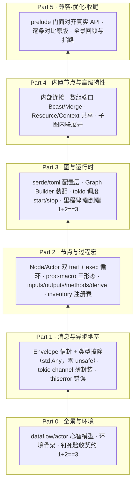

# Ch5.3 全景回顾 + 进阶指路

到这里，引擎造完了，对照也盘完了。最后一章不引入任何新东西，只做两件事:**把整本书铺过的路在一页纸上重走一遍**，然后为想继续往下走的你**指几条真实的路**——每条都带着原版（只读）里确切的文件坐标，不是泛泛而谈。

## 1. 全景回顾：从一条 TOML 到跑出结果

我们是从「什么都没有」开始的。六个部分，一层一层往上垒:

每一层都**踩在下一层肩上**:没有 Part 1 的 `Envelope` 类型擦除，Part 2 的节点收发不了任意类型的消息；没有 Part 2 的注册表，Part 3 的 Builder 不知道「`ty="BinaryOp"` 该造哪个结构体」；没有 Part 3 的装配与调度，Part 4 的数组端口和子图无处安放。这条依赖链本身，就是「引擎是怎么长出来的」这个问题的答案。

回看 Ch0.3 钉下的那句验收契约——**一段 TOML 描述的图，喂进 1 和 2，跑出 3**——我们在 Ch3.4 兑现了它，又在 Part 4 把它扩展成真实算法仓拓扑的全部骨架。**全书 92 个测试**从头绿到尾，每一章的代码都能编译、能运行、对书本身也做了 TDD。

## 2. 一路学到的 Rust

这本书名义上是「重写一个引擎」，但真正的暗线是**在一个非玩具的项目里把 Rust 的硬骨头逐个啃下来**。把它们和「在哪用到、为什么非它不可」对起来:

| Rust 概念 | 在哪学的 | 为什么这个引擎非它不可 |
|---|---|---|
| 所有权 / 借用 / 生命周期 | Ch1.1、Ch3.1（`PortRef<'a>`） | 端口名零拷贝借 `&str`；channel 的 `Sender` 可克隆扇入、`Receiver` 独占 |
| 泛型 / trait / `dyn` 对象安全 | Ch1.2、Ch2.1 | `Box<dyn Actor>` 把不同节点装进一个 `Vec`；`start` 非 async 才对象安全 |
| `Any` 与 downcast | Ch1.2、Ch1.3、Ch4.3 | 类型擦除的消息与资源——`downcast_ref` 借用、`Arc::downcast` 拿所有权 |
| async / `Future` / tokio | Ch1.4、Ch3.3 | 每个节点是一个 tokio 任务；channel 承载异步收发；`start/stop` 优雅停机 |
| 过程宏三形态 | Ch2.2–2.4 | 派生宏 `#[derive(Node)]` / 属性宏 `#[inputs]` / 函数式宏 `node_register!` |
| `thiserror` 错误设计 | Ch1.4 起按需生长 | 类型化、可穷尽的 `Error` 枚举（Ch5.2 §2） |
| `serde` / 声明式反序列化 | Ch3.1 | TOML 图拓扑 → 结构体；`flatten` + `deny_unknown_fields` 的取舍 |
| 编译期分布式注册 | Ch2.4 | `inventory` 跨 crate 收集节点，无运行期锁（Ch5.2 §5） |
| 内部可变性 / 原子 | Ch4.3（`Counter`） | `Arc<T>` 给不出 `&mut`，共享资源靠 `AtomicU64` 等内部可变 |

如果你是冲着「学 Rust」来的，这张表就是你的成绩单——这些都不是教科书例子，是一个真能跑的引擎**逼**你用上的。

## 3. 一路学到的工程判断

比具体的 Rust 语法更值钱的，是几条反复出现的**判断**。它们不是 Rust 独有的，是任何系统设计都用得上的:

- **需求决定抽象**（Ch4.3）:消息要自定义 clone 行为，所以 Ch1.3 自己造了 `AnyEnvelope` trait；资源不需要，所以 Ch4.3 直接用 std 的 `Any`。**别为不存在的需求造抽象。**
- **架构决定设计**（Ch4.4、Ch5.2 §6/§7）:原版子图选嵌套运行时、我们选内联展开，都是被各自的地基逼出来的最省事解。**没有绝对更优的设计，只有最契合既有约束的设计。**
- **校验前移**（Ch5.2 §3）:能在 `build()` 拦下的错误，绝不留到运行期。**在边界上快速失败。**
- **YAGNI / 教学化简**（Ch5.2 §8）:`EnvelopeInfo` 7 字段砍到 2、错误枚举按需生长。**没造的东西不会有 bug。**
- **诚实的边界**（贯穿全书，尤其 Ch5.2 §9）:分清「我们更优」和「我们做得少」。**认清自己站在谁的肩膀上。**
- **对书本身做 TDD**:每一章先写会失败的测试、再写让它绿的代码、逐章提交。**红-绿不只是测代码，是测「我到底有没有搞懂」。**

这几条，比这本书里任何一行 Rust 都更可能在你下一个项目里救你一命。

## 4. 这本书到底交付了什么

说清楚「完成」意味着什么，也是一种诚实:

- **三个 crate 的工作 workspace**:`flow-message`（消息层）、`flow-derive`（过程宏）、`flow-rs`（引擎核心）——**零 `unsafe`**、仅依赖 crates.io 公共 crate。
- **一个真能跑的引擎核心子集**:能加载 TOML 图、按注册表装配节点与 channel、用 tokio 调度、优雅停机，端到端跑通 `1+2==3`。
- **真实算法仓拓扑的全部骨架**:内部连接、数组端口、广播/汇聚、共享资源与上下文、静态子图复用。
- **92 个测试**全绿，`clippy -D warnings` 干净，`cargo fmt --check` 干净，`mdbook build` 零 warning。
- **一本能对着敲、能编译、能运行的中文教程**——这才是最终交付物。

它**不是**原版 MegFlow 的替代品（没有 FFI、动态子图、图优化器、硬件后端）。它是**理解原版、并顺带把 Rust 硬骨头啃下来的一条纵切路径**。

## 5. 进阶指路：想继续往下走，从这里开始

下面每一条都是我们**刻意划在范围外**的能力。如果你想继续深入，这是它们在原版（只读仓 `/data/algorithm_warehouse/bw100_dev/megflow`）里的确切入口:

### 5.1 图优化器

真实吞吐的关键。原版在装配前对图跑一串 pass:自动插缓冲、插内存池、插 skip 节点、重排。

- **入口**:`flow-rs/src/config/optimizer/`（`mod.rs` 是总调度，`indices.rs` 等是具体 pass）。
- **怎么上手**:我们的架构其实**特别适合**加优化器——因为我们已经有了 Ch3.1 的 `Config` 中间表示和 Ch4.4 的 `flatten`（它本身就是一个「图 → 图」的变换 pass!）。一个优化器就是在 `flatten` 之后、`assemble` 之前，再插几趟 `Config -> Config` 的变换。**从「给某类相邻节点之间自动插一个带缓冲的 channel」这种最简单的 pass 开始。**

### 5.2 可视化与 debugger

看不见的图最难调。原版能把图导成 Graphviz、能在运行期观察。

- **入口**:`flow-rs/src/config/graphviz.rs`（导出 `.dot`）、`flow-rs/src/graph/debug.rs`（运行期调试）、`flow-rs/src/profile/`（性能剖析，基于 `minstant` 低开销计时）。
- **怎么上手**:可视化是**最容易摘的果子**——你已经有完整的 `Config`（节点、连接、端口都在里面），写一个把它转成 Graphviz `digraph { ... }` 字符串的函数即可，一两百行就能让你「看见」任意 TOML 描述的图。这也是理解 `flatten` 到底把子图展开成了什么的最好工具。

### 5.3 C / Python FFI —— 真正的那座山

这是原版最重、最有价值、也最硬的部分:让 C 和 Python 写的节点桥进引擎。Ch5.2 §4/§6 反复提到的那 55 处 FFI `unsafe`、`rt` 那层包装、`stackful`，全在这里。

- **入口**:`flow-rs/src/loader/cffi/`（C 插件）、`flow-rs/src/loader/python/`（Python 插件）、`flow-rs/src/rt/spawn_pinned.rs`（把 `!Send` 任务钉本地线程）、以及 `stackful`（`python`/`cplugin` feature 下，把同步阻塞调用桥进 async）。
- **怎么上手**:**先啃 `spawn_pinned` 和 `!Send` 的关系**——理解「为什么 Python 的 `PyObject` 不能在 tokio 的多线程调度里跨线程搬」，是理解整座山的钥匙。然后从最小的「用 `libloading` 加载一个导出了固定符号的 `.so`、调它一个函数」开始，不要一上来就啃 `pyo3`。这条路需要你真正掌握 `unsafe` 的契约——它是这本书**有意没教**、但值得你专门花时间的下一课。

### 5.4 动态子图

Ch4.4 划在范围外的那条:运行期按输入流条数动态生成 N 套管线（「每来一路视频流就起一套」）。

- **入口**:`flow-rs/src/broker.rs`。
- **怎么上手**:这条依赖 §5.3 的运行时能力和原版的嵌套运行时架构，是几座山里**最该最后爬**的一座。先把前三条走通。

## 6. 收尾寄语

这本书从一句「我想搞懂 MegFlow，顺便学好 Rust」开始。走到这里，你手上有了一个**自己一行行写出来、每一行都懂**的引擎核心——它不大，但它是**你的**，且它真的会跑。

比起「读懂了原版的 22K 行」，**「重写了它的核心 2K 行、并且清楚每一个设计为什么长这样」**是更扎实的理解。原版那些你没重写的部分（FFI、优化器、动态子图），现在对你也不再是黑盒——你知道它们在哪、大致怎么工作、以及为什么它们比你的版本复杂。这份「知道边界在哪」的踏实，就是这本书想留给你的东西。

去把 §5 里的某一条走通吧。或者，回到你自己的算法仓，这次你会用**造过引擎的人**的眼睛去看那些 `.graph.py` 和 TOML——它们不再是魔法，而是你亲手实现过的机制。

## 小结

- **全景**:Part 0→5 一层踩一层，从 dataflow 心智模型垒到「跑出结果」再到真实拓扑骨架；Ch0.3 的验收契约在 Ch3.4 兑现，92 测试从头绿到尾。
- **学到的 Rust**:所有权/生命周期、泛型/trait/`dyn`/`Any`、async/tokio、过程宏三形态、thiserror、serde、inventory——全是被真引擎逼出来的，不是教科书例子。
- **学到的判断**:需求决定抽象、架构决定设计、校验前移、YAGNI、诚实的边界、对书做 TDD——比任何一行语法都更耐用。
- **交付物**:三 crate 零 `unsafe` workspace + 能跑的引擎核心子集 + 真实拓扑骨架 + 一本能对着敲的中文教程。**不是**原版替代品，**是**理解原版兼修 Rust 的纵切路径。
- **进阶指路**（带原版真实坐标）:图优化器（`config/optimizer/`，我们的 `flatten` 已是一趟 pass、最好上手）、可视化/debugger（`config/graphviz.rs`、`graph/debug.rs`、`profile/`，可视化是最易摘的果子）、C/Python FFI（`loader/{cffi,python}`、`rt/spawn_pinned.rs`、`stackful`——真正的那座山，先啃 `!Send`）、动态子图（`broker.rs`，最后爬）。

**全书完。** 感谢你一路走到这里——现在，去写你自己的下一个引擎吧。
