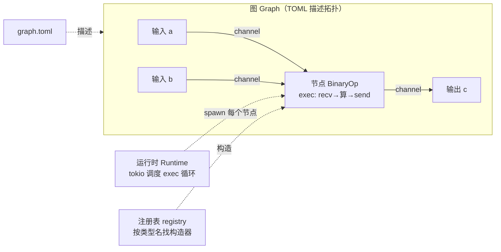

# Part 0 · 全景与环境 —— 实现计划 (Implementation Plan)

> **For agentic workers:** REQUIRED SUB-SKILL: Use superpowers:subagent-driven-development (recommended) or superpowers:executing-plans to implement this plan task-by-task. Steps use checkbox (`- [ ]`) syntax for tracking.

**Goal:** 搭好 `megflow-rebuild/` 的双工程骨架（`code/` 三-crate cargo workspace + `book/` mdbook），把工具链就位，并把「我们要对齐的验收标准」——真实 flow-rs 的 BinaryOp `1 + 2 == 3`——钉死为参照系，写完 Part 0 的三章（Ch0.1/0.2/0.3）。

**Architecture:** 交付物是「一本书 + 一个参考实现」。`book/`（mdbook，中文正文）手把手教读者一步步搭出 `code/`（cargo workspace：`flow-message` / `flow-derive` / `flow-rs`）。本 Part 只做**骨架与环境**：workspace 能 `cargo build`/`cargo test`（暂无单测，Part 1 起才有红-绿 TDD），mdbook 能 `mdbook build` 并渲染 mermaid，且已通过阅读+（尽力）运行原版把目标 API 契约固定下来。真正的引擎代码从 Part 1 开始。

**Tech Stack:** Rust edition 2021（rustc/cargo 1.98）；mdbook 0.5.4 + mdbook-toc 0.15.4 + mdbook-mermaid 0.17.1；仅使用 crates.io 公共 crate（**不**使用原版的私有 `megvii` 注册表，不链接闭源 `pplcore-*`/`mpp`/`blob-proxy`）。

**Spec:** `docs/specs/2026-08-24-megflow-rebuild-book-design.md`（本计划实现其 §5 的 Part 0；执行者应同时阅读 spec 与本计划）。

## Global Constraints

> 以下为全项目级约束，每个 task 的要求都隐含包含本节。数值/名字均从 spec 逐字复制。

- **工具链版本**：rustc/cargo **1.98**；mdbook **0.5.4**；mdbook-toc **0.15.4**；mdbook-mermaid **0.17.1**；cargo-expand **1.0.119**（均已装）。
- **Rust edition**：`code/` 统一 **edition 2021**（原版是 2018，此处为有意的现代化；见 spec §7 优化项）。
- **crate 命名**：三个 crate 名字**逐字沿用**真实版：`flow-rs` / `flow-message` / `flow-derive`。API / 宏 / 模块名对齐真实 flow-rs 以最大化「可替换」（spec §4、§6）。
- **依赖来源**：只允许 crates.io 公共 crate。**禁止** `registry = "megvii"` 的私有依赖、禁止 `pplcore-std`/`pplcore-rs`/`mpp`/`blob-proxy`/`stackful`/`pyo3` 等闭源或超范围依赖（spec §1 非目标、§6 诚实边界）。
- **正文语言**：中文（通俗易懂）；代码与关键注释中英对照（spec §4）。
- **对书本身 TDD**：书里出现的每段关键代码都必须来自真实编译/测试通过的 `code/` 工程（spec §3.4）。Part 0 代码是骨架，验收=能 build/render；红-绿单测从 Part 1（Ch1.1 的 `FlowError`）开始。
- **稳定版工具链**：`code/` 不使用 nightly 特性（原版 lib.rs 顶部的 `#![cfg_attr(doc, feature(doc_auto_cfg))]` 不移植）。
- **提交规范**：每个 task 末尾 commit；提交信息用中文，聚焦「本 task 交付了什么」。
- **工作目录**：所有路径相对 `megflow-rebuild/`（独立 git 仓，`git log` 目前只有一条 spec 提交）。

---

## File Structure（本 Part 将创建/修改的文件）

```
megflow-rebuild/
├── README.md                         # 【建】项目说明：这是什么 / 如何读书 / 如何构建代码
├── code/                             # 【建】cargo workspace（参考实现）
│   ├── Cargo.toml                    # 【建】[workspace] resolver=2, members=3, workspace.package
│   ├── flow-message/
│   │   ├── Cargo.toml                # 【建】空 lib（doctest=false）
│   │   └── src/lib.rs                # 【建】crate 文档注释，暂无实现
│   ├── flow-derive/
│   │   ├── Cargo.toml                # 【建】proc-macro=true 空 lib
│   │   └── src/lib.rs                # 【建】crate 文档注释，宏在 Part 2 到来
│   └── flow-rs/
│       ├── Cargo.toml                # 【建】path-deps: flow-message + flow-derive
│       └── src/lib.rs                # 【建】crate 文档注释
├── book/                             # 【建】mdbook 源
│   ├── book.toml                     # 【建】title/zh-CN + toc + mermaid 预处理器
│   ├── mermaid.min.js                # 【建·自动】mdbook-mermaid install 生成
│   ├── mermaid-init.js               # 【建·自动】mdbook-mermaid install 生成
│   └── src/
│       ├── SUMMARY.md                # 【建】全 6 部分/22 章目录树（Part 0 有文件，其余为 draft）
│       ├── introduction.md           # 【建】书前言
│       └── part0/
│           ├── ch01-panorama.md      # 【建】Ch0.1 概念章（含 mermaid 架构图）
│           ├── ch02-environment.md   # 【建】Ch0.2 环境与骨架章
│           └── ch03-reference.md     # 【建】Ch0.3 参照系章（钉死验收标准）
└── docs/plans/2026-08-24-part0-scaffold-and-environment.md   # 本文件
```

**决策说明（锁定在此）**：
- 计划文件放 `docs/plans/`（与项目已有的 `docs/specs/` 保持一致，而非 skill 默认的 `docs/superpowers/plans/`）。
- `code/` 为 workspace 根；三个 crate 目录名与包名一致。
- `book/src/introduction.md` 是**书前言**，与项目根 `README.md` 是两个不同文件，勿混。
- SUMMARY.md 一次性列出全 6 部分 22 章：Part 0 三章链接到真实文件；Part 1–5 各章用 draft 条目（无链接标题），既给读者完整路线图，又保证 `mdbook build` 干净通过。后续每个 Part 的计划落地时，把对应 draft 替换为真实链接。

---

## Task 1: `code/` workspace 骨架（Ch0.2 代码交付物）

建出可 `cargo build` / `cargo test` 通过的空三-crate workspace，证明 workspace 接线正确、path 依赖可解析。

**Files:**
- Create: `code/Cargo.toml`
- Create: `code/flow-message/Cargo.toml`
- Create: `code/flow-message/src/lib.rs`
- Create: `code/flow-derive/Cargo.toml`
- Create: `code/flow-derive/src/lib.rs`
- Create: `code/flow-rs/Cargo.toml`
- Create: `code/flow-rs/src/lib.rs`

**Interfaces:**
- Consumes: 无（首个 task）。
- Produces: 一个名为 `flow-rs`/`flow-message`/`flow-derive` 的 workspace，供 Part 1 起在各 crate 内添加模块；`flow-rs` 已 path-依赖另两者。

- [ ] **Step 1: 写 workspace 根 `code/Cargo.toml`**

```toml
[workspace]
resolver = "2"
members = ["flow-message", "flow-derive", "flow-rs"]

[workspace.package]
version = "0.1.0"
edition = "2021"
license = "Apache-2.0"
authors = ["douzhenbo", "Claude"]

# 说明：本 workspace 只用 crates.io 公共 crate；不使用原版的 megvii 私有注册表。
[profile.dev]
incremental = true
```

- [ ] **Step 2: 写 `code/flow-message/Cargo.toml`**

```toml
[package]
name = "flow-message"
version.workspace = true
edition.workspace = true
license.workspace = true

[lib]
doctest = false   # 与原版一致：文档示例不作为 doctest 运行
```

- [ ] **Step 3: 写 `code/flow-message/src/lib.rs`**

```rust
//! flow-message —— MegFlow 消息层（重写版）。
//!
//! 目前为骨架。消息信封 `Envelope<M>` 与类型擦除将在 Part 1（Ch1.3）实现。
//! flow-message —— message layer of MegFlow (rewrite). Skeleton for now;
//! `Envelope<M>` and type erasure arrive in Part 1 (Ch1.3).
```

- [ ] **Step 4: 写 `code/flow-derive/Cargo.toml`**

```toml
[package]
name = "flow-derive"
version.workspace = true
edition.workspace = true
license.workspace = true

[lib]
proc-macro = true   # 过程宏 crate
doctest = false
```

- [ ] **Step 5: 写 `code/flow-derive/src/lib.rs`**

```rust
//! flow-derive —— MegFlow 过程宏（重写版）。
//!
//! 目前为骨架。`#[inputs]`/`#[outputs]`/`#[derive(Node)]`/`#[methods]`/
//! `node_register!` 等宏将在 Part 2 实现。
//! flow-derive —— procedural macros of MegFlow (rewrite). Skeleton for now;
//! node macros arrive in Part 2.
```

- [ ] **Step 6: 写 `code/flow-rs/Cargo.toml`**

```toml
[package]
name = "flow-rs"
version.workspace = true
edition.workspace = true
license.workspace = true

[dependencies]
flow-message = { path = "../flow-message" }
flow-derive = { path = "../flow-derive" }

[lib]
doctest = false
```

- [ ] **Step 7: 写 `code/flow-rs/src/lib.rs`**

```rust
//! flow-rs —— MegFlow 引擎核心（重写版）。
//!
//! 目前为骨架。channel / node / registry / config / graph / rt 等模块将从
//! Part 1 起逐章加入；`prelude` 门面在 Part 5（Ch5.1）补齐。
//! flow-rs —— MegFlow engine core (rewrite). Skeleton for now; modules are
//! added chapter by chapter starting in Part 1.
```

- [ ] **Step 8: 运行 build，验证 workspace 接线正确**

Run: `cd code && cargo build --workspace`
Expected: 编译成功，0 error（proc-macro crate 与两个普通 crate 均产出）。

- [ ] **Step 9: 运行 test，确认 0 测试通过（尚无单测）**

Run: `cd code && cargo test --workspace`
Expected: 成功，`test result: ok. 0 passed`（Part 0 无单测是预期的；红-绿 TDD 从 Ch1.1 开始）。

- [ ] **Step 10: Commit**

```bash
git add code/
git commit -m "Part0: 搭建 code/ 三-crate workspace 骨架（flow-message/flow-derive/flow-rs）"
```

---

## Task 2: `book/` mdbook 骨架 + 工具链（Ch0.2 书交付物）

建出能 `mdbook build` 的 mdbook，装好 mermaid 预处理器，铺好全 22 章目录树与前言、项目 README。

**Files:**
- Create: `book/book.toml`
- Create: `book/src/SUMMARY.md`
- Create: `book/src/introduction.md`
- Create: `book/src/part0/ch01-panorama.md`（本 task 先建一行占位，Task 3 填充）
- Create: `book/src/part0/ch02-environment.md`（占位，Task 4 填充）
- Create: `book/src/part0/ch03-reference.md`（占位，Task 5 填充）
- Create: `README.md`（项目根）
- Auto-generated: `book/mermaid.min.js`, `book/mermaid-init.js`（由 `mdbook-mermaid install` 生成，并自动向 book.toml 追加 `[preprocessor.mermaid]` 与 `additional-js`）

**Interfaces:**
- Consumes: Task 1 的 `code/`（README 中引用其构建命令）。
- Produces: 一个 `mdbook build` 通过、含全章目录的书；Part 0 三章文件已存在，供 Task 3/4/5 填充。

- [ ] **Step 1: 安装 mdbook-mermaid**

Run: `cargo install mdbook-mermaid`
Expected: 安装成功，`mdbook-mermaid --version` 有输出（此前为 command not found）。

- [ ] **Step 2: 写 `book/book.toml`（先只含 toc 预处理器；mermaid 由 Step 6 的 install 追加）**

```toml
[book]
title = "从零用 Rust 重写 MegFlow —— 手把手学习型指南"
authors = ["douzhenbo", "Claude"]
language = "zh-CN"
src = "src"

[preprocessor.toc]
command = "mdbook-toc"
renderer = ["html"]

[output.html]
default-theme = "light"
preferred-dark-theme = "navy"
```

- [ ] **Step 3: 写 `book/src/SUMMARY.md`（全 6 部分 22 章；Part 0 有链接，其余 draft）**

```markdown
# 目录

[前言](introduction.md)

# 第 0 部分 · 全景与环境

- [Ch0.1 什么是 dataflow / actor，MegFlow 全景](part0/ch01-panorama.md)
- [Ch0.2 开发环境与项目骨架](part0/ch02-environment.md)
- [Ch0.3 跑通真实 flow-rs，钉死验收标准](part0/ch03-reference.md)

# 第 1 部分 · 消息与异步地基

- [Ch1.1 Rust 复习：并发下的所有权、借用、生命周期 + 错误处理]()
- [Ch1.2 泛型、trait、trait 对象 dyn、Any 与 downcast]()
- [Ch1.3 实现 Envelope 消息信封与类型擦除消息层]()
- [Ch1.4 async/await、Future、tokio 入门 → channel 封装]()

# 第 2 部分 · 节点与过程宏

- [Ch2.1 Node / Actor trait、端口、exec 循环（手写不用宏）]()
- [Ch2.2 过程宏入门：proc-macro2 / syn / quote]()
- [Ch2.3 实现 inputs / outputs / derive(Node) / methods 宏]()
- [Ch2.4 node_register! 与 inventory 编译期注册表]()

# 第 3 部分 · 图与运行时

- [Ch3.1 serde / toml 与图 TOML schema → 配置解析层]()
- [Ch3.2 Graph Builder：装配节点与 channel]()
- [Ch3.3 tokio 调度：spawn actor、start/stop、优雅停机]()
- [Ch3.4 端到端跑通 BinaryOp（大里程碑）+ Sandbox 测试框架]()

# 第 4 部分 · 内置节点与高级特性

- [Ch4.1 transform / noop / bcast 广播 + add_cvt_func]()
- [Ch4.2 merge / demux / reorder（多路复用与重排序）]()
- [Ch4.3 Resource 与 Context：共享模型 / 内存池]()
- [Ch4.4 子图 subgraph、多图 graphs、动态子图]()

# 第 5 部分 · 兼容 · 优化 · 收尾

- [Ch5.1 对齐真实 API，跑真实算法仓风格的图 + pplcore 边界]()
- [Ch5.2 优化与更少 bug：逐条对比原版]()
- [Ch5.3 全景回顾 + 进阶指路]()
```

- [ ] **Step 4: 写 `book/src/introduction.md`（书前言）**

```markdown
# 前言

这本书带你**从零用 Rust 重写 MegFlow 引擎核心**。读完你将：

1. 吃透 MegFlow（算法仓赖以运行的 dataflow 框架）的每个模块；
2. 顺带补齐 Rust 的异步、trait 对象、过程宏、生命周期；
3. 得到一个**功能对齐、实现更简、bug 更少**的优化版引擎。

## 这本书怎么读

- **纵切、即时补 Rust**：按引擎真实模块顺序建（消息 → 节点/宏 → 注册表 → 配置 → 图 → 运行时 → 内置节点 → 子图 → 兼容），每进入一块，先用小练习补齐正好需要的 Rust 概念，再动手实现。
- **TDD、每章能跑**：每章「红 → 绿 → 重构」，结束时 `cargo build` + `cargo test` 必须全绿。
- **书=真实工程**：书里每段关键代码都来自 `code/` 里真实编译测试通过的实现，抄下来就能跑。

## 里程碑

- **Ch3.4**：端到端跑通 BinaryOp `1 + 2 == 3`（第一个完整框架）。
- **Ch5.1**：跑通一个 detector → tracker → alarm 风格的多节点/子图图。

## 边界（诚实说明）

本书重写**核心引擎子集**（channel + graph + node + registry + TOML 解析）。**不**覆盖图优化器、调试器、C/Python FFI，也**不**承诺把成品直接链接进闭源 `pplcore-*`/`mpp`（末章给出「若要真正替换需补齐哪些私有面」的指路）。
```

- [ ] **Step 5: 建 Part 0 三章占位文件**

```bash
mkdir -p book/src/part0
printf '# Ch0.1 什么是 dataflow / actor，MegFlow 全景\n\n> 本章内容将由 Task 3 填充。\n' > book/src/part0/ch01-panorama.md
printf '# Ch0.2 开发环境与项目骨架\n\n> 本章内容将由 Task 4 填充。\n' > book/src/part0/ch02-environment.md
printf '# Ch0.3 跑通真实 flow-rs，钉死验收标准\n\n> 本章内容将由 Task 5 填充。\n' > book/src/part0/ch03-reference.md
```

- [ ] **Step 6: 用 mdbook-mermaid 安装静态资源（会自动改 book.toml）**

Run: `mdbook-mermaid install book`
Expected: 在 `book/` 生成 `mermaid.min.js` 与 `mermaid-init.js`，并向 `book/book.toml` 追加 `[preprocessor.mermaid]` 及 `output.html` 的 `additional-js`。

- [ ] **Step 7: 写项目根 `README.md`**

```markdown
# megflow-rebuild

一本手把手的中文学习型 mdbook（`book/`）+ 其配套参考实现（`code/`），指导你从零用 Rust 重写 MegFlow 引擎核心。

## 目录结构

- `book/` —— mdbook 源。`cd book && mdbook serve` 本地预览，`mdbook build` 产出静态站点。
- `code/` —— cargo workspace 参考实现（`flow-message` / `flow-derive` / `flow-rs`）。`cd code && cargo test` 全绿。
- `docs/specs/` —— 设计文档（spec）。
- `docs/plans/` —— 逐 Part 实现计划。

## 快速开始

```bash
# 读书
cd book && mdbook serve --open

# 构建参考实现
cd code && cargo build --workspace && cargo test --workspace
```

## 依赖与边界

参考实现只用 crates.io 公共 crate，不依赖任何闭源/私有注册表。详见 `docs/specs/`。
```

- [ ] **Step 8: 构建书，验证渲染无错**

Run: `cd book && mdbook build`
Expected: 成功，`book/book/` 静态站点生成，无 warning/error（draft 章节正常显示为不可点击）。

- [ ] **Step 9: Commit**

```bash
git add book/ README.md
git commit -m "Part0: 搭建 book/ mdbook 骨架（book.toml/SUMMARY/前言/mermaid）与项目 README"
```

---

## Task 3: Ch0.1 概念章 —— dataflow / actor 与 MegFlow 全景

写出建立心智模型的概念章：节点 / 端口 / channel / 图 / 运行时，配一张 mermaid 架构全景图与最终成品演示。无代码交付物（概念章）。

**Files:**
- Modify: `book/src/part0/ch01-panorama.md`（替换占位为正文）

**Interfaces:**
- Consumes: Task 2 的 mermaid 预处理器（本章的架构图依赖它渲染）。
- Produces: 读者的心智模型；后续章节引用「节点/端口/channel/图/运行时」这套术语。

- [ ] **Step 1: 写 Ch0.1 正文（含 mermaid 架构图）**

覆盖以下小节，逐段用通俗语言解释；正文写入 `book/src/part0/ch01-panorama.md`：

1. **一句话定位**：MegFlow 是一个 actor 模型的 dataflow 引擎——算法仓（跑在其上的业务仓）把「解码帧 → 检测 → 跟踪 → 属性 → 报警」建成一张图，帧在图里流动。
2. **五个核心概念**（每个一段 + 一句「为什么需要」）：
   - **节点 Node / Actor**：一个拥有状态的处理单元，框架反复调用其 `exec`。
   - **端口 Port**：节点的输入/输出接口，按名字（如 `add:a`）引用。
   - **channel**：连接端口的异步队列（有容量 `cap`，可关闭）。
   - **图 Graph**：由 TOML 描述的拓扑（哪些节点、怎么连线）。
   - **运行时 Runtime**：把每个节点 spawn 成一个异步任务来调度。
3. **一张 mermaid 架构全景图**，用如下代码块（fenced ```mermaid）：

````markdown

````

4. **数据流走一遍**：以 BinaryOp 加法为例，文字描述 `1` 进 `a`、`2` 进 `b`、`exec` 里 `recv().await` 两个数、相加、`send().await` 出 `c`、读到 `3`。
5. **最终成品演示（剧透）**：贴出 Ch3.4 将跑通的 `1 + 2 == 3` 目标代码片段（`Builder::default().template(...).build()?` → `graph.start()` → `send`/`recv` → `assert_eq!(.., 3)`），告诉读者「这就是我们要亲手搭出来的」。
6. **本书路线图**：一句话点出 6 个 Part 的推进顺序与两个里程碑（Ch3.4、Ch5.1）。

- [ ] **Step 2: 构建并肉眼验证 mermaid 渲染**

Run: `cd book && mdbook build`
Expected: 成功；打开 `book/book/part0/ch01-panorama.html` 确认 mermaid 图渲染为 SVG（而非原始代码块）。

- [ ] **Step 3: 验收——读者能画出数据流路径**

自检：正文是否让「零上下文」读者能复述 `a`/`b` → `BinaryOp` → `c` 的流动路径与五个概念的职责。若不能，补写。

- [ ] **Step 4: Commit**

```bash
git add book/src/part0/ch01-panorama.md
git commit -m "Part0: Ch0.1 概念章——dataflow/actor 与 MegFlow 全景（含架构 mermaid 图）"
```

---

## Task 4: Ch0.2 章正文 —— 开发环境与项目骨架

写出手把手的环境搭建 + 骨架章，正文与 Task 1/Task 2 真实建出的骨架一一对应（对书 TDD：先有能跑的骨架，再落书稿）。

**Files:**
- Modify: `book/src/part0/ch02-environment.md`（替换占位为正文）

**Interfaces:**
- Consumes: Task 1 的 `code/` 骨架、Task 2 的工具链安装步骤（本章把它们写成读者可复现的操作）。
- Produces: 读者手上一份能 `cargo build` + `mdbook build` 的骨架。

- [ ] **Step 1: 写 Ch0.2 正文**

正文写入 `book/src/part0/ch02-environment.md`，逐步、可复现，覆盖：

1. **工具链安装**（给出确切命令与本书验证过的版本）：
   - rustup / rustc 1.98 / cargo 1.98；`cargo --version` 应显示 1.98。
   - `cargo install mdbook`（0.5.4）、`cargo install mdbook-toc`（0.15.4）、`cargo install mdbook-mermaid`（0.17.1）。
   - `cargo install cargo-expand`（1.0.119，Part 2 调试宏用，可现在装）。
2. **cargo workspace 讲解**：什么是 workspace、`[workspace] members`、虚拟 manifest、`resolver = "2"`、`workspace.package` 继承、path 依赖。
3. **一步步建骨架**：贴出 Task 1 的 7 个文件真实内容（`code/Cargo.toml` 及三 crate 的 `Cargo.toml`+`src/lib.rs`），逐个解释——为什么 `flow-derive` 要 `proc-macro = true`、为什么 `doctest = false`、为什么用 edition 2021（对比原版 2018）、为什么只用 crates.io（对比原版 megvii 私有注册表）。
4. **建 mdbook 骨架**：贴出 `book.toml`、`SUMMARY.md` 结构、`mdbook-mermaid install book` 的作用（生成两个 js 并改 book.toml）。
5. **验证**：`cd code && cargo build --workspace`（成功）、`cd book && mdbook serve --open`（能看到书）。
6. **常见坑**：`~/.cargo/config` 与 `config.toml` 并存的 warning 说明；mermaid 不渲染多半是没跑 `mdbook-mermaid install`。

- [ ] **Step 2: 构建书，验证本章渲染**

Run: `cd book && mdbook build`
Expected: 成功，`part0/ch02-environment.html` 生成，代码块高亮正常。

- [ ] **Step 3: 验收——命令可复现**

自检：把正文里的命令按顺序在干净环境执行，应能得到与 Task 1/2 相同的骨架且 `cargo build` 通过。文中命令与真实文件内容逐字一致（无编造）。

- [ ] **Step 4: Commit**

```bash
git add book/src/part0/ch02-environment.md
git commit -m "Part0: Ch0.2 章正文——开发环境与项目骨架（对应真实建出的 workspace/mdbook）"
```

---

## Task 5: Ch0.3 参照系章 —— 跑通/读懂真实 flow-rs，钉死验收标准

把「我们重写的对照参照系」固定下来：真实 flow-rs 的 BinaryOp `1 + 2 == 3`。因原版依赖私有 `megvii` 注册表+bindgen，采用「尽力运行 + 保底读源码追踪」策略，并把目标 API 契约写成一张读者与后续章节都对照的表。

**Files:**
- Modify: `book/src/part0/ch03-reference.md`（替换占位为正文）

**Interfaces:**
- Consumes: 原版源码 `/data/algorithm_warehouse/bw100_dev/megflow/flow-rs/src/lib.rs`（BinaryOp 四步示例）与 `flow-rs/tests/01-subgraph.rs`（图在测试中如何跑）。
- Produces: **全项目的验收目标契约**——后续 Ch2.3（节点宏）、Ch3.4（端到端）都以此为「绿」的定义。

- [ ] **Step 1: 追踪原版 BinaryOp 示例（保底、必做）**

阅读并在正文中逐段讲解 `/data/algorithm_warehouse/bw100_dev/megflow/flow-rs/src/lib.rs` 顶部文档里的四步示例（这是本书要对齐的 API 面）：
- **Step 1 节点定义**：`#[inputs(a: i32, b: i32)]` / `#[outputs(c: i32)]` / `#[derive(Default, Node)]` / `#[methods] impl BinaryOp { fn new(_, args: &Args) -> Self; async fn exec(&mut self) {..} }` / `node_register!("BinaryOp", BinaryOp)`。解释 `exec` 里 `futures_util::join!(self.a.recv(), self.b.recv())` → `unpack()` → `repack()` → `self.c.send(..).await`。
- **Step 2 Sandbox 测试**：`Sandbox::with_args("BinaryOp", args)` / `add_data("a", |i| ..)` / `add_check("c", |i:i32| assert_eq!(i,3))` / `start().await`。
- **Step 3 建图跑通**：`Builder::default().template(TOML).build()?` → `graph.input("a")`/`graph.output("c")` → `graph.start()` → `a.send(Envelope::new(1i32))` / `c.recv::<i32>().await.map(|mut x| x.unpack()) == Ok(3)` → `graph.stop()` → `flow_rs::finalize().await`。贴出该 TOML（`main="example"` / `[[graphs]]` / `nodes`/`inputs`/`outputs`，端口写法 `"add:a"`，`cap=16`）。

- [ ] **Step 2: 尽力实际运行原版（时间盒 ~10 分钟，可选、失败不阻塞）**

Run（在原版仓，尝试构建/跑其集成测试之一）：
```bash
cd /data/algorithm_warehouse/bw100_dev/megflow && cargo test -p flow-rs --test 01-subgraph -- --nocapture
```
Expected（两种结局都记录到正文的「动手：在你的环境验证」小节）：
- **能跑**：贴出真实输出，说明「原版引擎在本机可运行，这是我们的活参照」。
- **跑不动**（私有 `megvii` 注册表/`bindgen`/闭源依赖不可得）：如实写明「原版需内部注册表方能构建，本书以其源码为参照系；我们的重写只用 crates.io 依赖，从 Ch1.1 起白手起家」。**不要**因跑不动而阻塞——Step 1 的源码追踪已足够钉死契约。

- [ ] **Step 3: 写「验收标准契约表」（后续章节对照用）**

在正文写一张表，列出重写必须对齐的 API 面（源自 spec §2.2 与 lib.rs），至少含：节点写法（7 个核心宏）、`Envelope<M>`（`new/unpack/repack/repack_inplace`）、`Builder::default().template().build()`、`graph.input/output/start/stop`、`finalize()`、`Sandbox`、TOML schema（`main`/`[[graphs]]`/`nodes`/`inputs`/`outputs`/端口 `"n:p"`/`cap`）。并**明确标注**：`1 + 2 == 3` 端到端跑通 = Ch3.4 的验收；本章只负责「钉死它长什么样」。

- [ ] **Step 4: 构建书，验证本章渲染**

Run: `cd book && mdbook build`
Expected: 成功，`part0/ch03-reference.html` 生成。

- [ ] **Step 5: 验收——参照系清晰**

自检：读者读完能说清「我们最终要让什么代码跑出 `3`」，且知道原版与重写在依赖上的边界。

- [ ] **Step 6: Commit**

```bash
git add book/src/part0/ch03-reference.md
git commit -m "Part0: Ch0.3 参照系章——追踪真实 flow-rs BinaryOp 1+2==3，钉死验收契约"
```

---

## Self-Review

**1. Spec coverage（对照 spec §5 Part 0）：**
- Ch0.1（概念/全景/架构图/成品演示）→ Task 3 ✅
- Ch0.2（装工具链 / workspace 骨架 / cargo 工作流 / `cargo build` + `mdbook serve` 验收）→ Task 1（代码）+ Task 2（书骨架）+ Task 4（章正文）✅
- Ch0.3（跑通/钉死真实 BinaryOp `1+2==3` 参照系）→ Task 5 ✅
- spec §4 项目布局（book/ + code/ + docs/）→ Task 1/2 建出 ✅
- spec §8 工具链（mdbook-mermaid 需装）→ Task 2 Step 1 ✅
- 超出 Part 0 的章节（Part 1–5）→ 由各自的 Part 计划覆盖，本计划只在 SUMMARY 放 draft 条目占位（有意为之）。

**2. Placeholder scan：** 所有代码步骤均含真实文件内容或确切命令；无 TBD/TODO/“类似 Task N”/“加适当错误处理”等空洞措辞。书章 Task（3/4/5）以「小节清单 + 确切要贴的真实代码来源文件:内容」界定，非空洞。Task 5 对「原版能否构建」的不确定性以**时间盒 + 保底源码追踪**显式处理，非占位。

**3. Type consistency：** 三个 crate 名（`flow-rs`/`flow-message`/`flow-derive`）、path 依赖方向（`flow-rs` → 另两者）、章节文件名（`part0/ch0{1,2,3}-*.md`）、SUMMARY 链接、验收命令（`cargo build --workspace` / `cargo test --workspace` / `mdbook build`）在各 task 间一致。

**无遗漏的 spec Part 0 要求未被 task 覆盖。**

---

## Execution Handoff

见对话中的执行方式选择（subagent-driven vs inline）。执行完 Part 0 后，用 writing-plans 产出 **Part 1 计划**（Ch1.1–1.4：`FlowError`/thiserror、trait 对象与 `Any`、`Envelope<M>`、async+channel 封装），届时把 SUMMARY 里 Part 1 的 draft 条目替换为真实链接。
